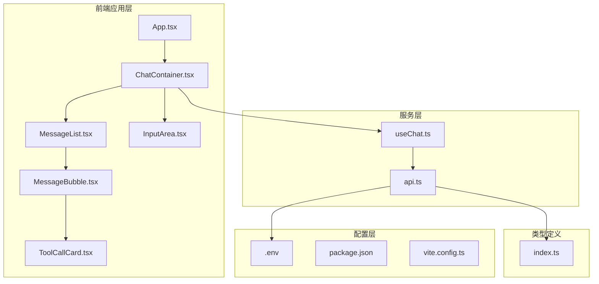
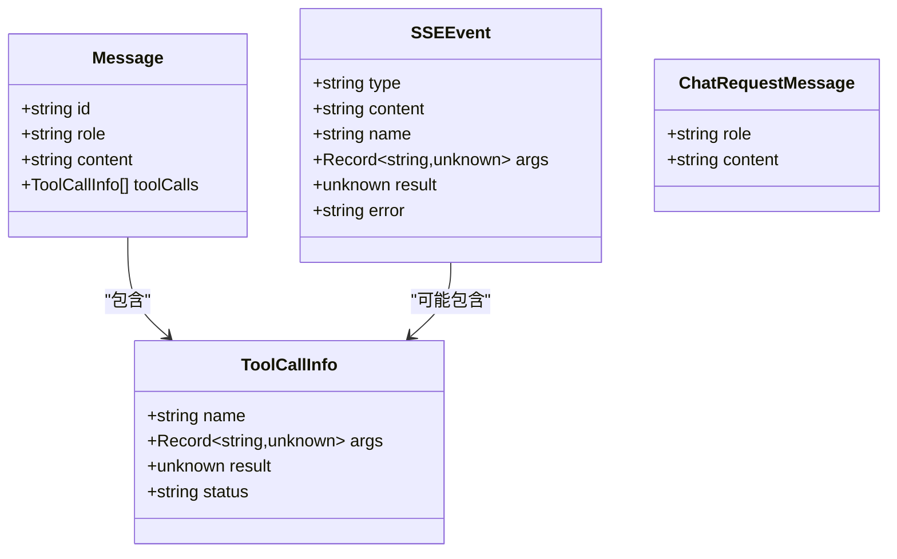
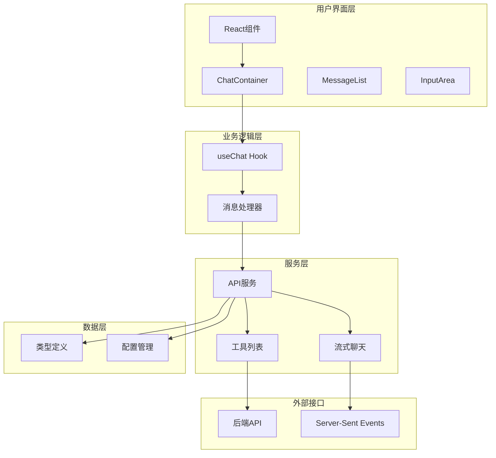
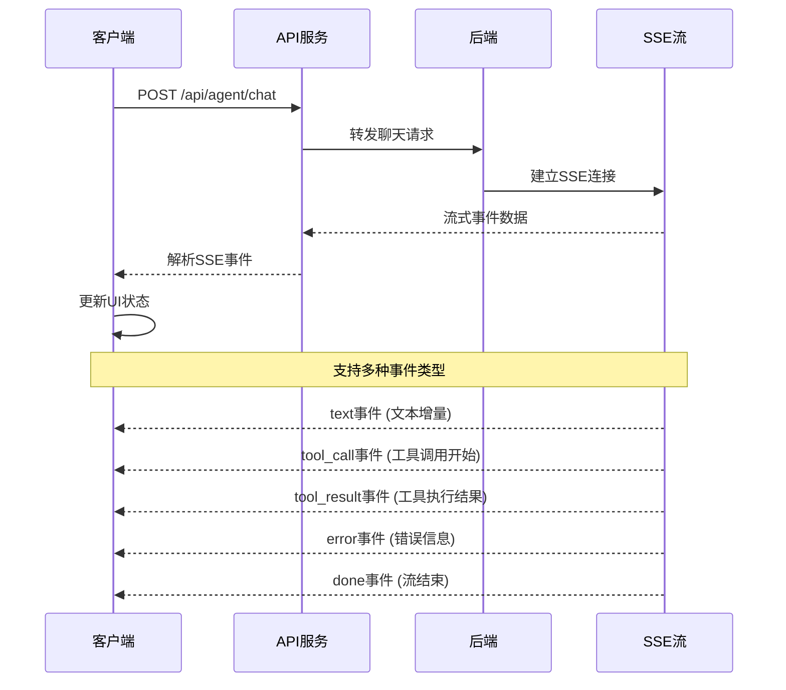
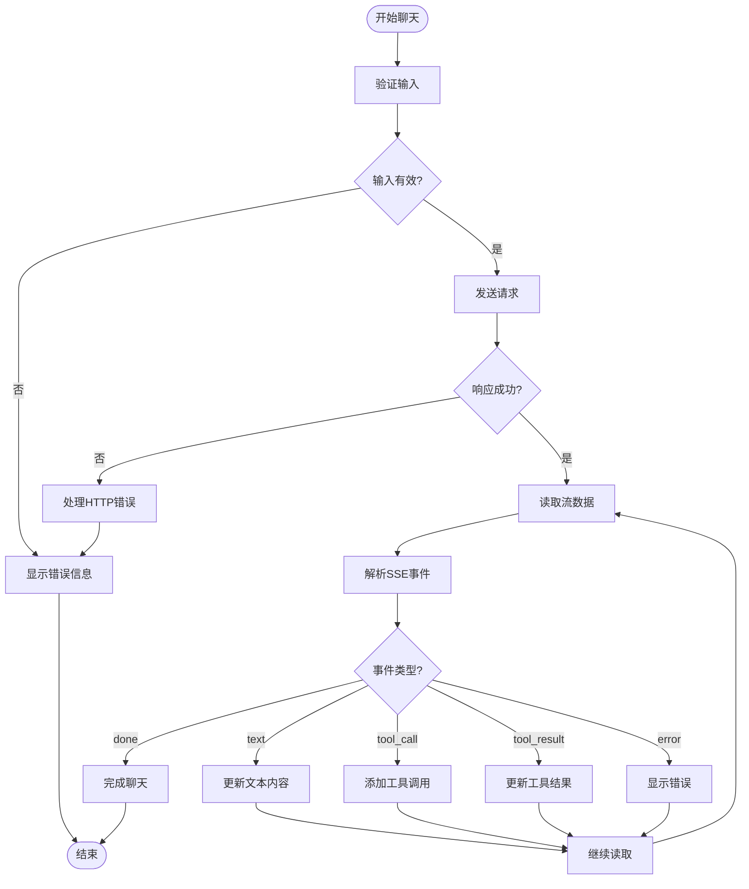
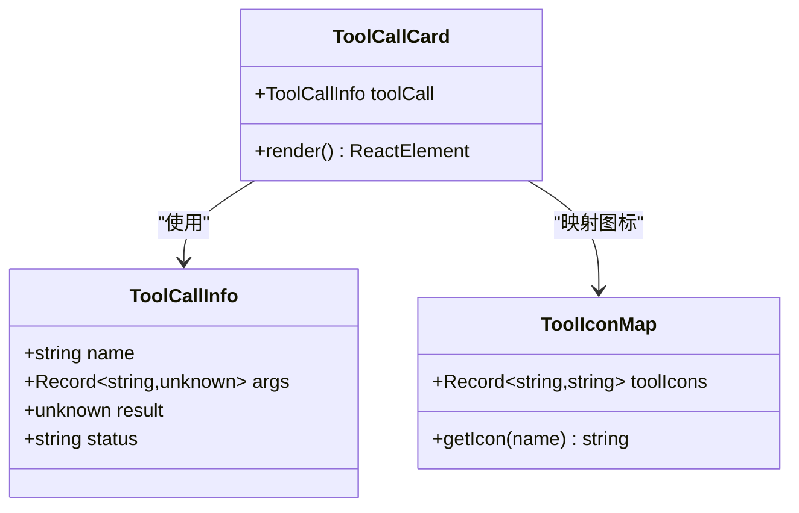
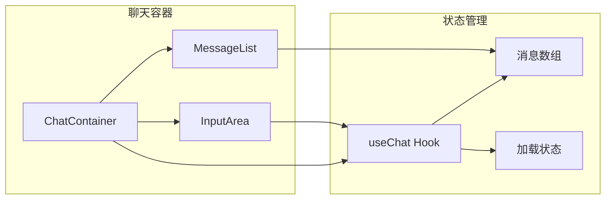
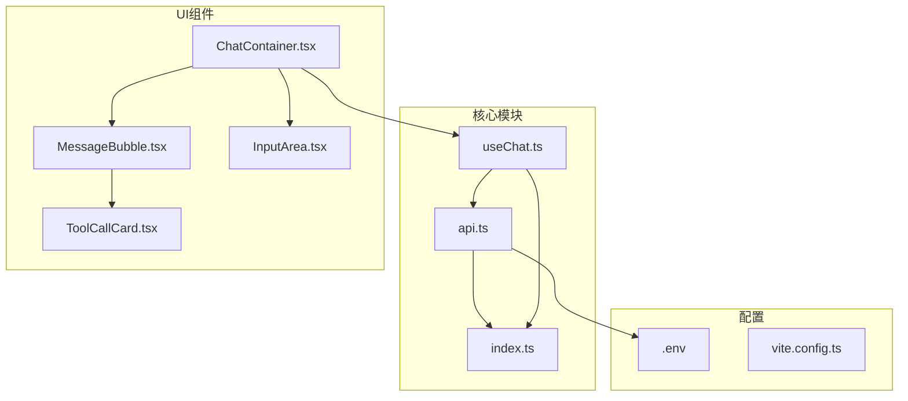

# API服务层

<cite>
**本文档引用的文件**
- [api.ts](file://src/services/api.ts)
- [useChat.ts](file://src/hooks/useChat.ts)
- [index.ts](file://src/types/index.ts)
- [ChatContainer.tsx](file://src/components/Chat/ChatContainer.tsx)
- [InputArea.tsx](file://src/components/Chat/InputArea.tsx)
- [MessageBubble.tsx](file://src/components/Chat/MessageBubble.tsx)
- [ToolCallCard.tsx](file://src/components/Chat/ToolCallCard.tsx)
- [.env](file://.env)
- [package.json](file://package.json)
- [vite.config.ts](file://vite.config.ts)
</cite>

## 目录
1. [简介](#简介)
2. [项目结构](#项目结构)
3. [核心组件](#核心组件)
4. [架构概览](#架构概览)
5. [详细组件分析](#详细组件分析)
6. [依赖关系分析](#依赖关系分析)
7. [性能考虑](#性能考虑)
8. [故障排除指南](#故障排除指南)
9. [结论](#结论)

## 简介

AI代理Web项目是一个基于React和TypeScript的前端应用，实现了流式聊天功能和工具调用能力。该应用通过API服务层与后端AI代理系统进行通信，支持实时消息流和工具执行状态跟踪。

该项目采用现代前端技术栈，包括：
- Vite作为构建工具和开发服务器
- React Hooks用于状态管理
- TypeScript提供类型安全保障
- 流式API实现实时聊天体验
- 自定义工具调用UI组件

## 项目结构

项目采用模块化组织方式，主要分为以下几个层次：



**图表来源**
- [ChatContainer.tsx](file://src/components/Chat/ChatContainer.tsx#L1-L24)
- [api.ts](file://src/services/api.ts#L1-L53)
- [useChat.ts](file://src/hooks/useChat.ts#L1-L159)

**章节来源**
- [package.json](file://package.json#L1-L25)
- [vite.config.ts](file://vite.config.ts#L1-L9)

## 核心组件

### API服务层

API服务层是整个应用与后端通信的核心，提供了两个主要功能：

1. **流式聊天API**：实现SSE风格的实时消息流
2. **工具列表API**：获取可用工具的元数据

### 类型系统

应用使用TypeScript定义了完整的类型系统，确保类型安全：



**图表来源**
- [index.ts](file://src/types/index.ts#L1-L28)

**章节来源**
- [index.ts](file://src/types/index.ts#L1-L28)

## 架构概览

应用采用分层架构设计，从上到下分别为：



**图表来源**
- [api.ts](file://src/services/api.ts#L1-L53)
- [useChat.ts](file://src/hooks/useChat.ts#L1-L159)

## 详细组件分析

### 流式聊天API实现

流式聊天功能是本项目的核心特性，实现了类似Server-Sent Events (SSE) 的实时消息传输机制。

#### API端点定义

| 组件 | 方法 | URL | 描述 |
|------|------|-----|------|
| 聊天流 | POST | `/api/agent/chat` | 接收用户消息并返回流式响应 |
| 工具列表 | GET | `/api/agent/tools` | 获取可用工具的元数据 |

#### 请求/响应模式

**聊天请求格式**：
```typescript
interface ChatRequest {
  messages: ChatRequestMessage[];
}

interface ChatRequestMessage {
  role: 'user' | 'assistant';
  content: string;
}
```

**SSE事件格式**：
```typescript
interface SSEEvent {
  type: 'text' | 'tool_call' | 'tool_result' | 'error' | 'done';
  content?: string;
  name?: string;
  args?: Record<string, unknown>;
  result?: unknown;
  error?: string;
}
```

#### 实现流程图



**图表来源**
- [api.ts](file://src/services/api.ts#L8-L47)
- [useChat.ts](file://src/hooks/useChat.ts#L44-L130)

#### 错误处理机制



**图表来源**
- [api.ts](file://src/services/api.ts#L17-L24)
- [useChat.ts](file://src/hooks/useChat.ts#L131-L145)

**章节来源**
- [api.ts](file://src/services/api.ts#L8-L47)
- [useChat.ts](file://src/hooks/useChat.ts#L14-L146)

### 工具列表API实现

工具列表功能提供了对可用工具的查询和展示能力。

#### 工具调用UI组件



**图表来源**
- [ToolCallCard.tsx](file://src/components/Chat/ToolCallCard.tsx#L1-L45)
- [index.ts](file://src/types/index.ts#L8-L13)

#### 工具状态管理

| 状态 | 图标 | 颜色 | 描述 |
|------|------|------|------|
| pending | ⏳ | 蓝色 | 工具正在执行中 |
| success | ✅ | 绿色 | 工具执行成功 |
| error | ❌ | 红色 | 工具执行失败 |

**章节来源**
- [ToolCallCard.tsx](file://src/components/Chat/ToolCallCard.tsx#L8-L12)
- [index.ts](file://src/types/index.ts#L8-L13)

### 用户界面集成

#### 聊天容器组件

聊天容器负责协调各个子组件的工作：



**图表来源**
- [ChatContainer.tsx](file://src/components/Chat/ChatContainer.tsx#L1-L24)
- [useChat.ts](file://src/hooks/useChat.ts#L10-L158)

**章节来源**
- [ChatContainer.tsx](file://src/components/Chat/ChatContainer.tsx#L6-L21)
- [InputArea.tsx](file://src/components/Chat/InputArea.tsx#L9-L51)

## 依赖关系分析

### 外部依赖

项目的主要依赖包括：

```mermaid
graph TD
subgraph "运行时依赖"
React[react ^18.3.1]
ReactDOM[react-dom ^18.3.1]
Markdown[react-markdown ^9.0.1]
GFM[remark-gfm ^4.0.0]
end
subgraph "开发依赖"
Vite[vite ^6.0.5]
ReactPlugin[@vitejs/plugin-react ^4.3.4]
TypeScript[typescript ~5.6.2]
TSConfig[@types/react ^18.3.18]
TSConfigDOM[@types/react-dom ^18.3.5]
end
subgraph "应用"
App[AI Agent Web]
end
App --> React
App --> ReactDOM
App --> Markdown
App --> GFM
App --> Vite
App --> ReactPlugin
App --> TypeScript
App --> TSConfig
App --> TSConfigDOM
```

**图表来源**
- [package.json](file://package.json#L11-L23)

### 内部模块依赖



**图表来源**
- [api.ts](file://src/services/api.ts#L1-L53)
- [useChat.ts](file://src/hooks/useChat.ts#L1-L159)

**章节来源**
- [package.json](file://package.json#L11-L23)

## 性能考虑

### 流式处理优化

1. **内存管理**：使用AsyncGenerator避免一次性加载大量数据
2. **缓冲区优化**：智能分割和缓存流数据块
3. **解码效率**：使用TextDecoder进行高效的字节解码

### UI渲染优化

1. **状态最小化**：只在必要时更新相关状态
2. **批量更新**：合并多个状态变更以减少重渲染
3. **虚拟滚动**：对于大量消息使用虚拟化技术

### 缓存策略

1. **工具列表缓存**：工具元数据可以缓存以减少网络请求
2. **会话状态持久化**：聊天历史可以在本地存储中保存

## 故障排除指南

### 常见问题及解决方案

#### API连接问题

**症状**：无法连接到后端API
**原因**：
- API地址配置错误
- CORS跨域问题
- 网络连接中断

**解决方案**：
1. 检查 `.env` 文件中的 `VITE_API_URL` 配置
2. 确认后端服务正在运行
3. 验证网络连接和防火墙设置

#### 流式数据处理问题

**症状**：消息显示不完整或出现乱码
**原因**：
- 字符编码问题
- 数据流截断
- 解码器错误

**解决方案**：
1. 确保使用正确的字符编码
2. 检查网络连接稳定性
3. 验证后端流式输出格式

#### 工具调用显示问题

**症状**：工具调用UI显示异常
**原因**：
- 工具名称映射缺失
- 状态更新逻辑错误
- 样式冲突

**解决方案**：
1. 检查工具图标映射表
2. 验证工具状态转换逻辑
3. 确认CSS类名正确应用

**章节来源**
- [api.ts](file://src/services/api.ts#L17-L24)
- [useChat.ts](file://src/hooks/useChat.ts#L131-L145)

## 结论

AI代理Web项目的API服务层展现了现代前端应用的最佳实践，通过以下关键特性实现了优秀的用户体验：

1. **实时性**：流式API提供了接近实时的消息传递体验
2. **可扩展性**：模块化的架构设计便于功能扩展
3. **类型安全**：完整的TypeScript类型系统确保代码质量
4. **用户友好**：直观的UI设计和工具调用可视化

该实现为AI代理系统的前端集成提供了清晰的参考模型，特别是在流式聊天和工具调用场景下的最佳实践。未来可以考虑添加更多的错误恢复机制、性能监控和更丰富的工具调用状态反馈。