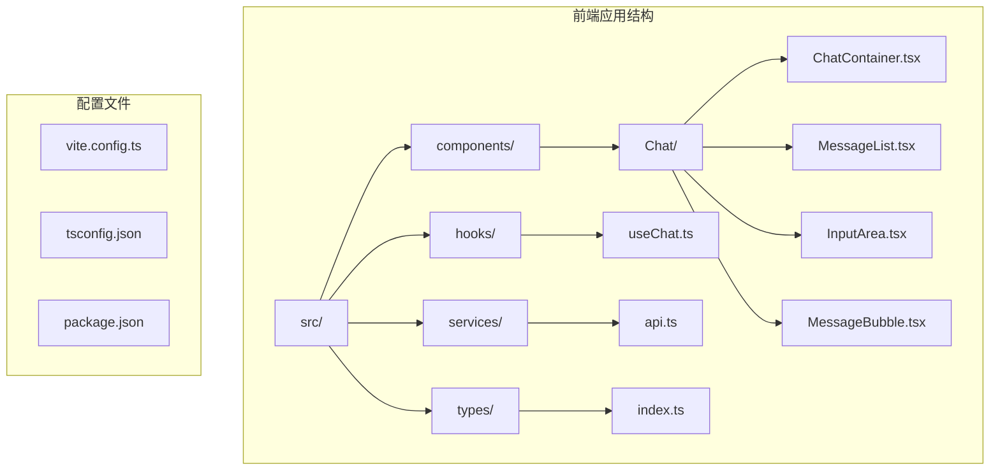
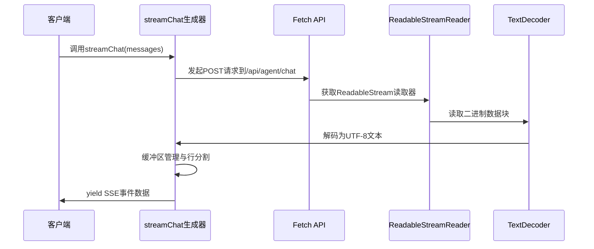
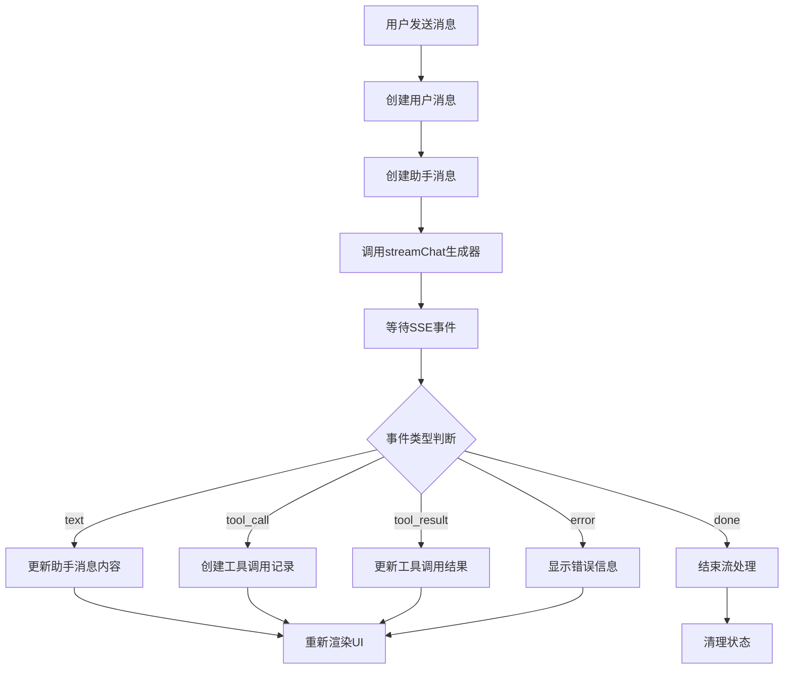
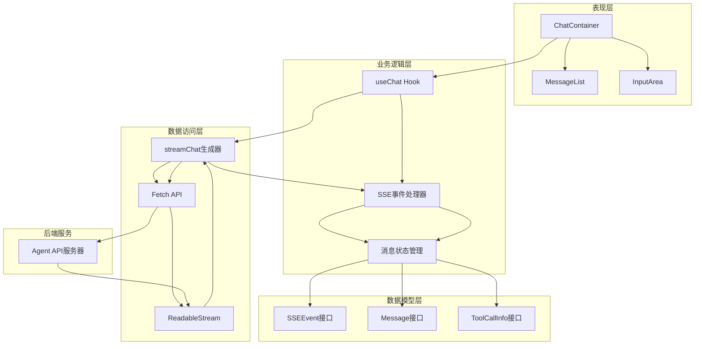
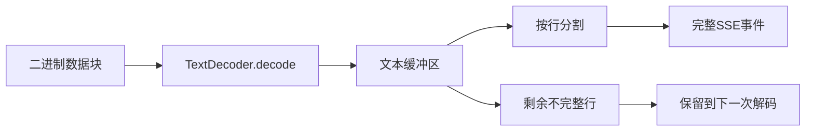
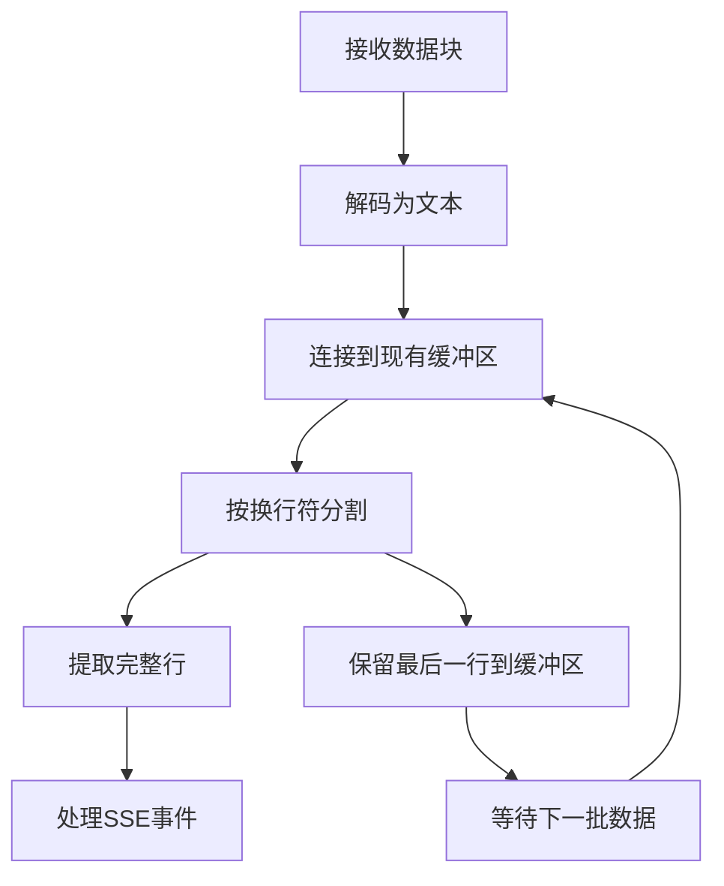
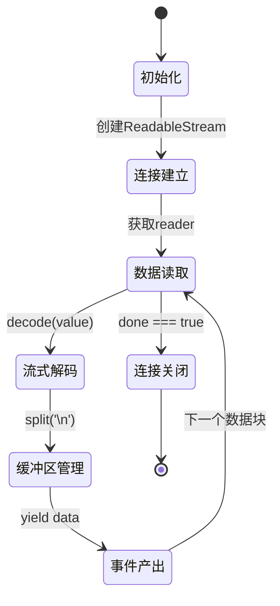
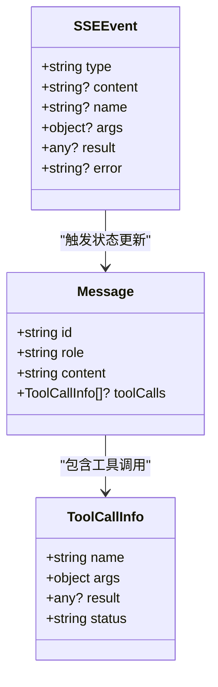
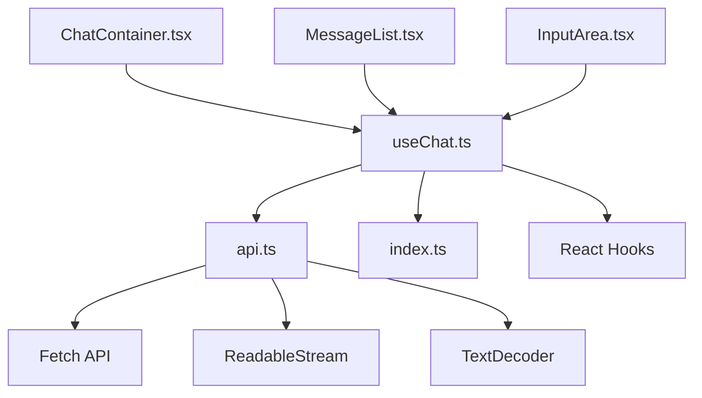

# SSE事件处理机制

<cite>
**本文档引用的文件**
- [useChat.ts](file://src/hooks/useChat.ts)
- [api.ts](file://src/services/api.ts)
- [index.ts](file://src/types/index.ts)
- [ChatContainer.tsx](file://src/components/Chat/ChatContainer.tsx)
- [MessageList.tsx](file://src/components/Chat/MessageList.tsx)
- [InputArea.tsx](file://src/components/Chat/InputArea.tsx)
- [package.json](file://package.json)
</cite>

## 目录
1. [简介](#简介)
2. [项目结构](#项目结构)
3. [核心组件](#核心组件)
4. [架构概览](#架构概览)
5. [详细组件分析](#详细组件分析)
6. [依赖分析](#依赖分析)
7. [性能考虑](#性能考虑)
8. [故障排除指南](#故障排除指南)
9. [结论](#结论)

## 简介

本文件详细阐述了AI代理Web应用中基于服务器推送事件（Server-Sent Events, SSE）的流式聊天API实现机制。该系统采用现代浏览器的ReadableStream API和TextDecoder API，实现了高效的实时数据传输和处理。文档重点分析了以下技术要点：

- **TextDecoder的使用**：用于将二进制数据流解码为文本字符
- **缓冲区管理策略**：通过行缓冲区处理不完整的消息片段
- **数据行分割算法**：基于换行符的SSE事件解析逻辑
- **异步生成器模式**：在SSE中的应用和生命周期管理
- **SSE事件格式规范**：包括data前缀处理、事件类型识别和错误恢复机制

## 项目结构

该项目采用React前端架构，主要文件组织如下：



**图表来源**
- [ChatContainer.tsx](file://src/components/Chat/ChatContainer.tsx#L1-L24)
- [useChat.ts](file://src/hooks/useChat.ts#L1-L159)
- [api.ts](file://src/services/api.ts#L1-L53)

**章节来源**
- [package.json](file://package.json#L1-L25)
- [ChatContainer.tsx](file://src/components/Chat/ChatContainer.tsx#L1-L24)

## 核心组件

### 异步生成器函数（streamChat）

系统的核心是`streamChat`异步生成器函数，它实现了完整的SSE数据流处理管道：



**图表来源**
- [api.ts](file://src/services/api.ts#L8-L47)

### 事件处理器（useChat Hook）

React自定义Hook负责处理SSE事件并更新UI状态：



**图表来源**
- [useChat.ts](file://src/hooks/useChat.ts#L44-L130)

**章节来源**
- [api.ts](file://src/services/api.ts#L8-L47)
- [useChat.ts](file://src/hooks/useChat.ts#L10-L159)

## 架构概览

整个SSE事件处理系统采用分层架构设计，确保了良好的可维护性和扩展性：



**图表来源**
- [ChatContainer.tsx](file://src/components/Chat/ChatContainer.tsx#L6-L21)
- [useChat.ts](file://src/hooks/useChat.ts#L10-L159)
- [api.ts](file://src/services/api.ts#L8-L47)
- [index.ts](file://src/types/index.ts#L1-L28)

## 详细组件分析

### TextDecoder实现分析

TextDecoder在SSE数据流处理中扮演着关键角色，负责将二进制数据块转换为可解析的文本格式：

#### 核心实现特性

| 特性 | 实现细节 | 性能影响 |
|------|----------|----------|
| 流式解码 | 使用`{ stream: true }`参数支持增量解码 | 最小化内存占用 |
| UTF-8编码 | 自动检测和转换UTF-8字节序列 | 支持多语言字符 |
| 错误处理 | 遇到无效字节序列时的容错机制 | 保证数据完整性 |

#### 内存管理策略



**图表来源**
- [api.ts](file://src/services/api.ts#L26-L46)

**章节来源**
- [api.ts](file://src/services/api.ts#L26-L46)

### 缓冲区管理策略

系统采用智能的缓冲区管理机制来处理SSE数据流中的边界情况：

#### 行缓冲区算法



#### 关键优化点

- **惰性加载**：只在需要时才进行缓冲区操作
- **内存复用**：重用缓冲区对象避免频繁分配
- **边界检测**：智能识别SSE事件的开始和结束标记

**章节来源**
- [api.ts](file://src/services/api.ts#L27-L46)

### 数据行分割算法

SSE协议要求每条事件必须以特定格式发送，系统实现了精确的数据行分割算法：

#### SSE事件格式解析

| 事件类型 | 格式示例 | 解析规则 |
|----------|----------|----------|
| 文本事件 | `data: {"type":"text","content":"Hello"}` | 提取data: 后的内容 |
| 工具调用 | `data: {"type":"tool_call","name":"weather"}` | JSON解析并处理 |
| 工具结果 | `data: {"type":"tool_result","result":"..."}` | 更新对应工具调用 |
| 错误事件 | `data: {"type":"error","error":"..."}` | 显示错误信息 |
| 完成信号 | `data: {"type":"done"}` | 结束流处理 |

#### 分割算法复杂度

- **时间复杂度**：O(n)，其中n为数据块长度
- **空间复杂度**：O(n)，用于缓冲区存储
- **处理效率**：支持流式处理，无额外延迟

**章节来源**
- [api.ts](file://src/services/api.ts#L37-L41)
- [useChat.ts](file://src/hooks/useChat.ts#L48-L129)

### 异步生成器模式应用

系统采用ES2018的异步生成器模式实现SSE数据流的优雅处理：

#### 生成器生命周期



#### 内存管理最佳实践

- **及时释放**：生成器完成后自动清理资源
- **流式消费**：避免一次性加载所有数据到内存
- **异常安全**：确保在异常情况下正确清理资源

**章节来源**
- [api.ts](file://src/services/api.ts#L8-L47)

### SSE事件格式规范

系统定义了完整的SSE事件格式规范，确保前后端数据交换的一致性：

#### 事件类型定义

| 事件类型 | 字段说明 | 使用场景 |
|----------|----------|----------|
| text | content: string | 文本内容增量更新 |
| tool_call | name: string, args: object | 工具调用开始 |
| tool_result | name: string, result: any | 工具调用结果 |
| error | error: string | 错误信息 |
| done | 无 | 流处理完成信号 |

#### 数据模型结构



**图表来源**
- [index.ts](file://src/types/index.ts#L15-L22)
- [index.ts](file://src/types/index.ts#L1-L6)
- [index.ts](file://src/types/index.ts#L8-L13)

**章节来源**
- [index.ts](file://src/types/index.ts#L15-L22)

## 依赖分析

### 外部依赖关系

```mermaid
graph LR
A[React应用] --> B[React 18.3.1]
A --> C[React DOM 18.3.1]
A --> D[开发依赖]
D --> E[@types/react]
D --> F[@types/react-dom]
D --> G[@vitejs/plugin-react]
D --> H[TypeScript]
D --> I[Vite]
```

**图表来源**
- [package.json](file://package.json#L11-L23)

### 内部模块依赖



**图表来源**
- [useChat.ts](file://src/hooks/useChat.ts#L1-L3)
- [api.ts](file://src/services/api.ts#L1-L1)
- [ChatContainer.tsx](file://src/components/Chat/ChatContainer.tsx#L1-L4)

**章节来源**
- [package.json](file://package.json#L11-L23)
- [useChat.ts](file://src/hooks/useChat.ts#L1-L3)

## 性能考虑

### 内存优化策略

1. **流式处理**：使用异步生成器避免一次性加载所有数据
2. **缓冲区复用**：重用字符串缓冲区减少内存分配
3. **增量解码**：TextDecoder的流式模式最小化内存占用

### 网络优化

1. **连接复用**：单个HTTP连接处理多个SSE事件
2. **压缩传输**：后端可启用GZIP压缩减少带宽消耗
3. **超时处理**：合理的连接超时和重连机制

### 前端渲染优化

1. **虚拟滚动**：大量消息时使用虚拟列表
2. **状态更新优化**：使用不可变数据结构避免不必要的重渲染
3. **防抖处理**：高频更新的输入框使用防抖机制

## 故障排除指南

### 常见问题及解决方案

#### 1. SSE连接中断

**症状**：消息发送后没有响应
**原因**：网络连接不稳定或服务器超时
**解决方案**：
- 实现自动重连机制
- 添加连接状态指示器
- 设置合理的超时时间

#### 2. 文本乱码问题

**症状**：显示乱码或特殊字符
**原因**：编码不匹配或数据损坏
**解决方案**：
- 确保服务器使用UTF-8编码
- 检查TextDecoder配置
- 实现数据校验机制

#### 3. 内存泄漏

**症状**：页面运行时间越长内存占用越高
**原因**：事件监听器未正确清理
**解决方案**：
- 在组件卸载时清理所有订阅
- 使用React的cleanup函数
- 监控内存使用情况

#### 4. 事件丢失

**症状**：部分SSE事件未被处理
**原因**：缓冲区溢出或解析错误
**解决方案**：
- 增加缓冲区大小限制
- 实现事件确认机制
- 添加重试逻辑

**章节来源**
- [useChat.ts](file://src/hooks/useChat.ts#L131-L145)
- [api.ts](file://src/services/api.ts#L17-L24)

## 结论

本SSE事件处理机制展现了现代Web应用中流式数据处理的最佳实践。通过精心设计的异步生成器模式、智能的缓冲区管理和严格的类型系统，系统实现了高效、可靠且易于维护的实时通信功能。

### 主要优势

1. **性能优异**：流式处理和增量解码确保低延迟和低内存占用
2. **可靠性强**：完善的错误处理和恢复机制保证系统稳定性
3. **可扩展性好**：清晰的架构设计便于功能扩展和维护
4. **用户体验佳**：实时反馈和流畅的交互体验

### 技术亮点

- **TextDecoder的巧妙运用**：实现了高效的二进制到文本转换
- **异步生成器的优雅实现**：提供了简洁的流式数据处理接口
- **类型安全的设计**：完整的TypeScript类型定义确保代码质量
- **React Hooks的合理应用**：实现了组件状态的集中管理

该实现为类似的实时通信应用场景提供了优秀的参考模板，展示了如何在现代前端技术栈中构建高性能的SSE处理系统。