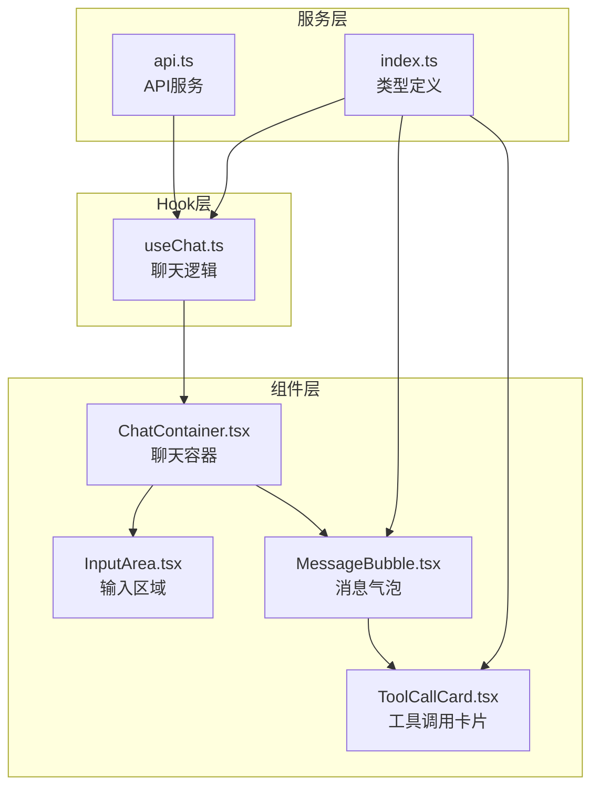
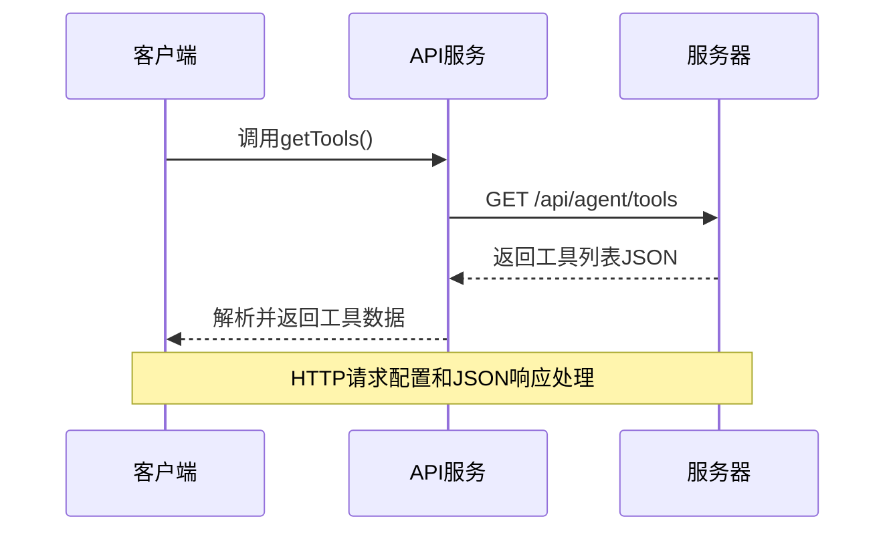
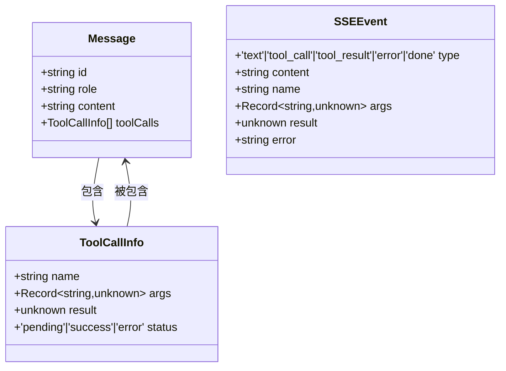
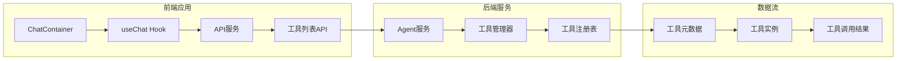
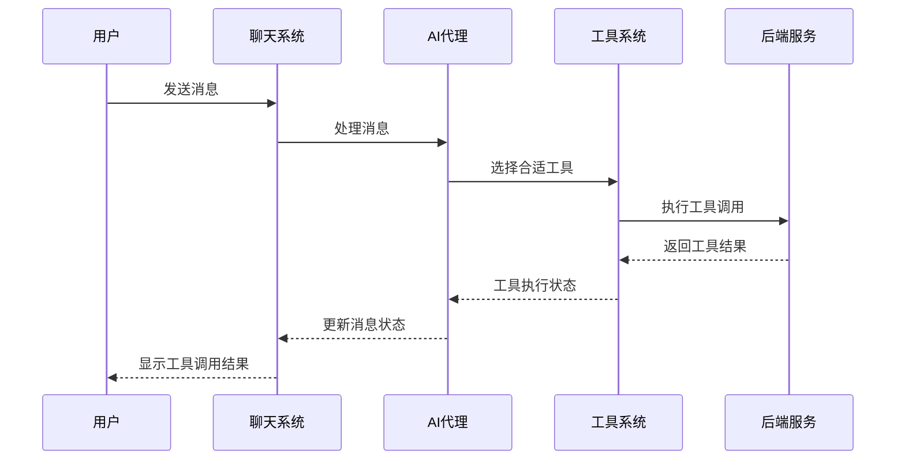
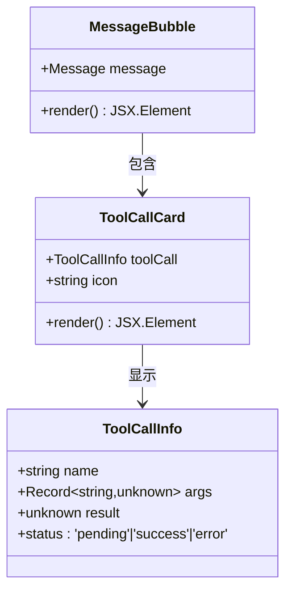
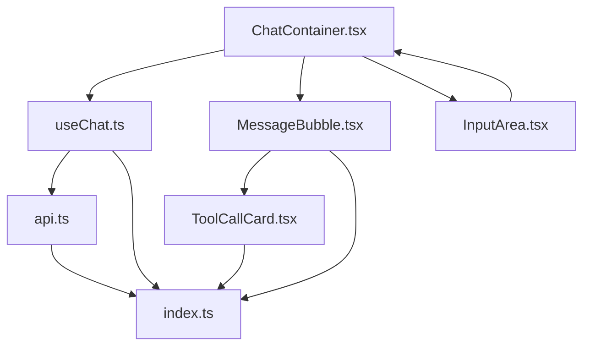

# 工具列表API

<cite>
**本文档引用的文件**
- [api.ts](file://src/services/api.ts)
- [useChat.ts](file://src/hooks/useChat.ts)
- [index.ts](file://src/types/index.ts)
- [ToolCallCard.tsx](file://src/components/Chat/ToolCallCard.tsx)
- [MessageBubble.tsx](file://src/components/Chat/MessageBubble.tsx)
- [ChatContainer.tsx](file://src/components/Chat/ChatContainer.tsx)
- [InputArea.tsx](file://src/components/Chat/InputArea.tsx)
- [package.json](file://package.json)
</cite>

## 目录
1. [简介](#简介)
2. [项目结构](#项目结构)
3. [核心组件](#核心组件)
4. [架构概览](#架构概览)
5. [详细组件分析](#详细组件分析)
6. [依赖关系分析](#依赖关系分析)
7. [性能考虑](#性能考虑)
8. [故障排除指南](#故障排除指南)
9. [结论](#结论)

## 简介

工具列表API是AI Agent系统中的关键组件，负责提供可用工具的元数据信息。该API通过GET /api/agent/tools端点返回工具清单，支持智能代理根据用户需求选择合适的工具来执行特定任务。

本API设计遵循RESTful原则，采用JSON格式传输数据，为前端组件提供标准化的工具描述信息，包括工具名称、参数定义、功能描述等元数据。

## 项目结构

AI Agent Web应用采用模块化架构，工具系统相关的文件分布如下：



**图表来源**
- [api.ts](file://src/services/api.ts#L1-L52)
- [useChat.ts](file://src/hooks/useChat.ts#L1-L116)
- [index.ts](file://src/types/index.ts#L1-L27)

**章节来源**
- [api.ts](file://src/services/api.ts#L1-L52)
- [useChat.ts](file://src/hooks/useChat.ts#L1-L116)
- [index.ts](file://src/types/index.ts#L1-L27)

## 核心组件

### API服务层

API服务层提供了统一的网络请求接口，其中getTools函数专门用于获取工具列表：



**图表来源**
- [api.ts](file://src/services/api.ts#L49-L52)

### 类型定义系统

系统使用TypeScript接口定义了工具相关的数据结构：



**图表来源**
- [index.ts](file://src/types/index.ts#L1-L27)

**章节来源**
- [api.ts](file://src/services/api.ts#L49-L52)
- [index.ts](file://src/types/index.ts#L1-L27)

## 架构概览

工具列表API在整个系统中的位置和交互关系如下：



**图表来源**
- [ChatContainer.tsx](file://src/components/Chat/ChatContainer.tsx#L1-L24)
- [useChat.ts](file://src/hooks/useChat.ts#L1-L116)
- [api.ts](file://src/services/api.ts#L49-L52)

## 详细组件分析

### getTools函数实现分析

getTools函数是工具列表API的核心实现，负责HTTP请求和响应处理：

#### HTTP请求配置

函数使用标准的fetch API进行网络请求，配置包括：
- 请求方法：GET
- 请求URL：`${API_URL}/api/agent/tools`
- 内容类型：自动设置为application/json
- 超时处理：依赖浏览器默认超时机制

#### JSON响应处理

响应处理流程：
1. 验证HTTP状态码
2. 解析JSON响应体
3. 返回原始响应对象（未进行额外的数据转换）

#### 错误处理机制

当前实现采用简单的错误处理策略：
- HTTP错误状态直接抛出异常
- 缺少响应体时抛出明确的错误信息

**章节来源**
- [api.ts](file://src/services/api.ts#L49-L52)

### 工具调用流程

工具调用采用事件驱动的异步模式，通过Server-Sent Events(SSE)实现实时通信：



**图表来源**
- [useChat.ts](file://src/hooks/useChat.ts#L67-L108)

### 工具显示组件

工具调用结果通过专用组件进行可视化展示：



**图表来源**
- [ToolCallCard.tsx](file://src/components/Chat/ToolCallCard.tsx#L1-L44)
- [MessageBubble.tsx](file://src/components/Chat/MessageBubble.tsx#L1-L37)

**章节来源**
- [ToolCallCard.tsx](file://src/components/Chat/ToolCallCard.tsx#L1-L44)
- [MessageBubble.tsx](file://src/components/Chat/MessageBubble.tsx#L1-L37)

## 依赖关系分析

### 外部依赖

项目使用以下关键依赖来支持工具系统：

```mermaid
graph TB
subgraph "核心依赖"
REACT[react ^18.3.1<br/>UI框架]
MARKDOWN[react-markdown ^9.0.1<br/>Markdown渲染]
REMARK[remark-gfm ^4.0.0<br/>GitHub风格标记]
end
subgraph "开发依赖"
VITE[vite ^6.0.5<br/>构建工具]
TYPESCRIPT[typescript ~5.6.2<br/>类型系统]
PLUGIN[@vitejs/plugin-react<br/>React插件]
end
subgraph "工具系统"
API[api.ts<br/>网络服务]
TYPES[index.ts<br/>类型定义]
COMPONENTS[ToolCallCard.tsx<br/>显示组件]
end
REACT --> API
MARKDOWN --> COMPONENTS
TYPESCRIPT --> API
VITE --> COMPONENTS
API --> TYPES
COMPONENTS --> TYPES
```

**图表来源**
- [package.json](file://package.json#L11-L23)

### 内部模块依赖



**图表来源**
- [api.ts](file://src/services/api.ts#L1-L52)
- [useChat.ts](file://src/hooks/useChat.ts#L1-L116)
- [index.ts](file://src/types/index.ts#L1-L27)

**章节来源**
- [package.json](file://package.json#L11-L23)

## 性能考虑

### 网络请求优化

- **连接复用**：使用浏览器内置的HTTP/1.1连接池
- **缓存策略**：工具列表数据可考虑添加适当的缓存机制
- **并发控制**：避免同时发起多个工具请求

### 内存管理

- **事件清理**：及时清理SSE事件监听器
- **状态管理**：合理管理工具调用状态，避免内存泄漏
- **组件卸载**：确保组件卸载时清理所有订阅

### 渲染优化

- **虚拟滚动**：对于大量消息时考虑虚拟滚动
- **懒加载**：工具调用结果按需渲染
- **防抖处理**：输入框事件防抖减少重渲染

## 故障排除指南

### 常见错误类型

#### 网络连接问题

| 错误类型 | 可能原因 | 解决方案 |
|---------|---------|---------|
| CORS错误 | 跨域配置不正确 | 检查后端CORS设置 |
| 超时错误 | 网络延迟过高 | 增加超时时间或重试机制 |
| 连接中断 | 网络不稳定 | 实现断线重连逻辑 |

#### 数据解析错误

| 错误类型 | 可能原因 | 解决方案 |
|---------|---------|---------|
| JSON解析失败 | 响应格式不正确 | 添加JSON验证和错误处理 |
| 类型不匹配 | 数据结构变更 | 更新TypeScript类型定义 |
| 缺失字段 | API版本不兼容 | 实现向后兼容性检查 |

#### 工具调用错误

| 错误类型 | 可能原因 | 解决方案 |
|---------|---------|---------|
| 工具不存在 | 工具名称拼写错误 | 验证工具名称和可用性 |
| 参数错误 | 参数类型不正确 | 添加参数验证和类型检查 |
| 执行失败 | 工具内部异常 | 实现重试机制和错误回退 |

### 调试建议

1. **网络层面**：使用浏览器开发者工具监控网络请求
2. **数据层面**：检查API响应格式和数据完整性
3. **组件层面**：验证组件状态更新和渲染逻辑
4. **错误处理**：添加详细的错误日志和用户提示

**章节来源**
- [api.ts](file://src/services/api.ts#L17-L24)
- [useChat.ts](file://src/hooks/useChat.ts#L110-L116)

## 结论

工具列表API为AI Agent系统提供了灵活的工具扩展机制。通过标准化的JSON接口和事件驱动的通信模式，系统能够动态地发现和使用各种工具来增强AI代理的功能。

### 主要优势

1. **标准化接口**：统一的API规范便于工具集成
2. **事件驱动**：实时通信提供良好的用户体验
3. **类型安全**：TypeScript类型定义确保数据完整性
4. **可扩展性**：模块化设计支持工具的动态添加

### 改进建议

1. **增强错误处理**：添加更完善的错误恢复机制
2. **性能优化**：实现工具列表缓存和预加载
3. **监控告警**：添加工具使用统计和性能监控
4. **文档完善**：提供更详细的工具API文档和示例

该API为构建强大的AI工具生态系统奠定了坚实基础，通过持续的优化和扩展，能够满足复杂应用场景的需求。