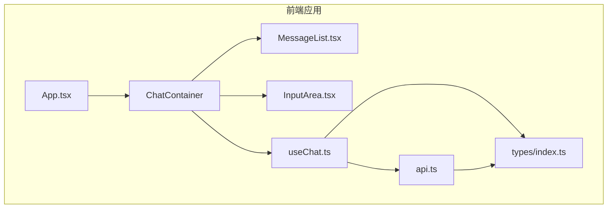
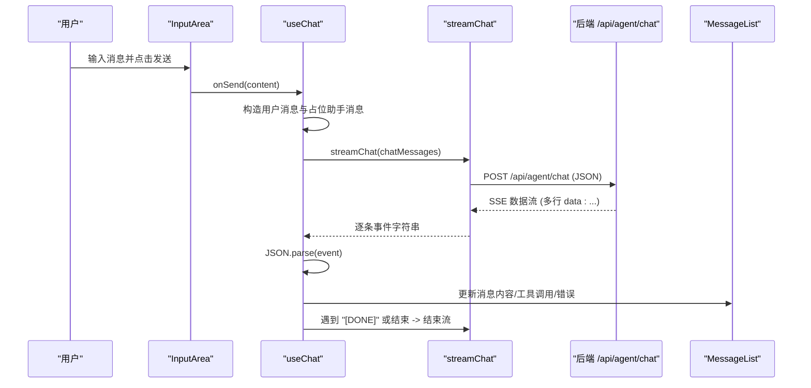
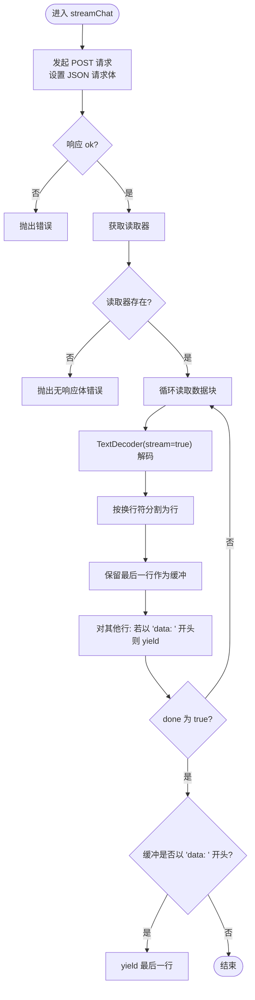
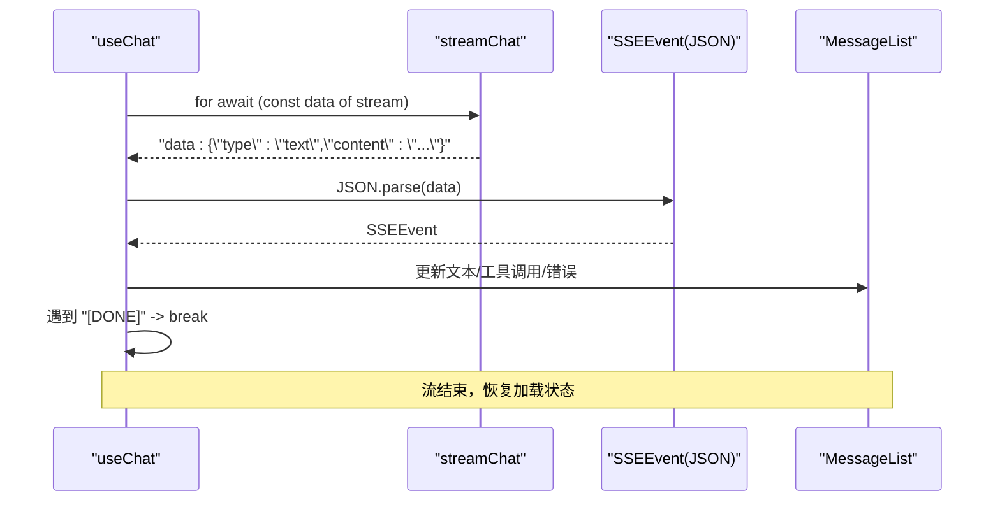
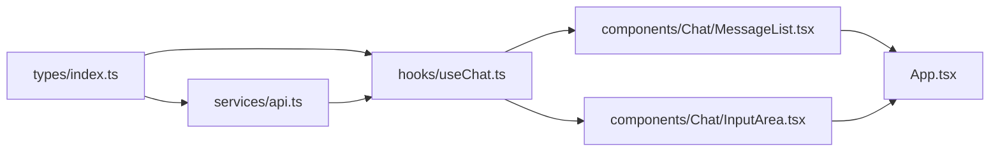

# 流式聊天API

<cite>
**本文档引用的文件**
- [src/services/api.ts](file://src/services/api.ts)
- [src/hooks/useChat.ts](file://src/hooks/useChat.ts)
- [src/types/index.ts](file://src/types/index.ts)
- [src/components/Chat/MessageList.tsx](file://src/components/Chat/MessageList.tsx)
- [src/components/Chat/InputArea.tsx](file://src/components/Chat/InputArea.tsx)
- [src/App.tsx](file://src/App.tsx)
- [package.json](file://package.json)
</cite>

## 目录
1. [简介](#简介)
2. [项目结构](#项目结构)
3. [核心组件](#核心组件)
4. [架构总览](#架构总览)
5. [详细组件分析](#详细组件分析)
6. [依赖关系分析](#依赖关系分析)
7. [性能考虑](#性能考虑)
8. [故障排除指南](#故障排除指南)
9. [结论](#结论)
10. [附录](#附录)

## 简介
本文件面向前端开发者与集成工程师，提供“流式聊天API”的完整技术文档。重点覆盖以下内容：
- POST /api/agent/chat 端点的请求/响应规范
- 异步生成器函数 streamChat 的实现原理与数据流解析逻辑
- SSE（Server-Sent Events）事件格式与边界情况处理
- 错误处理机制与常见问题排查
- 性能优化建议与最佳实践

该系统采用 React + TypeScript 构建，通过自定义异步生成器从后端拉取流式数据，并在前端实时渲染对话与工具调用结果。

## 项目结构
本项目采用按功能模块划分的组织方式，核心聊天相关代码集中在以下目录：
- src/services/api.ts：封装与后端交互的 API 方法，包括流式聊天生成器
- src/hooks/useChat.ts：React Hook，负责消息状态管理与流式事件消费
- src/types/index.ts：类型定义，包括消息、工具调用与 SSE 事件结构
- src/components/Chat/*：聊天界面组件，负责输入、展示与滚动行为
- src/App.tsx：应用入口，渲染聊天容器

图表来源
- [src/App.tsx](file://src/App.tsx#L1-L9)
- [src/components/Chat/MessageList.tsx](file://src/components/Chat/MessageList.tsx#L1-L52)
- [src/components/Chat/InputArea.tsx](file://src/components/Chat/InputArea.tsx#L1-L52)
- [src/hooks/useChat.ts](file://src/hooks/useChat.ts#L1-L159)
- [src/services/api.ts](file://src/services/api.ts#L1-L53)
- [src/types/index.ts](file://src/types/index.ts#L1-L28)

章节来源
- [src/App.tsx](file://src/App.tsx#L1-L9)
- [package.json](file://package.json#L1-L25)

## 核心组件
- 流式聊天生成器：streamChat
  - 功能：向后端发起 POST 请求，读取响应体的二进制流，使用 TextDecoder 解码为文本，按行解析并过滤以 "data: " 开头的数据行，逐条产出可消费的字符串片段
  - 关键点：基于 ReadableStream 的 getReader() 与 TextDecoder(stream: true) 实现增量解码；通过缓冲区与行分割处理跨块边界的数据
- 聊天 Hook：useChat
  - 功能：维护消息列表与加载状态；发送用户消息；消费 streamChat 产出的事件；根据事件类型更新 UI（文本增量、工具调用、工具结果、错误）
  - 关键点：对 JSON.parse 失败进行容错；遇到 "[DONE]" 时终止循环；统一捕获异常并在最后清理加载状态
- 类型定义：SSEEvent、Message、ToolCallInfo
  - 功能：约束后端返回的事件结构与前端消息模型，确保类型安全
- 组件层：MessageList、InputArea
  - 功能：渲染消息列表、输入框与发送按钮；在空状态显示引导文案；自动滚动到底部；禁用输入时的交互状态

章节来源
- [src/services/api.ts](file://src/services/api.ts#L8-L47)
- [src/hooks/useChat.ts](file://src/hooks/useChat.ts#L10-L158)
- [src/types/index.ts](file://src/types/index.ts#L1-L28)
- [src/components/Chat/MessageList.tsx](file://src/components/Chat/MessageList.tsx#L1-L52)
- [src/components/Chat/InputArea.tsx](file://src/components/Chat/InputArea.tsx#L1-L52)

## 架构总览
下图展示了从前端到后端的端到端流程：用户输入 -> Hook 消息构建 -> 流式生成器 -> 后端 SSE -> 前端事件解析 -> UI 更新。

图表来源
- [src/components/Chat/InputArea.tsx](file://src/components/Chat/InputArea.tsx#L9-L28)
- [src/hooks/useChat.ts](file://src/hooks/useChat.ts#L14-L146)
- [src/services/api.ts](file://src/services/api.ts#L8-L47)

## 详细组件分析

### 端点规范：POST /api/agent/chat
- 请求方法：POST
- 请求头：
  - Content-Type: application/json
- 请求体字段：
  - messages: ChatMessage[]（见下方类型定义）
- 响应格式：SSE（Server-Sent Events），每条数据以 "data: " 开头，内容为 JSON 字符串
- 特殊结束标记：当后端发送 "[DONE]" 时，前端应停止消费流

请求体类型定义（ChatMessage[]）
- role: 'user' | 'assistant'
- content: string

响应事件类型（SSEEvent）
- type: 'text' | 'tool_call' | 'tool_result' | 'error' | 'done'
- content?: string（文本增量）
- name?: string（工具名称）
- args?: Record<string, unknown>（工具参数）
- result?: unknown（工具执行结果）
- error?: string（错误信息）

章节来源
- [src/services/api.ts](file://src/services/api.ts#L3-L6)
- [src/services/api.ts](file://src/services/api.ts#L8-L15)
- [src/types/index.ts](file://src/types/index.ts#L15-L22)

### 异步生成器：streamChat 的实现原理
- Fetch 配置
  - 使用 POST 方法，设置 Content-Type 为 application/json
  - 将 messages 数组序列化为请求体
- 读取器与解码
  - 通过 response.body.getReader() 获取读取器
  - 使用 TextDecoder 并开启 stream: true 进行增量解码
- 缓冲区与行解析
  - 读取到的字节块拼接到缓冲区，按换行符拆分为行
  - 保留最后一行作为缓冲，避免截断 UTF-8 序列
  - 对除最后一行外的每一行，若以 "data: " 开头则提取数据部分并 yield
- 结束条件
  - 当 reader.read() 返回 done 为 true 时，循环结束
  - 若缓冲区仍以 "data: " 开头，则将其余内容 yield 出去

图表来源
- [src/services/api.ts](file://src/services/api.ts#L8-L47)

章节来源
- [src/services/api.ts](file://src/services/api.ts#L8-L47)

### 前端事件消费：useChat 中的事件处理
- 流式消费
  - 使用 for-await-of 遍历 streamChat 产出的事件字符串
  - 遇到 "[DONE]" 即刻中断循环
- 事件解析与更新
  - JSON.parse 事件字符串为 SSEEvent
  - 根据 type 分支处理：
    - text：拼接到最后一个 assistant 消息的 content
    - tool_call：创建 pending 工具调用并追加到消息的 toolCalls
    - tool_result：匹配当前工具调用，更新其 result 与状态
    - error：在最后一个 assistant 消息中追加错误提示
    - done：忽略，用于后端结束信号
- 错误处理
  - 对 JSON.parse 失败进行 try/catch 容错
  - 捕获 streamChat 抛出的网络或读取错误，统一写入最后一个 assistant 消息
  - finally 中重置加载状态

图表来源
- [src/hooks/useChat.ts](file://src/hooks/useChat.ts#L44-L146)
- [src/types/index.ts](file://src/types/index.ts#L15-L22)

章节来源
- [src/hooks/useChat.ts](file://src/hooks/useChat.ts#L14-L146)
- [src/types/index.ts](file://src/types/index.ts#L15-L22)

### 组件层：MessageList 与 InputArea
- MessageList
  - 渲染消息列表，空状态显示引导文案
  - 自动滚动到底部，保证最新消息可见
  - 在加载且最后一条消息为空时显示打字指示器
- InputArea
  - 文本域支持 Enter 发送、Shift+Enter 换行
  - 发送按钮禁用条件：输入为空或正在加载
  - 提交后清空输入框

章节来源
- [src/components/Chat/MessageList.tsx](file://src/components/Chat/MessageList.tsx#L11-L51)
- [src/components/Chat/InputArea.tsx](file://src/components/Chat/InputArea.tsx#L9-L49)

## 依赖关系分析
- 组件耦合
  - ChatContainer 依赖 MessageList 与 InputArea
  - useChat 依赖 streamChat 与类型定义
  - streamChat 依赖类型定义与浏览器原生 Fetch/ReadableStream
- 外部依赖
  - React 生态：useState、useCallback、useEffect、useRef
  - 第三方库：react-markdown、remark-gfm（在 package.json 中声明）

图表来源
- [src/types/index.ts](file://src/types/index.ts#L1-L28)
- [src/services/api.ts](file://src/services/api.ts#L1-L53)
- [src/hooks/useChat.ts](file://src/hooks/useChat.ts#L1-L159)
- [src/components/Chat/MessageList.tsx](file://src/components/Chat/MessageList.tsx#L1-L52)
- [src/components/Chat/InputArea.tsx](file://src/components/Chat/InputArea.tsx#L1-L52)
- [src/App.tsx](file://src/App.tsx#L1-L9)

章节来源
- [package.json](file://package.json#L11-L23)

## 性能考虑
- 流式解码与缓冲
  - 使用 TextDecoder(stream: true) 可减少中间字符串拼接开销
  - 行级缓冲避免 UTF-8 截断，降低解析失败概率
- UI 更新策略
  - 仅对最后一条 assistant 消息进行增量更新，避免全量重渲染
  - 工具调用列表追加而非替换，保持 DOM 稳定性
- 网络与并发
  - 在发送新消息时禁用输入，避免并发请求导致的状态混乱
  - 合理设置超时与重试策略（可在 fetch 层扩展）
- 内存占用
  - 避免在事件循环中累积过多中间字符串
  - 对长对话历史可考虑分页或裁剪策略（在业务层实现）

## 故障排除指南
- 常见错误与处理
  - HTTP 非 OK：streamChat 抛出错误，useChat 捕获并写入最后一条 assistant 消息
  - 无响应体：getReader 不存在时抛出错误，useChat 捕获并提示
  - JSON 解析失败：事件字符串非有效 JSON 时忽略该事件，继续消费后续事件
  - 网络中断：fetch 抛出异常，useChat 捕获并提示错误
- 边界情况
  - 最后一行不完整：通过缓冲区保留未完成行，在结束时再处理
  - 多个连续 data 行：逐行解析，逐条 yield
  - "[DONE]" 提前到达：前端立即 break，避免多余等待
- 调试建议
  - 打印事件字符串与解析后的对象，确认后端事件格式
  - 检查 Content-Type 是否为 application/json
  - 确认后端已正确发送 "data: " 前缀与 JSON 结构

章节来源
- [src/services/api.ts](file://src/services/api.ts#L17-L24)
- [src/hooks/useChat.ts](file://src/hooks/useChat.ts#L131-L142)
- [src/hooks/useChat.ts](file://src/hooks/useChat.ts#L127-L129)

## 结论
本方案通过自定义异步生成器与 React Hook 的组合，实现了稳定、可扩展的流式聊天体验。前端以最小代价消费后端 SSE，实时渲染文本与工具调用结果，并具备完善的错误处理与边界情况应对能力。建议在后端严格遵循事件格式规范，前端保持对 JSON 结构与前缀的强校验，以获得最佳的用户体验与稳定性。

## 附录

### 请求/响应示例（路径引用）
- 请求体示例（messages 数组）
  - [请求体示例路径](file://src/services/api.ts#L14)
- 正常流式响应（SSE 事件）
  - 文本增量事件：[事件示例路径](file://src/hooks/useChat.ts#L50-L65)
  - 工具调用事件：[事件示例路径](file://src/hooks/useChat.ts#L67-L84)
  - 工具结果事件：[事件示例路径](file://src/hooks/useChat.ts#L86-L108)
  - 错误事件：[事件示例路径](file://src/hooks/useChat.ts#L110-L122)
- 结束信号
  - [结束信号示例路径](file://src/hooks/useChat.ts#L45)

### SSE 事件格式规范
- 事件类型（type）
  - text：文本增量
  - tool_call：开始一次工具调用
  - tool_result：工具调用结果
  - error：错误信息
  - done：结束信号（可选）
- 数据行解析规则
  - 每行以 "data: " 开头，后跟 JSON 字符串
  - 前端需先去除 "data: " 前缀，再进行 JSON.parse
  - 支持多行事件合并，最终以 "[DONE]" 结束

章节来源
- [src/types/index.ts](file://src/types/index.ts#L15-L22)
- [src/hooks/useChat.ts](file://src/hooks/useChat.ts#L44-L126)