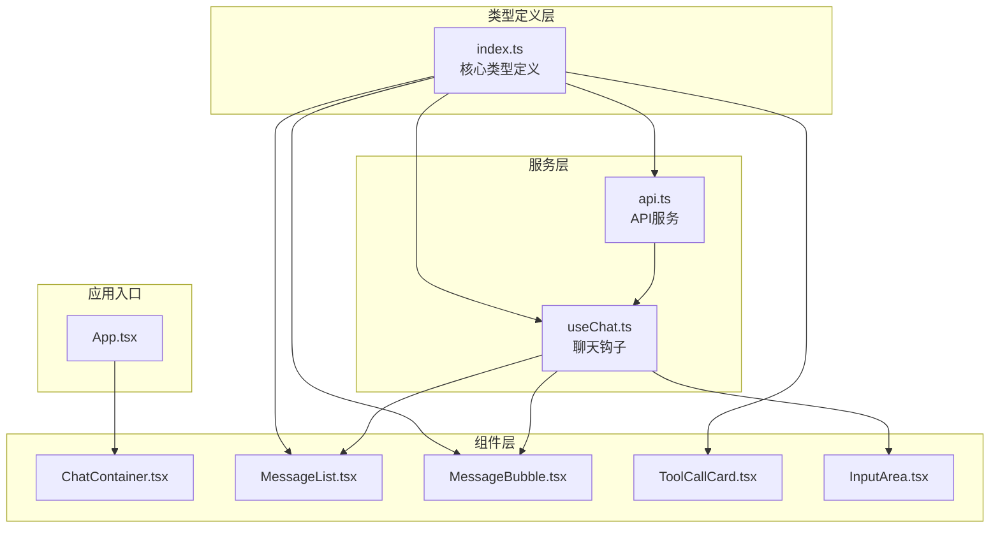
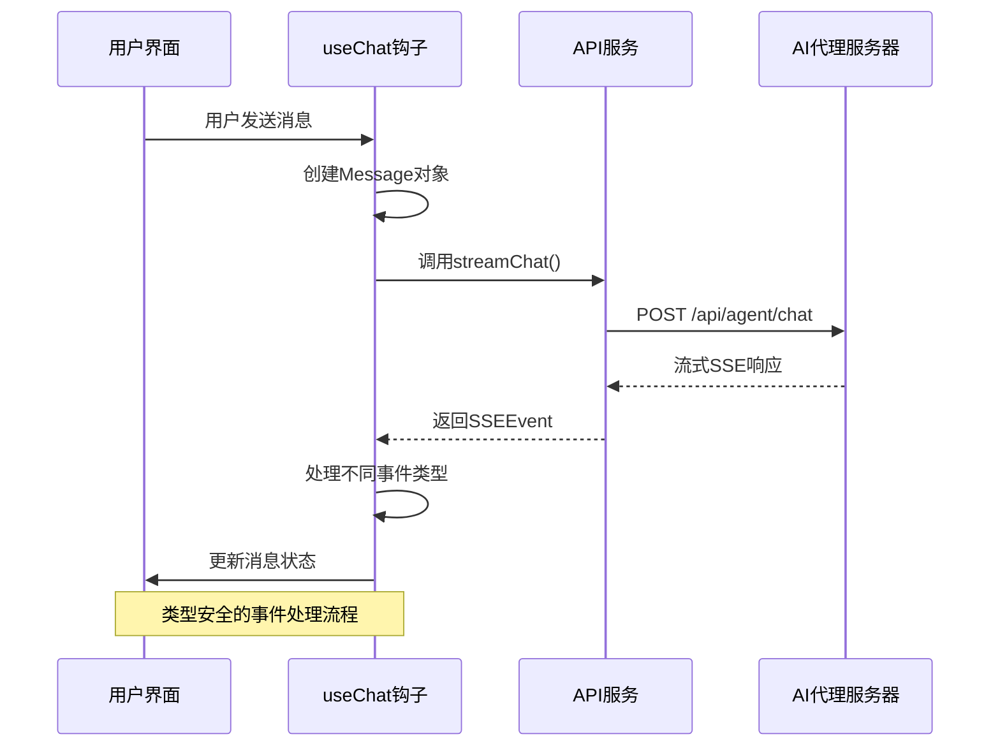
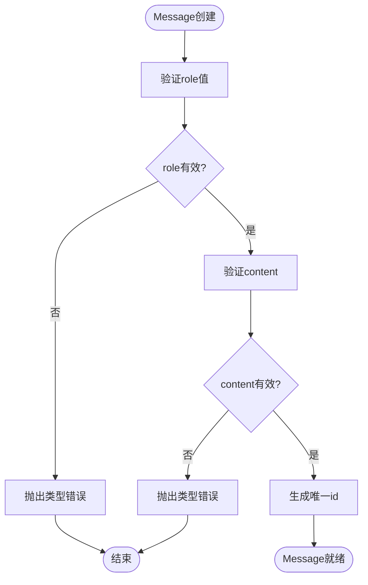
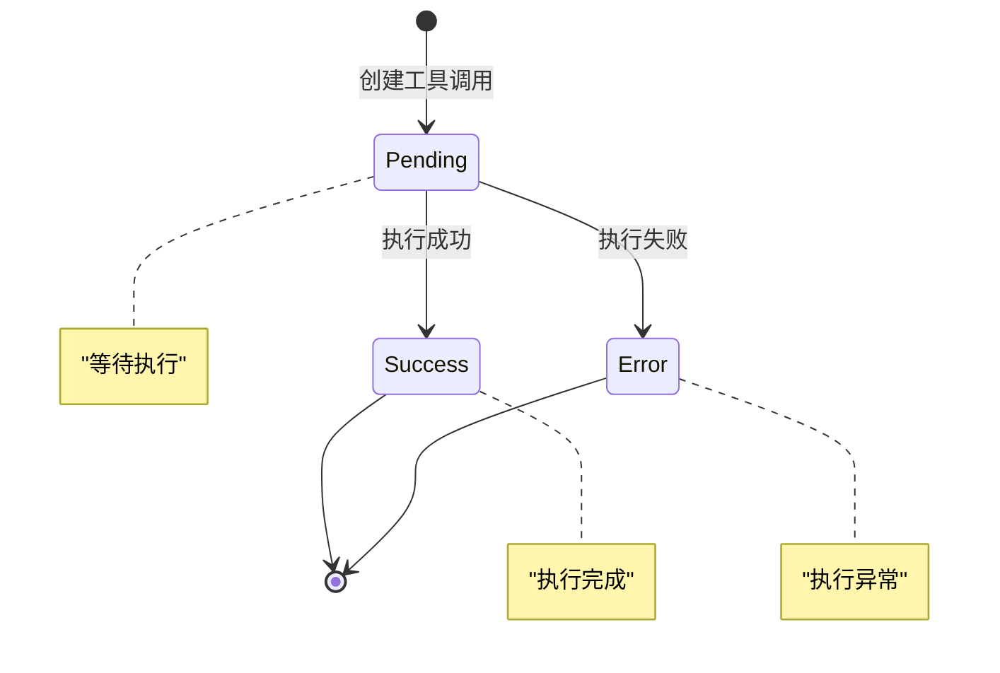
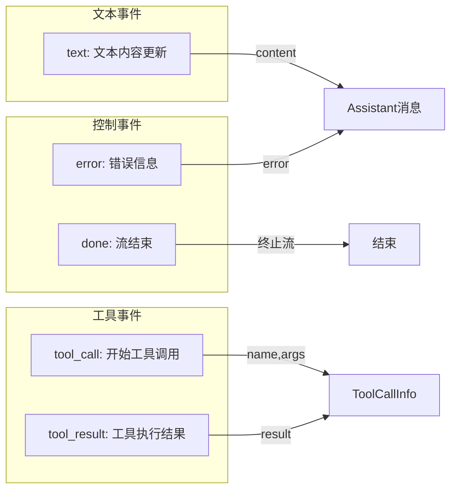
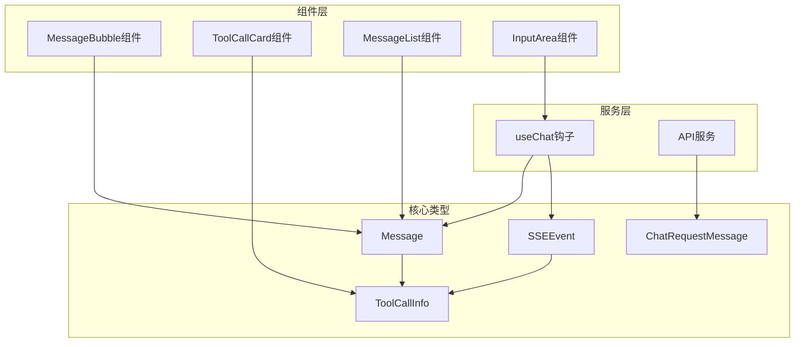
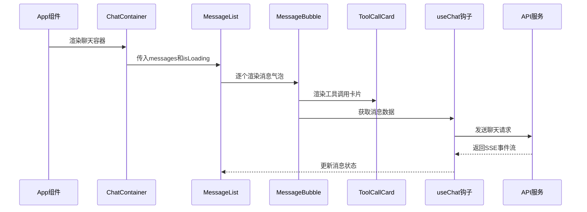
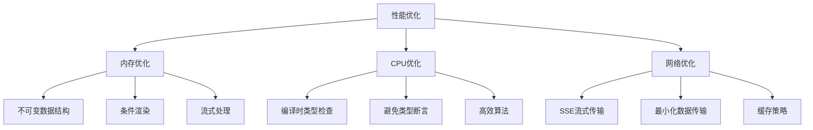

# TypeScript类型定义

<cite>
**本文档引用的文件**
- [src/types/index.ts](file://src/types/index.ts)
- [src/hooks/useChat.ts](file://src/hooks/useChat.ts)
- [src/services/api.ts](file://src/services/api.ts)
- [src/components/Chat/MessageBubble.tsx](file://src/components/Chat/MessageBubble.tsx)
- [src/components/Chat/ToolCallCard.tsx](file://src/components/Chat/ToolCallCard.tsx)
- [src/components/Chat/MessageList.tsx](file://src/components/Chat/MessageList.tsx)
- [src/components/Chat/InputArea.tsx](file://src/components/Chat/InputArea.tsx)
- [src/App.tsx](file://src/App.tsx)
- [tsconfig.json](file://tsconfig.json)
- [package.json](file://package.json)
</cite>

## 目录
1. [简介](#简介)
2. [项目结构](#项目结构)
3. [核心类型系统](#核心类型系统)
4. [架构概览](#架构概览)
5. [详细类型分析](#详细类型分析)
6. [依赖关系分析](#依赖关系分析)
7. [性能考量](#性能考量)
8. [故障排除指南](#故障排除指南)
9. [结论](#结论)
10. [附录](#附录)

## 简介

本文件为AI代理Web项目的TypeScript类型定义进行全面的技术文档。该系统采用严格的类型安全设计，通过精心设计的数据模型支持实时对话、工具调用和流式响应处理。项目的核心类型系统围绕三个主要接口构建：Message（消息）、ToolCallInfo（工具调用信息）和SSEEvent（服务器发送事件），这些类型共同构成了整个AI代理交互的基础。

系统的设计重点在于：
- **类型安全保证**：通过严格的数据模型防止运行时错误
- **扩展性考虑**：灵活的类型定义支持未来功能扩展
- **性能优化**：最小化的类型转换和高效的内存管理
- **开发体验**：完整的IDE支持和智能提示

## 项目结构

项目采用模块化架构，类型定义集中在统一的类型文件中，便于维护和复用：



**图表来源**
- [src/types/index.ts](file://src/types/index.ts#L1-L28)
- [src/services/api.ts](file://src/services/api.ts#L1-L53)
- [src/hooks/useChat.ts](file://src/hooks/useChat.ts#L1-L159)

**章节来源**
- [src/types/index.ts](file://src/types/index.ts#L1-L28)
- [src/services/api.ts](file://src/services/api.ts#L1-L53)
- [src/hooks/useChat.ts](file://src/hooks/useChat.ts#L1-L159)

## 核心类型系统

### 主要类型定义

系统的核心类型定义位于[src/types/index.ts](file://src/types/index.ts)，包含以下关键接口：

#### Message接口
Message接口定义了对话中的单条消息，是整个系统的基础数据结构：

```mermaid
classDiagram
class Message {
+string id
+UserRole role
+string content
+ToolCallInfo[] toolCalls?
}
class UserRole {
<<enumeration>>
"user"
"assistant"
}
Message --> ToolCallInfo : "包含多个"
```

**图表来源**
- [src/types/index.ts](file://src/types/index.ts#L1-L6)

#### ToolCallInfo接口
ToolCallInfo接口描述了AI代理执行的具体工具调用操作：

```mermaid
classDiagram
class ToolCallInfo {
+string name
+Record~string, unknown~ args
+unknown result?
+ToolStatus status
}
class ToolStatus {
<<enumeration>>
"pending"
"success"
"error"
}
ToolCallInfo --> ToolStatus : "状态管理"
```

**图表来源**
- [src/types/index.ts](file://src/types/index.ts#L8-L13)

#### SSEEvent接口
SSEEvent接口定义了服务器推送事件的格式，支持多种事件类型：

```mermaid
classDiagram
class SSEEvent {
+EventType type
+string content?
+string name?
+Record~string, unknown~ args?
+unknown result?
+string error?
}
class EventType {
<<enumeration>>
"text"
"tool_call"
"tool_result"
"error"
"done"
}
SSEEvent --> EventType : "事件类型"
```

**图表来源**
- [src/types/index.ts](file://src/types/index.ts#L15-L22)

**章节来源**
- [src/types/index.ts](file://src/types/index.ts#L1-L28)

## 架构概览

系统采用分层架构，类型定义贯穿所有层次，确保端到端的类型安全：



**图表来源**
- [src/hooks/useChat.ts](file://src/hooks/useChat.ts#L14-L146)
- [src/services/api.ts](file://src/services/api.ts#L8-L47)

**章节来源**
- [src/hooks/useChat.ts](file://src/hooks/useChat.ts#L1-L159)
- [src/services/api.ts](file://src/services/api.ts#L1-L53)

## 详细类型分析

### Message类型深度解析

Message类型是系统中最核心的数据结构，具有以下特点：

#### 字段定义与约束
- **id**: 唯一标识符，使用时间戳和计数器生成
- **role**: 严格限定为'user'或'assistant'枚举值
- **content**: 必需字符串，存储消息内容
- **toolCalls**: 可选数组，存储工具调用信息

#### 数据验证规则


**图表来源**
- [src/types/index.ts](file://src/types/index.ts#L1-L6)
- [src/hooks/useChat.ts](file://src/hooks/useChat.ts#L17-L21)

#### 类型安全保证
- 使用字面量类型确保role值的正确性
- 可选属性通过条件检查避免运行时错误
- 工具调用数组的可选性支持不同消息类型的灵活性

**章节来源**
- [src/types/index.ts](file://src/types/index.ts#L1-L6)
- [src/hooks/useChat.ts](file://src/hooks/useChat.ts#L17-L31)

### ToolCallInfo类型分析

ToolCallInfo类型专门用于描述AI代理的工具调用操作：

#### 状态管理模式


**图表来源**
- [src/types/index.ts](file://src/types/index.ts#L8-L13)
- [src/hooks/useChat.ts](file://src/hooks/useChat.ts#L68-L72)

#### 参数处理机制
- **args**: 使用Record<string, unknown>类型支持任意参数结构
- **result**: 可选结果存储，支持异步执行后的结果返回
- **状态同步**: 通过状态字段跟踪工具调用的执行进度

**章节来源**
- [src/types/index.ts](file://src/types/index.ts#L8-L13)
- [src/components/Chat/ToolCallCard.tsx](file://src/components/Chat/ToolCallCard.tsx#L14-L44)

### SSEEvent类型详解

SSEEvent类型定义了服务器推送事件的完整格式，支持五种不同的事件类型：

#### 事件类型映射


**图表来源**
- [src/types/index.ts](file://src/types/index.ts#L15-L22)
- [src/hooks/useChat.ts](file://src/hooks/useChat.ts#L50-L126)

#### 事件处理流程
事件处理采用switch语句模式，每种事件类型都有特定的处理逻辑：
- **text事件**: 追加文本内容到最新助手消息
- **tool_call事件**: 创建新的工具调用并添加到消息中
- **tool_result事件**: 更新对应工具调用的结果和状态
- **error事件**: 在消息中添加错误信息
- **done事件**: 终止流处理

**章节来源**
- [src/types/index.ts](file://src/types/index.ts#L15-L22)
- [src/hooks/useChat.ts](file://src/hooks/useChat.ts#L44-L126)

### ChatRequestMessage类型

ChatRequestMessage接口用于API请求的消息格式，简化了数据传输：

#### 设计目的
- **精简结构**: 移除不必要的字段以减少网络传输
- **兼容性**: 与Message类型保持角色和内容的一致性
- **向后兼容**: 支持现有的API接口

**章节来源**
- [src/types/index.ts](file://src/types/index.ts#L24-L27)
- [src/services/api.ts](file://src/services/api.ts#L3-L6)

## 依赖关系分析

### 类型依赖图



**图表来源**
- [src/types/index.ts](file://src/types/index.ts#L1-L28)
- [src/hooks/useChat.ts](file://src/hooks/useChat.ts#L1-L159)
- [src/services/api.ts](file://src/services/api.ts#L1-L53)

### 组件间类型传递

系统中的类型传递遵循严格的单向依赖原则：



**图表来源**
- [src/App.tsx](file://src/App.tsx#L1-L9)
- [src/components/Chat/MessageList.tsx](file://src/components/Chat/MessageList.tsx#L11-L40)
- [src/components/Chat/MessageBubble.tsx](file://src/components/Chat/MessageBubble.tsx#L11-L37)

**章节来源**
- [src/App.tsx](file://src/App.tsx#L1-L9)
- [src/components/Chat/MessageList.tsx](file://src/components/Chat/MessageList.tsx#L1-L52)
- [src/components/Chat/MessageBubble.tsx](file://src/components/Chat/MessageBubble.tsx#L1-L37)
- [src/components/Chat/ToolCallCard.tsx](file://src/components/Chat/ToolCallCard.tsx#L1-L45)

## 性能考量

### 类型系统性能优化

系统在类型设计上充分考虑了性能因素：

#### 内存管理
- **不可变更新**: 使用函数式更新模式避免不必要的状态重渲染
- **条件渲染**: 工具调用和错误信息仅在需要时渲染
- **流式处理**: SSE事件采用流式处理减少内存占用

#### 编译时优化
- **严格模式**: 启用TypeScript严格模式确保编译时类型检查
- **无副作用导入**: 避免不必要的模块导入减少打包体积
- **类型推导**: 充分利用TypeScript的类型推导能力

**章节来源**
- [tsconfig.json](file://tsconfig.json#L15-L19)
- [src/hooks/useChat.ts](file://src/hooks/useChat.ts#L53-L63)

### 运行时性能特性



## 故障排除指南

### 常见类型错误及解决方案

#### 类型不匹配错误
**问题**: 当传递错误类型的消息给组件时
**解决方案**: 确保使用正确的Message接口实例

#### 状态访问错误
**问题**: 访问不存在的工具调用状态
**解决方案**: 使用可选链操作符或类型守卫检查

#### 异步处理错误
**问题**: SSE事件解析失败
**解决方案**: 添加try-catch块和错误边界

### 调试技巧

#### 类型断言安全使用
```typescript
// 安全的类型断言示例
const safeEvent = JSON.parse(data) as SSEEvent;

// 更好的类型守卫
function isValidSSEEvent(obj: any): obj is SSEEvent {
  return obj && typeof obj.type === 'string' && 
         ['text', 'tool_call', 'tool_result', 'error', 'done'].includes(obj.type);
}
```

#### 开发时调试
- 启用TypeScript严格模式
- 使用VS Code的类型提示功能
- 利用JSDoc注释增强IDE支持

**章节来源**
- [src/hooks/useChat.ts](file://src/hooks/useChat.ts#L47-L48)
- [src/hooks/useChat.ts](file://src/hooks/useChat.ts#L127-L129)

## 结论

本TypeScript类型定义系统展现了现代前端开发的最佳实践：

### 设计优势
- **类型安全**: 完整的类型检查确保运行时稳定性
- **扩展性强**: 灵活的类型设计支持未来功能扩展
- **性能优化**: 从编译时到运行时的全方位性能考虑
- **开发体验**: 优秀的IDE支持和智能提示

### 技术亮点
- **枚举类型**: 使用字面量类型确保值域约束
- **可选属性**: 灵活的数据结构设计
- **流式处理**: SSE事件的高效处理机制
- **组件化**: 类型驱动的组件设计模式

### 未来发展方向
- **泛型扩展**: 可能引入更通用的工具调用类型
- **验证增强**: 添加运行时数据验证机制
- **性能监控**: 集成类型使用性能分析工具

## 附录

### 最佳实践指南

#### 类型定义最佳实践
1. **使用字面量类型**确保值域约束
2. **合理使用可选属性**提高灵活性
3. **避免any类型**保持类型安全
4. **利用类型推导**减少冗余代码

#### 高级类型特性
- **类型守卫**: 使用自定义类型守卫进行运行时类型检查
- **泛型使用**: 在需要时使用泛型提高代码复用性
- **条件类型**: 利用条件类型实现复杂的类型逻辑

#### 代码组织建议
- 将类型定义集中管理
- 使用有意义的类型名称
- 添加适当的JSDoc注释
- 定期审查和重构类型定义

**章节来源**
- [src/types/index.ts](file://src/types/index.ts#L1-L28)
- [tsconfig.json](file://tsconfig.json#L15-L19)