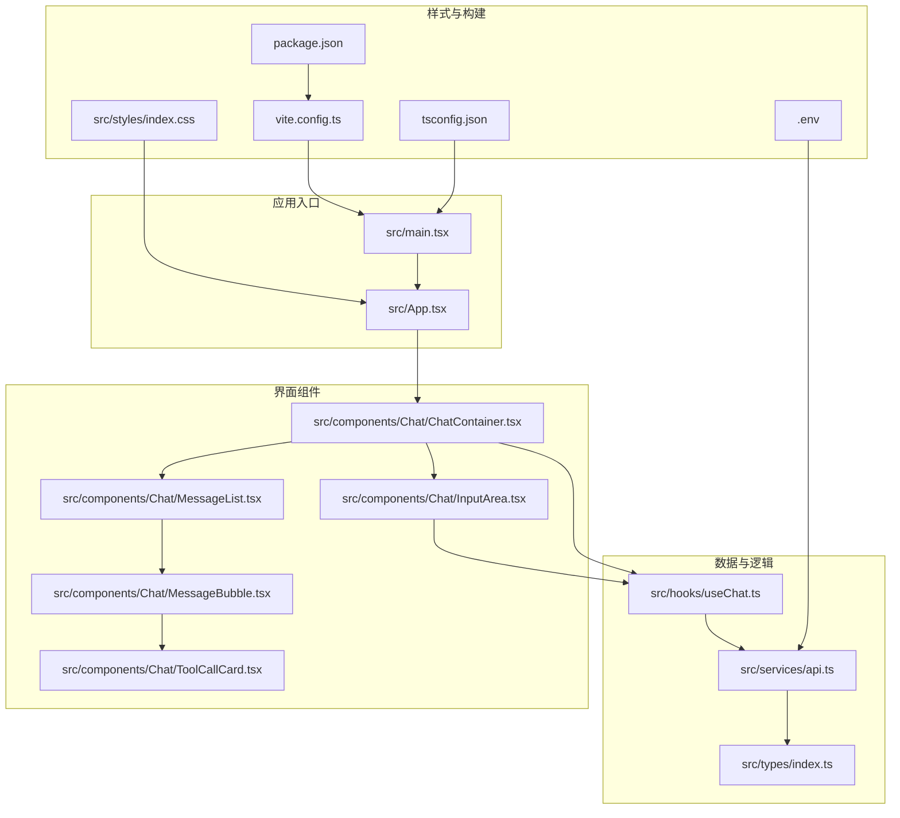
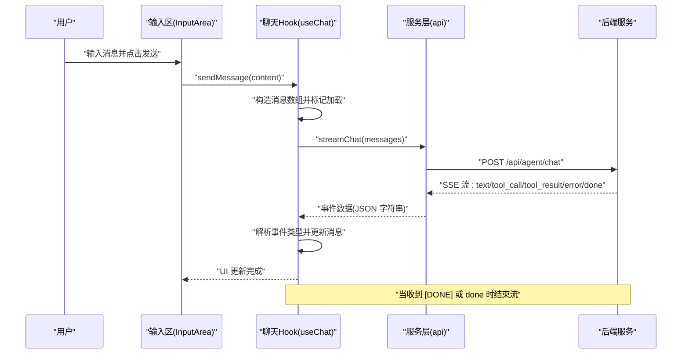
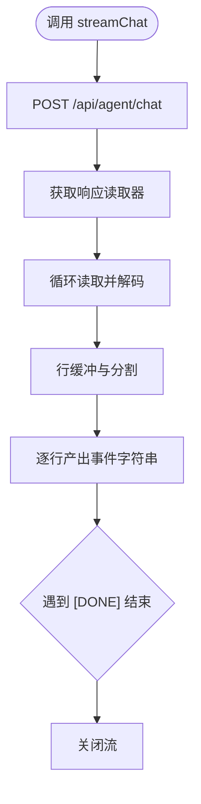
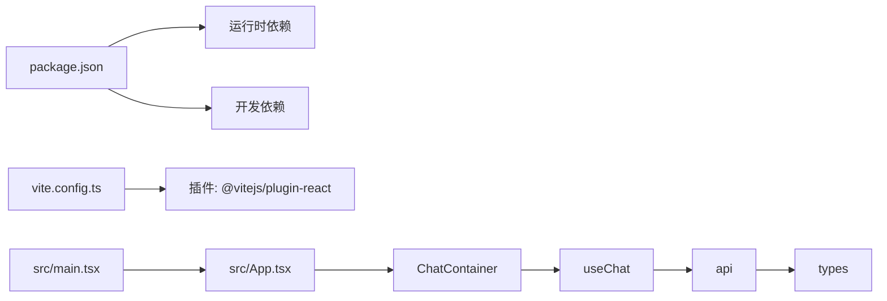

# 开发指南

<cite>
**本文引用的文件**
- [package.json](file://package.json)
- [vite.config.ts](file://vite.config.ts)
- [tsconfig.json](file://tsconfig.json)
- [.gitignore](file://.gitignore)
- [.env](file://.env)
- [src/main.tsx](file://src/main.tsx)
- [src/App.tsx](file://src/App.tsx)
- [src/services/api.ts](file://src/services/api.ts)
- [src/hooks/useChat.ts](file://src/hooks/useChat.ts)
- [src/types/index.ts](file://src/types/index.ts)
- [src/components/Chat/ChatContainer.tsx](file://src/components/Chat/ChatContainer.tsx)
- [src/components/Chat/InputArea.tsx](file://src/components/Chat/InputArea.tsx)
- [src/components/Chat/MessageList.tsx](file://src/components/Chat/MessageList.tsx)
- [src/components/Chat/MessageBubble.tsx](file://src/components/Chat/MessageBubble.tsx)
- [src/components/Chat/ToolCallCard.tsx](file://src/components/Chat/ToolCallCard.tsx)
- [src/styles/index.css](file://src/styles/index.css)
</cite>

## 目录
1. [简介](#简介)
2. [项目结构](#项目结构)
3. [核心组件](#核心组件)
4. [架构总览](#架构总览)
5. [详细组件分析](#详细组件分析)
6. [依赖关系分析](#依赖关系分析)
7. [性能考虑](#性能考虑)
8. [故障排查指南](#故障排查指南)
9. [结论](#结论)
10. [附录](#附录)

## 简介
本指南面向新加入的开发者，提供从开发环境搭建到组件开发、测试与调试的完整流程。项目采用 React + TypeScript + Vite 技术栈，通过服务端事件流（SSE）实现聊天交互与工具调用展示。文档覆盖代码规范、组件开发流程、测试策略、调试技巧、性能优化、常见问题与协作规范，并给出可直接定位到源码位置的参考路径。

## 项目结构
项目采用按功能分层的组织方式：入口应用、组件层、服务层、类型定义、样式与构建配置。核心运行链路为：用户在输入区输入消息 -> 调用自定义 Hook -> 通过服务层发起请求 -> 流式接收服务端事件 -> 更新消息列表与工具调用卡片。



图表来源
- [src/main.tsx](file://src/main.tsx#L1-L10)
- [src/App.tsx](file://src/App.tsx#L1-L9)
- [src/components/Chat/ChatContainer.tsx](file://src/components/Chat/ChatContainer.tsx#L1-L24)
- [src/components/Chat/MessageList.tsx](file://src/components/Chat/MessageList.tsx#L1-L52)
- [src/components/Chat/MessageBubble.tsx](file://src/components/Chat/MessageBubble.tsx#L1-L38)
- [src/components/Chat/InputArea.tsx](file://src/components/Chat/InputArea.tsx#L1-L52)
- [src/components/Chat/ToolCallCard.tsx](file://src/components/Chat/ToolCallCard.tsx#L1-L45)
- [src/hooks/useChat.ts](file://src/hooks/useChat.ts#L1-L159)
- [src/services/api.ts](file://src/services/api.ts#L1-L53)
- [src/types/index.ts](file://src/types/index.ts#L1-L28)
- [src/styles/index.css](file://src/styles/index.css#L1-L35)
- [vite.config.ts](file://vite.config.ts#L1-L10)
- [package.json](file://package.json#L1-L25)
- [tsconfig.json](file://tsconfig.json#L1-L23)
- [.env](file://.env#L1-L2)

章节来源
- [package.json](file://package.json#L1-L25)
- [vite.config.ts](file://vite.config.ts#L1-L10)
- [tsconfig.json](file://tsconfig.json#L1-L23)
- [.gitignore](file://.gitignore#L1-L4)
- [.env](file://.env#L1-L2)

## 核心组件
- 应用入口与根组件：负责挂载 React 根节点并渲染根组件。
- 聊天容器：协调消息列表、输入区域与清理按钮，承载聊天状态。
- 输入区：处理文本输入、快捷键与发送控制。
- 消息列表：滚动至底部、空态提示与“正在输入”指示器。
- 消息气泡：渲染 Markdown 内容与工具调用卡片。
- 工具调用卡片：展示工具名称、图标、参数与结果。
- 自定义 Hook：封装消息状态、加载状态、发送消息与错误处理。
- 服务层：封装 API 请求、SSE 流解析与工具列表获取。
- 类型系统：统一消息、工具调用与 SSE 事件的数据结构。

章节来源
- [src/main.tsx](file://src/main.tsx#L1-L10)
- [src/App.tsx](file://src/App.tsx#L1-L9)
- [src/components/Chat/ChatContainer.tsx](file://src/components/Chat/ChatContainer.tsx#L1-L24)
- [src/components/Chat/InputArea.tsx](file://src/components/Chat/InputArea.tsx#L1-L52)
- [src/components/Chat/MessageList.tsx](file://src/components/Chat/MessageList.tsx#L1-L52)
- [src/components/Chat/MessageBubble.tsx](file://src/components/Chat/MessageBubble.tsx#L1-L38)
- [src/components/Chat/ToolCallCard.tsx](file://src/components/Chat/ToolCallCard.tsx#L1-L45)
- [src/hooks/useChat.ts](file://src/hooks/useChat.ts#L1-L159)
- [src/services/api.ts](file://src/services/api.ts#L1-L53)
- [src/types/index.ts](file://src/types/index.ts#L1-L28)

## 架构总览
下图展示了从前端到后端的交互时序：客户端通过 Hook 触发消息发送，服务层以 POST 方式提交消息数组；后端以 SSE 流返回增量数据，前端逐条解析并更新 UI。



图表来源
- [src/components/Chat/InputArea.tsx](file://src/components/Chat/InputArea.tsx#L1-L52)
- [src/hooks/useChat.ts](file://src/hooks/useChat.ts#L1-L159)
- [src/services/api.ts](file://src/services/api.ts#L1-L53)

## 详细组件分析

### 组件A：聊天容器（ChatContainer）
职责
- 聚合消息列表、输入区与清空按钮。
- 将状态与回调传递给子组件。
- 提供基础布局与标题。

设计要点
- 使用自定义 Hook 获取消息、加载状态与发送函数。
- 条件渲染清空按钮，避免无消息时显示。
- 布局类名统一管理，便于样式扩展。

章节来源
- [src/components/Chat/ChatContainer.tsx](file://src/components/Chat/ChatContainer.tsx#L1-L24)

### 组件B：输入区（InputArea）
职责
- 管理本地输入状态。
- 处理回车发送与 Shift+Enter 换行。
- 控制发送按钮可用性与禁用态。

设计要点
- 受控组件模式，通过受控 textarea 与状态同步。
- 键盘事件处理，避免默认行为干扰。
- 发送前校验输入非空且未处于加载中。

章节来源
- [src/components/Chat/InputArea.tsx](file://src/components/Chat/InputArea.tsx#L1-L52)

### 组件C：消息列表（MessageList）
职责
- 渲染消息气泡集合。
- 在消息变化时自动滚动到底部。
- 显示空态占位与“正在输入”指示器。

设计要点
- 使用 useRef 与 useEffect 实现平滑滚动。
- 空态时提供示例提示与引导按钮占位。
- 加载态判断需确保当前助手消息为空且无工具调用。

章节来源
- [src/components/Chat/MessageList.tsx](file://src/components/Chat/MessageList.tsx#L1-L52)

### 组件D：消息气泡（MessageBubble）
职责
- 渲染用户与助手消息头像与内容。
- 使用 Markdown 渲染富文本。
- 展示工具调用卡片集合。

设计要点
- 判断角色决定头像与样式类名。
- 工具调用存在时才渲染卡片区域。
- 内容渲染使用 ReactMarkdown 并启用 GFM 插件。

章节来源
- [src/components/Chat/MessageBubble.tsx](file://src/components/Chat/MessageBubble.tsx#L1-L38)

### 组件E：工具调用卡片（ToolCallCard）
职责
- 展示工具名称、图标、状态与参数/结果。
- 支持多种工具类型的可视化映射。

设计要点
- 工具图标映射表集中维护，便于扩展。
- 参数与结果以预格式化文本展示，利于调试。
- 状态类名用于样式区分。

章节来源
- [src/components/Chat/ToolCallCard.tsx](file://src/components/Chat/ToolCallCard.tsx#L1-L45)

### Hook：useChat
职责
- 维护消息列表与加载状态。
- 发送消息、解析 SSE 事件、更新 UI。
- 清空消息与错误兜底处理。

设计要点
- 使用 useCallback 包裹发送函数，减少重渲染。
- 生成唯一消息 ID，避免重复与错位。
- 事件解析采用 try/catch 忽略异常，保证流式体验。
- 错误分支将错误信息拼接到最后一条助手消息内容中。

```mermaid
flowchart TD
Start(["开始发送"]) --> Validate["校验输入与加载状态"]
Validate --> |无效| End(["结束"])
Validate --> |有效| AppendUser["追加用户消息"]
AppendUser --> MarkLoading["标记加载中"]
MarkLoading --> AppendAssistant["追加助手占位消息"]
AppendAssistant --> Stream["启动流式请求"]
Stream --> Loop{"遍历事件"}
Loop --> |text| UpdateText["拼接文本内容"]
Loop --> |tool_call| AddTool["新增工具调用"]
Loop --> |tool_result| SetResult["设置工具结果"]
Loop --> |error| AppendError["追加错误信息"]
Loop --> |done 或 [DONE]| Finish["结束流"]
UpdateText --> Loop
AddTool --> Loop
SetResult --> Loop
AppendError --> Loop
Finish --> ClearLoading["清除加载状态"]
ClearLoading --> End
```

图表来源
- [src/hooks/useChat.ts](file://src/hooks/useChat.ts#L1-L159)

章节来源
- [src/hooks/useChat.ts](file://src/hooks/useChat.ts#L1-L159)

### 服务层：api
职责
- 定义 API 基础地址（支持环境变量）。
- 提供流式聊天接口与工具列表接口。
- 解析 SSE 数据流，逐条产出事件字符串。

设计要点
- 使用 fetch 的 ReadableStream 读取器逐块解码。
- 行缓冲与前缀过滤，确保只处理以特定前缀开头的有效行。
- 对非 OK 状态抛出错误，便于上层捕获。



图表来源
- [src/services/api.ts](file://src/services/api.ts#L1-L53)

章节来源
- [src/services/api.ts](file://src/services/api.ts#L1-L53)

### 类型系统：types
职责
- 统一消息、工具调用与 SSE 事件的数据结构。
- 为组件与 Hook 提供类型安全。

设计要点
- 工具调用状态枚举化，便于 UI 状态管理。
- SSE 事件字段可选，兼容不同事件类型。

章节来源
- [src/types/index.ts](file://src/types/index.ts#L1-L28)

## 依赖关系分析
- 运行时依赖：React 生态、React Markdown 与 GFM 插件。
- 开发依赖：Vite、React 插件、TypeScript 与类型声明。
- 构建与运行：Vite 配置启用 React 插件与本地端口；TypeScript 编译严格模式；入口文件挂载根组件。



图表来源
- [package.json](file://package.json#L1-L25)
- [vite.config.ts](file://vite.config.ts#L1-L10)
- [src/main.tsx](file://src/main.tsx#L1-L10)
- [src/App.tsx](file://src/App.tsx#L1-L9)
- [src/components/Chat/ChatContainer.tsx](file://src/components/Chat/ChatContainer.tsx#L1-L24)
- [src/hooks/useChat.ts](file://src/hooks/useChat.ts#L1-L159)
- [src/services/api.ts](file://src/services/api.ts#L1-L53)
- [src/types/index.ts](file://src/types/index.ts#L1-L28)

章节来源
- [package.json](file://package.json#L1-L25)
- [vite.config.ts](file://vite.config.ts#L1-L10)
- [tsconfig.json](file://tsconfig.json#L1-L23)

## 性能考虑
- 渲染优化
  - 使用 useCallback 包裹事件处理函数，降低子组件重渲染频率。
  - 仅在消息列表长度变化时触发滚动，避免频繁 DOM 访问。
- 网络与流式处理
  - 合理使用流式读取与行缓冲，避免一次性拼接大块文本导致内存压力。
  - 在事件解析失败时快速跳过，保证主循环不被阻塞。
- 样式与资源
  - 全局样式统一字体与滚动条，减少重复样式计算。
  - 图标与静态资源尽量复用，避免重复引入。

## 故障排查指南
- 环境变量未生效
  - 确认 .env 中的 API 地址已正确设置，且前端以 Vite 环境变量形式注入。
  - 参考路径：[环境变量定义](file://.env#L1-L2)，[API 基础地址](file://src/services/api.ts#L1-L1)
- 无法连接后端或返回非 2xx
  - 检查后端服务是否启动，网络连通性与跨域配置。
  - 查看服务层对响应状态的抛错与上层错误合并逻辑。
  - 参考路径：[SSE 流与错误处理](file://src/services/api.ts#L17-L24)，[错误合并到消息](file://src/hooks/useChat.ts#L131-L142)
- 输入区无法发送或按钮不可用
  - 检查加载状态与输入值是否满足发送条件。
  - 参考路径：[输入区发送逻辑](file://src/components/Chat/InputArea.tsx#L12-L17)
- 工具调用未显示或状态异常
  - 确认事件类型为 tool_call/tool_result，且名称匹配。
  - 参考路径：[工具调用状态更新](file://src/hooks/useChat.ts#L67-L108)，[工具卡片渲染](file://src/components/Chat/ToolCallCard.tsx#L1-L45)
- 页面空白或样式缺失
  - 检查全局样式是否正确引入与打包。
  - 参考路径：[全局样式](file://src/styles/index.css#L1-L35)，[入口挂载](file://src/main.tsx#L1-L10)

章节来源
- [.env](file://.env#L1-L2)
- [src/services/api.ts](file://src/services/api.ts#L1-L53)
- [src/hooks/useChat.ts](file://src/hooks/useChat.ts#L1-L159)
- [src/components/Chat/InputArea.tsx](file://src/components/Chat/InputArea.tsx#L1-L52)
- [src/components/Chat/ToolCallCard.tsx](file://src/components/Chat/ToolCallCard.tsx#L1-L45)
- [src/styles/index.css](file://src/styles/index.css#L1-L35)
- [src/main.tsx](file://src/main.tsx#L1-L10)

## 结论
本项目以清晰的分层与类型约束实现了简洁高效的聊天交互，结合流式事件与工具调用卡片，提供了良好的扩展性与可维护性。遵循本文档的开发规范与最佳实践，可快速迭代新功能并保持高质量交付。

## 附录

### 开发环境配置
- 安装依赖
  - 使用包管理器安装依赖后即可启动开发服务器。
  - 参考路径：[依赖声明](file://package.json#L11-L23)
- 启动与预览
  - 开发：npm run dev 或对应包管理器命令。
  - 预览：npm run preview。
  - 参考路径：[脚本定义](file://package.json#L6-L10)，[Vite 配置](file://vite.config.ts#L1-L10)
- 环境变量
  - 设置后端 API 地址，确保与实际服务一致。
  - 参考路径：[环境变量](file://.env#L1-L2)

章节来源
- [package.json](file://package.json#L1-L25)
- [vite.config.ts](file://vite.config.ts#L1-L10)
- [.env](file://.env#L1-L2)

### 代码规范与质量保证
- TypeScript 严格模式
  - 启用严格类型检查、未使用局部变量与参数、无开关穿透等规则。
  - 参考路径：[编译选项](file://tsconfig.json#L2-L20)
- React 最佳实践
  - 使用受控组件与 useCallback 降低重渲染。
  - 事件解析采用容错处理，保证流式体验。
  - 参考路径：[输入区](file://src/components/Chat/InputArea.tsx#L1-L52)，[Hook](file://src/hooks/useChat.ts#L1-L159)
- 样式与可访问性
  - 全局样式统一字体与滚动条；为输入区提供占位提示与键盘快捷键。
  - 参考路径：[全局样式](file://src/styles/index.css#L1-L35)，[输入区占位与快捷键](file://src/components/Chat/InputArea.tsx#L33-L38)

章节来源
- [tsconfig.json](file://tsconfig.json#L1-L23)
- [src/components/Chat/InputArea.tsx](file://src/components/Chat/InputArea.tsx#L1-L52)
- [src/hooks/useChat.ts](file://src/hooks/useChat.ts#L1-L159)
- [src/styles/index.css](file://src/styles/index.css#L1-L35)

### 组件开发流程
- 新增消息类型
  - 在类型文件中扩展事件类型与消息结构，确保向后兼容。
  - 参考路径：[类型定义](file://src/types/index.ts#L1-L28)
- 扩展工具卡片
  - 在图标映射表中添加新工具图标，完善参数/结果展示。
  - 参考路径：[工具卡片图标映射](file://src/components/Chat/ToolCallCard.tsx#L8-L12)
- 新增事件处理
  - 在 Hook 中增加事件类型分支，更新消息状态。
  - 参考路径：[事件解析与更新](file://src/hooks/useChat.ts#L50-L126)

章节来源
- [src/types/index.ts](file://src/types/index.ts#L1-L28)
- [src/components/Chat/ToolCallCard.tsx](file://src/components/Chat/ToolCallCard.tsx#L1-L45)
- [src/hooks/useChat.ts](file://src/hooks/useChat.ts#L1-L159)

### 测试策略与调试技巧
- 单元测试建议
  - 对 Hook 的状态转换与事件解析进行断言，模拟事件流与错误场景。
  - 对组件渲染进行快照或断言关键元素存在性。
- 端到端测试建议
  - 使用真实后端或 Mock 服务，验证从输入到消息列表与工具卡片的完整链路。
- 调试技巧
  - 在事件解析处添加日志，确认事件类型与内容。
  - 使用浏览器开发者工具检查网络面板中的 SSE 流与响应体。
  - 参考路径：[事件解析与错误兜底](file://src/hooks/useChat.ts#L48-L129)

章节来源
- [src/hooks/useChat.ts](file://src/hooks/useChat.ts#L1-L159)

### 版本控制与协作规范
- 提交前检查
  - 确保通过类型检查与格式化。
  - 参考路径：[编译选项](file://tsconfig.json#L2-L20)
- 分支与合并
  - 功能开发在特性分支进行，合并前进行代码审查与测试。
- 日志与忽略
  - 日志文件与 node_modules、dist 目录纳入忽略清单。
  - 参考路径：[忽略规则](file://.gitignore#L1-L4)

章节来源
- [.gitignore](file://.gitignore#L1-L4)
- [tsconfig.json](file://tsconfig.json#L1-L23)

### 实用工具推荐
- 开发工具
  - Vite 开发服务器与热更新。
  - 参考路径：[Vite 配置](file://vite.config.ts#L1-L10)
- 类型与格式化
  - TypeScript 严格模式保障类型安全。
  - 参考路径：[编译选项](file://tsconfig.json#L2-L20)
- 文档与样式
  - React Markdown 与 GFM 插件用于富文本渲染。
  - 参考路径：[消息气泡渲染](file://src/components/Chat/MessageBubble.tsx#L1-L38)

章节来源
- [vite.config.ts](file://vite.config.ts#L1-L10)
- [tsconfig.json](file://tsconfig.json#L1-L23)
- [src/components/Chat/MessageBubble.tsx](file://src/components/Chat/MessageBubble.tsx#L1-L38)