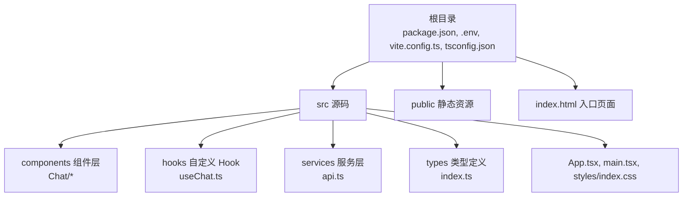
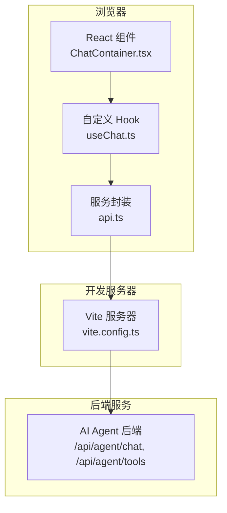
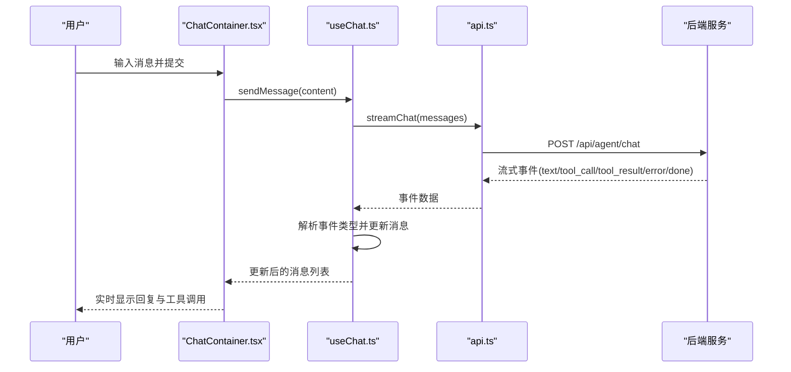
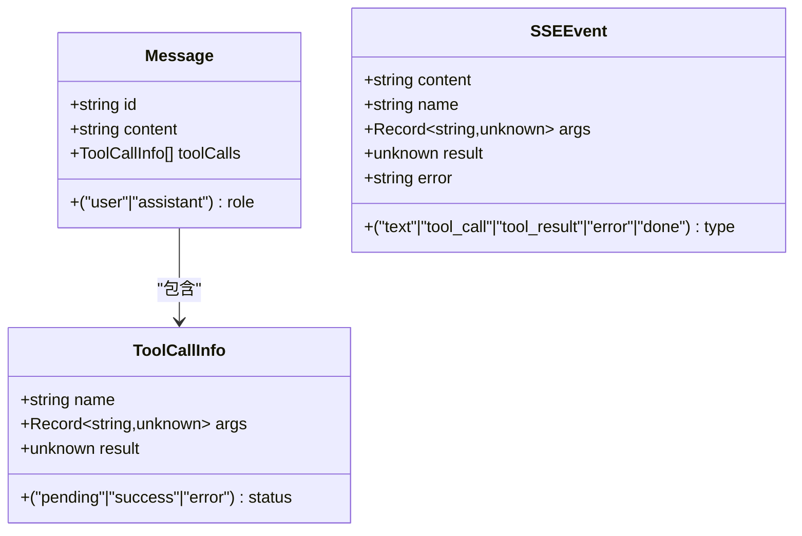
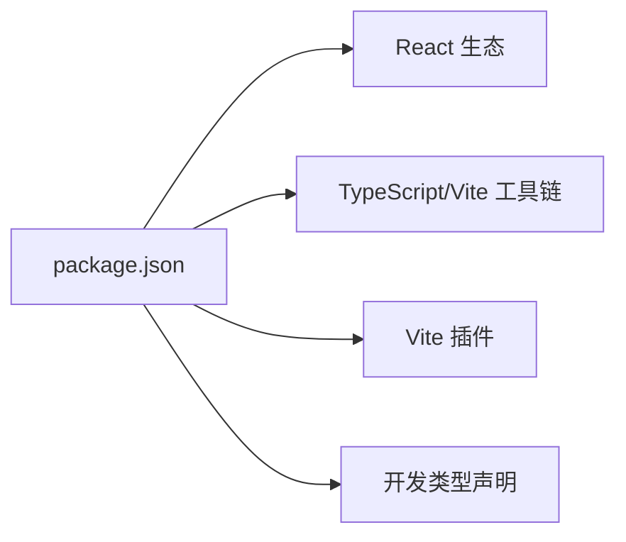

# 快速开始

<cite>
**本文引用的文件列表**
- [package.json](file://package.json)
- [.env](file://.env)
- [vite.config.ts](file://vite.config.ts)
- [src/services/api.ts](file://src/services/api.ts)
- [src/hooks/useChat.ts](file://src/hooks/useChat.ts)
- [src/App.tsx](file://src/App.tsx)
- [src/main.tsx](file://src/main.tsx)
- [index.html](file://index.html)
- [tsconfig.json](file://tsconfig.json)
- [src/types/index.ts](file://src/types/index.ts)
- [src/components/Chat/ChatContainer.tsx](file://src/components/Chat/ChatContainer.tsx)
</cite>

## 目录
1. [简介](#简介)
2. [项目结构](#项目结构)
3. [核心组件](#核心组件)
4. [架构总览](#架构总览)
5. [详细组件分析](#详细组件分析)
6. [依赖关系分析](#依赖关系分析)
7. [性能考虑](#性能考虑)
8. [故障排除指南](#故障排除指南)
9. [结论](#结论)
10. [附录](#附录)

## 简介
本指南面向首次接触 AI 代理 Web 项目的开发者，帮助你在最短时间内完成环境准备、依赖安装与开发服务器启动，并成功运行聊天界面，看到基础的流式消息交互效果。项目基于 React + TypeScript + Vite 构建，前端通过环境变量配置后端 API 地址，使用流式事件（SSE）接收 AI 回复。

## 项目结构
该项目采用“按功能模块组织”的目录布局：
- 根目录包含构建脚本、环境变量、类型定义与入口 HTML
- 源码位于 src 下，按功能拆分为 components、hooks、services、styles、types
- 配置文件包括 Vite、TypeScript、包管理等

图表来源
- [package.json](file://package.json#L1-L25)
- [vite.config.ts](file://vite.config.ts#L1-L10)
- [src/App.tsx](file://src/App.tsx#L1-L9)
- [src/main.tsx](file://src/main.tsx#L1-L10)
- [index.html](file://index.html#L1-L14)

章节来源
- [package.json](file://package.json#L1-L25)
- [vite.config.ts](file://vite.config.ts#L1-L10)
- [index.html](file://index.html#L1-L14)

## 核心组件
- 应用入口：在 index.html 中挂载根节点，main.tsx 创建 React 根实例，App.tsx 渲染聊天容器
- 聊天逻辑：useChat.ts 提供消息状态管理、发送消息、流式处理与工具调用展示
- API 服务：api.ts 封装了与后端的通信，支持流式数据读取与工具列表获取
- 类型系统：types/index.ts 定义消息、工具调用与 SSE 事件的数据结构

章节来源
- [src/main.tsx](file://src/main.tsx#L1-L10)
- [src/App.tsx](file://src/App.tsx#L1-L9)
- [src/hooks/useChat.ts](file://src/hooks/useChat.ts#L1-L159)
- [src/services/api.ts](file://src/services/api.ts#L1-L53)
- [src/types/index.ts](file://src/types/index.ts#L1-L28)

## 架构总览
前端通过 Vite 开发服务器提供本地调试能力，React 组件负责用户交互与渲染；useChat 通过 api.ts 发起请求到后端，接收以流式方式推送的事件，实时更新 UI。

图表来源
- [src/components/Chat/ChatContainer.tsx](file://src/components/Chat/ChatContainer.tsx#L1-L24)
- [src/hooks/useChat.ts](file://src/hooks/useChat.ts#L1-L159)
- [src/services/api.ts](file://src/services/api.ts#L1-L53)
- [vite.config.ts](file://vite.config.ts#L1-L10)

## 详细组件分析

### 环境变量与后端 API 地址
- 前端通过 Vite 的环境变量机制读取后端地址，默认值为 http://localhost:3001
- 在本地开发时，需要确保该地址指向可用的后端服务
- 若后端运行在其他端口或域名，请修改 .env 文件中的 VITE_API_URL

章节来源
- [.env](file://.env#L1-L2)
- [src/services/api.ts](file://src/services/api.ts#L1-L1)
- [vite.config.ts](file://vite.config.ts#L6-L8)

### 开发服务器与构建配置
- 开发服务器默认端口为 5173，可通过 vite.config.ts 修改
- 构建脚本使用 TypeScript 编译与 Vite 打包
- 本地预览使用 vite preview

章节来源
- [vite.config.ts](file://vite.config.ts#L1-L10)
- [package.json](file://package.json#L6-L10)

### 聊天流程与流式事件处理
- 用户发送消息后，useChat 会将消息加入状态并触发流式请求
- 服务端返回的事件类型包括文本、工具调用、工具结果、错误与完成信号
- 前端逐条解析事件并增量更新最后一条助手消息的内容或工具调用列表

图表来源
- [src/hooks/useChat.ts](file://src/hooks/useChat.ts#L14-L146)
- [src/services/api.ts](file://src/services/api.ts#L8-L47)

章节来源
- [src/hooks/useChat.ts](file://src/hooks/useChat.ts#L1-L159)
- [src/services/api.ts](file://src/services/api.ts#L1-L53)

### 数据模型与类型定义
- Message：包含消息 ID、角色、内容与可选的工具调用数组
- ToolCallInfo：描述一次工具调用的名称、参数、结果与状态
- SSEEvent：描述服务端推送的事件类型与负载

图表来源
- [src/types/index.ts](file://src/types/index.ts#L1-L28)

章节来源
- [src/types/index.ts](file://src/types/index.ts#L1-L28)

## 依赖关系分析
- 包管理与脚本：package.json 定义了开发与构建脚本，以及 React、TypeScript、Vite 及其相关插件
- 运行时依赖：React 生态与 Markdown 渲染相关库
- 开发依赖：TypeScript、Vite、React 插件与类型声明

图表来源
- [package.json](file://package.json#L11-L23)

章节来源
- [package.json](file://package.json#L1-L25)

## 性能考虑
- 使用流式读取减少首屏等待时间，提升交互体验
- 严格模式与 TypeScript 严格选项有助于早期发现潜在问题
- 避免不必要的重渲染：useCallback 与不可变更新策略已在 useChat 中应用

## 故障排除指南
- 启动失败：确认 Node.js 版本满足项目需求，建议使用 LTS 版本；若出现端口占用，可在 vite.config.ts 中调整 server.port
- 无法连接后端：检查 .env 中的 VITE_API_URL 是否正确指向后端服务；确保后端已启动且可访问
- 构建报错：清理 node_modules 并重新安装依赖；确认 TypeScript 与 Vite 版本兼容
- 浏览器跨域问题：如后端未配置 CORS，需在后端添加相应头或使用代理
- 无响应或空白页面：确认 index.html 中的入口脚本路径与 src/main.tsx 正确加载

章节来源
- [vite.config.ts](file://vite.config.ts#L6-L8)
- [.env](file://.env#L1-L2)
- [package.json](file://package.json#L11-L23)

## 结论
按照本指南完成环境准备与依赖安装后，你可以在本地快速启动开发服务器并看到基本的聊天界面。通过合理配置后端 API 地址与确保后端服务可用，即可体验到流式消息与工具调用的完整交互流程。

## 附录

### 环境要求
- Node.js：建议使用 LTS 版本
- 包管理器：推荐使用 npm（与 package.json 脚本兼容）
- 浏览器：现代浏览器（支持 ES2020+ 与模块）

章节来源
- [package.json](file://package.json#L11-L23)
- [tsconfig.json](file://tsconfig.json#L4-L19)

### 安装步骤
- 克隆仓库后进入项目根目录
- 安装依赖：执行包管理器安装命令
- 启动开发服务器：执行 dev 脚本
- 在浏览器中打开默认端口地址，即可看到聊天界面

章节来源
- [package.json](file://package.json#L6-L10)
- [vite.config.ts](file://vite.config.ts#L6-L8)
- [index.html](file://index.html#L1-L14)

### 环境变量配置
- VITE_API_URL：后端 API 的基础地址，默认 http://localhost:3001
- 如需更改后端地址，请在 .env 中设置对应值

章节来源
- [.env](file://.env#L1-L2)
- [src/services/api.ts](file://src/services/api.ts#L1-L1)

### 常见命令与预期行为
- npm run dev：启动开发服务器，监听端口并在浏览器中自动打开
- npm run build：先进行 TypeScript 编译，再进行 Vite 打包
- npm run preview：本地预览打包产物
- 预期输出：浏览器控制台无严重错误，页面显示聊天界面与输入框

章节来源
- [package.json](file://package.json#L6-L10)
- [vite.config.ts](file://vite.config.ts#L6-L8)