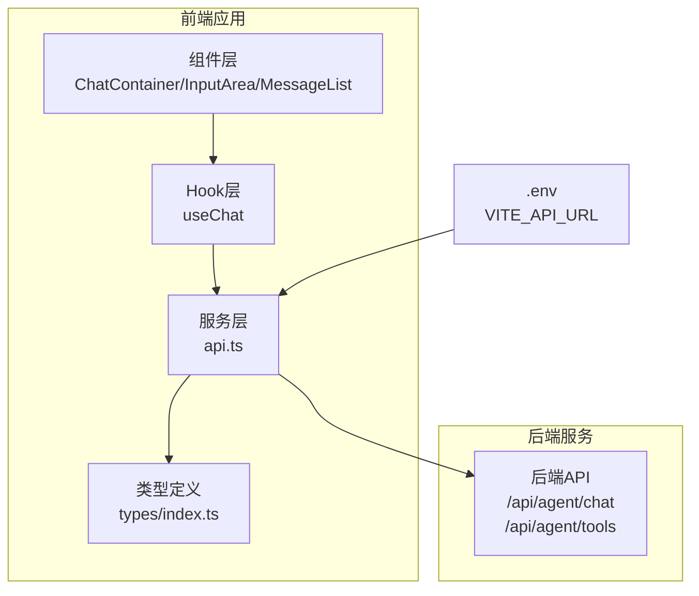
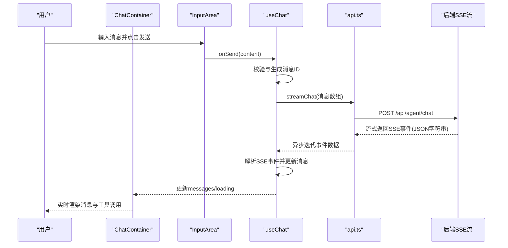
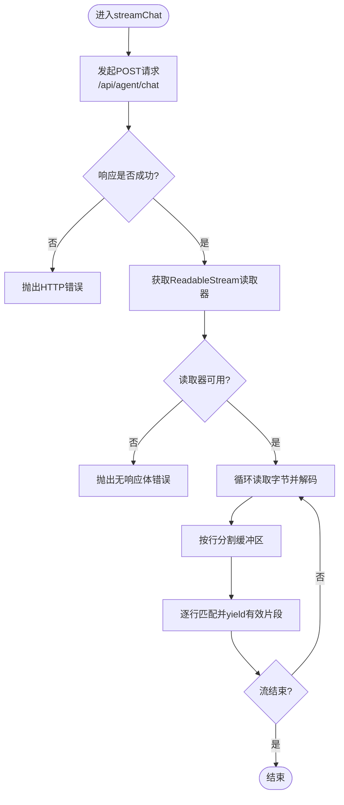
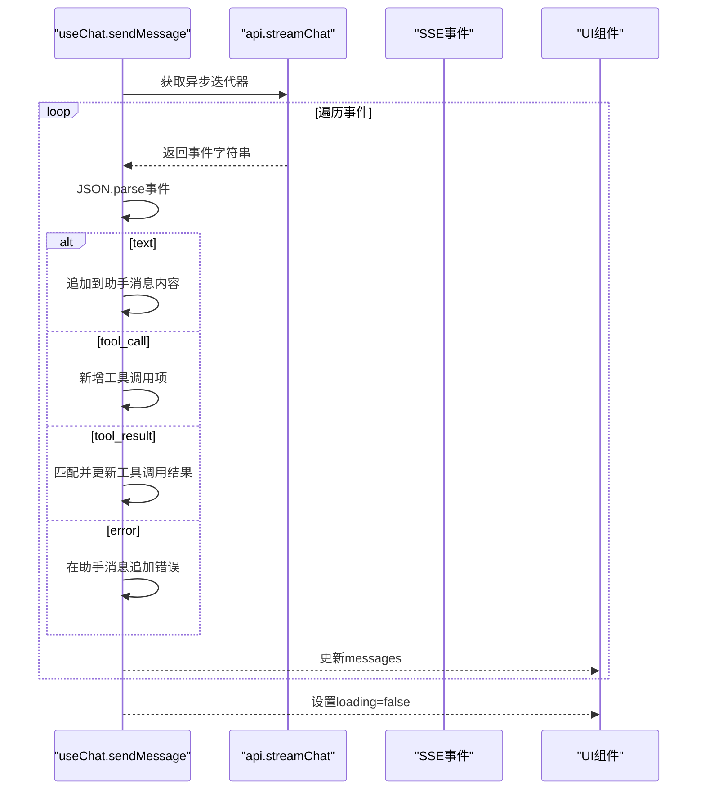
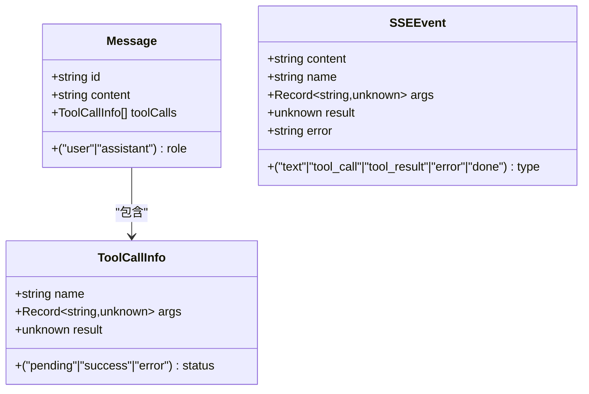
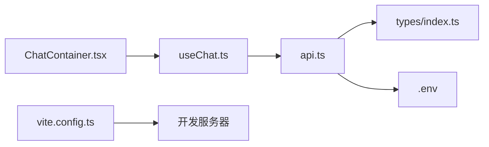

# API集成

<cite>
**本文引用的文件**
- [src/services/api.ts](file://src/services/api.ts)
- [src/hooks/useChat.ts](file://src/hooks/useChat.ts)
- [src/types/index.ts](file://src/types/index.ts)
- [src/components/Chat/ChatContainer.tsx](file://src/components/Chat/ChatContainer.tsx)
- [src/components/Chat/InputArea.tsx](file://src/components/Chat/InputArea.tsx)
- [src/components/Chat/MessageList.tsx](file://src/components/Chat/MessageList.tsx)
- [.env](file://.env)
- [vite.config.ts](file://vite.config.ts)
- [package.json](file://package.json)
</cite>

## 目录
1. [简介](#简介)
2. [项目结构](#项目结构)
3. [核心组件](#核心组件)
4. [架构总览](#架构总览)
5. [详细组件分析](#详细组件分析)
6. [依赖关系分析](#依赖关系分析)
7. [性能考虑](#性能考虑)
8. [故障排查指南](#故障排查指南)
9. [结论](#结论)
10. [附录](#附录)

## 简介
本文件面向AI代理Web前端项目，系统化梳理API服务层设计与集成方案，重点覆盖：
- HTTP请求封装与SSE流式处理
- 聊天API与工具列表API的集成方式（请求参数、响应格式、认证机制）
- SSE事件处理、流式数据解析与连接管理
- 环境变量配置、CORS与跨域处理
- API调用示例、错误处理策略与性能优化建议
- 扩展点与新接口集成方法

## 项目结构
前端采用React + Vite构建，API集成集中在服务层与自定义Hook中，UI组件负责展示与交互。关键目录与文件如下：
- 服务层：src/services/api.ts（HTTP与SSE封装）
- Hook层：src/hooks/useChat.ts（业务逻辑与事件驱动更新）
- 类型定义：src/types/index.ts（消息、工具调用、SSE事件等）
- 组件层：ChatContainer、InputArea、MessageList等
- 配置：.env（后端地址）、vite.config.ts（开发服务器）

图表来源
- [src/services/api.ts](file://src/services/api.ts#L1-L53)
- [src/hooks/useChat.ts](file://src/hooks/useChat.ts#L1-L159)
- [src/types/index.ts](file://src/types/index.ts#L1-L28)
- [.env](file://.env#L1-L2)

章节来源
- [src/services/api.ts](file://src/services/api.ts#L1-L53)
- [src/hooks/useChat.ts](file://src/hooks/useChat.ts#L1-L159)
- [src/types/index.ts](file://src/types/index.ts#L1-L28)
- [.env](file://.env#L1-L2)
- [vite.config.ts](file://vite.config.ts#L1-L10)

## 核心组件
- 服务层API封装：提供聊天流式接口与工具列表接口，统一处理HTTP状态、读取器与SSE事件解析。
- 自定义Hook useChat：协调消息状态、触发发送流程、消费SSE事件并更新UI。
- 类型系统：定义消息、工具调用、SSE事件的数据结构，确保前后端契约一致。
- 组件层：负责输入、渲染消息列表与加载态，配合Hook完成端到端交互。

章节来源
- [src/services/api.ts](file://src/services/api.ts#L1-L53)
- [src/hooks/useChat.ts](file://src/hooks/useChat.ts#L1-L159)
- [src/types/index.ts](file://src/types/index.ts#L1-L28)

## 架构总览
下图展示了从用户输入到后端SSE流消费的完整链路，以及错误处理与状态更新路径。

图表来源
- [src/components/Chat/ChatContainer.tsx](file://src/components/Chat/ChatContainer.tsx#L1-L24)
- [src/components/Chat/InputArea.tsx](file://src/components/Chat/InputArea.tsx#L1-L52)
- [src/hooks/useChat.ts](file://src/hooks/useChat.ts#L1-L159)
- [src/services/api.ts](file://src/services/api.ts#L8-L47)

## 详细组件分析

### 服务层：API封装与SSE流处理
- 基础URL：通过环境变量VITE_API_URL动态配置后端地址，默认本地3001端口。
- 聊天流式接口streamChat
  - 请求方法：POST
  - 路径：/api/agent/chat
  - 请求体：消息数组（仅role与content字段）
  - 认证：未在请求头中显式添加认证头
  - 响应：ReadableStream（SSE风格），逐行以"data: "前缀标识，使用TextDecoder增量解码
  - 错误处理：非OK状态抛出异常；无body或读取器失败时抛错
- 工具列表接口getTools
  - 方法：GET
  - 路径：/api/agent/tools
  - 返回：JSON对象（具体结构由后端定义）
  - 认证：未在请求头中显式添加认证头

图表来源
- [src/services/api.ts](file://src/services/api.ts#L8-L47)

章节来源
- [src/services/api.ts](file://src/services/api.ts#L1-L53)
- [.env](file://.env#L1-L2)

### Hook层：useChat与SSE事件处理
- 状态管理：维护messages与isLoading，支持清空消息
- 发送流程：
  - 生成用户消息与占位的助手消息
  - 将历史消息映射为后端期望的消息数组
  - 调用streamChat获取异步迭代器
- SSE事件解析与更新：
  - 支持事件类型：text、tool_call、tool_result、error、done
  - 文本事件：拼接到最后一条助手消息内容
  - 工具调用事件：追加到助手消息的toolCalls数组
  - 工具结果事件：根据名称匹配并更新对应工具调用的状态与结果
  - 错误事件：在助手消息末尾追加错误提示
  - done事件：当前流结束标记
- 错误处理：
  - 迭代期间JSON解析失败被忽略
  - 外层try/catch捕获流异常，向最后一条助手消息写入错误文本
  - finally确保loading状态复位

图表来源
- [src/hooks/useChat.ts](file://src/hooks/useChat.ts#L14-L146)
- [src/types/index.ts](file://src/types/index.ts#L15-L22)

章节来源
- [src/hooks/useChat.ts](file://src/hooks/useChat.ts#L1-L159)
- [src/types/index.ts](file://src/types/index.ts#L1-L28)

### 类型系统：消息、工具调用与SSE事件
- Message：id、role、content、可选toolCalls
- ToolCallInfo：name、args、result、status
- SSEEvent：type枚举（text、tool_call、tool_result、error、done），以及对应字段

图表来源
- [src/types/index.ts](file://src/types/index.ts#L1-L28)

章节来源
- [src/types/index.ts](file://src/types/index.ts#L1-L28)

### 组件层：输入、消息列表与容器
- ChatContainer：聚合消息列表与输入区域，并提供清空按钮
- InputArea：文本框输入、回车发送、禁用态控制
- MessageList：滚动到底部、空态提示、打字指示器

章节来源
- [src/components/Chat/ChatContainer.tsx](file://src/components/Chat/ChatContainer.tsx#L1-L24)
- [src/components/Chat/InputArea.tsx](file://src/components/Chat/InputArea.tsx#L1-L52)
- [src/components/Chat/MessageList.tsx](file://src/components/Chat/MessageList.tsx#L1-L52)

## 依赖关系分析
- 组件依赖Hook：ChatContainer依赖useChat提供的状态与方法
- Hook依赖服务层：useChat内部调用api.ts中的streamChat与getTools
- 服务层依赖类型定义：api.ts使用类型定义确保消息与事件结构一致
- 配置依赖环境变量：api.ts读取VITE_API_URL，vite.config.ts提供开发服务器端口

图表来源
- [src/components/Chat/ChatContainer.tsx](file://src/components/Chat/ChatContainer.tsx#L1-L24)
- [src/hooks/useChat.ts](file://src/hooks/useChat.ts#L1-L159)
- [src/services/api.ts](file://src/services/api.ts#L1-L53)
- [src/types/index.ts](file://src/types/index.ts#L1-L28)
- [.env](file://.env#L1-L2)
- [vite.config.ts](file://vite.config.ts#L1-L10)

章节来源
- [src/components/Chat/ChatContainer.tsx](file://src/components/Chat/ChatContainer.tsx#L1-L24)
- [src/hooks/useChat.ts](file://src/hooks/useChat.ts#L1-L159)
- [src/services/api.ts](file://src/services/api.ts#L1-L53)
- [src/types/index.ts](file://src/types/index.ts#L1-L28)
- [.env](file://.env#L1-L2)
- [vite.config.ts](file://vite.config.ts#L1-L10)

## 性能考虑
- 流式渲染：SSE事件逐条到达即更新，避免一次性渲染大块内容
- 最小化重渲染：useChat基于不可变更新策略，仅替换最后一条助手消息或其toolCalls
- 输入防抖：当前实现未内置防抖，可在InputArea中增加节流/防抖策略以减少高频发送
- 缓存与预取：工具列表getTools可缓存结果，避免重复请求
- 资源释放：在组件卸载时取消未完成的流或清理定时器（如需）
- 网络优化：合理设置超时与重试策略，结合后端限流与压缩

## 故障排查指南
- 无法连接后端
  - 检查VITE_API_URL是否正确指向后端服务
  - 开发环境下确认Vite代理或CORS配置允许跨域访问
- 流式数据不显示
  - 确认后端SSE事件以"data: "前缀输出
  - 检查事件JSON格式是否符合SSEEvent定义
- 工具调用结果未更新
  - 确保tool_result事件携带正确的name字段与结果
  - 检查事件顺序：tool_call必须先于tool_result出现
- 错误处理
  - 若JSON解析失败，当前实现会忽略该事件
  - 若流异常，最终会在助手消息中追加错误提示
- 加载态问题
  - 确保finally分支正确复位loading状态

章节来源
- [src/services/api.ts](file://src/services/api.ts#L17-L19)
- [src/hooks/useChat.ts](file://src/hooks/useChat.ts#L127-L146)

## 结论
本项目通过服务层统一封装HTTP与SSE，结合Hook层的事件驱动更新，实现了流畅的聊天体验与工具调用可视化。类型系统保证了前后端契约一致性，环境变量与Vite配置提供了灵活的部署与开发体验。后续可通过引入认证头、CORS代理、重试与缓存策略进一步增强稳定性与性能。

## 附录

### API定义与调用示例
- 聊天流式接口
  - 方法与路径：POST /api/agent/chat
  - 请求体：消息数组（每条含role与content）
  - 响应：SSE事件流，逐行以"data: "前缀标识
  - 示例调用：参考服务层streamChat函数
- 工具列表接口
  - 方法与路径：GET /api/agent/tools
  - 响应：JSON对象（具体结构由后端定义）
  - 示例调用：参考服务层getTools函数

章节来源
- [src/services/api.ts](file://src/services/api.ts#L8-L52)

### 环境变量与CORS配置
- 环境变量
  - VITE_API_URL：后端服务基础URL
- CORS与跨域
  - 当前端与后端端口不同时，建议在后端配置CORS白名单
  - 开发阶段可使用Vite代理转发请求，避免跨域问题

章节来源
- [.env](file://.env#L1-L2)
- [vite.config.ts](file://vite.config.ts#L1-L10)

### 认证机制
- 当前实现未在请求头中显式添加认证头
- 建议在服务层统一注入认证头（如Authorization），并在后端校验

章节来源
- [src/services/api.ts](file://src/services/api.ts#L9-L14)

### 扩展点与新接口集成方法
- 新增接口
  - 在服务层新增函数并遵循现有错误处理与返回格式
  - 在类型定义中补充新的事件或消息结构
- SSE事件扩展
  - 在SSEEvent中新增类型枚举
  - 在useChat中添加对应的事件处理分支
- 工具调用扩展
  - 在ToolCallInfo中扩展状态与结果字段
  - 在UI组件中渲染新的工具调用状态

章节来源
- [src/services/api.ts](file://src/services/api.ts#L49-L52)
- [src/hooks/useChat.ts](file://src/hooks/useChat.ts#L15-L22)
- [src/types/index.ts](file://src/types/index.ts#L15-L22)