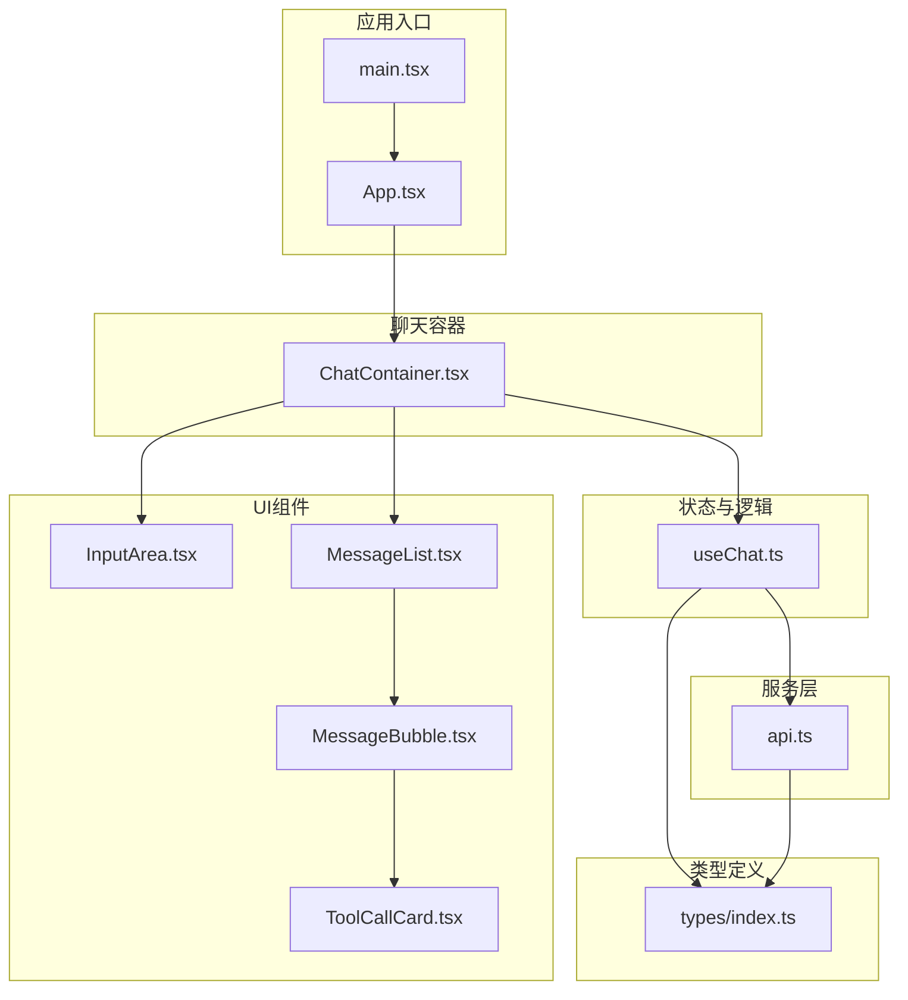
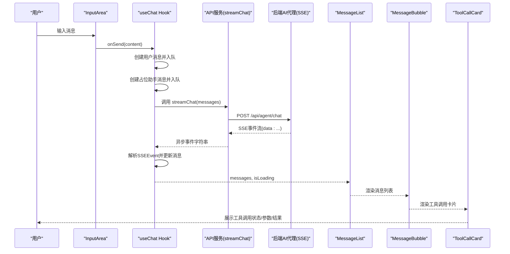
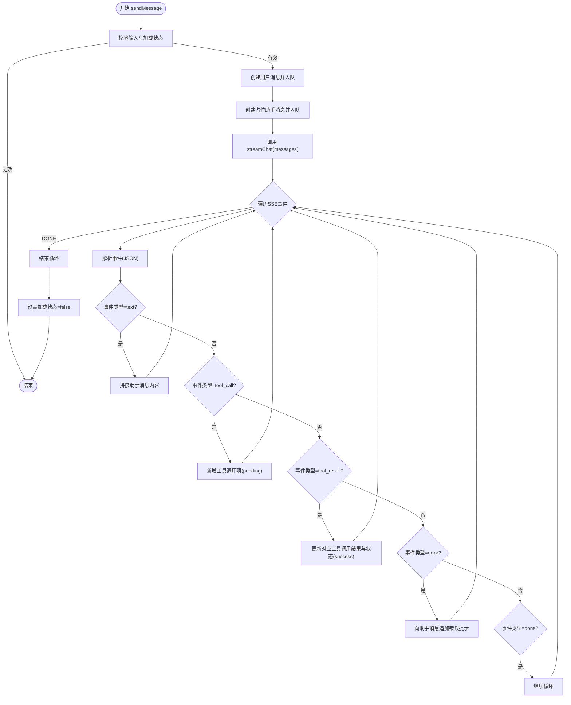
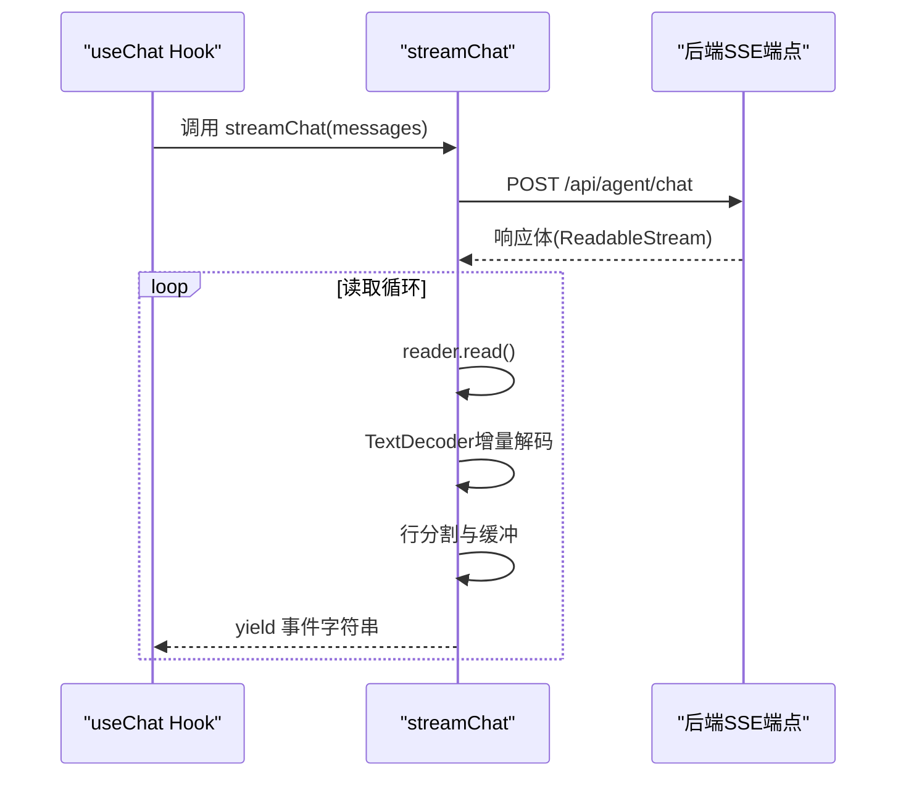
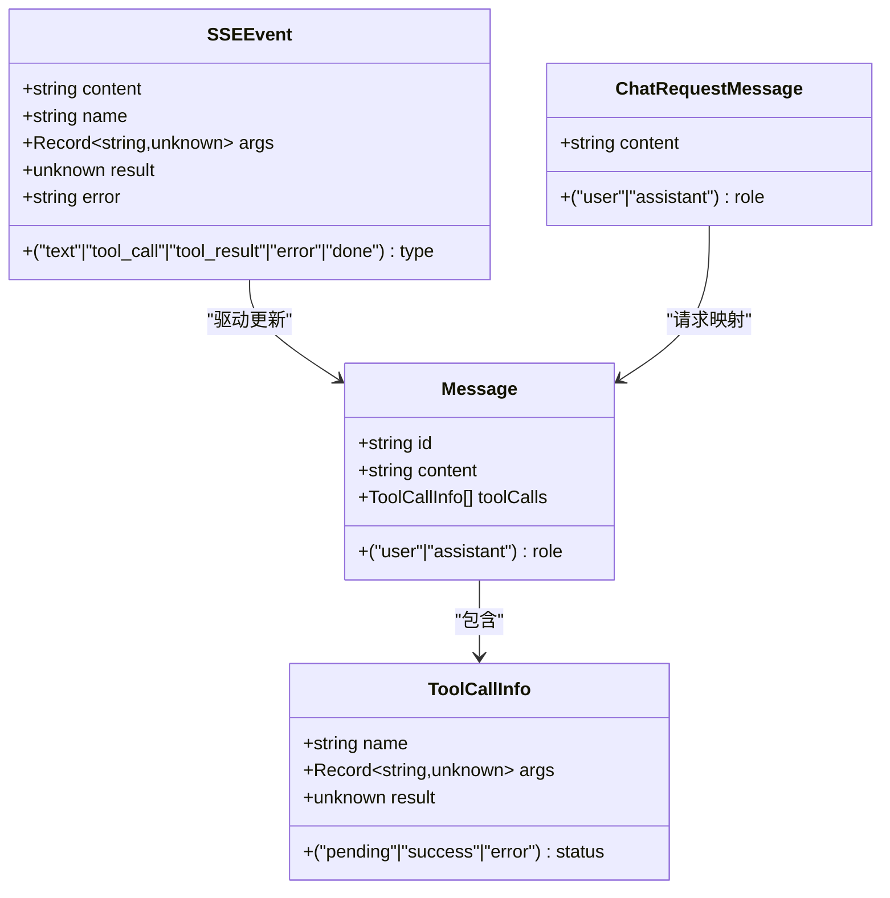
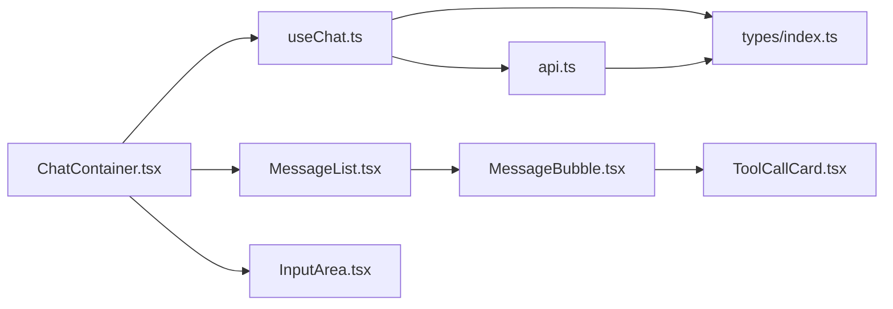

# 数据流设计

<cite>
**本文引用的文件**
- [src/hooks/useChat.ts](file://src/hooks/useChat.ts)
- [src/services/api.ts](file://src/services/api.ts)
- [src/types/index.ts](file://src/types/index.ts)
- [src/components/Chat/InputArea.tsx](file://src/components/Chat/InputArea.tsx)
- [src/components/Chat/MessageList.tsx](file://src/components/Chat/MessageList.tsx)
- [src/components/Chat/MessageBubble.tsx](file://src/components/Chat/MessageBubble.tsx)
- [src/components/Chat/ToolCallCard.tsx](file://src/components/Chat/ToolCallCard.tsx)
- [src/components/Chat/ChatContainer.tsx](file://src/components/Chat/ChatContainer.tsx)
- [src/App.tsx](file://src/App.tsx)
- [src/main.tsx](file://src/main.tsx)
- [src/components/Chat/ChatContainer.css](file://src/components/Chat/ChatContainer.css)
- [src/styles/index.css](file://src/styles/index.css)
</cite>

## 目录
1. [简介](#简介)
2. [项目结构](#项目结构)
3. [核心组件](#核心组件)
4. [架构总览](#架构总览)
5. [详细组件分析](#详细组件分析)
6. [依赖关系分析](#依赖关系分析)
7. [性能考虑](#性能考虑)
8. [故障排查指南](#故障排查指南)
9. [结论](#结论)

## 简介
本文件面向AI代理Web项目，系统性梳理“从用户输入到最终显示”的完整数据流路径与交互机制。重点覆盖以下链路：
- 用户输入 → InputArea
- InputArea → useChat Hook
- useChat Hook → API服务（streamChat）
- API服务 → 后端AI代理（SSE流）
- SSE事件 → useChat Hook（异步解析与状态更新）
- useChat Hook → MessageList
- MessageList → MessageBubble
- MessageBubble → ToolCallCard

同时，文档阐述异步数据处理、状态更新机制、流式响应处理、数据模型定义、类型安全保证、错误处理策略，以及组件间数据传递、状态提升与共享机制，并提供数据流图与实际代码示例路径。

## 项目结构
该项目采用以功能域划分的组件化架构，核心聊天流程由容器组件协调，通过自定义Hook集中管理状态与副作用，服务层负责与后端通信，UI层按职责拆分为输入区、消息列表、消息气泡与工具调用卡片等。

图表来源
- [src/main.tsx](file://src/main.tsx#L1-L10)
- [src/App.tsx](file://src/App.tsx#L1-L9)
- [src/components/Chat/ChatContainer.tsx](file://src/components/Chat/ChatContainer.tsx#L1-L24)
- [src/components/Chat/InputArea.tsx](file://src/components/Chat/InputArea.tsx#L1-L52)
- [src/components/Chat/MessageList.tsx](file://src/components/Chat/MessageList.tsx#L1-L52)
- [src/components/Chat/MessageBubble.tsx](file://src/components/Chat/MessageBubble.tsx#L1-L38)
- [src/components/Chat/ToolCallCard.tsx](file://src/components/Chat/ToolCallCard.tsx#L1-L45)
- [src/hooks/useChat.ts](file://src/hooks/useChat.ts#L1-L159)
- [src/services/api.ts](file://src/services/api.ts#L1-L53)
- [src/types/index.ts](file://src/types/index.ts#L1-L28)

章节来源
- [src/main.tsx](file://src/main.tsx#L1-L10)
- [src/App.tsx](file://src/App.tsx#L1-L9)
- [src/components/Chat/ChatContainer.tsx](file://src/components/Chat/ChatContainer.tsx#L1-L24)

## 核心组件
- ChatContainer：承载聊天界面，协调消息列表、输入区域与useChat Hook，负责清空对话等控制逻辑。
- InputArea：负责收集用户输入，触发发送动作，并根据加载状态禁用控件。
- useChat：核心Hook，维护消息数组与加载状态，封装发送消息、接收SSE事件、更新消息与工具调用状态的逻辑。
- MessageList：渲染消息列表，自动滚动到底部；在助手首次回复且内容为空时显示“正在输入”指示器。
- MessageBubble：渲染单条消息，支持Markdown文本与工具调用卡片集合。
- ToolCallCard：渲染单个工具调用的状态、参数与结果。
- api.ts：封装SSE流式请求，将后端返回的SSE事件转换为可消费的异步迭代器。
- types/index.ts：定义消息、工具调用与SSE事件的类型，确保端到端类型安全。

章节来源
- [src/components/Chat/ChatContainer.tsx](file://src/components/Chat/ChatContainer.tsx#L1-L24)
- [src/components/Chat/InputArea.tsx](file://src/components/Chat/InputArea.tsx#L1-L52)
- [src/hooks/useChat.ts](file://src/hooks/useChat.ts#L1-L159)
- [src/components/Chat/MessageList.tsx](file://src/components/Chat/MessageList.tsx#L1-L52)
- [src/components/Chat/MessageBubble.tsx](file://src/components/Chat/MessageBubble.tsx#L1-L38)
- [src/components/Chat/ToolCallCard.tsx](file://src/components/Chat/ToolCallCard.tsx#L1-L45)
- [src/services/api.ts](file://src/services/api.ts#L1-L53)
- [src/types/index.ts](file://src/types/index.ts#L1-L28)

## 架构总览
下图展示从用户输入到最终显示的完整数据流与组件交互关系。

图表来源
- [src/components/Chat/InputArea.tsx](file://src/components/Chat/InputArea.tsx#L1-L52)
- [src/hooks/useChat.ts](file://src/hooks/useChat.ts#L1-L159)
- [src/services/api.ts](file://src/services/api.ts#L1-L53)
- [src/components/Chat/MessageList.tsx](file://src/components/Chat/MessageList.tsx#L1-L52)
- [src/components/Chat/MessageBubble.tsx](file://src/components/Chat/MessageBubble.tsx#L1-L38)
- [src/components/Chat/ToolCallCard.tsx](file://src/components/Chat/ToolCallCard.tsx#L1-L45)

## 详细组件分析

### useChat Hook：状态管理与异步事件处理
- 职责
  - 维护消息数组与加载状态
  - 将用户输入转换为消息并入队
  - 预创建占位助手消息，便于流式增量更新
  - 通过streamChat消费SSE事件，按事件类型更新消息内容、工具调用状态与结果
  - 在finally阶段重置加载状态
- 关键点
  - 使用生成器函数式异步迭代器消费SSE事件，逐条解析并更新UI
  - 对不同SSE事件类型（text、tool_call、tool_result、error、done）分别处理
  - 错误处理：捕获JSON解析异常与网络异常，向最后一条助手消息追加错误提示
  - 工具调用状态机：pending → success，支持参数与结果展示
- 复杂度
  - 单次会话时间复杂度近似O(N)，N为事件数量；空间复杂度O(M)，M为消息数

图表来源
- [src/hooks/useChat.ts](file://src/hooks/useChat.ts#L1-L159)

章节来源
- [src/hooks/useChat.ts](file://src/hooks/useChat.ts#L1-L159)

### API服务：SSE流式请求
- 职责
  - 将前端消息数组序列化为ChatMessage格式并提交至后端
  - 基于ReadableStream读取SSE事件，按行解析"data:"前缀，逐条产出事件字符串
  - 对非OK响应抛出错误，对无响应体抛出错误
- 关键点
  - 使用TextDecoder增量解码，避免大块数据一次性解码
  - 通过AsyncGenerator实现惰性消费，降低内存占用
  - 通过环境变量VITE_API_URL配置后端地址

图表来源
- [src/services/api.ts](file://src/services/api.ts#L1-L53)

章节来源
- [src/services/api.ts](file://src/services/api.ts#L1-L53)

### 数据模型与类型安全
- Message：包含id、role、content与可选toolCalls数组
- ToolCallInfo：包含name、args、result与status（pending/success/error）
- SSEEvent：包含type与相应字段（content/name/args/result/error）
- ChatRequestMessage：用于向后端发送的消息结构

图表来源
- [src/types/index.ts](file://src/types/index.ts#L1-L28)

章节来源
- [src/types/index.ts](file://src/types/index.ts#L1-L28)

### InputArea：输入与发送控制
- 职责
  - 维护本地输入状态，支持回车发送、Shift+回车换行
  - 当处于加载状态或输入为空时禁用发送按钮
  - 调用父组件传入的onSend回调
- 交互细节
  - 禁用态与加载态通过isLoading属性控制
  - 发送后清空输入框

章节来源
- [src/components/Chat/InputArea.tsx](file://src/components/Chat/InputArea.tsx#L1-L52)

### MessageList：消息列表渲染与滚动
- 职责
  - 渲染所有消息，为空时显示引导状态
  - 自动滚动到底部，保证最新消息可见
  - 在助手首次回复且内容为空时显示“正在输入”指示器
- 性能注意
  - 仅在messages变化时滚动，避免频繁DOM操作

章节来源
- [src/components/Chat/MessageList.tsx](file://src/components/Chat/MessageList.tsx#L1-L52)

### MessageBubble：消息内容与工具调用渲染
- 职责
  - 区分用户/助手头像与样式
  - 使用ReactMarkdown渲染富文本
  - 当存在工具调用时渲染ToolCallCard集合
- 扩展性
  - 可扩展为支持更多消息类型（如文件、图片）

章节来源
- [src/components/Chat/MessageBubble.tsx](file://src/components/Chat/MessageBubble.tsx#L1-L38)

### ToolCallCard：工具调用卡片
- 职责
  - 展示工具名称、图标、状态（pending/success/error）
  - 展示参数与结果（以JSON格式预格式化）
- 图标映射
  - 内置常用工具图标，未匹配时使用默认图标

章节来源
- [src/components/Chat/ToolCallCard.tsx](file://src/components/Chat/ToolCallCard.tsx#L1-L45)

### ChatContainer：状态提升与共享
- 职责
  - 通过useChat获取messages、isLoading、sendMessage、clearMessages
  - 将状态与回调传递给子组件
  - 提供清空对话功能
- 设计要点
  - 将状态提升至容器组件，避免多处重复状态
  - 子组件只负责展示与简单交互，逻辑集中在Hook

章节来源
- [src/components/Chat/ChatContainer.tsx](file://src/components/Chat/ChatContainer.tsx#L1-L24)

## 依赖关系分析
- 组件耦合
  - ChatContainer依赖useChat，实现状态提升与共享
  - MessageList依赖MessageBubble，后者依赖ToolCallCard
  - InputArea依赖useChat提供的sendMessage
- 服务依赖
  - useChat依赖api.ts中的streamChat
  - api.ts依赖types中的ChatRequestMessage与Message
- 类型依赖
  - 全部组件通过types/index.ts定义的接口进行类型约束，确保跨层一致性

图表来源
- [src/components/Chat/ChatContainer.tsx](file://src/components/Chat/ChatContainer.tsx#L1-L24)
- [src/hooks/useChat.ts](file://src/hooks/useChat.ts#L1-L159)
- [src/services/api.ts](file://src/services/api.ts#L1-L53)
- [src/types/index.ts](file://src/types/index.ts#L1-L28)

章节来源
- [src/components/Chat/ChatContainer.tsx](file://src/components/Chat/ChatContainer.tsx#L1-L24)
- [src/hooks/useChat.ts](file://src/hooks/useChat.ts#L1-L159)
- [src/services/api.ts](file://src/services/api.ts#L1-L53)
- [src/types/index.ts](file://src/types/index.ts#L1-L28)

## 性能考虑
- 流式渲染
  - 使用SSE与AsyncGenerator逐条产出事件，避免一次性渲染大量数据
- 最小化重渲染
  - 通过不可变更新策略（map/filter/spread）减少不必要的重渲染
  - MessageList仅在messages变化时滚动
- 内存管理
  - 文本增量拼接而非全量替换，降低字符串操作成本
- 网络优化
  - 合理的缓冲与行分割，避免大块数据解码带来的峰值内存

## 故障排查指南
- 常见问题与定位
  - 无法发送消息：检查InputArea的isLoading状态与按钮禁用条件
  - 无响应或空白：确认useChat是否正确创建占位助手消息并进入加载状态
  - SSE解析失败：查看useChat中JSON解析异常分支，确认后端事件格式
  - 网络错误：检查api.ts中fetch响应状态与reader可用性
- 排查步骤
  - 在useChat中添加日志输出，观察事件类型与内容
  - 在api.ts中打印响应状态与reader状态
  - 检查后端SSE端点是否正确返回"data:"前缀
- 错误处理策略
  - 对JSON解析异常进行静默忽略，避免中断流式过程
  - 对网络异常与业务错误，向最后一条助手消息追加错误提示
  - finally阶段统一重置加载状态，防止UI卡死

章节来源
- [src/hooks/useChat.ts](file://src/hooks/useChat.ts#L1-L159)
- [src/services/api.ts](file://src/services/api.ts#L1-L53)

## 结论
本项目通过清晰的分层与类型约束，实现了从用户输入到最终显示的完整数据流闭环。useChat作为状态与逻辑中心，结合SSE流式事件，实现了低延迟、高交互性的聊天体验。组件间通过props与Hook共享状态，保持了良好的内聚与解耦。建议后续可进一步增强：
- 后端SSE事件格式的标准化与版本化
- 前端事件去重与幂等处理
- 更丰富的消息类型与富媒体支持
- 会话历史持久化与恢复能力