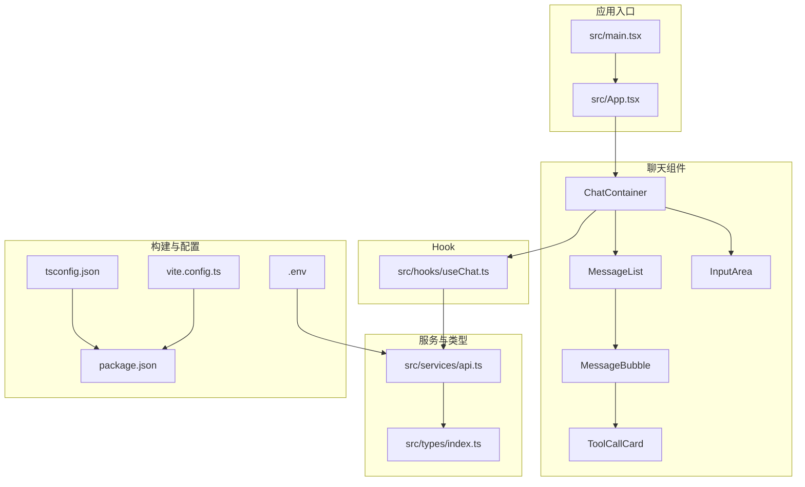
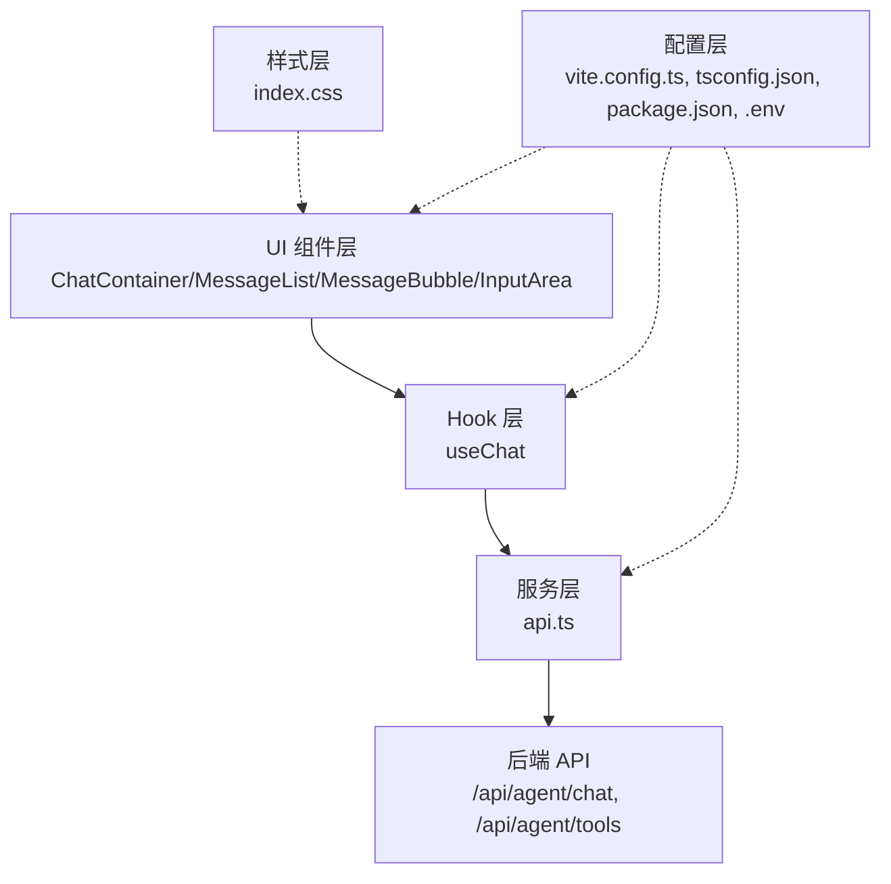
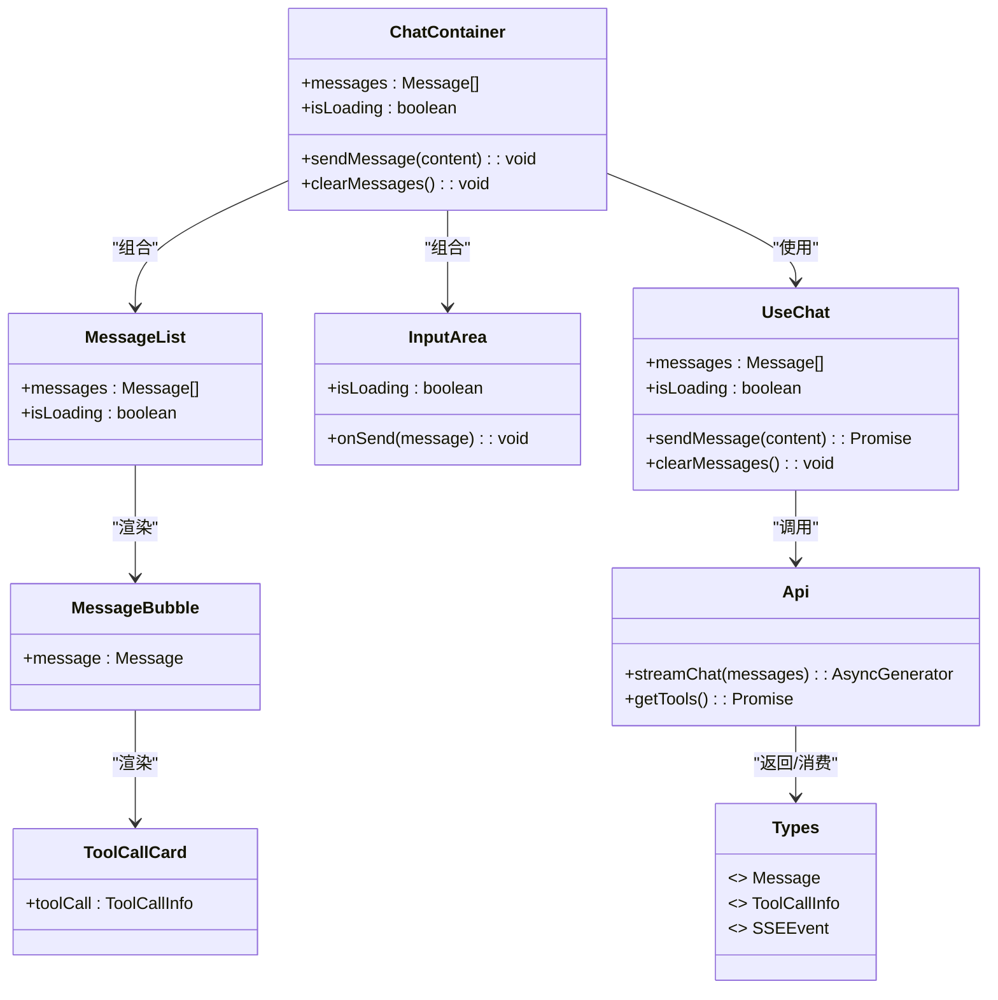
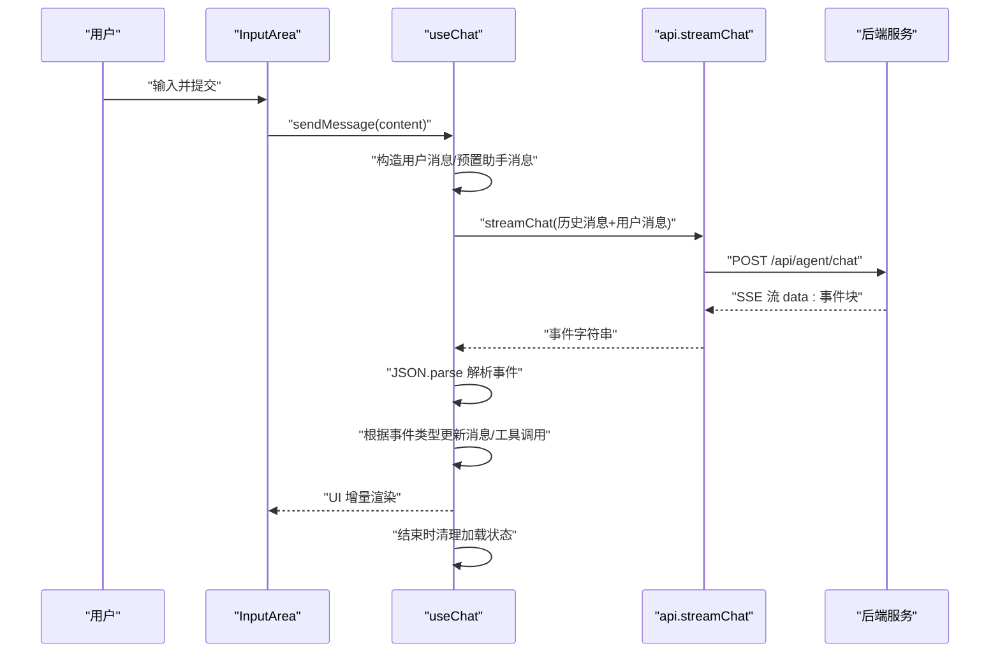
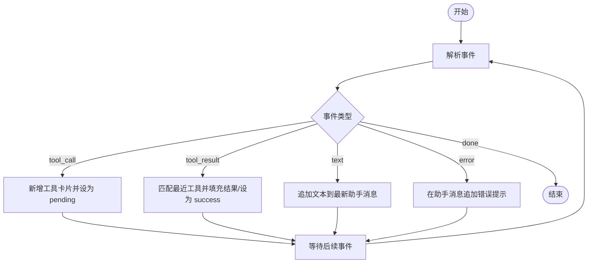
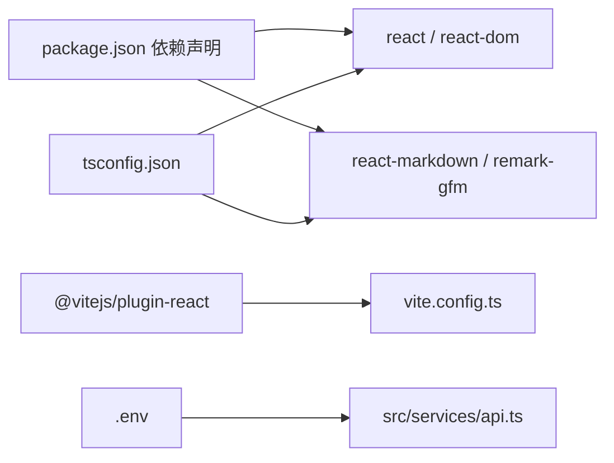
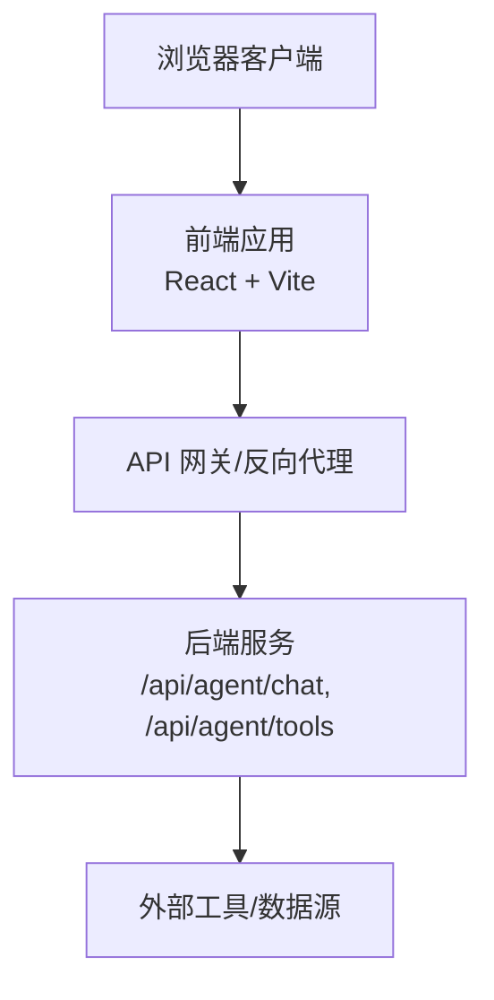

# 架构设计

<cite>
**本文引用的文件**
- [package.json](file://package.json)
- [vite.config.ts](file://vite.config.ts)
- [tsconfig.json](file://tsconfig.json)
- [.env](file://.env)
- [src/main.tsx](file://src/main.tsx)
- [src/App.tsx](file://src/App.tsx)
- [src/services/api.ts](file://src/services/api.ts)
- [src/hooks/useChat.ts](file://src/hooks/useChat.ts)
- [src/types/index.ts](file://src/types/index.ts)
- [src/components/Chat/ChatContainer.tsx](file://src/components/Chat/ChatContainer.tsx)
- [src/components/Chat/InputArea.tsx](file://src/components/Chat/InputArea.tsx)
- [src/components/Chat/MessageList.tsx](file://src/components/Chat/MessageList.tsx)
- [src/components/Chat/MessageBubble.tsx](file://src/components/Chat/MessageBubble.tsx)
- [src/components/Chat/ToolCallCard.tsx](file://src/components/Chat/ToolCallCard.tsx)
- [src/styles/index.css](file://src/styles/index.css)
</cite>

## 目录
1. [引言](#引言)
2. [项目结构](#项目结构)
3. [核心组件](#核心组件)
4. [架构总览](#架构总览)
5. [详细组件分析](#详细组件分析)
6. [依赖关系分析](#依赖关系分析)
7. [性能考量](#性能考量)
8. [故障排查指南](#故障排查指南)
9. [结论](#结论)
10. [附录](#附录)

## 引言
本项目是一个基于 React 的 AI 代理 Web 前端应用，采用现代前端技术栈与流式数据处理模式，实现用户与后端智能体的实时对话交互。系统通过 Hook 抽象状态与副作用，以组件化方式组织界面层，并通过服务模块封装与后端 API 的通信细节。本文档从架构视角阐述系统边界、组件交互、数据流与集成模式，同时给出技术选型、性能与可扩展性建议、部署拓扑以及安全与监控等横切关注点。

## 项目结构
项目采用按功能域划分的目录组织方式：入口文件位于根级，组件按业务域分层（Chat），服务与类型定义分别集中于独立模块，构建与编译配置集中在根级配置文件中。整体呈现“入口 → 组件 → 服务/类型 → 配置”的清晰层次。

图表来源
- [src/main.tsx](file://src/main.tsx#L1-L10)
- [src/App.tsx](file://src/App.tsx#L1-L9)
- [src/components/Chat/ChatContainer.tsx](file://src/components/Chat/ChatContainer.tsx#L1-L24)
- [src/components/Chat/MessageList.tsx](file://src/components/Chat/MessageList.tsx#L1-L52)
- [src/components/Chat/MessageBubble.tsx](file://src/components/Chat/MessageBubble.tsx#L1-L38)
- [src/components/Chat/InputArea.tsx](file://src/components/Chat/InputArea.tsx#L1-L52)
- [src/components/Chat/ToolCallCard.tsx](file://src/components/Chat/ToolCallCard.tsx#L1-L45)
- [src/hooks/useChat.ts](file://src/hooks/useChat.ts#L1-L159)
- [src/services/api.ts](file://src/services/api.ts#L1-L53)
- [src/types/index.ts](file://src/types/index.ts#L1-L28)
- [vite.config.ts](file://vite.config.ts#L1-L10)
- [tsconfig.json](file://tsconfig.json#L1-L23)
- [package.json](file://package.json#L1-L25)
- [.env](file://.env#L1-L2)

章节来源
- [package.json](file://package.json#L1-L25)
- [vite.config.ts](file://vite.config.ts#L1-L10)
- [tsconfig.json](file://tsconfig.json#L1-L23)
- [.env](file://.env#L1-L2)

## 核心组件
- 应用入口与根组件
  - 入口负责挂载根组件；根组件直接渲染聊天容器，形成单一职责的页面骨架。
- 聊天容器
  - 负责组织头部、消息列表与输入区域，并注入聊天 Hook 的状态与方法。
- 消息列表与气泡
  - 列表负责滚动定位与空态展示；气泡负责内容渲染与工具调用卡片展示。
- 输入区域
  - 提供文本输入、快捷键与发送控制逻辑。
- Hook：useChat
  - 管理消息状态、加载状态与发送流程；封装流式事件解析与工具调用生命周期。
- 服务层：api
  - 封装后端 API 地址、SSE 流式读取与工具清单获取。
- 类型系统
  - 定义消息、工具调用与 SSE 事件的强类型接口，确保跨模块一致性。

章节来源
- [src/main.tsx](file://src/main.tsx#L1-L10)
- [src/App.tsx](file://src/App.tsx#L1-L9)
- [src/components/Chat/ChatContainer.tsx](file://src/components/Chat/ChatContainer.tsx#L1-L24)
- [src/components/Chat/MessageList.tsx](file://src/components/Chat/MessageList.tsx#L1-L52)
- [src/components/Chat/MessageBubble.tsx](file://src/components/Chat/MessageBubble.tsx#L1-L38)
- [src/components/Chat/InputArea.tsx](file://src/components/Chat/InputArea.tsx#L1-L52)
- [src/components/Chat/ToolCallCard.tsx](file://src/components/Chat/ToolCallCard.tsx#L1-L45)
- [src/hooks/useChat.ts](file://src/hooks/useChat.ts#L1-L159)
- [src/services/api.ts](file://src/services/api.ts#L1-L53)
- [src/types/index.ts](file://src/types/index.ts#L1-L28)

## 架构总览
系统采用“组件化 + Hook 抽象 + 服务封装”的分层架构。前端通过 Hook 将 UI 与副作用解耦，服务模块统一管理网络请求与流式数据解析，类型系统贯穿全链路保障类型安全。组件之间通过属性与回调传递数据，避免直接共享状态，降低耦合度。

图表来源
- [src/components/Chat/ChatContainer.tsx](file://src/components/Chat/ChatContainer.tsx#L1-L24)
- [src/components/Chat/MessageList.tsx](file://src/components/Chat/MessageList.tsx#L1-L52)
- [src/components/Chat/MessageBubble.tsx](file://src/components/Chat/MessageBubble.tsx#L1-L38)
- [src/components/Chat/InputArea.tsx](file://src/components/Chat/InputArea.tsx#L1-L52)
- [src/hooks/useChat.ts](file://src/hooks/useChat.ts#L1-L159)
- [src/services/api.ts](file://src/services/api.ts#L1-L53)
- [vite.config.ts](file://vite.config.ts#L1-L10)
- [tsconfig.json](file://tsconfig.json#L1-L23)
- [package.json](file://package.json#L1-L25)
- [.env](file://.env#L1-L2)

## 详细组件分析

### 组件类图（代码级）

图表来源
- [src/components/Chat/ChatContainer.tsx](file://src/components/Chat/ChatContainer.tsx#L1-L24)
- [src/components/Chat/MessageList.tsx](file://src/components/Chat/MessageList.tsx#L1-L52)
- [src/components/Chat/MessageBubble.tsx](file://src/components/Chat/MessageBubble.tsx#L1-L38)
- [src/components/Chat/InputArea.tsx](file://src/components/Chat/InputArea.tsx#L1-L52)
- [src/components/Chat/ToolCallCard.tsx](file://src/components/Chat/ToolCallCard.tsx#L1-L45)
- [src/hooks/useChat.ts](file://src/hooks/useChat.ts#L1-L159)
- [src/services/api.ts](file://src/services/api.ts#L1-L53)
- [src/types/index.ts](file://src/types/index.ts#L1-L28)

### 数据流与处理逻辑（消息发送与流式渲染）
该流程围绕 Hook 的 sendMessage 方法展开：构造用户消息、预置助手消息、启动流式读取、逐段解析事件并增量更新 UI，最终在工具调用完成后回填结果。

图表来源
- [src/components/Chat/InputArea.tsx](file://src/components/Chat/InputArea.tsx#L1-L52)
- [src/hooks/useChat.ts](file://src/hooks/useChat.ts#L1-L159)
- [src/services/api.ts](file://src/services/api.ts#L1-L53)

### 工具调用事件处理流程
工具调用由“工具开始”“工具结果”两个事件驱动，期间 UI 会显示工具卡片并标注状态；当收到结果事件时，回填参数与结果并标记成功。

图表来源
- [src/hooks/useChat.ts](file://src/hooks/useChat.ts#L1-L159)
- [src/components/Chat/MessageBubble.tsx](file://src/components/Chat/MessageBubble.tsx#L1-L38)
- [src/components/Chat/ToolCallCard.tsx](file://src/components/Chat/ToolCallCard.tsx#L1-L45)

### Hook 模式与状态管理
- 状态隔离：每个 Hook 独立维护自身状态，避免全局状态污染。
- 回调稳定：使用 useCallback 包裹发送逻辑，减少子组件重渲染。
- 增量更新：针对最后一条助手消息进行就地拼接或工具数组追加，保证 UI 流畅。

章节来源
- [src/hooks/useChat.ts](file://src/hooks/useChat.ts#L1-L159)

### 流式处理与类型安全
- 流式读取：服务层通过 fetch 的 ReadableStream 与 TextDecoder 实现增量解析，事件以“data: ”前缀分块传输。
- 类型安全：通过 TypeScript 接口约束消息、工具调用与事件字段，确保跨模块一致的数据契约。
- 错误兜底：对 JSON 解析异常与网络错误进行捕获与 UI 反馈。

章节来源
- [src/services/api.ts](file://src/services/api.ts#L1-L53)
- [src/types/index.ts](file://src/types/index.ts#L1-L28)

### 组件化架构与样式
- 组件职责单一：容器负责布局与状态注入，展示组件负责渲染与少量交互。
- 样式内聚：样式文件集中管理，组件通过类名与局部样式结合，避免全局污染。
- Markdown 渲染：消息内容通过 React-Markdown 与 GFM 插件支持表格、代码块等语法。

章节来源
- [src/components/Chat/ChatContainer.tsx](file://src/components/Chat/ChatContainer.tsx#L1-L24)
- [src/components/Chat/MessageList.tsx](file://src/components/Chat/MessageList.tsx#L1-L52)
- [src/components/Chat/MessageBubble.tsx](file://src/components/Chat/MessageBubble.tsx#L1-L38)
- [src/styles/index.css](file://src/styles/index.css#L1-L35)

## 依赖关系分析
- 运行时依赖
  - React 生态：React 与 React-DOM 提供运行时与渲染能力；React-Markdown 与 remark-gfm 支持富文本渲染。
- 开发时依赖
  - Vite 作为构建与开发服务器；TypeScript 提供类型检查；@vitejs/plugin-react 提升开发体验。
- 配置与环境
  - Vite 配置指定插件与端口；TS 配置启用严格模式与 ESNext 模块解析；环境变量注入后端地址。

图表来源
- [package.json](file://package.json#L1-L25)
- [vite.config.ts](file://vite.config.ts#L1-L10)
- [tsconfig.json](file://tsconfig.json#L1-L23)
- [.env](file://.env#L1-L2)
- [src/services/api.ts](file://src/services/api.ts#L1-L53)

章节来源
- [package.json](file://package.json#L1-L25)
- [vite.config.ts](file://vite.config.ts#L1-L10)
- [tsconfig.json](file://tsconfig.json#L1-L23)
- [.env](file://.env#L1-L2)

## 性能考量
- 渲染优化
  - 使用 useCallback 包裹发送函数，减少子组件重渲染。
  - 仅对最后一条消息进行就地更新，降低 DOM 操作范围。
- 流式渲染
  - 增量解析事件，避免一次性拼接大量字符串，提升首包体验。
- 资源与体积
  - 保持依赖精简，避免引入不必要的 polyfill 或重型库。
- 编译与打包
  - 启用严格模式与无副作用导入，配合 Vite 的按需加载与 Tree-shaking。

## 故障排查指南
- 网络与流式读取
  - 若出现“无响应体”或“HTTP 非 OK”，检查后端服务可达性与 CORS 配置；确认环境变量正确指向后端地址。
- 事件解析异常
  - JSON 解析失败时，当前实现会忽略单条异常事件；若持续出现，建议在上层增加日志与重试策略。
- UI 卡顿
  - 大消息或频繁工具调用可能导致重排压力；可通过虚拟列表或分页策略缓解。
- 开发与构建
  - 若热更新失效，尝试重启开发服务器；检查 TS 配置与插件版本兼容性。

章节来源
- [src/services/api.ts](file://src/services/api.ts#L1-L53)
- [src/hooks/useChat.ts](file://src/hooks/useChat.ts#L1-L159)
- [.env](file://.env#L1-L2)

## 结论
本项目以 React 组件化为核心，结合 Hook 抽象与服务封装，实现了简洁而健壮的聊天交互体验。通过流式事件与类型安全设计，系统在可读性与可维护性上具备良好基础。建议在后续迭代中补充监控埋点、错误边界与缓存策略，并完善工具调用的可视化与可观察性。

## 附录

### 系统上下文图（概念性）

（此图为概念性示意，不对应具体源码文件）

### 部署拓扑与基础设施要求（建议）
- 前端部署
  - 使用静态站点托管（如 Nginx/CDN）；开启 gzip/HTTP2；配置缓存策略。
- 后端对接
  - 通过反向代理转发至后端服务；确保跨域与证书配置正确。
- 可观测性
  - 前端埋点：关键事件（发送、接收、错误）上报；性能指标（TTFB、FCP）采集。
  - 后端可观测：日志聚合、链路追踪、告警策略。
- 安全加固
  - HTTPS 强制；CSP 与 X-Frame-Options；敏感信息通过环境变量注入。
- 灾难恢复
  - 多副本部署与健康检查；灰度发布与回滚机制；备份与快照策略。

### 版本兼容性与技术栈
- 前端技术栈
  - React 18、TypeScript、Vite、React-Markdown、remark-gfm
- 构建与开发
  - Vite 插件生态、ESNext 模块解析、严格 TS 检查
- 环境变量
  - VITE_API_URL 指向后端服务地址

章节来源
- [package.json](file://package.json#L1-L25)
- [vite.config.ts](file://vite.config.ts#L1-L10)
- [tsconfig.json](file://tsconfig.json#L1-L23)
- [.env](file://.env#L1-L2)