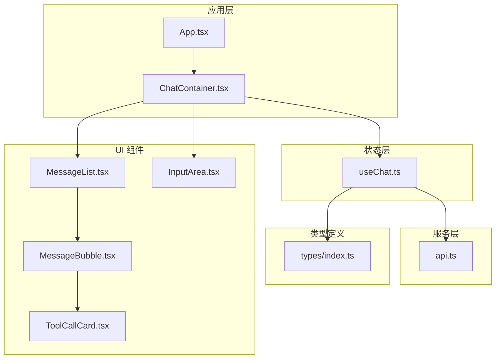
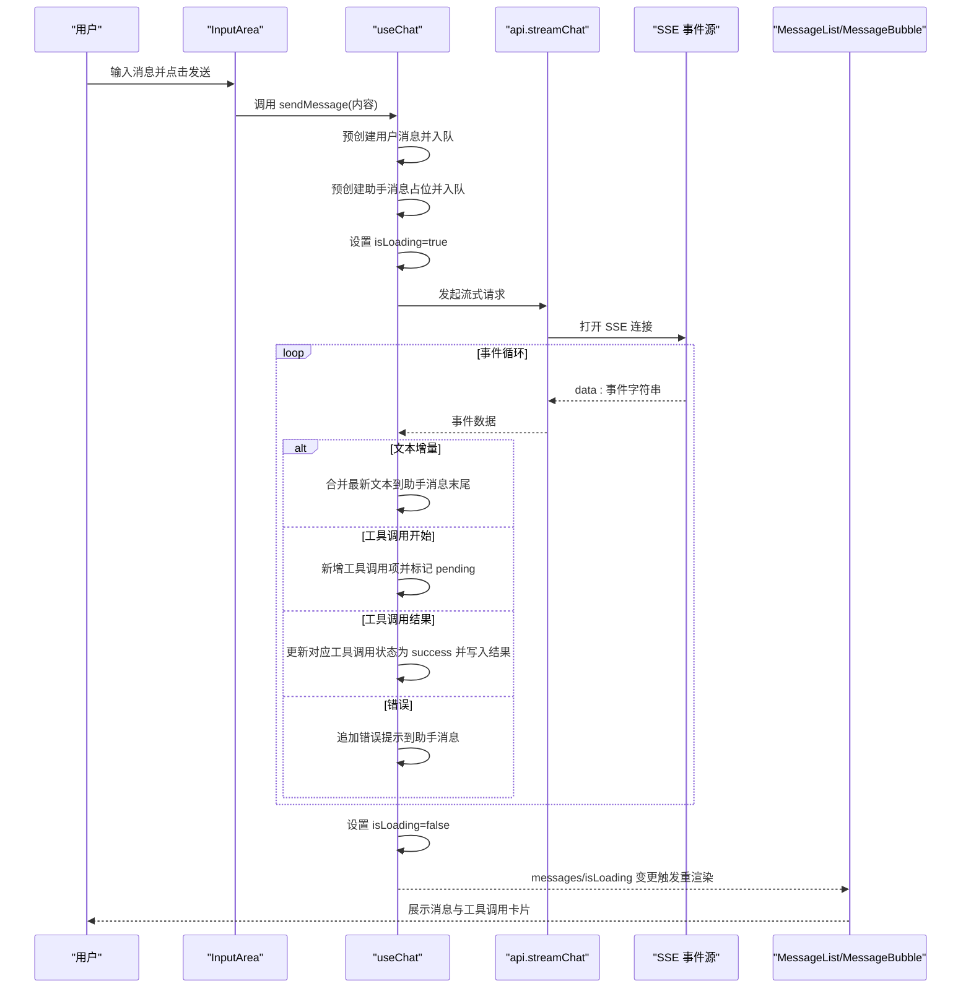
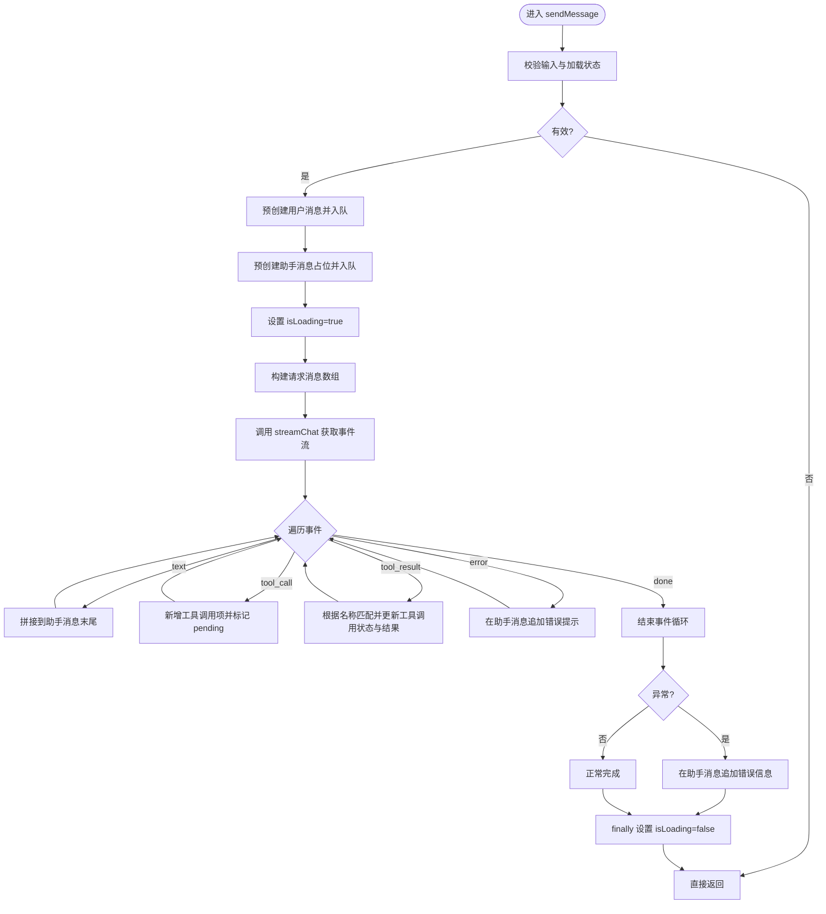
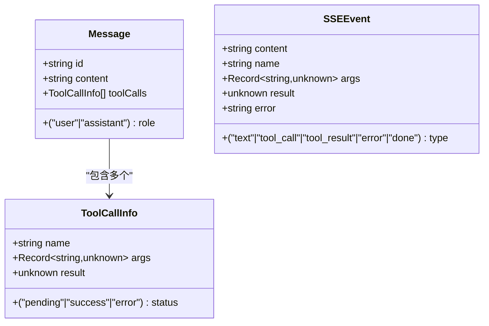
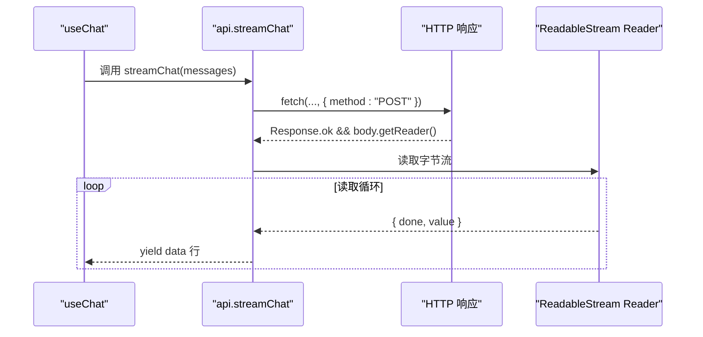
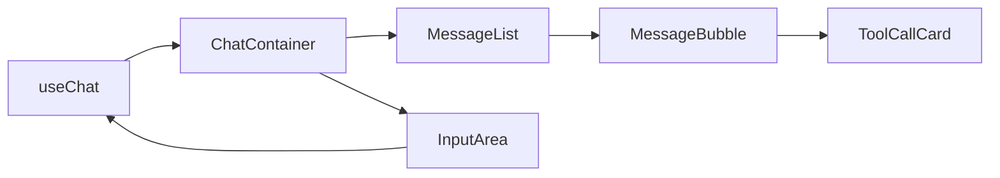
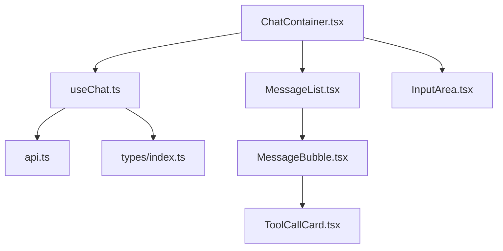
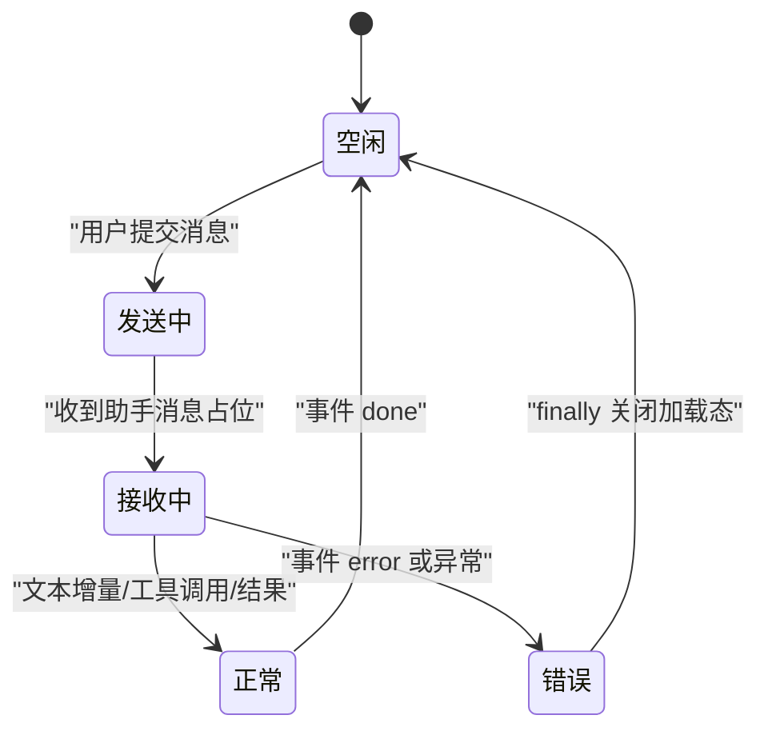

# 状态管理

<cite>
**本文引用的文件**
- [useChat.ts](file://src/hooks/useChat.ts)
- [api.ts](file://src/services/api.ts)
- [index.ts](file://src/types/index.ts)
- [ChatContainer.tsx](file://src/components/Chat/ChatContainer.tsx)
- [InputArea.tsx](file://src/components/Chat/InputArea.tsx)
- [MessageList.tsx](file://src/components/Chat/MessageList.tsx)
- [MessageBubble.tsx](file://src/components/Chat/MessageBubble.tsx)
- [ToolCallCard.tsx](file://src/components/Chat/ToolCallCard.tsx)
- [App.tsx](file://src/App.tsx)
- [MessageList.css](file://src/components/Chat/MessageList.css)
- [InputArea.css](file://src/components/Chat/InputArea.css)
</cite>

## 目录
1. [简介](#简介)
2. [项目结构](#项目结构)
3. [核心组件](#核心组件)
4. [架构总览](#架构总览)
5. [详细组件分析](#详细组件分析)
6. [依赖关系分析](#依赖关系分析)
7. [性能考量](#性能考量)
8. [故障排查指南](#故障排查指南)
9. [结论](#结论)
10. [附录](#附录)

## 简介
本文件围绕 AI 代理 Web 项目的“状态管理”主题，系统性解析自定义 Hook useChat 的设计与实现，涵盖：
- 状态定义与数据模型
- 状态更新逻辑与副作用处理
- 消息状态、工具调用状态、加载状态与错误状态的管理机制
- React 状态钩子使用模式、状态提升与状态共享策略
- 状态持久化、性能优化与内存管理建议
- 状态流转图与时序流程图
- 实际使用示例与扩展维护建议

## 项目结构
该项目采用按功能域划分的目录组织方式，状态管理集中在 hooks/useChat.ts 中，通过服务层与类型定义连接到 UI 组件树：
- hooks/useChat.ts：自定义 Hook，封装聊天会话状态与异步流式交互
- services/api.ts：封装后端 API 调用与服务器事件流（SSE）读取
- types/index.ts：定义消息、工具调用与 SSE 事件的数据结构
- components/Chat/*：展示层组件，消费 useChat 返回的状态与方法
- App.tsx：应用入口，渲染聊天容器

图表来源
- [App.tsx](file://src/App.tsx#L1-L9)
- [ChatContainer.tsx](file://src/components/Chat/ChatContainer.tsx#L1-L24)
- [useChat.ts](file://src/hooks/useChat.ts#L1-L159)
- [api.ts](file://src/services/api.ts#L1-L53)
- [types/index.ts](file://src/types/index.ts#L1-L28)
- [MessageList.tsx](file://src/components/Chat/MessageList.tsx#L1-L52)
- [MessageBubble.tsx](file://src/components/Chat/MessageBubble.tsx#L1-L38)
- [ToolCallCard.tsx](file://src/components/Chat/ToolCallCard.tsx#L1-L45)
- [InputArea.tsx](file://src/components/Chat/InputArea.tsx#L1-L52)

章节来源
- [App.tsx](file://src/App.tsx#L1-L9)
- [ChatContainer.tsx](file://src/components/Chat/ChatContainer.tsx#L1-L24)
- [useChat.ts](file://src/hooks/useChat.ts#L1-L159)
- [api.ts](file://src/services/api.ts#L1-L53)
- [index.ts](file://src/types/index.ts#L1-L28)

## 核心组件
本节聚焦 useChat 自定义 Hook 的设计与实现要点：
- 状态定义
  - messages：数组，存储用户与助手消息；每个消息可包含工具调用列表
  - isLoading：布尔值，表示当前是否正在等待或接收流式响应
- 状态更新逻辑
  - sendMessage：发送用户消息、预创建助手消息占位、启动流式处理、按事件类型增量更新消息内容与工具调用状态
  - clearMessages：清空消息列表
- 副作用处理
  - 流式读取：通过服务层提供的异步生成器迭代 SSE 数据块
  - 错误处理：捕获 JSON 解析异常与网络/流式异常，并在最后统一关闭加载态
- 状态提升与共享
  - 将 messages 与 isLoading 提升至 useChat，由 ChatContainer 统一注入给 MessageList 与 InputArea
  - sendMessage 作为回调向下传递，InputArea 在用户输入时触发

章节来源
- [useChat.ts](file://src/hooks/useChat.ts#L1-L159)
- [index.ts](file://src/types/index.ts#L1-L28)
- [ChatContainer.tsx](file://src/components/Chat/ChatContainer.tsx#L1-L24)
- [InputArea.tsx](file://src/components/Chat/InputArea.tsx#L1-L52)
- [MessageList.tsx](file://src/components/Chat/MessageList.tsx#L1-L52)

## 架构总览
下图展示了从用户输入到消息渲染的完整状态流转路径，以及工具调用状态的更新时机。

图表来源
- [useChat.ts](file://src/hooks/useChat.ts#L14-L146)
- [api.ts](file://src/services/api.ts#L8-L47)
- [MessageList.tsx](file://src/components/Chat/MessageList.tsx#L11-L51)
- [MessageBubble.tsx](file://src/components/Chat/MessageBubble.tsx#L11-L37)
- [ToolCallCard.tsx](file://src/components/Chat/ToolCallCard.tsx#L14-L44)
- [InputArea.tsx](file://src/components/Chat/InputArea.tsx#L12-L24)

## 详细组件分析

### useChat 自定义 Hook 设计
- 状态定义与初始化
  - 使用 useState 定义 messages 与 isLoading
  - 使用 generateId 为每条消息分配唯一标识，避免重复键问题
- 状态更新策略
  - sendMessage：采用不可变更新模式，通过函数式 setState 保证读取到最新 messages
  - 对于工具调用，先在助手消息末尾追加新的 ToolCallInfo，再在收到结果时回填状态与结果
- 副作用与流式处理
  - 通过服务层返回的异步生成器迭代 SSE 事件
  - 对 JSON 解析异常进行容错处理，避免中断流式过程
  - finally 分支确保 isLoading 在任何情况下都会被重置
- 性能与内存
  - 仅在消息列表变化时滚动到底部，减少不必要的 DOM 操作
  - 使用 useCallback 包裹 sendMessage 与 clearMessages，降低下游组件重渲染频率

图表来源
- [useChat.ts](file://src/hooks/useChat.ts#L14-L146)

章节来源
- [useChat.ts](file://src/hooks/useChat.ts#L1-L159)
- [index.ts](file://src/types/index.ts#L1-L28)

### 类型与数据模型
- Message：包含 id、role、content，以及可选的 toolCalls 数组
- ToolCallInfo：包含 name、args、result、status
- SSEEvent：描述服务器推送的事件类型与负载，支持 text、tool_call、tool_result、error、done

图表来源
- [index.ts](file://src/types/index.ts#L1-L28)

章节来源
- [index.ts](file://src/types/index.ts#L1-L28)

### 服务层与流式事件
- streamChat：基于 Fetch 的 SSE 读取器，逐行解码并产出事件字符串
- 错误处理：当响应非 OK 或无响应体时抛出异常，便于上层捕获
- 事件分发：事件字符串由 useChat 解析为 SSEEvent 并驱动状态更新

图表来源
- [api.ts](file://src/services/api.ts#L8-L47)

章节来源
- [api.ts](file://src/services/api.ts#L1-L53)

### UI 组件与状态消费
- ChatContainer：从 useChat 获取 messages、isLoading、sendMessage、clearMessages，并将其传递给 MessageList 与 InputArea
- MessageList：根据 messages 渲染消息气泡，自动滚动到底部；在助手消息为空且无工具调用时显示“正在输入”指示
- MessageBubble：渲染消息内容与工具调用卡片
- ToolCallCard：根据工具调用状态渲染不同样式与内容
- InputArea：管理本地输入状态，禁用发送按钮与文本域以防止并发发送

图表来源
- [ChatContainer.tsx](file://src/components/Chat/ChatContainer.tsx#L6-L22)
- [MessageList.tsx](file://src/components/Chat/MessageList.tsx#L11-L51)
- [MessageBubble.tsx](file://src/components/Chat/MessageBubble.tsx#L11-L37)
- [ToolCallCard.tsx](file://src/components/Chat/ToolCallCard.tsx#L14-L44)
- [InputArea.tsx](file://src/components/Chat/InputArea.tsx#L9-L28)

章节来源
- [ChatContainer.tsx](file://src/components/Chat/ChatContainer.tsx#L1-L24)
- [MessageList.tsx](file://src/components/Chat/MessageList.tsx#L1-L52)
- [MessageBubble.tsx](file://src/components/Chat/MessageBubble.tsx#L1-L38)
- [ToolCallCard.tsx](file://src/components/Chat/ToolCallCard.tsx#L1-L45)
- [InputArea.tsx](file://src/components/Chat/InputArea.tsx#L1-L52)

## 依赖关系分析
- useChat 依赖
  - 服务层：streamChat 提供异步事件流
  - 类型定义：Message、ToolCallInfo、SSEEvent
- UI 组件依赖
  - ChatContainer 依赖 useChat
  - MessageList 依赖 MessageBubble
  - MessageBubble 依赖 ToolCallCard
- 耦合与内聚
  - useChat 内聚了聊天状态与流式事件处理，UI 组件只负责展示与输入，职责清晰
  - 通过 props 下传状态与回调，形成单向数据流

图表来源
- [useChat.ts](file://src/hooks/useChat.ts#L1-L159)
- [api.ts](file://src/services/api.ts#L1-L53)
- [index.ts](file://src/types/index.ts#L1-L28)
- [ChatContainer.tsx](file://src/components/Chat/ChatContainer.tsx#L1-L24)
- [MessageList.tsx](file://src/components/Chat/MessageList.tsx#L1-L52)
- [MessageBubble.tsx](file://src/components/Chat/MessageBubble.tsx#L1-L38)
- [ToolCallCard.tsx](file://src/components/Chat/ToolCallCard.tsx#L1-L45)
- [InputArea.tsx](file://src/components/Chat/InputArea.tsx#L1-L52)

章节来源
- [useChat.ts](file://src/hooks/useChat.ts#L1-L159)
- [api.ts](file://src/services/api.ts#L1-L53)
- [index.ts](file://src/types/index.ts#L1-L28)
- [ChatContainer.tsx](file://src/components/Chat/ChatContainer.tsx#L1-L24)
- [MessageList.tsx](file://src/components/Chat/MessageList.tsx#L1-L52)
- [MessageBubble.tsx](file://src/components/Chat/MessageBubble.tsx#L1-L38)
- [ToolCallCard.tsx](file://src/components/Chat/ToolCallCard.tsx#L1-L45)
- [InputArea.tsx](file://src/components/Chat/InputArea.tsx#L1-L52)

## 性能考量
- 渲染优化
  - 使用 useCallback 包裹 sendMessage 与 clearMessages，避免子组件不必要的重渲染
  - MessageList 仅在 messages 变化时滚动，减少 DOM 操作
- 状态更新策略
  - 采用函数式 setState，确保读取到最新消息列表，避免闭包陷阱
  - 工具调用状态更新通过映射替换，避免深层拷贝带来的性能损耗
- 流式处理
  - 事件循环中按类型分支处理，避免多余解析与渲染
  - finally 统一关闭加载态，确保 UI 状态一致性
- 内存管理
  - 未显式持久化消息历史，避免无限增长导致内存压力
  - 可在 clearMessages 或达到阈值时清理旧消息，保持 UI 响应性

[本节为通用性能指导，不直接分析具体文件]

## 故障排查指南
- 常见问题与定位
  - 发送按钮无法点击：检查 isLoading 状态与 InputArea 的禁用条件
  - 文本不显示：确认 SSE 事件类型为 text，且助手消息存在
  - 工具调用不更新：确认事件类型为 tool_call/tool_result，且名称匹配
  - 错误提示未出现：检查事件类型为 error，或网络异常被捕获
- 排查步骤
  - 在 useChat 中打印事件类型与内容，验证事件流是否到达
  - 检查 api.streamChat 是否正确读取响应体与行分隔符
  - 确认 UI 组件是否正确消费 messages 与 isLoading
- 错误处理
  - JSON 解析异常被忽略，不会中断流式过程
  - 网络或流式异常会在 finally 分支前被捕捉并写入助手消息

章节来源
- [useChat.ts](file://src/hooks/useChat.ts#L44-L146)
- [api.ts](file://src/services/api.ts#L8-L47)
- [InputArea.tsx](file://src/components/Chat/InputArea.tsx#L12-L24)
- [MessageList.tsx](file://src/components/Chat/MessageList.tsx#L14-L16)

## 结论
useChat 通过清晰的状态定义、稳健的流式事件处理与合理的 UI 状态消费，实现了从用户输入到消息渲染的完整闭环。其设计遵循单向数据流与状态提升原则，具备良好的可维护性与扩展性。后续可在以下方面进一步增强：
- 状态持久化：将 messages 与 isLoading 写入 localStorage 或 IndexedDB，支持刷新后恢复
- 性能优化：引入消息分页、虚拟滚动与事件去抖
- 错误与重试：增加网络异常重试与断线重连策略
- 工具调用扩展：支持工具调用的取消与进度反馈

[本节为总结性内容，不直接分析具体文件]

## 附录

### 状态流转图（概念）

[该图为概念性状态图，不直接映射到具体源文件]

### 实际使用示例（路径指引）
- 在组件中使用 useChat
  - 引入 Hook 并解构出 messages、isLoading、sendMessage、clearMessages
  - 将 sendMessage 传递给 InputArea，将 messages 与 isLoading 传递给 MessageList
  - 参考路径：[ChatContainer.tsx](file://src/components/Chat/ChatContainer.tsx#L6-L22)
- 发送消息
  - 调用 sendMessage(content)，内部会预创建用户与助手消息并启动流式处理
  - 参考路径：[useChat.ts](file://src/hooks/useChat.ts#L14-L146)
- 清空对话
  - 调用 clearMessages，重置消息列表
  - 参考路径：[useChat.ts](file://src/hooks/useChat.ts#L148-L150)

### 扩展与维护建议
- 新增状态字段
  - 在类型定义中扩展 Message 或 ToolCallInfo，确保 UI 组件同步更新
  - 参考路径：[index.ts](file://src/types/index.ts#L1-L28)
- 新增事件类型
  - 在 SSEEvent 中添加新类型，并在 useChat 的事件分支中处理
  - 参考路径：[useChat.ts](file://src/hooks/useChat.ts#L50-L126)
- 状态持久化
  - 在应用启动时从本地存储恢复 messages 与 isLoading
  - 在 sendMessage 与 clearMessages 中同步更新本地存储
  - 参考路径：[useChat.ts](file://src/hooks/useChat.ts#L11-L150)