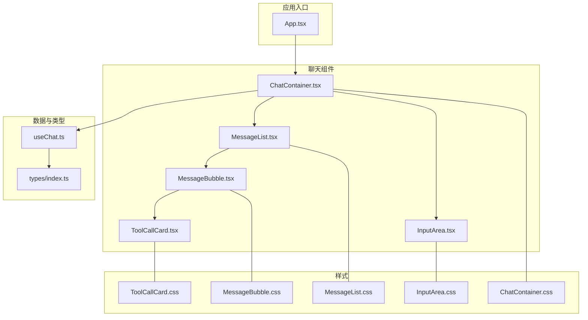
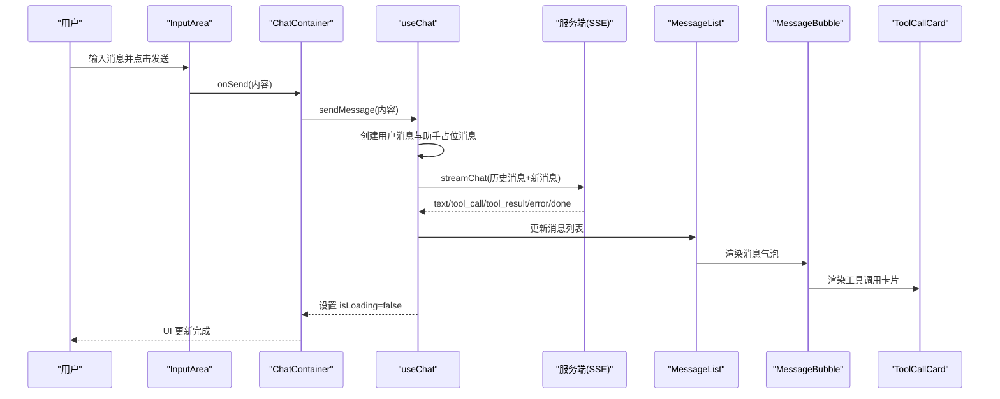
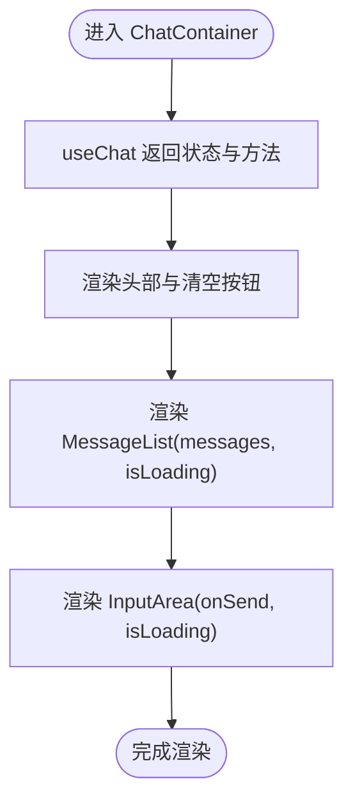
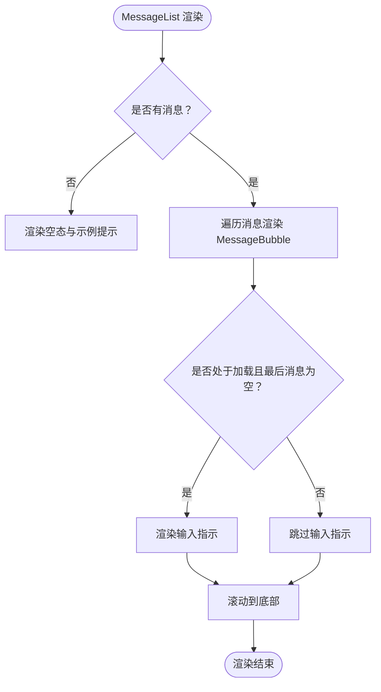
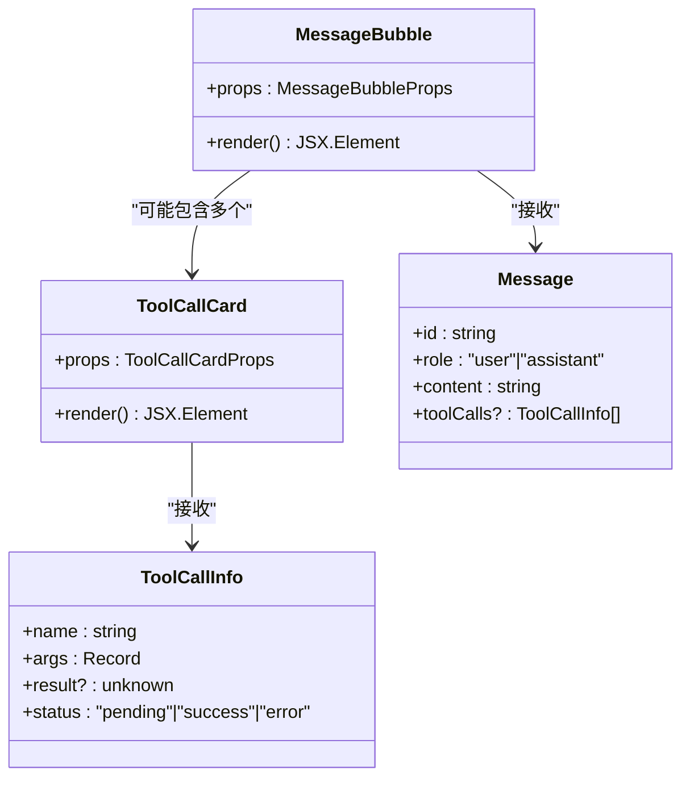
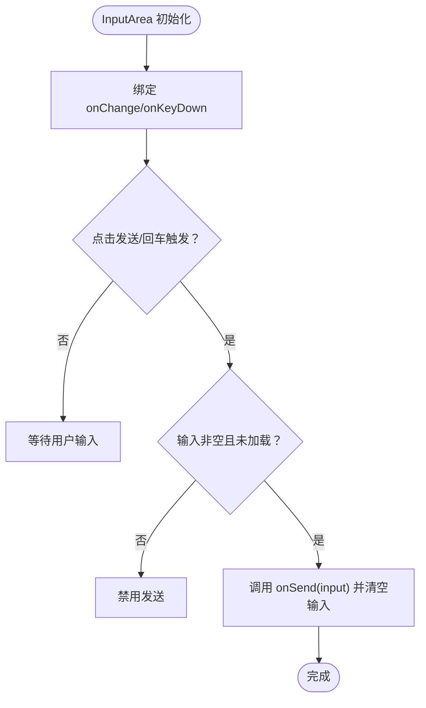
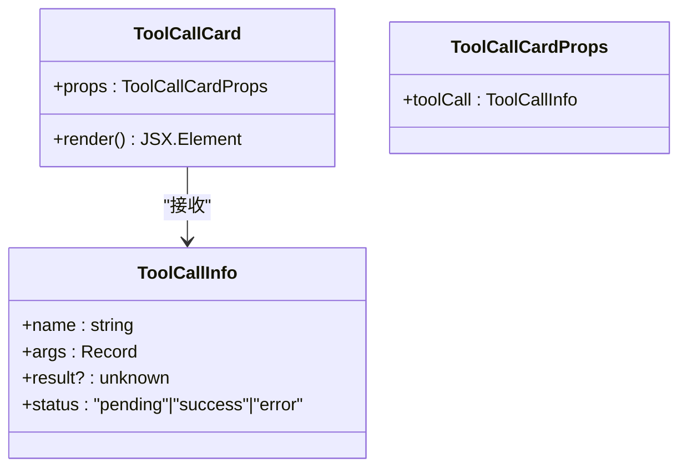
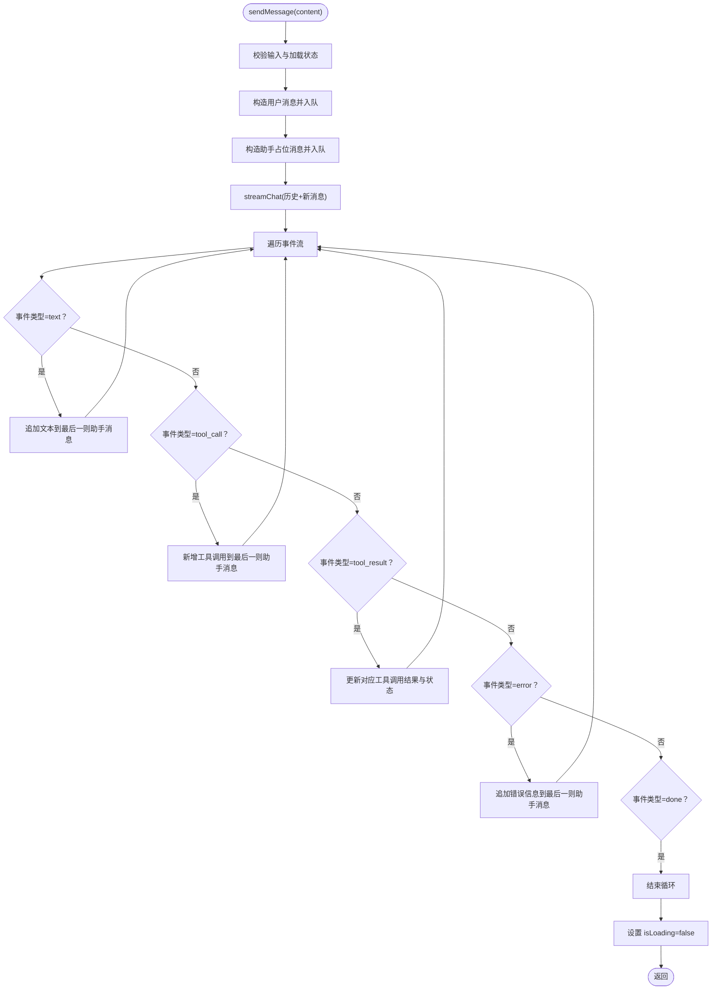
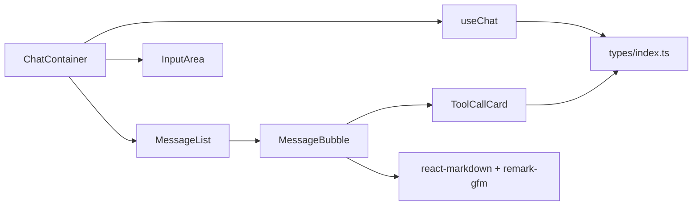

# 组件架构

<cite>
**本文引用的文件**
- [App.tsx](file://src/App.tsx)
- [ChatContainer.tsx](file://src/components/Chat/ChatContainer.tsx)
- [MessageList.tsx](file://src/components/Chat/MessageList.tsx)
- [MessageBubble.tsx](file://src/components/Chat/MessageBubble.tsx)
- [InputArea.tsx](file://src/components/Chat/InputArea.tsx)
- [ToolCallCard.tsx](file://src/components/Chat/ToolCallCard.tsx)
- [useChat.ts](file://src/hooks/useChat.ts)
- [types/index.ts](file://src/types/index.ts)
- [ChatContainer.css](file://src/components/Chat/ChatContainer.css)
- [MessageList.css](file://src/components/Chat/MessageList.css)
- [MessageBubble.css](file://src/components/Chat/MessageBubble.css)
- [InputArea.css](file://src/components/Chat/InputArea.css)
- [ToolCallCard.css](file://src/components/Chat/ToolCallCard.css)
</cite>

## 目录
1. [简介](#简介)
2. [项目结构](#项目结构)
3. [核心组件](#核心组件)
4. [架构总览](#架构总览)
5. [详细组件分析](#详细组件分析)
6. [依赖分析](#依赖分析)
7. [性能考虑](#性能考虑)
8. [故障排查指南](#故障排查指南)
9. [结论](#结论)
10. [附录](#附录)

## 简介
本文件系统性梳理 AI 代理 Web 项目的组件架构与设计模式，重点围绕 Chat 容器体系：ChatContainer 作为主容器协调数据与交互，MessageList 负责消息列表渲染与滚动行为，MessageBubble 承载单条消息展示与 Markdown 渲染，InputArea 提供输入与发送控制，ToolCallCard 展示工具调用状态与参数/结果。文档同时阐述组件间通信机制（props 传递与回调）、生命周期管理、性能优化策略与可复用性设计，并给出组合模式与最佳实践建议。

## 项目结构
项目采用按功能域分层的组件组织方式，Chat 子模块集中于 src/components/Chat 下，配合自定义 Hook useChat 抽象聊天逻辑，类型定义集中在 src/types 中，样式文件与组件一一对应，便于维护与扩展。

图表来源
- [App.tsx](file://src/App.tsx#L1-L9)
- [ChatContainer.tsx](file://src/components/Chat/ChatContainer.tsx#L1-L24)
- [MessageList.tsx](file://src/components/Chat/MessageList.tsx#L1-L52)
- [MessageBubble.tsx](file://src/components/Chat/MessageBubble.tsx#L1-L38)
- [InputArea.tsx](file://src/components/Chat/InputArea.tsx#L1-L52)
- [ToolCallCard.tsx](file://src/components/Chat/ToolCallCard.tsx#L1-L45)
- [useChat.ts](file://src/hooks/useChat.ts#L1-L159)
- [types/index.ts](file://src/types/index.ts#L1-L28)

章节来源
- [App.tsx](file://src/App.tsx#L1-L9)
- [ChatContainer.tsx](file://src/components/Chat/ChatContainer.tsx#L1-L24)

## 核心组件
- ChatContainer：主容器，负责承载头部、消息列表、输入区域，聚合 useChat 的状态与方法，向下传递 props。
- MessageList：根据消息数组渲染消息气泡，处理空态与“正在输入”指示，自动滚动到底部。
- MessageBubble：单条消息渲染，支持 Markdown 文本与工具调用卡片集合。
- InputArea：多行文本输入、回车发送、禁用态控制与按钮交互。
- ToolCallCard：展示工具名称、图标、状态、参数与结果，区分 pending/success/error。
- useChat：封装消息状态、加载状态、发送流程与 SSE 流式更新，提供 clearMessages。

章节来源
- [ChatContainer.tsx](file://src/components/Chat/ChatContainer.tsx#L6-L23)
- [MessageList.tsx](file://src/components/Chat/MessageList.tsx#L11-L51)
- [MessageBubble.tsx](file://src/components/Chat/MessageBubble.tsx#L11-L37)
- [InputArea.tsx](file://src/components/Chat/InputArea.tsx#L9-L51)
- [ToolCallCard.tsx](file://src/components/Chat/ToolCallCard.tsx#L14-L44)
- [useChat.ts](file://src/hooks/useChat.ts#L10-L158)

## 架构总览
组件层次清晰：App 仅引入 ChatContainer；ChatContainer 通过 useChat 获取状态与方法，向下传递给 MessageList 与 InputArea；MessageList 内部使用 MessageBubble 渲染每条消息；MessageBubble 可能包含多个 ToolCallCard；ToolCallCard 由 useChat 的流事件驱动更新。

图表来源
- [InputArea.tsx](file://src/components/Chat/InputArea.tsx#L12-L24)
- [ChatContainer.tsx](file://src/components/Chat/ChatContainer.tsx#L6-L23)
- [useChat.ts](file://src/hooks/useChat.ts#L14-L146)
- [MessageList.tsx](file://src/components/Chat/MessageList.tsx#L11-L51)
- [MessageBubble.tsx](file://src/components/Chat/MessageBubble.tsx#L11-L37)
- [ToolCallCard.tsx](file://src/components/Chat/ToolCallCard.tsx#L14-L44)

## 详细组件分析

### ChatContainer 设计理念
- 角色定位：顶层容器，负责布局与状态聚合，不直接处理业务细节。
- 数据与行为：从 useChat 获取 messages、isLoading、sendMessage、clearMessages。
- 交互控制：根据消息数量显示清空按钮；将发送回调与加载状态透传给 InputArea。
- 结构组织：头部标题与清空按钮、消息列表、输入区域三段式布局，配合样式实现响应式与阴影边框。

图表来源
- [ChatContainer.tsx](file://src/components/Chat/ChatContainer.tsx#L6-L23)

章节来源
- [ChatContainer.tsx](file://src/components/Chat/ChatContainer.tsx#L6-L23)
- [ChatContainer.css](file://src/components/Chat/ChatContainer.css#L1-L42)

### MessageList：列表渲染与滚动
- 职责边界：只负责消息列表渲染、空态提示、输入指示与滚动行为。
- 空态处理：当无消息时展示欢迎语、示例提示按钮。
- 滚动行为：每次消息变化后平滑滚动到底部，确保最新消息可见。
- 输入指示：在最后一条消息为空且无工具调用时显示“正在输入”动画。
- 性能注意：通过 key 基于消息 id 渲染，避免不必要的重排。

图表来源
- [MessageList.tsx](file://src/components/Chat/MessageList.tsx#L11-L51)

章节来源
- [MessageList.tsx](file://src/components/Chat/MessageList.tsx#L11-L51)
- [MessageList.css](file://src/components/Chat/MessageList.css#L65-L97)

### MessageBubble：消息内容与工具调用
- 角色区分：根据消息角色渲染不同样式（用户/助手）。
- 内容渲染：使用 ReactMarkdown 渲染富文本，启用 GFM 支持。
- 工具调用：当存在 toolCalls 时，逐个渲染 ToolCallCard。
- 可访问性：头像图标与内容区分离，保证可读性与可聚焦性。

图表来源
- [MessageBubble.tsx](file://src/components/Chat/MessageBubble.tsx#L11-L37)
- [ToolCallCard.tsx](file://src/components/Chat/ToolCallCard.tsx#L14-L44)
- [types/index.ts](file://src/types/index.ts#L1-L28)

章节来源
- [MessageBubble.tsx](file://src/components/Chat/MessageBubble.tsx#L11-L37)
- [MessageBubble.css](file://src/components/Chat/MessageBubble.css#L1-L74)

### InputArea：输入与发送控制
- 行为控制：受 isLoading 禁用；输入为空或加载中禁用发送按钮。
- 交互体验：Enter 发送、Shift+Enter 换行；自动清空输入框；按钮根据状态切换图标。
- 可扩展性：onSend 回调由上层注入，便于替换为不同后端或中间件。

图表来源
- [InputArea.tsx](file://src/components/Chat/InputArea.tsx#L9-L51)

章节来源
- [InputArea.tsx](file://src/components/Chat/InputArea.tsx#L9-L51)
- [InputArea.css](file://src/components/Chat/InputArea.css#L1-L62)

### ToolCallCard：工具调用可视化
- 状态展示：根据 status 动态设置边框颜色与状态标签样式。
- 图标映射：根据工具名映射到预设图标，未知工具使用默认图标。
- 参数与结果：以代码块形式展示 args 与 result，支持换行与滚动。
- 可复用性：独立组件，可被其他消息类型复用，便于统一风格。

图表来源
- [ToolCallCard.tsx](file://src/components/Chat/ToolCallCard.tsx#L4-L6)
- [types/index.ts](file://src/types/index.ts#L8-L13)

章节来源
- [ToolCallCard.tsx](file://src/components/Chat/ToolCallCard.tsx#L14-L44)
- [ToolCallCard.css](file://src/components/Chat/ToolCallCard.css#L1-L95)

### useChat：聊天状态与流式更新
- 状态管理：messages、isLoading，提供 sendMessage 与 clearMessages。
- 发送流程：生成用户消息与助手占位消息，构建请求消息数组，调用 streamChat。
- 流式事件：text 追加内容，tool_call 新增工具调用，tool_result 更新工具结果，error 追加错误信息，done 结束。
- 错误处理：捕获 JSON 解析异常与网络异常，最终统一关闭加载状态。
- 性能优化：使用 useCallback 包裹 sendMessage/clearMessages，减少重渲染；消息 id 使用自增计数器保证唯一性。

图表来源
- [useChat.ts](file://src/hooks/useChat.ts#L14-L146)

章节来源
- [useChat.ts](file://src/hooks/useChat.ts#L10-L158)
- [types/index.ts](file://src/types/index.ts#L15-L22)

## 依赖分析
- 组件耦合度：ChatContainer 与 useChat 强耦合，但通过 props 与回调解耦了 UI 与业务；子组件之间弱耦合，通过 props 传递数据。
- 外部依赖：MessageBubble 依赖 react-markdown 与 remark-gfm；ToolCallCard 依赖 types 中的 ToolCallInfo。
- 类型约束：types/index.ts 明确了 Message、ToolCallInfo、SSEEvent 的结构，确保组件间契约稳定。

图表来源
- [ChatContainer.tsx](file://src/components/Chat/ChatContainer.tsx#L1-L3)
- [MessageList.tsx](file://src/components/Chat/MessageList.tsx#L1-L4)
- [MessageBubble.tsx](file://src/components/Chat/MessageBubble.tsx#L1-L3)
- [ToolCallCard.tsx](file://src/components/Chat/ToolCallCard.tsx#L1-L2)
- [useChat.ts](file://src/hooks/useChat.ts#L1-L3)
- [types/index.ts](file://src/types/index.ts#L1-L28)

章节来源
- [types/index.ts](file://src/types/index.ts#L1-L28)

## 性能考虑
- 渲染优化
  - 使用 key 基于消息 id，避免列表重排与子组件重建。
  - 将 sendMessage/clearMessages 用 useCallback 包裹，降低子组件重渲染概率。
- DOM 与滚动
  - MessageList 使用 useRef 与 useEffect 在消息变化后滚动到底部，避免强制同步布局。
- 网络与状态
  - isLoading 控制输入禁用与按钮状态，避免并发发送。
  - 流式事件按类型分支处理，减少不必要的状态变更。
- 样式与可读性
  - 使用 CSS 动画实现“正在输入”指示，避免复杂 JS 动画带来的性能开销。

章节来源
- [MessageList.tsx](file://src/components/Chat/MessageList.tsx#L11-L16)
- [useChat.ts](file://src/hooks/useChat.ts#L14-L146)
- [InputArea.tsx](file://src/components/Chat/InputArea.tsx#L9-L24)

## 故障排查指南
- 输入无法发送
  - 检查 isLoading 是否为 true；检查输入是否为空；确认按钮禁用状态。
  - 参考路径：[InputArea.tsx](file://src/components/Chat/InputArea.tsx#L12-L24)
- 消息不显示或不滚动
  - 确认 messages 非空且已正确入队；检查 useEffect 的依赖与滚动逻辑。
  - 参考路径：[MessageList.tsx](file://src/components/Chat/MessageList.tsx#L14-L16)
- 工具调用状态不更新
  - 确认 SSE 事件类型为 tool_call/tool_result；检查当前助手消息是否存在 toolCalls。
  - 参考路径：[useChat.ts](file://src/hooks/useChat.ts#L67-L108)
- Markdown 渲染异常
  - 确认 remarkGfm 插件已正确注册；检查 content 字符串是否包含合法 Markdown。
  - 参考路径：[MessageBubble.tsx](file://src/components/Chat/MessageBubble.tsx#L29-L31)
- 清空对话无效
  - 检查 clearMessages 是否被正确传入 ChatContainer；确认按钮可见条件。
  - 参考路径：[ChatContainer.tsx](file://src/components/Chat/ChatContainer.tsx#L13-L17)

章节来源
- [InputArea.tsx](file://src/components/Chat/InputArea.tsx#L12-L24)
- [MessageList.tsx](file://src/components/Chat/MessageList.tsx#L14-L16)
- [useChat.ts](file://src/hooks/useChat.ts#L67-L108)
- [MessageBubble.tsx](file://src/components/Chat/MessageBubble.tsx#L29-L31)
- [ChatContainer.tsx](file://src/components/Chat/ChatContainer.tsx#L13-L17)

## 结论
该组件架构以 ChatContainer 为核心，通过 useChat 抽象出完整的聊天生命周期与流式更新机制，子组件各司其职、职责清晰，具备良好的可维护性与可扩展性。通过 props 与回调实现松耦合，结合 useCallback 与 key 优化提升性能。未来可在以下方面进一步增强：
- 将样式抽离为主题变量，支持暗色模式切换。
- 对 MessageBubble 的 Markdown 渲染增加白名单与安全过滤。
- 将 ToolCallCard 的图标映射抽象为配置，便于动态扩展工具类型。
- 增加消息分页与长对话截断策略，优化大消息场景。

## 附录
- 组件组合模式
  - ChatContainer + MessageList + MessageBubble + InputArea + ToolCallCard 形成完整聊天界面。
  - 可通过替换 InputArea 或 MessageBubble 的渲染策略适配不同 UI 需求。
- 最佳实践
  - 保持 props 单向流动，避免跨层级直接修改状态。
  - 使用 useCallback 缓存回调函数，减少子组件重渲染。
  - 为列表项提供稳定 key，优先使用业务 id。
  - 将样式与逻辑分离，便于测试与维护。