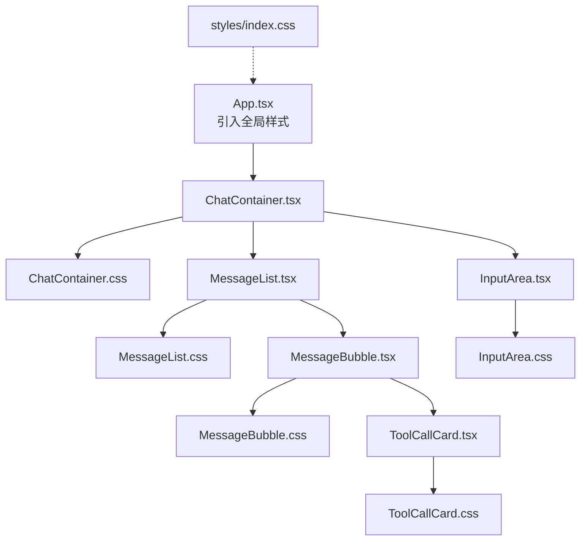
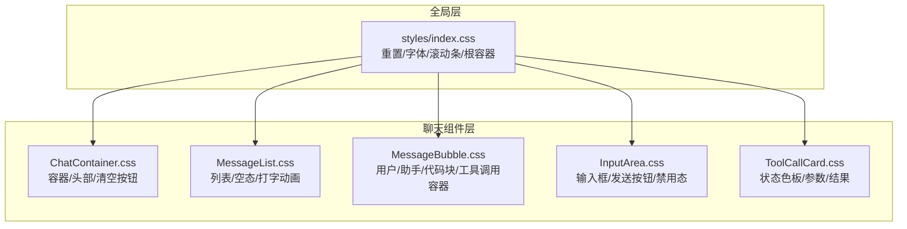
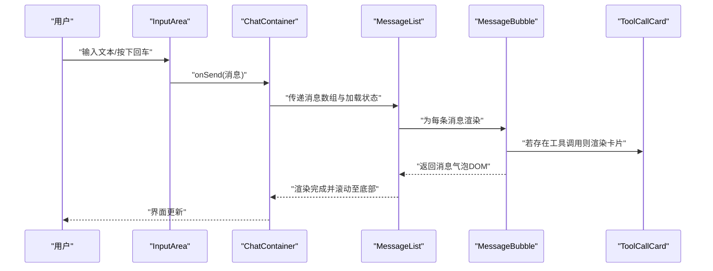

# 样式系统

<cite>
**本文引用的文件**
- [src/styles/index.css](file://src/styles/index.css)
- [src/components/Chat/ChatContainer.css](file://src/components/Chat/ChatContainer.css)
- [src/components/Chat/InputArea.css](file://src/components/Chat/InputArea.css)
- [src/components/Chat/MessageBubble.css](file://src/components/Chat/MessageBubble.css)
- [src/components/Chat/MessageList.css](file://src/components/Chat/MessageList.css)
- [src/components/Chat/ToolCallCard.css](file://src/components/Chat/ToolCallCard.css)
- [src/components/Chat/ChatContainer.tsx](file://src/components/Chat/ChatContainer.tsx)
- [src/components/Chat/MessageBubble.tsx](file://src/components/Chat/MessageBubble.tsx)
- [src/components/Chat/MessageList.tsx](file://src/components/Chat/MessageList.tsx)
- [src/components/Chat/InputArea.tsx](file://src/components/Chat/InputArea.tsx)
- [src/components/Chat/ToolCallCard.tsx](file://src/components/Chat/ToolCallCard.tsx)
- [src/App.tsx](file://src/App.tsx)
- [src/types/index.ts](file://src/types/index.ts)
- [package.json](file://package.json)
</cite>

## 目录
1. [简介](#简介)
2. [项目结构](#项目结构)
3. [核心组件](#核心组件)
4. [架构总览](#架构总览)
5. [详细组件分析](#详细组件分析)
6. [依赖分析](#依赖分析)
7. [性能考虑](#性能考虑)
8. [故障排查指南](#故障排查指南)
9. [结论](#结论)
10. [附录](#附录)

## 简介
本文件系统性梳理 AI 代理 Web 项目的样式系统，覆盖 CSS 架构设计、组件样式组织、响应式与交互反馈、动画与滚动条定制、全局样式与组件样式的协调关系，并给出可操作的主题定制与最佳实践建议。项目采用“按功能域分层”的样式组织方式：全局样式集中于入口样式文件，组件级样式以独立 CSS 文件与对应 TSX 组件并列存放，通过 className 命名约定实现清晰的语义化与可维护性。

## 项目结构
样式相关文件分布如下：
- 全局样式：src/styles/index.css
- 聊天组件样式：src/components/Chat/*.css
- 聊天组件逻辑：src/components/Chat/*.tsx（样式通过 import 引入）
- 应用入口：src/App.tsx（引入全局样式）

图表来源
- [src/App.tsx](file://src/App.tsx#L1-L9)
- [src/styles/index.css](file://src/styles/index.css#L1-L35)
- [src/components/Chat/ChatContainer.tsx](file://src/components/Chat/ChatContainer.tsx#L1-L24)
- [src/components/Chat/ChatContainer.css](file://src/components/Chat/ChatContainer.css#L1-L42)
- [src/components/Chat/MessageList.tsx](file://src/components/Chat/MessageList.tsx#L1-L52)
- [src/components/Chat/MessageList.css](file://src/components/Chat/MessageList.css#L1-L98)
- [src/components/Chat/MessageBubble.tsx](file://src/components/Chat/MessageBubble.tsx#L1-L38)
- [src/components/Chat/MessageBubble.css](file://src/components/Chat/MessageBubble.css#L1-L74)
- [src/components/Chat/ToolCallCard.tsx](file://src/components/Chat/ToolCallCard.tsx#L1-L45)
- [src/components/Chat/ToolCallCard.css](file://src/components/Chat/ToolCallCard.css#L1-L95)
- [src/components/Chat/InputArea.tsx](file://src/components/Chat/InputArea.tsx#L1-L52)
- [src/components/Chat/InputArea.css](file://src/components/Chat/InputArea.css#L1-L62)

章节来源
- [src/App.tsx](file://src/App.tsx#L1-L9)
- [src/styles/index.css](file://src/styles/index.css#L1-L35)

## 核心组件
- 全局样式：统一重置、字体、滚动条与根容器高度，奠定整体视觉基调。
- 聊天容器：负责布局与头部交互按钮，承载消息列表与输入区域。
- 消息列表：管理滚动定位、空态展示与打字指示器动画。
- 消息气泡：渲染用户/助手消息、工具调用卡片与 Markdown 内容。
- 输入区域：多行文本输入、快捷键发送、禁用态与按钮状态联动。
- 工具调用卡片：按状态（执行中/成功/失败）展示参数与结果。

章节来源
- [src/styles/index.css](file://src/styles/index.css#L1-L35)
- [src/components/Chat/ChatContainer.css](file://src/components/Chat/ChatContainer.css#L1-L42)
- [src/components/Chat/MessageList.css](file://src/components/Chat/MessageList.css#L1-L98)
- [src/components/Chat/MessageBubble.css](file://src/components/Chat/MessageBubble.css#L1-L74)
- [src/components/Chat/InputArea.css](file://src/components/Chat/InputArea.css#L1-L62)
- [src/components/Chat/ToolCallCard.css](file://src/components/Chat/ToolCallCard.css#L1-L95)

## 架构总览
样式系统遵循“全局样式 + 组件样式”的分层架构：
- 全局样式负责基础排版、颜色与滚动条等通用元素。
- 组件样式聚焦于局部布局、交互态与状态类，避免全局污染。
- 组件通过 className 选择器与状态类组合，形成高内聚、低耦合的样式模块。

图表来源
- [src/styles/index.css](file://src/styles/index.css#L1-L35)
- [src/components/Chat/ChatContainer.css](file://src/components/Chat/ChatContainer.css#L1-L42)
- [src/components/Chat/MessageList.css](file://src/components/Chat/MessageList.css#L1-L98)
- [src/components/Chat/MessageBubble.css](file://src/components/Chat/MessageBubble.css#L1-L74)
- [src/components/Chat/InputArea.css](file://src/components/Chat/InputArea.css#L1-L62)
- [src/components/Chat/ToolCallCard.css](file://src/components/Chat/ToolCallCard.css#L1-L95)

## 详细组件分析

### 全局样式（styles/index.css）
- 设计要点
  - 重置盒模型，确保一致的尺寸计算。
  - 设置默认字体族与抗锯齿，提升可读性。
  - 定义根容器高度为视口全高，便于子组件使用百分比高度。
  - 自定义 WebKit 滚动条宽度、轨道与滑块颜色，增强界面一致性。

- 复用策略
  - 将通用视觉变量（如字体、背景、文字色）收敛到一处，便于主题切换时统一调整。
  - 通过根选择器与通用选择器减少重复声明。

- 响应式与交互
  - 未使用媒体查询，但通过相对单位与 Flex 布局保证在不同屏幕下的自适应表现。

章节来源
- [src/styles/index.css](file://src/styles/index.css#L1-L35)

### 聊天容器（ChatContainer）
- 结构与布局
  - 使用垂直 Flex 布局，容器高度占满视口，最大宽度约束与居中对齐。
  - 头部包含标题与清空按钮，清空按钮仅在有消息时显示。
  - 阴影与背景色营造卡片化视觉层次。

- 交互与状态
  - 清空按钮悬停态改变边框与文字颜色，过渡时间为短时长，反馈明确。
  - 与 MessageList 和 InputArea 协作，共同构成完整的聊天界面。

- 命名约定
  - 类名采用语义化前缀，如 chat-*、clear-*，便于识别作用域。

章节来源
- [src/components/Chat/ChatContainer.css](file://src/components/Chat/ChatContainer.css#L1-L42)
- [src/components/Chat/ChatContainer.tsx](file://src/components/Chat/ChatContainer.tsx#L1-L24)

### 消息列表（MessageList）
- 列表滚动与空态
  - 使用溢出滚动与底部锚点，新消息进入时自动滚动到底部。
  - 空列表时展示欢迎语、图标与示例提示按钮，提升初次体验。

- 动画与反馈
  - 打字指示器采用三段圆点，配合关键帧动画实现“打字”节奏感。
  - 动画通过延迟与缩放/透明度变化模拟真实感。

- 响应式与可访问性
  - 使用 Flex 布局与换行，示例按钮在窄屏下自动换行。
  - 文本换行与代码块滚动处理，保证长内容可读性。

章节来源
- [src/components/Chat/MessageList.css](file://src/components/Chat/MessageList.css#L1-L98)
- [src/components/Chat/MessageList.tsx](file://src/components/Chat/MessageList.tsx#L1-L52)

### 消息气泡（MessageBubble）
- 用户与助手差异化
  - 用户消息背景浅灰，内容右对齐；助手消息背景白色，左对齐。
  - 头像区域固定尺寸与圆形，图标区分用户与助手角色。

- 内容渲染
  - 支持 Markdown 渲染与 GFM 插件，代码块与行内代码具备独立样式。
  - 文本段落间距与最后一段处理，避免多余留白。

- 工具调用集成
  - 当存在工具调用时，在消息内容上方插入工具调用卡片集合。

章节来源
- [src/components/Chat/MessageBubble.css](file://src/components/Chat/MessageBubble.css#L1-L74)
- [src/components/Chat/MessageBubble.tsx](file://src/components/Chat/MessageBubble.tsx#L1-L38)

### 输入区域（InputArea）
- 输入与发送
  - 文本域支持自动增长与最大高度限制，禁用态降低交互反馈。
  - 发送按钮根据输入状态与加载状态启用/禁用，悬停态颜色变化。

- 键盘交互
  - Enter 发送，Shift+Enter 换行，符合常见 IM 习惯。
  - 按钮与文本域均设置过渡动画，提升交互顺滑度。

章节来源
- [src/components/Chat/InputArea.css](file://src/components/Chat/InputArea.css#L1-L62)
- [src/components/Chat/InputArea.tsx](file://src/components/Chat/InputArea.tsx#L1-L52)

### 工具调用卡片（ToolCallCard）
- 状态可视化
  - 通过边框颜色与状态标签背景/文字色区分执行中、成功、失败三种状态。
  - 标签使用小字号与圆角，信息密度适中。

- 参数与结果展示
  - 参数与结果区域使用等宽字体与预格式化文本，便于阅读结构化数据。
  - 横向滚动与断词处理，保证长 JSON 的可读性。

章节来源
- [src/components/Chat/ToolCallCard.css](file://src/components/Chat/ToolCallCard.css#L1-L95)
- [src/components/Chat/ToolCallCard.tsx](file://src/components/Chat/ToolCallCard.tsx#L1-L45)

### 样式与组件的协作流程
以下序列图展示了从用户输入到消息渲染的关键交互路径，以及样式参与的时机。

图表来源
- [src/components/Chat/InputArea.tsx](file://src/components/Chat/InputArea.tsx#L1-L52)
- [src/components/Chat/ChatContainer.tsx](file://src/components/Chat/ChatContainer.tsx#L1-L24)
- [src/components/Chat/MessageList.tsx](file://src/components/Chat/MessageList.tsx#L1-L52)
- [src/components/Chat/MessageBubble.tsx](file://src/components/Chat/MessageBubble.tsx#L1-L38)
- [src/components/Chat/ToolCallCard.tsx](file://src/components/Chat/ToolCallCard.tsx#L1-L45)

## 依赖分析
- 样式依赖
  - 所有组件样式均通过 import 方式在对应 TSX 中引入，确保样式与组件同生命周期加载。
  - 全局样式由 App.tsx 引入，作为所有组件样式的基线。

- 运行时依赖
  - react-markdown 与 remark-gfm 用于消息内容的 Markdown 渲染，样式文件中已针对代码块与行内代码提供专门样式。

- 开发依赖
  - Vite 与 React 插件用于构建与热更新，样式文件通过打包器统一处理。

章节来源
- [src/App.tsx](file://src/App.tsx#L1-L9)
- [package.json](file://package.json#L1-L25)
- [src/components/Chat/MessageBubble.tsx](file://src/components/Chat/MessageBubble.tsx#L1-L38)

## 性能考虑
- 样式体积控制
  - 采用按需引入的方式，每个组件仅加载自身样式，避免全局样式膨胀。
  - 使用语义化类名与最小化选择器层级，降低样式匹配成本。

- 动画与滚动
  - 打字动画使用 transform 与 opacity，避免触发布局与重绘。
  - 滚动条自定义采用伪元素，不引入额外 DOM，保持轻量。

- 可访问性与跨浏览器
  - 字体族包含系统字体栈，提升跨平台一致性。
  - 未使用实验性特性，兼容主流浏览器。

[本节为通用指导，无需列出具体文件来源]

## 故障排查指南
- 滚动条样式无效
  - 确认浏览器是否支持 WebKit 滚动条伪元素；如需更广兼容，可引入第三方库或使用自定义滚动容器方案。

- 消息列表未自动滚动
  - 检查底部锚点是否正确挂载，以及消息数组变更后是否触发滚动逻辑。

- 打字动画不生效
  - 确认关键帧名称与选择器匹配，且未被其他样式覆盖。

- 代码块显示异常
  - 检查等宽字体与预格式化容器的样式是否被覆盖，必要时提高选择器优先级。

章节来源
- [src/components/Chat/MessageList.css](file://src/components/Chat/MessageList.css#L65-L98)
- [src/components/Chat/MessageBubble.css](file://src/components/Chat/MessageBubble.css#L51-L74)

## 结论
该样式系统以“全局样式 + 组件样式”的分层架构实现清晰的职责划分，结合语义化命名与状态类，使样式具备良好的可维护性与扩展性。通过动画与交互反馈强化用户体验，同时在性能与可访问性方面保持稳健。后续可在主题定制、响应式断点与跨浏览器兼容上进一步完善。

[本节为总结性内容，无需列出具体文件来源]

## 附录

### 命名约定与复用策略
- 命名约定
  - 组件级类名采用“组件名-子项”语义化前缀，如 chat-*、message-*、input-*、tool-*。
  - 状态类使用语义化状态值，如 user、assistant、pending、success、error。
- 复用策略
  - 将通用颜色、尺寸、阴影等变量收敛到全局样式，便于主题切换。
  - 通过组合类名与状态类实现样式复用，避免重复定义。

章节来源
- [src/components/Chat/ChatContainer.css](file://src/components/Chat/ChatContainer.css#L1-L42)
- [src/components/Chat/MessageBubble.css](file://src/components/Chat/MessageBubble.css#L1-L74)
- [src/components/Chat/ToolCallCard.css](file://src/components/Chat/ToolCallCard.css#L1-L95)

### 主题定制指南
- 全局色彩体系
  - 在全局样式中集中定义主色、辅助色与状态色，组件通过状态类引用，实现一键切换。
- 字体与排版
  - 在全局字体栈基础上，可替换为自定义字体，注意加载与回退策略。
- 间距与圆角
  - 将常用间距与圆角数值抽象为变量，统一组件的视觉节奏。

章节来源
- [src/styles/index.css](file://src/styles/index.css#L5-L13)

### 动画与交互反馈清单
- 打字指示器：三段圆点，关键帧动画，延迟错位。
- 悬停反馈：按钮与文本的颜色/边框变化，过渡时间短促。
- 加载态：发送按钮根据状态显示不同表情与背景色。

章节来源
- [src/components/Chat/MessageList.css](file://src/components/Chat/MessageList.css#L65-L98)
- [src/components/Chat/InputArea.css](file://src/components/Chat/InputArea.css#L39-L61)
- [src/components/Chat/ChatContainer.css](file://src/components/Chat/ChatContainer.css#L27-L41)

### 使用场景与最佳实践
- 场景一：新增消息类型
  - 新增状态类并在组件中动态拼接 className，避免硬编码。
- 场景二：调整间距与圆角
  - 在全局样式中修改变量值，影响所有组件的一致性。
- 场景三：优化长文本可读性
  - 为代码块与段落增加合适的行高与内边距，避免拥挤。

章节来源
- [src/components/Chat/MessageBubble.css](file://src/components/Chat/MessageBubble.css#L38-L74)
- [src/components/Chat/ToolCallCard.css](file://src/components/Chat/ToolCallCard.css#L62-L95)