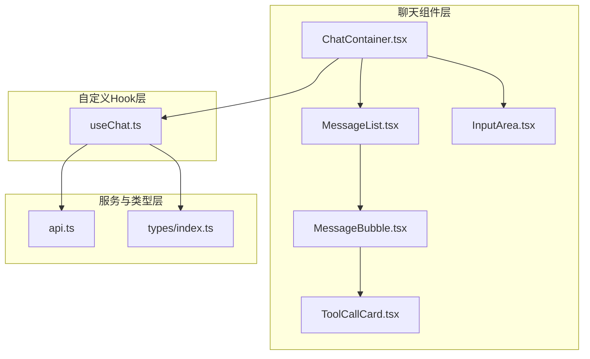
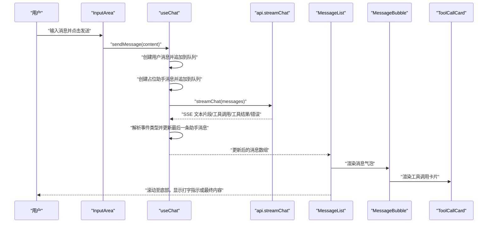
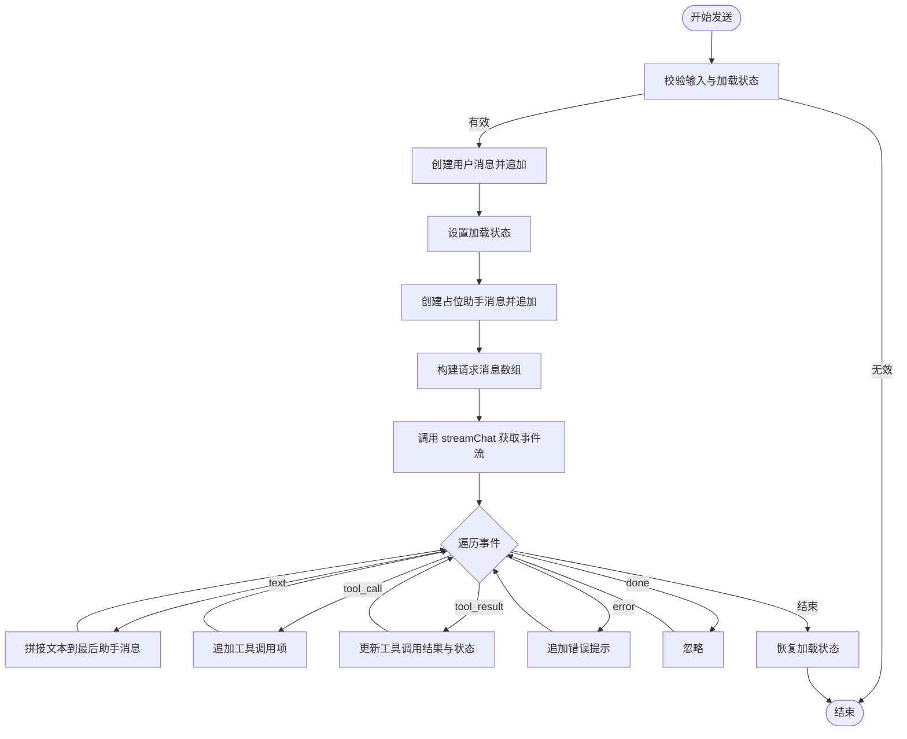
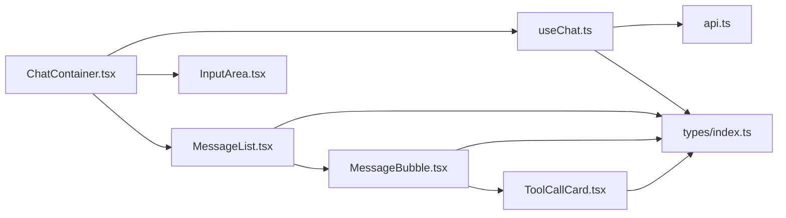

# ChatContainer 聊天容器

<cite>
**本文引用的文件**
- [ChatContainer.tsx](file://src/components/Chat/ChatContainer.tsx)
- [useChat.ts](file://src/hooks/useChat.ts)
- [MessageList.tsx](file://src/components/Chat/MessageList.tsx)
- [InputArea.tsx](file://src/components/Chat/InputArea.tsx)
- [MessageBubble.tsx](file://src/components/Chat/MessageBubble.tsx)
- [ToolCallCard.tsx](file://src/components/Chat/ToolCallCard.tsx)
- [ChatContainer.css](file://src/components/Chat/ChatContainer.css)
- [MessageList.css](file://src/components/Chat/MessageList.css)
- [InputArea.css](file://src/components/Chat/InputArea.css)
- [MessageBubble.css](file://src/components/Chat/MessageBubble.css)
- [ToolCallCard.css](file://src/components/Chat/ToolCallCard.css)
- [api.ts](file://src/services/api.ts)
- [index.ts](file://src/types/index.ts)
</cite>

## 目录
1. [简介](#简介)
2. [项目结构](#项目结构)
3. [核心组件](#核心组件)
4. [架构总览](#架构总览)
5. [详细组件分析](#详细组件分析)
6. [依赖关系分析](#依赖关系分析)
7. [性能考虑](#性能考虑)
8. [故障排查指南](#故障排查指南)
9. [结论](#结论)
10. [附录](#附录)

## 简介
本文件围绕 ChatContainer 聊天容器组件，系统性阐述其设计理念、组件组合模式、状态管理、消息传递机制与用户交互处理，并结合 CSS 样式架构与响应式设计，提供可操作的集成建议与性能优化策略。文档同时解释与 MessageList、InputArea 等子组件的协作关系，记录 props 接口、事件回调与样式定制选项，帮助开发者快速理解并扩展该聊天界面。

## 项目结构
ChatContainer 所在的聊天模块采用“容器 + 子组件 + 自定义 Hook”的分层组织方式：
- 容器层：ChatContainer 负责布局与协调，调用 useChat 获取状态与动作。
- 子组件层：MessageList 负责消息渲染与滚动；InputArea 负责输入与发送；MessageBubble 负责单条消息渲染；ToolCallCard 负责工具调用卡片展示。
- 数据与类型层：types 定义消息、工具调用与 SSE 事件类型；api 提供服务端流式接口封装。
- 样式层：各组件独立样式文件，统一在 ChatContainer.css 中定义整体布局与头部样式。

图表来源
- [ChatContainer.tsx](file://src/components/Chat/ChatContainer.tsx#L1-L24)
- [useChat.ts](file://src/hooks/useChat.ts#L1-L159)
- [MessageList.tsx](file://src/components/Chat/MessageList.tsx#L1-L52)
- [InputArea.tsx](file://src/components/Chat/InputArea.tsx#L1-L52)
- [MessageBubble.tsx](file://src/components/Chat/MessageBubble.tsx#L1-L38)
- [ToolCallCard.tsx](file://src/components/Chat/ToolCallCard.tsx#L1-L45)
- [api.ts](file://src/services/api.ts#L1-L53)
- [index.ts](file://src/types/index.ts#L1-L28)

章节来源
- [ChatContainer.tsx](file://src/components/Chat/ChatContainer.tsx#L1-L24)
- [useChat.ts](file://src/hooks/useChat.ts#L1-L159)
- [MessageList.tsx](file://src/components/Chat/MessageList.tsx#L1-L52)
- [InputArea.tsx](file://src/components/Chat/InputArea.tsx#L1-L52)
- [MessageBubble.tsx](file://src/components/Chat/MessageBubble.tsx#L1-L38)
- [ToolCallCard.tsx](file://src/components/Chat/ToolCallCard.tsx#L1-L45)
- [api.ts](file://src/services/api.ts#L1-L53)
- [index.ts](file://src/types/index.ts#L1-L28)

## 核心组件
- ChatContainer：负责整体布局与子组件编排，通过 useChat 获取 messages、isLoading、sendMessage、clearMessages，并在有历史消息时显示清空按钮。
- useChat：封装消息状态、加载状态与异步流式处理逻辑，支持文本增量、工具调用与工具结果的实时更新。
- MessageList：根据消息数组渲染消息气泡，自动滚动到底部；在无消息时展示引导页与示例提示；在助手回复为空且正在加载时显示打字动画。
- InputArea：提供多行文本输入、回车发送（Shift+Enter 换行）、禁用态控制与发送按钮。
- MessageBubble：按角色渲染头像与内容，支持 Markdown 渲染与工具调用卡片列表。
- ToolCallCard：渲染工具调用的图标、名称、状态与参数/结果详情。
- 样式：ChatContainer.css 控制容器、头部与清空按钮；MessageList.css 控制空态、示例提示与打字指示器动画；InputArea.css 控制输入框与发送按钮；MessageBubble.css 控制消息气泡、文本与代码块样式；ToolCallCard.css 控制工具卡片的边框、状态色与参数/结果区域。

章节来源
- [ChatContainer.tsx](file://src/components/Chat/ChatContainer.tsx#L6-L23)
- [useChat.ts](file://src/hooks/useChat.ts#L10-L158)
- [MessageList.tsx](file://src/components/Chat/MessageList.tsx#L11-L51)
- [InputArea.tsx](file://src/components/Chat/InputArea.tsx#L9-L51)
- [MessageBubble.tsx](file://src/components/Chat/MessageBubble.tsx#L11-L37)
- [ToolCallCard.tsx](file://src/components/Chat/ToolCallCard.tsx#L14-L44)
- [ChatContainer.css](file://src/components/Chat/ChatContainer.css#L1-L42)
- [MessageList.css](file://src/components/Chat/MessageList.css#L1-L98)
- [InputArea.css](file://src/components/Chat/InputArea.css#L1-L62)
- [MessageBubble.css](file://src/components/Chat/MessageBubble.css#L1-L74)
- [ToolCallCard.css](file://src/components/Chat/ToolCallCard.css#L1-L95)

## 架构总览
ChatContainer 作为顶层容器，通过 useChat 钩子集中管理聊天状态与交互流程。消息从 InputArea 输入，经 useChat 的 sendMessage 触发服务端流式返回，useChat 将增量数据写入消息队列，MessageList 实时渲染，MessageBubble 渲染 Markdown 与工具调用卡片，ToolCallCard 展示工具调用的参数与结果。

图表来源
- [InputArea.tsx](file://src/components/Chat/InputArea.tsx#L12-L17)
- [useChat.ts](file://src/hooks/useChat.ts#L14-L146)
- [api.ts](file://src/services/api.ts#L8-L47)
- [MessageList.tsx](file://src/components/Chat/MessageList.tsx#L36-L50)
- [MessageBubble.tsx](file://src/components/Chat/MessageBubble.tsx#L14-L36)
- [ToolCallCard.tsx](file://src/components/Chat/ToolCallCard.tsx#L14-L44)

## 详细组件分析

### ChatContainer 组件
- 设计理念：以最小容器承担布局与协调职责，将复杂的状态与交互下沉到 useChat，保持 UI 的简洁与可维护性。
- 组件组合：引入 MessageList 与 InputArea，通过 useChat 提供的数据与方法驱动子组件。
- 清空对话：当存在历史消息时显示清空按钮，点击后调用 clearMessages 清空消息队列。
- 响应式与样式：通过 ChatContainer.css 设置容器高度、阴影与最大宽度，确保在桌面与移动端的适配。

章节来源
- [ChatContainer.tsx](file://src/components/Chat/ChatContainer.tsx#L6-L23)
- [ChatContainer.css](file://src/components/Chat/ChatContainer.css#L1-L42)

### useChat Hook
- 状态管理：维护 messages 与 isLoading 两个核心状态；通过 useCallback 包裹 sendMessage 与 clearMessages，避免不必要的重渲染。
- 消息生成：为用户与助手分别生成唯一 ID，助手消息初始 content 为空，用于后续增量拼接。
- 流式处理：调用 api.streamChat 获取服务端事件流，逐条解析事件类型：
  - text：将增量文本追加到最后一条助手消息。
  - tool_call：为最后一条助手消息追加新的工具调用项。
  - tool_result：根据工具名匹配并更新对应工具调用的结果与状态。
  - error：在助手消息末尾追加错误提示。
  - done：忽略，用于协议结束标记。
- 错误处理：捕获 JSON 解析异常与网络异常，保证 UI 不崩溃。
- 加载控制：在发送前设置 isLoading，finally 中恢复，确保输入区禁用与按钮状态正确。

图表来源
- [useChat.ts](file://src/hooks/useChat.ts#L14-L146)
- [api.ts](file://src/services/api.ts#L8-L47)

章节来源
- [useChat.ts](file://src/hooks/useChat.ts#L10-L158)
- [api.ts](file://src/services/api.ts#L8-L47)

### MessageList 组件
- 渲染策略：遍历 messages 数组，为每条消息渲染 MessageBubble；助手消息为空且正在加载时显示打字指示器。
- 自动滚动：使用 useRef 与 useEffect，在消息变化时平滑滚动到底部。
- 空态处理：当 messages 为空时，渲染引导页与示例提示按钮，便于用户快速开始。

章节来源
- [MessageList.tsx](file://src/components/Chat/MessageList.tsx#L11-L51)
- [MessageList.css](file://src/components/Chat/MessageList.css#L65-L97)

### InputArea 组件
- 输入控制：受控组件，通过 useState 管理输入值；支持 Enter 发送、Shift+Enter 换行；禁用态由 isLoading 控制。
- 交互逻辑：handleSubmit 在条件满足时调用父级 onSend；handleKeyDown 处理键盘事件；handleChange 更新输入值。
- 样式与可用性：输入框具备占位符、最小/最大高度、禁用透明度；发送按钮根据输入与加载状态启用/禁用。

章节来源
- [InputArea.tsx](file://src/components/Chat/InputArea.tsx#L9-L51)
- [InputArea.css](file://src/components/Chat/InputArea.css#L1-L62)

### MessageBubble 组件
- 角色区分：根据 message.role 决定头像与对齐方向；用户消息右对齐，助手消息左对齐。
- 内容渲染：使用 ReactMarkdown 与 remarkGfm 插件渲染 Markdown；支持段落、代码块与行内代码。
- 工具调用：当存在 toolCalls 时，渲染 ToolCallCard 列表，展示工具名、参数与结果。

章节来源
- [MessageBubble.tsx](file://src/components/Chat/MessageBubble.tsx#L11-L37)
- [MessageBubble.css](file://src/components/Chat/MessageBubble.css#L1-L74)

### ToolCallCard 组件
- 状态可视化：根据 toolCall.status 应用不同边框与状态标签颜色（进行中/成功/失败）。
- 内容展示：展示工具图标、名称与参数/结果的 JSON 格式化输出，便于调试与理解工具调用过程。

章节来源
- [ToolCallCard.tsx](file://src/components/Chat/ToolCallCard.tsx#L14-L44)
- [ToolCallCard.css](file://src/components/Chat/ToolCallCard.css#L1-L95)

## 依赖关系分析
- ChatContainer 依赖 useChat 提供的状态与方法，并向子组件传递 props。
- MessageList 依赖 MessageBubble 渲染消息；依赖 types 中的 Message 类型。
- MessageBubble 依赖 ToolCallCard 渲染工具调用卡片；依赖 ReactMarkdown 与 remarkGfm 进行 Markdown 渲染。
- useChat 依赖 api.streamChat 获取服务端事件流；依赖 types 中的 Message、ToolCallInfo、SSEEvent 类型。
- 样式文件相互独立，通过类名与布局属性协同实现响应式与视觉一致性。

图表来源
- [ChatContainer.tsx](file://src/components/Chat/ChatContainer.tsx#L1-L3)
- [useChat.ts](file://src/hooks/useChat.ts#L1-L3)
- [MessageList.tsx](file://src/components/Chat/MessageList.tsx#L1-L3)
- [InputArea.tsx](file://src/components/Chat/InputArea.tsx#L1-L2)
- [MessageBubble.tsx](file://src/components/Chat/MessageBubble.tsx#L1-L3)
- [ToolCallCard.tsx](file://src/components/Chat/ToolCallCard.tsx#L1-L2)
- [api.ts](file://src/services/api.ts#L1-L6)
- [index.ts](file://src/types/index.ts#L1-L22)

章节来源
- [ChatContainer.tsx](file://src/components/Chat/ChatContainer.tsx#L1-L3)
- [useChat.ts](file://src/hooks/useChat.ts#L1-L3)
- [MessageList.tsx](file://src/components/Chat/MessageList.tsx#L1-L3)
- [InputArea.tsx](file://src/components/Chat/InputArea.tsx#L1-L2)
- [MessageBubble.tsx](file://src/components/Chat/MessageBubble.tsx#L1-L3)
- [ToolCallCard.tsx](file://src/components/Chat/ToolCallCard.tsx#L1-L2)
- [api.ts](file://src/services/api.ts#L1-L6)
- [index.ts](file://src/types/index.ts#L1-L22)

## 性能考虑
- 状态更新粒度：useChat 对消息的更新仅针对最后一条助手消息，减少不必要的重渲染。
- 回调稳定化：sendMessage 与 clearMessages 使用 useCallback，避免子组件重复渲染。
- DOM 操作最小化：MessageList 仅在消息数组变化时滚动，避免频繁滚动计算。
- 流式渲染：SSE 事件增量更新，避免一次性大对象渲染。
- 可选优化建议：
  - 对消息列表进行虚拟滚动（如消息量较大时）。
  - 对 Markdown 渲染结果进行缓存（如内容重复）。
  - 对工具调用参数/结果进行节流或去抖（如频繁更新）。
  - 在高并发场景下，考虑对 sendMessage 进行防抖或队列化。

[本节为通用性能建议，不直接分析具体文件]

## 故障排查指南
- 无法发送消息
  - 检查 InputArea 的禁用态是否由 isLoading 导致；确认 onSend 是否传入。
  - 章节来源
    - [InputArea.tsx](file://src/components/Chat/InputArea.tsx#L38-L47)
- 无消息显示或滚动异常
  - 确认 MessageList 的 messages 是否正确传入；检查 useEffect 的依赖与滚动逻辑。
  - 章节来源
    - [MessageList.tsx](file://src/components/Chat/MessageList.tsx#L14-L16)
- 流式事件未更新
  - 检查 api.streamChat 返回的事件格式与类型；确认 useChat 的事件解析分支。
  - 章节来源
    - [api.ts](file://src/services/api.ts#L8-L47)
    - [useChat.ts](file://src/hooks/useChat.ts#L44-L126)
- 工具调用状态不更新
  - 确认 tool_call 与 tool_result 事件是否成对出现；检查 name 字段匹配逻辑。
  - 章节来源
    - [useChat.ts](file://src/hooks/useChat.ts#L67-L108)
- 清空按钮不可见
  - 确认 messages.length > 0 条件是否满足；检查按钮的显示逻辑。
  - 章节来源
    - [ChatContainer.tsx](file://src/components/Chat/ChatContainer.tsx#L13-L17)

## 结论
ChatContainer 通过清晰的容器-子组件分层与 useChat 的集中状态管理，实现了从输入到流式渲染的完整聊天体验。组件间职责明确、耦合度低，配合完善的样式体系与响应式设计，能够快速集成到各类应用中。建议在大规模消息场景下进一步优化渲染与滚动性能，并持续完善错误处理与边界场景。

[本节为总结性内容，不直接分析具体文件]

## 附录

### Props 接口与事件回调
- ChatContainer
  - 无显式 props，内部通过 useChat 注入 messages、isLoading、sendMessage、clearMessages。
- MessageList
  - messages: Message[]
  - isLoading: boolean
- InputArea
  - onSend: (message: string) => void
  - isLoading: boolean
- MessageBubble
  - message: Message
- ToolCallCard
  - toolCall: ToolCallInfo

章节来源
- [MessageList.tsx](file://src/components/Chat/MessageList.tsx#L6-L9)
- [InputArea.tsx](file://src/components/Chat/InputArea.tsx#L4-L7)
- [MessageBubble.tsx](file://src/components/Chat/MessageBubble.tsx#L7-L9)
- [ToolCallCard.tsx](file://src/components/Chat/ToolCallCard.tsx#L4-L6)
- [index.ts](file://src/types/index.ts#L1-L22)

### 样式定制选项
- ChatContainer.css
  - 容器高度、阴影、最大宽度与头部样式，适合在不同屏幕尺寸下居中展示。
- MessageList.css
  - 空态引导、示例提示按钮、打字指示器动画与滚动行为。
- InputArea.css
  - 输入框容器、文本域、发送按钮的尺寸、颜色与禁用态。
- MessageBubble.css
  - 用户/助手消息气泡、头像、文本行高、代码块与预格式化区域。
- ToolCallCard.css
  - 工具卡片边框、状态色、参数/结果区域的字体与换行。

章节来源
- [ChatContainer.css](file://src/components/Chat/ChatContainer.css#L1-L42)
- [MessageList.css](file://src/components/Chat/MessageList.css#L1-L98)
- [InputArea.css](file://src/components/Chat/InputArea.css#L1-L62)
- [MessageBubble.css](file://src/components/Chat/MessageBubble.css#L1-L74)
- [ToolCallCard.css](file://src/components/Chat/ToolCallCard.css#L1-L95)

### 生命周期与事件处理要点
- 初始化：ChatContainer 渲染容器与子组件，useChat 初始化状态。
- 输入阶段：InputArea 处理键盘与点击事件，调用 onSend。
- 发送阶段：useChat 创建用户消息与占位助手消息，启动流式处理。
- 渲染阶段：MessageList 根据消息数组渲染；MessageBubble 渲染 Markdown 与工具调用卡片；ToolCallCard 展示工具状态。
- 清空阶段：点击清空按钮触发 clearMessages，重置消息队列。

章节来源
- [ChatContainer.tsx](file://src/components/Chat/ChatContainer.tsx#L6-L23)
- [InputArea.tsx](file://src/components/Chat/InputArea.tsx#L9-L51)
- [useChat.ts](file://src/hooks/useChat.ts#L14-L146)
- [MessageList.tsx](file://src/components/Chat/MessageList.tsx#L11-L51)
- [MessageBubble.tsx](file://src/components/Chat/MessageBubble.tsx#L11-L37)
- [ToolCallCard.tsx](file://src/components/Chat/ToolCallCard.tsx#L14-L44)