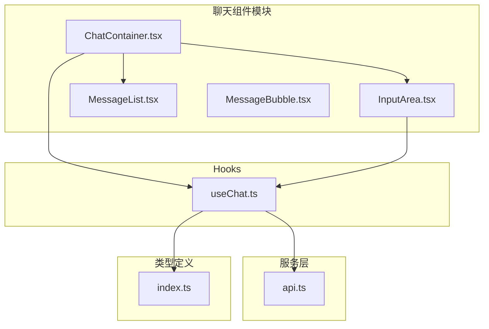
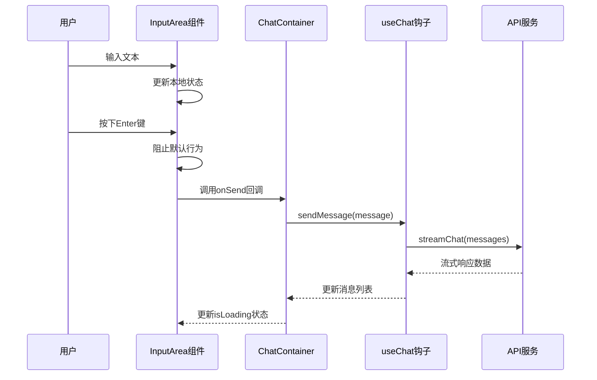
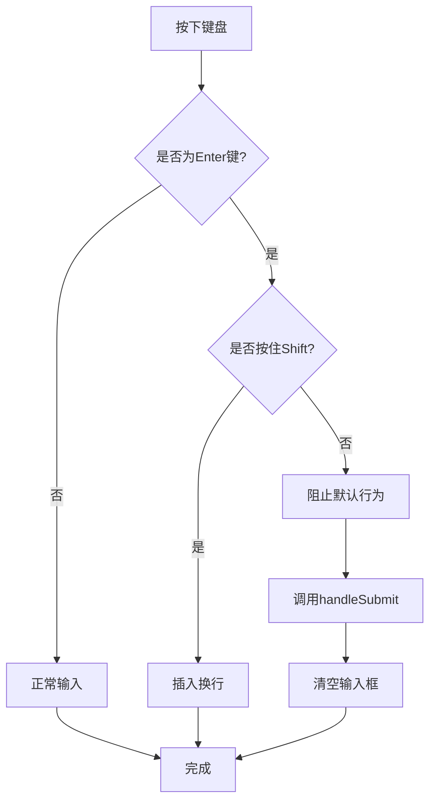
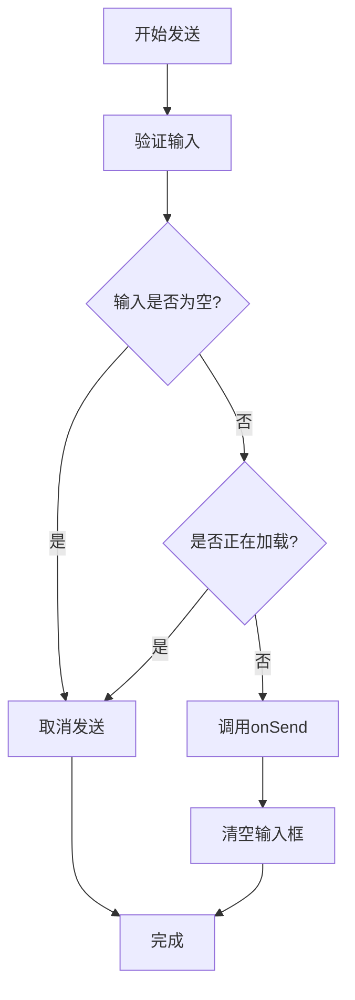
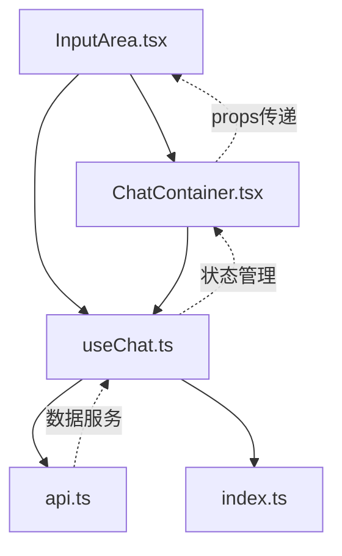

# InputArea 输入区域

<cite>
**本文档引用的文件**
- [InputArea.tsx](file://src/components/Chat/InputArea.tsx)
- [InputArea.css](file://src/components/Chat/InputArea.css)
- [ChatContainer.tsx](file://src/components/Chat/ChatContainer.tsx)
- [useChat.ts](file://src/hooks/useChat.ts)
- [api.ts](file://src/services/api.ts)
- [index.ts](file://src/types/index.ts)
</cite>

## 目录
1. [简介](#简介)
2. [项目结构](#项目结构)
3. [核心组件](#核心组件)
4. [架构概览](#架构概览)
5. [详细组件分析](#详细组件分析)
6. [依赖关系分析](#依赖关系分析)
7. [性能考虑](#性能考虑)
8. [故障排除指南](#故障排除指南)
9. [结论](#结论)

## 简介

InputArea 是一个专为聊天应用设计的输入区域组件，提供了直观的文本输入体验。该组件实现了多行文本框、键盘快捷键支持、发送按钮状态管理和实时加载反馈等功能。它采用 React Hooks 架构，与 useChat 钩子紧密集成，为用户提供流畅的聊天交互体验。

## 项目结构

InputArea 组件位于聊天功能模块中，与其他相关组件协同工作：



**图表来源**
- [ChatContainer.tsx](file://src/components/Chat/ChatContainer.tsx#L1-L24)
- [InputArea.tsx](file://src/components/Chat/InputArea.tsx#L1-L52)
- [useChat.ts](file://src/hooks/useChat.ts#L1-L159)

**章节来源**
- [ChatContainer.tsx](file://src/components/Chat/ChatContainer.tsx#L1-L24)
- [InputArea.tsx](file://src/components/Chat/InputArea.tsx#L1-L52)

## 核心组件

### 组件接口定义

InputArea 组件通过清晰的接口定义提供功能：

```typescript
interface InputAreaProps {
  onSend: (message: string) => void;
  isLoading: boolean;
}
```

**参数说明：**
- `onSend`: 消息发送回调函数，接收用户输入的字符串内容
- `isLoading`: 加载状态布尔值，控制组件的可用性状态

**章节来源**
- [InputArea.tsx](file://src/components/Chat/InputArea.tsx#L4-L7)

### 状态管理

组件使用 React 的 useState Hook 管理内部状态：

```typescript
const [input, setInput] = useState('');
```

状态管理特点：
- 单一输入状态管理
- 实时内容同步
- 自动清空机制

**章节来源**
- [InputArea.tsx](file://src/components/Chat/InputArea.tsx#L9-L11)

## 架构概览

InputArea 采用分层架构设计，与上层组件和下层服务层解耦：



**图表来源**
- [InputArea.tsx](file://src/components/Chat/InputArea.tsx#L12-L24)
- [ChatContainer.tsx](file://src/components/Chat/ChatContainer.tsx#L20)
- [useChat.ts](file://src/hooks/useChat.ts#L14-L146)

## 详细组件分析

### 文本输入处理

#### 多行文本框实现

InputArea 使用原生 textarea 元素实现多行文本输入：

```html
<textarea
  value={input}
  onChange={handleChange}
  onKeyDown={handleKeyDown}
  placeholder="输入消息... (Enter 发送, Shift+Enter 换行)"
  disabled={isLoading}
  rows={1}
/>
```

**特性配置：**
- `rows={1}`: 初始显示一行，支持动态扩展
- `resize: none`: 禁止手动调整大小
- `min-height: 24px`: 最小高度保证
- `max-height: 150px`: 最大高度限制

#### 内容变更监听

handleChange 函数处理输入内容的实时更新：

```typescript
const handleChange = (e: ChangeEvent<HTMLTextAreaElement>) => {
  setInput(e.target.value);
};
```

**功能特点：**
- 实时状态同步
- 受控组件模式
- 自动高度适应

**章节来源**
- [InputArea.tsx](file://src/components/Chat/InputArea.tsx#L26-L28)

### 键盘快捷键支持

#### 回车键发送逻辑

组件实现了智能的键盘事件处理：

```typescript
const handleKeyDown = (e: KeyboardEvent<HTMLTextAreaElement>) => {
  if (e.key === 'Enter' && !e.shiftKey) {
    e.preventDefault();
    handleSubmit();
  }
};
```

**交互规则：**
- `Enter`: 发送消息（阻止默认行为）
- `Shift+Enter`: 插入换行符
- `其他按键`: 正常输入

#### 快捷键状态管理

键盘事件处理确保在不同状态下提供一致的用户体验：



**图表来源**
- [InputArea.tsx](file://src/components/Chat/InputArea.tsx#L19-L24)

**章节来源**
- [InputArea.tsx](file://src/components/Chat/InputArea.tsx#L19-L24)

### 发送按钮状态管理

#### 禁用条件判断

发送按钮的启用/禁用状态由以下条件决定：

```typescript
disabled={!input.trim() || isLoading}
```

**禁用条件：**
- 输入为空或仅包含空白字符
- 当前处于加载状态
- 两个条件同时满足时按钮禁用

#### 按钮状态反馈

按钮根据状态提供视觉反馈：

```css
.send-button:disabled {
  background: #ccc;
  cursor: not-allowed;
}

.send-button:hover:not(:disabled) {
  background: #000;
}
```

**状态变化：**
- 正常状态：深灰色背景，悬停变黑色
- 禁用状态：浅灰色背景，鼠标指针变为不允许
- 加载状态：通过父组件传递的 isLoading 控制

**章节来源**
- [InputArea.tsx](file://src/components/Chat/InputArea.tsx#L41-L47)
- [InputArea.css](file://src/components/Chat/InputArea.css#L58-L61)

### 提交处理流程

#### 发送按钮点击事件

handleSubmit 函数协调整个发送流程：

```typescript
const handleSubmit = () => {
  if (input.trim() && !isLoading) {
    onSend(input);
    setInput('');
  }
};
```

**处理步骤：**
1. 验证输入内容和加载状态
2. 调用父组件的 onSend 回调
3. 清空输入框状态

#### 表单验证机制

组件内置基础验证确保数据质量：



**图表来源**
- [InputArea.tsx](file://src/components/Chat/InputArea.tsx#L12-L17)

**章节来源**
- [InputArea.tsx](file://src/components/Chat/InputArea.tsx#L12-L17)

### 加载状态同步

#### 实时状态反馈

组件通过 props 接收 isLoading 状态，并将其应用到输入元素：

```typescript
<textarea disabled={isLoading} />
```

**状态同步机制：**
- 父组件 useChat 钩子管理全局加载状态
- ChatContainer 将状态传递给 InputArea
- 输入框在加载期间自动禁用

#### 加载指示器

发送按钮根据加载状态显示不同的图标：

```typescript
{isLoading ? '⏳' : '➤'}
```

**状态切换：**
- 加载中：显示时钟图标
- 可用状态：显示箭头图标

**章节来源**
- [InputArea.tsx](file://src/components/Chat/InputArea.tsx#L38)
- [InputArea.tsx](file://src/components/Chat/InputArea.tsx#L46)

### 错误处理机制

#### 组件级错误处理

InputArea 本身不直接处理网络错误，但通过以下方式提供错误反馈：

```typescript
// 错误处理主要在 useChat 钩子中实现
try {
  const stream = streamChat(chatMessages);
  // 流式处理逻辑
} catch (error) {
  // 错误状态已在 useChat 中处理
}
```

**错误传播：**
- 网络错误通过 useChat 钩子处理
- 错误消息添加到消息列表
- 加载状态重置

**章节来源**
- [useChat.ts](file://src/hooks/useChat.ts#L131-L145)

### 用户体验优化

#### 自动完成支持

虽然当前版本未实现自动完成功能，但组件结构为未来扩展预留了空间：

```typescript
// 可选的自动完成功能
// <input autoComplete="on" list="suggestions" />
// <datalist id="suggestions">...</datalist>
```

#### 输入限制配置

组件支持灵活的输入限制配置：

```css
/* 最大高度限制 */
max-height: 150px;

/* 最小高度保证 */
min-height: 24px;

/* 禁止手动调整大小 */
resize: none;
```

**可配置参数：**
- 最大输入高度
- 最小输入高度  
- 自动换行行为

**章节来源**
- [InputArea.css](file://src/components/Chat/InputArea.css#L28)
- [InputArea.css](file://src/components/Chat/InputArea.css#L27)
- [InputArea.css](file://src/components/Chat/InputArea.css#L24)

## 依赖关系分析

### 组件间依赖



**图表来源**
- [InputArea.tsx](file://src/components/Chat/InputArea.tsx#L1-L52)
- [ChatContainer.tsx](file://src/components/Chat/ChatContainer.tsx#L1-L24)
- [useChat.ts](file://src/hooks/useChat.ts#L1-L159)
- [api.ts](file://src/services/api.ts#L1-L53)

### 外部依赖

组件依赖于以下外部库和工具：

- **React**: 核心框架，提供组件生命周期和状态管理
- **TypeScript**: 类型安全，提供编译时类型检查
- **CSS Modules**: 样式隔离，避免样式冲突

**章节来源**
- [InputArea.tsx](file://src/components/Chat/InputArea.tsx#L1)
- [InputArea.css](file://src/components/Chat/InputArea.css#L1-L62)

## 性能考虑

### 渲染优化

InputArea 组件采用轻量级设计，具有良好的性能特征：

- **最小化重渲染**: 使用受控组件模式，只在状态变化时更新
- **事件处理优化**: 键盘事件处理器保持简单高效
- **内存管理**: 自动清理输入状态，防止内存泄漏

### 状态同步效率

组件通过 props 传递状态，避免了不必要的状态提升：

```typescript
// 高效的状态传递模式
<InputArea onSend={sendMessage} isLoading={isLoading} />
```

**性能优势：**
- 减少组件树遍历
- 降低状态同步开销
- 提高响应速度

## 故障排除指南

### 常见问题诊断

#### 输入无法发送

**可能原因：**
1. 组件处于加载状态
2. 输入内容为空或仅包含空白字符
3. 父组件未正确传递 onSend 回调

**解决方案：**
- 检查 isLoading 状态
- 验证输入内容长度
- 确认 onSend 回调函数存在

#### 键盘快捷键失效

**可能原因：**
1. 事件处理器未正确绑定
2. 父组件阻止了键盘事件
3. 浏览器兼容性问题

**解决方案：**
- 检查 onKeyDown 属性绑定
- 验证事件对象的 key 属性
- 测试不同浏览器的兼容性

#### 样式显示异常

**可能原因：**
1. CSS 文件未正确加载
2. 样式类名冲突
3. 浏览器缓存问题

**解决方案：**
- 确认 CSS 文件路径正确
- 检查样式优先级
- 清除浏览器缓存

**章节来源**
- [InputArea.tsx](file://src/components/Chat/InputArea.tsx#L12-L24)
- [InputArea.css](file://src/components/Chat/InputArea.css#L1-L62)

## 结论

InputArea 输入区域组件是一个设计精良的聊天输入组件，具有以下突出特点：

### 技术优势
- **简洁的架构设计**: 清晰的职责分离和状态管理
- **优秀的用户体验**: 智能的键盘快捷键和即时反馈
- **强大的扩展性**: 为未来功能增强预留了良好基础

### 功能完整性
- 完整的文本输入处理能力
- 灵活的键盘交互支持
- 实时的状态同步机制
- 健壮的错误处理策略

### 最佳实践
- 遵循 React Hooks 最佳实践
- 实现受控组件模式
- 提供清晰的类型定义
- 注重用户体验细节

该组件为聊天应用提供了坚实的基础，其设计原则和实现模式可以作为其他类似组件开发的参考模板。