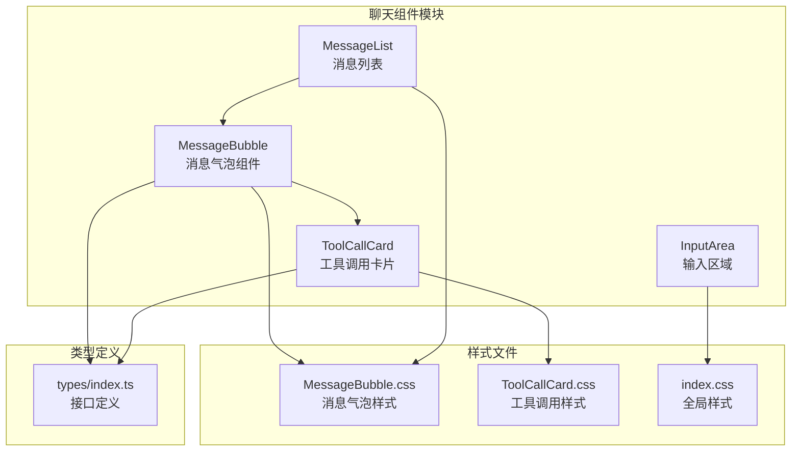
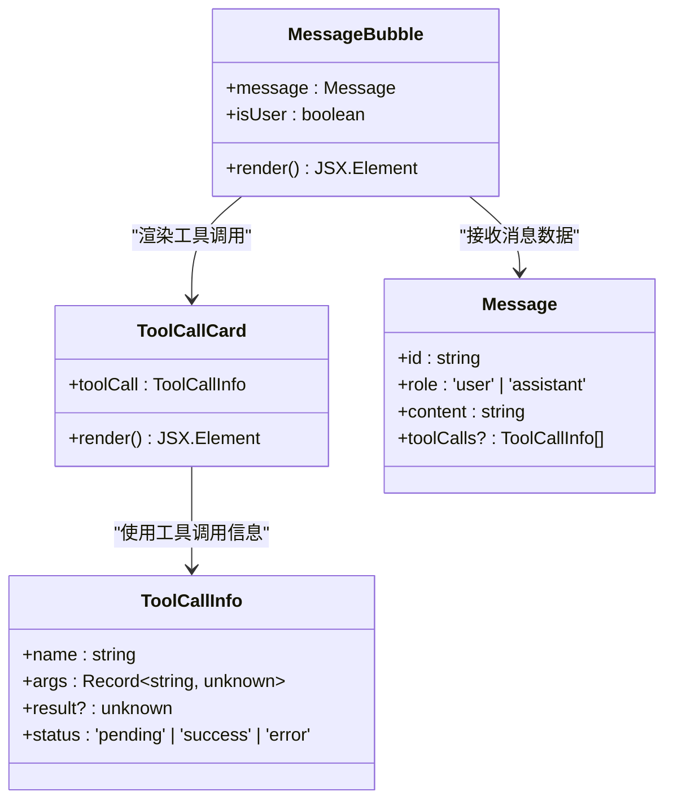
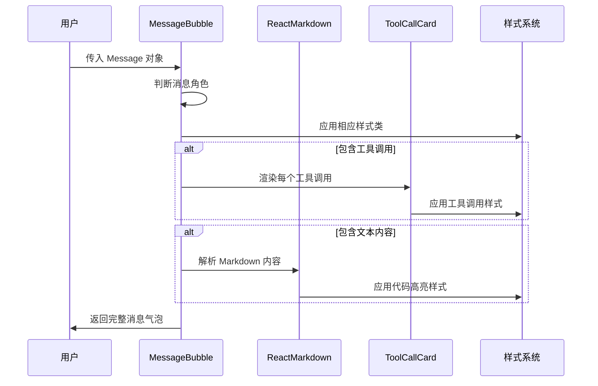
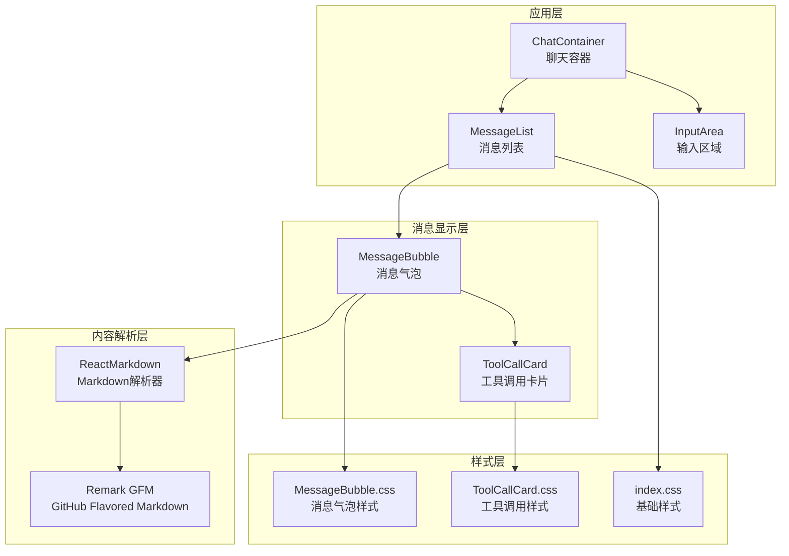
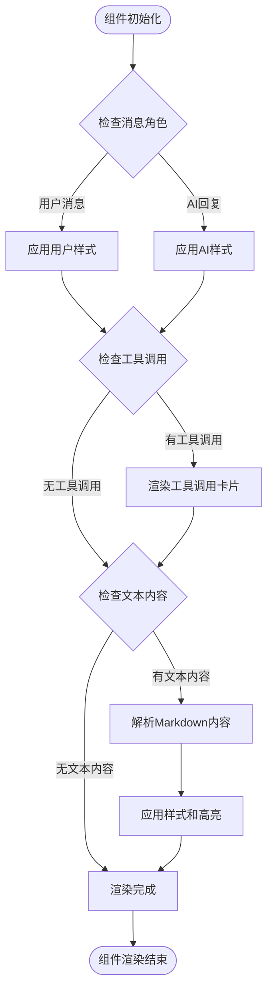
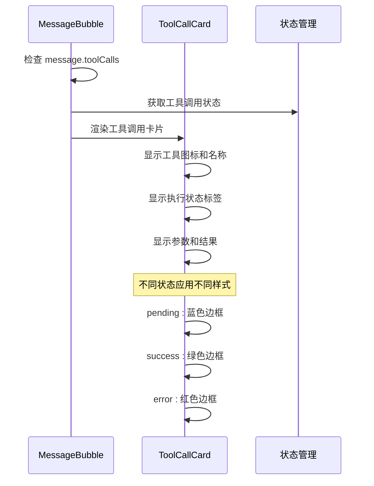
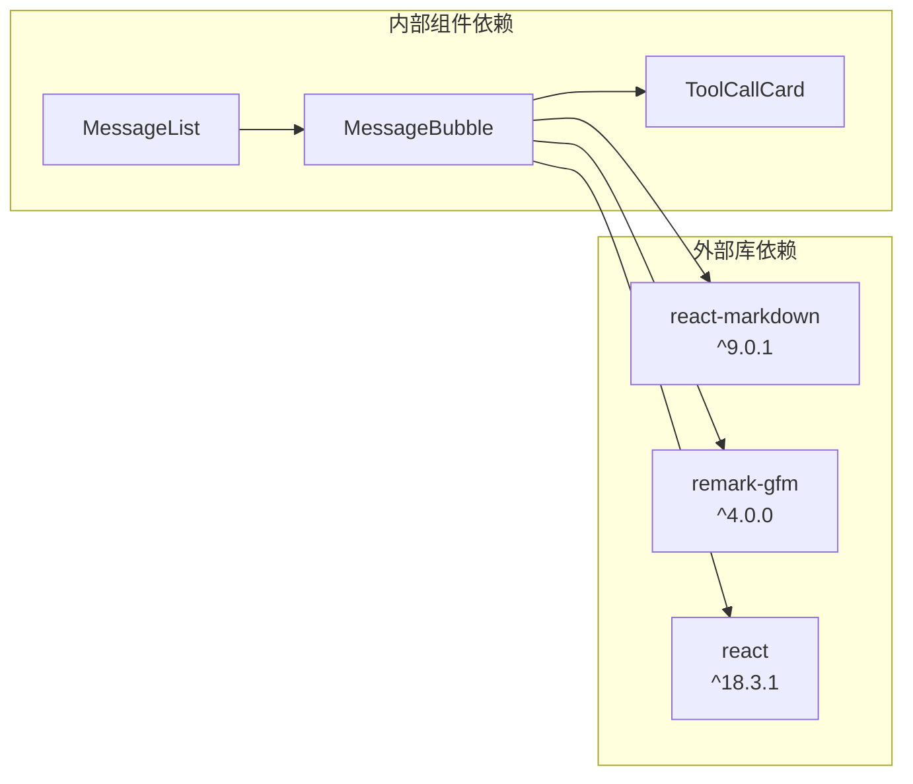
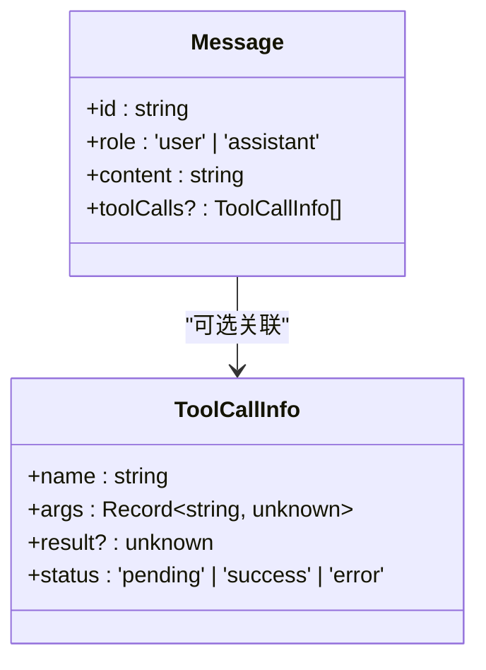

# MessageBubble 消息气泡

<cite>
**本文档引用的文件**
- [MessageBubble.tsx](file://src/components/Chat/MessageBubble.tsx)
- [MessageBubble.css](file://src/components/Chat/MessageBubble.css)
- [ToolCallCard.tsx](file://src/components/Chat/ToolCallCard.tsx)
- [ToolCallCard.css](file://src/components/Chat/ToolCallCard.css)
- [MessageList.tsx](file://src/components/Chat/MessageList.tsx)
- [types/index.ts](file://src/types/index.ts)
- [package.json](file://package.json)
- [index.css](file://src/styles/index.css)
</cite>

## 目录
1. [简介](#简介)
2. [项目结构](#项目结构)
3. [核心组件](#核心组件)
4. [架构概览](#架构概览)
5. [详细组件分析](#详细组件分析)
6. [依赖关系分析](#依赖关系分析)
7. [性能考虑](#性能考虑)
8. [故障排除指南](#故障排除指南)
9. [结论](#结论)
10. [附录](#附录)

## 简介

MessageBubble 是 AI Agent Web 应用中的核心消息显示组件，负责渲染用户和 AI 的对话消息。该组件集成了 react-markdown 和 remark-gfm 来提供 Markdown 格式解析和代码高亮功能，同时支持工具调用消息的特殊处理和 ToolCallCard 嵌入机制。

该组件的主要特性包括：
- 用户消息与 AI 回复的差异化视觉呈现
- Markdown 格式解析和 GFM 扩展功能
- 工具调用消息的可视化展示
- 响应式布局和无障碍访问支持
- 主题适配和样式定制选项

## 项目结构

MessageBubble 组件位于聊天功能模块中，与相关的样式文件和类型定义共同构成完整的消息显示系统。



**图表来源**
- [MessageBubble.tsx](file://src/components/Chat/MessageBubble.tsx#L1-L38)
- [ToolCallCard.tsx](file://src/components/Chat/ToolCallCard.tsx#L1-L45)
- [MessageList.tsx](file://src/components/Chat/MessageList.tsx#L1-L52)
- [types/index.ts](file://src/types/index.ts#L1-L28)

**章节来源**
- [MessageBubble.tsx](file://src/components/Chat/MessageBubble.tsx#L1-L38)
- [MessageBubble.css](file://src/components/Chat/MessageBubble.css#L1-L74)
- [ToolCallCard.tsx](file://src/components/Chat/ToolCallCard.tsx#L1-L45)
- [ToolCallCard.css](file://src/components/Chat/ToolCallCard.css#L1-L95)

## 核心组件

MessageBubble 组件是整个聊天界面的核心，负责将服务器返回的消息数据转换为用户友好的界面元素。组件通过 props 接收 Message 类型的数据，并根据消息角色（用户或 AI）应用不同的样式和行为。

### 组件架构



**图表来源**
- [MessageBubble.tsx](file://src/components/Chat/MessageBubble.tsx#L7-L37)
- [ToolCallCard.tsx](file://src/components/Chat/ToolCallCard.tsx#L4-L44)
- [types/index.ts](file://src/types/index.ts#L1-L13)

### 数据流分析



**图表来源**
- [MessageBubble.tsx](file://src/components/Chat/MessageBubble.tsx#L11-L37)
- [ToolCallCard.tsx](file://src/components/Chat/ToolCallCard.tsx#L14-L44)

**章节来源**
- [MessageBubble.tsx](file://src/components/Chat/MessageBubble.tsx#L1-L38)
- [types/index.ts](file://src/types/index.ts#L1-L13)

## 架构概览

MessageBubble 组件在整个聊天系统中扮演着关键角色，它不仅负责消息的视觉呈现，还集成了多种功能特性来增强用户体验。

### 系统架构图



**图表来源**
- [ChatContainer.tsx](file://src/components/Chat/ChatContainer.tsx#L1-L24)
- [MessageList.tsx](file://src/components/Chat/MessageList.tsx#L1-L52)
- [MessageBubble.tsx](file://src/components/Chat/MessageBubble.tsx#L1-L38)
- [ToolCallCard.tsx](file://src/components/Chat/ToolCallCard.tsx#L1-L45)

### 组件交互流程



**图表来源**
- [MessageBubble.tsx](file://src/components/Chat/MessageBubble.tsx#L11-L37)

**章节来源**
- [ChatContainer.tsx](file://src/components/Chat/ChatContainer.tsx#L1-L24)
- [MessageList.tsx](file://src/components/Chat/MessageList.tsx#L1-L52)

## 详细组件分析

### MessageBubble 组件详解

MessageBubble 组件是消息显示的核心，它实现了以下关键功能：

#### 角色区分与样式应用

组件通过消息的角色属性自动区分用户消息和 AI 回复，并应用相应的视觉样式：

- **用户消息样式**：背景色为浅灰色，头像显示为 👤，内容右对齐
- **AI 回复样式**：背景色为白色，头像显示为 🤖，内容左对齐

#### Markdown 内容解析

组件集成了 react-markdown 和 remark-gfm 插件来提供完整的 Markdown 支持：

```mermaid
classDiagram
class ReactMarkdown {
+remarkPlugins : Array
+children : string
+components : Object
+render() JSX.Element
}
class RemarkGfm {
+name : "remark-gfm"
+features : [
"task lists",
"tables",
"strikethrough",
"autolinks"
]
}
ReactMarkdown --> RemarkGfm : "使用GFM插件"
```

**图表来源**
- [MessageBubble.tsx](file://src/components/Chat/MessageBubble.tsx#L1-L3)
- [package.json](file://package.json#L11-L16)

#### 工具调用消息处理

对于包含工具调用的消息，组件会渲染 ToolCallCard 组件来展示工具执行状态：



**图表来源**
- [MessageBubble.tsx](file://src/components/Chat/MessageBubble.tsx#L20-L26)
- [ToolCallCard.tsx](file://src/components/Chat/ToolCallCard.tsx#L14-L44)

**章节来源**
- [MessageBubble.tsx](file://src/components/Chat/MessageBubble.tsx#L1-L38)
- [ToolCallCard.tsx](file://src/components/Chat/ToolCallCard.tsx#L1-L45)

### ToolCallCard 组件详解

ToolCallCard 专门用于展示工具调用的详细信息，提供了完整的工具执行生命周期可视化。

#### 工具图标映射

组件内置了常用工具的图标映射：

| 工具名称 | 图标 | 功能 |
|---------|------|------|
| get_weather | 🌤️ | 天气查询 |
| calculate | 🔢 | 数学计算 |
| web_search | 🔍 | 网络搜索 |

#### 状态指示系统

工具调用卡片通过三种状态来指示执行进度：

- **pending（执行中）**：蓝色边框和状态标签
- **success（完成）**：绿色边框和状态标签  
- **error（失败）**：红色边框和状态标签

#### 参数和结果展示

组件以 JSON 格式清晰地展示工具调用的参数和结果，便于调试和理解工具执行过程。

**章节来源**
- [ToolCallCard.tsx](file://src/components/Chat/ToolCallCard.tsx#L8-L44)
- [ToolCallCard.css](file://src/components/Chat/ToolCallCard.css#L1-L95)

### 样式系统分析

MessageBubble 的样式系统采用了模块化的 CSS 设计，确保了良好的可维护性和主题适配能力。

#### 响应式设计

组件采用 Flexbox 布局，支持响应式设计：

- **消息气泡容器**：使用 `display: flex` 实现头像和内容的水平排列
- **间距控制**：通过 `gap: 12px` 统一控制元素间距
- **文本换行**：使用 `overflow-wrap: break-word` 确保长文本正确换行

#### 主题适配

样式系统支持多种主题适配：

- **颜色变量**：通过 CSS 变量定义主色调和辅助色彩
- **状态样式**：为不同状态提供独立的视觉反馈
- **字体系统**：统一的字体家族和字号设置

#### 无障碍访问支持

组件在设计时考虑了无障碍访问需求：

- **语义化标签**：使用适当的 HTML 结构
- **颜色对比度**：确保文本和背景有足够的对比度
- **键盘导航**：支持键盘操作和焦点管理

**章节来源**
- [MessageBubble.css](file://src/components/Chat/MessageBubble.css#L1-L74)
- [ToolCallCard.css](file://src/components/Chat/ToolCallCard.css#L1-L95)
- [index.css](file://src/styles/index.css#L1-L35)

## 依赖关系分析

MessageBubble 组件的依赖关系相对简洁，主要依赖于第三方库和内部类型定义。

### 外部依赖



**图表来源**
- [package.json](file://package.json#L11-L16)
- [MessageBubble.tsx](file://src/components/Chat/MessageBubble.tsx#L1-L3)
- [MessageList.tsx](file://src/components/Chat/MessageList.tsx#L1-L52)

### 内部类型依赖

组件严格依赖于类型定义来确保类型安全：



**图表来源**
- [types/index.ts](file://src/types/index.ts#L1-L13)

**章节来源**
- [package.json](file://package.json#L11-L16)
- [types/index.ts](file://src/types/index.ts#L1-L13)

## 性能考虑

MessageBubble 组件在设计时充分考虑了性能优化，特别是在大量消息渲染场景下的表现。

### 渲染优化策略

- **条件渲染**：仅在存在内容时才渲染相应的子组件
- **最小化重渲染**：通过合理的 props 结构减少不必要的重新渲染
- **样式缓存**：CSS 类名的静态性有助于浏览器缓存样式

### 内存管理

- **及时清理**：组件卸载时自动清理相关的 DOM 引用
- **事件监听**：避免在组件内部创建内存泄漏的事件监听器

### 渲染性能监控

建议在生产环境中监控以下指标：
- 单个消息气泡的渲染时间
- 大消息列表的滚动性能
- Markdown 解析的 CPU 使用率

## 故障排除指南

### 常见问题及解决方案

#### Markdown 解析错误

**问题**：Markdown 内容无法正确解析
**原因**：可能是内容格式不符合规范
**解决方案**：
1. 检查 Markdown 语法是否正确
2. 确认 remark-gfm 插件已正确安装
3. 验证内容字符串不为空

#### 工具调用显示异常

**问题**：ToolCallCard 无法正常显示
**原因**：工具调用数据结构不正确
**解决方案**：
1. 检查 ToolCallInfo 接口的数据格式
2. 确认工具调用状态值在允许范围内
3. 验证工具名称是否在图标映射表中

#### 样式显示问题

**问题**：消息气泡样式显示异常
**原因**：CSS 文件未正确加载或样式冲突
**解决方案**：
1. 检查 CSS 文件路径是否正确
2. 确认没有其他样式覆盖了组件样式
3. 验证浏览器开发者工具中的样式应用情况

### 调试技巧

1. **使用 React DevTools**：检查组件的 props 和 state
2. **浏览器开发者工具**：监控网络请求和资源加载
3. **控制台日志**：添加必要的日志输出进行调试

**章节来源**
- [MessageBubble.tsx](file://src/components/Chat/MessageBubble.tsx#L1-L38)
- [ToolCallCard.tsx](file://src/components/Chat/ToolCallCard.tsx#L1-L45)

## 结论

MessageBubble 消息气泡组件是一个设计精良、功能完整的聊天消息显示组件。它成功地将多种复杂功能整合在一个简洁的组件中，包括：

- **强大的内容渲染**：通过 react-markdown 和 remark-gfm 提供完整的 Markdown 支持
- **灵活的消息类型**：支持普通文本消息和工具调用消息的差异化展示
- **优秀的用户体验**：提供直观的视觉反馈和无障碍访问支持
- **良好的可维护性**：清晰的代码结构和完善的类型定义

该组件为 AI Agent Web 应用提供了坚实的消息显示基础，为后续的功能扩展和主题定制奠定了良好基础。

## 附录

### 使用示例

#### 基本消息渲染

```typescript
// 用户消息示例
const userMessage: Message = {
  id: '1',
  role: 'user',
  content: '你好，AI助手！',
  toolCalls: []
};

// AI 回复示例
const aiMessage: Message = {
  id: '2', 
  role: 'assistant',
  content: '你好！我如何帮助你？',
  toolCalls: []
};
```

#### 工具调用消息示例

```typescript
const toolCallMessage: Message = {
  id: '3',
  role: 'assistant',
  content: '让我为你查询天气信息',
  toolCalls: [
    {
      name: 'get_weather',
      args: { city: '北京' },
      result: { temperature: 25, condition: '晴朗' },
      status: 'success'
    }
  ]
};
```

### 样式定制指南

#### 自定义主题颜色

可以通过修改 CSS 变量来自定义主题：

```css
:root {
  --user-message-bg: #e3f2fd;
  --assistant-message-bg: #ffffff;
  --user-message-text: #1976d2;
  --assistant-message-text: #333333;
}
```

#### 响应式断点

组件支持以下断点：
- 移动设备：最大宽度 768px
- 平板设备：769px - 1024px
- 桌面设备：超过 1024px

### 无障碍访问最佳实践

1. **语义化 HTML**：使用适当的 HTML 标签结构
2. **键盘导航**：确保所有交互元素可通过键盘访问
3. **屏幕阅读器支持**：为重要信息提供适当的 ARIA 属性
4. **颜色对比度**：确保文本和背景有足够的对比度