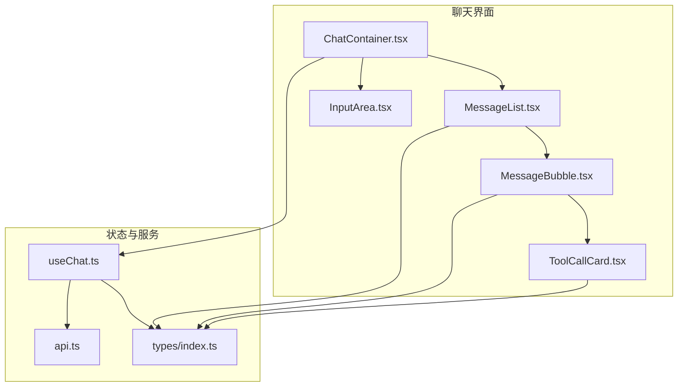
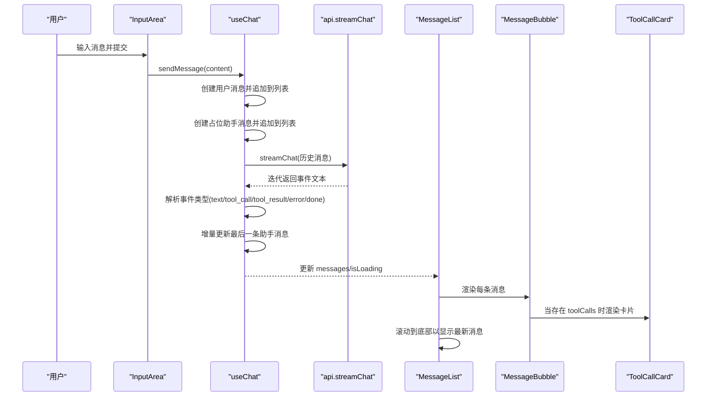
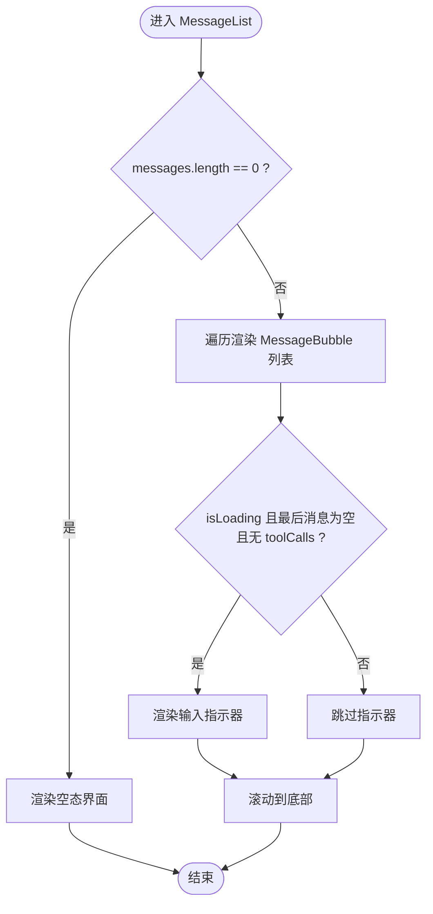
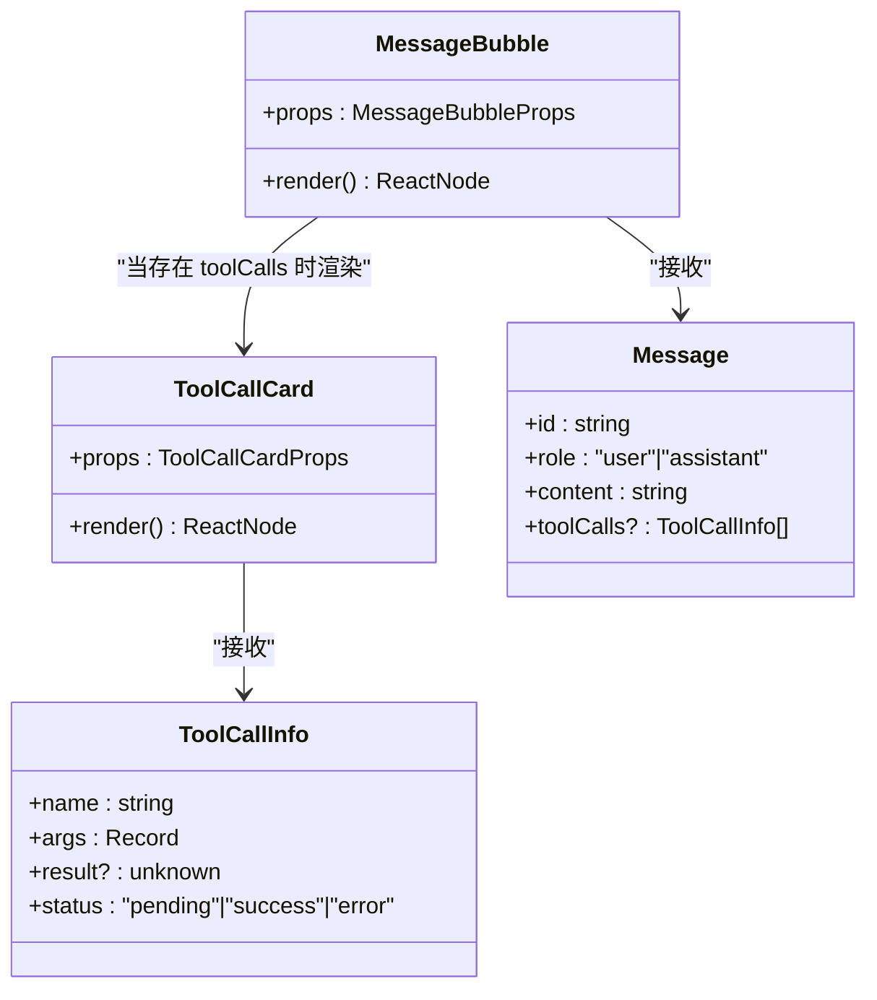
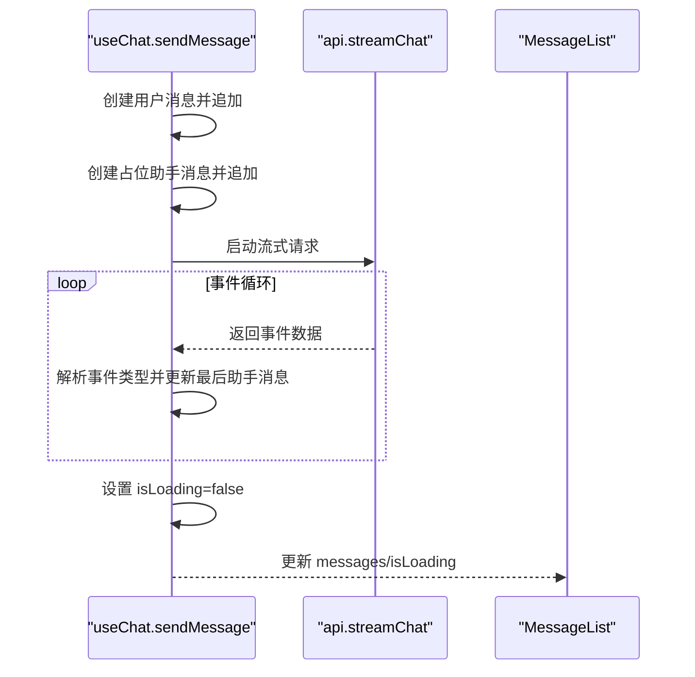
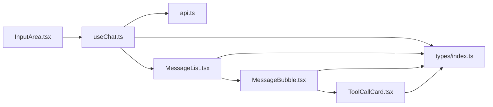

# MessageList 消息列表

<cite>
**本文引用的文件**
- [MessageList.tsx](file://src/components/Chat/MessageList.tsx)
- [MessageBubble.tsx](file://src/components/Chat/MessageBubble.tsx)
- [MessageList.css](file://src/components/Chat/MessageList.css)
- [MessageBubble.css](file://src/components/Chat/MessageBubble.css)
- [ToolCallCard.tsx](file://src/components/Chat/ToolCallCard.tsx)
- [ToolCallCard.css](file://src/components/Chat/ToolCallCard.css)
- [useChat.ts](file://src/hooks/useChat.ts)
- [api.ts](file://src/services/api.ts)
- [types/index.ts](file://src/types/index.ts)
- [ChatContainer.tsx](file://src/components/Chat/ChatContainer.tsx)
- [InputArea.tsx](file://src/components/Chat/InputArea.tsx)
</cite>

## 目录
1. [简介](#简介)
2. [项目结构](#项目结构)
3. [核心组件](#核心组件)
4. [架构总览](#架构总览)
5. [组件详细分析](#组件详细分析)
6. [依赖关系分析](#依赖关系分析)
7. [性能与内存优化](#性能与内存优化)
8. [故障排查指南](#故障排查指南)
9. [结论](#结论)
10. [附录：使用流程与示例路径](#附录使用流程与示例路径)

## 简介
本文件围绕 MessageList 消息列表组件，系统性阐述其消息渲染机制、滚动行为控制、加载状态处理、消息类型区分与样式差异化、以及与上层 useChat 钩子和 API 流式接口的协作方式。文档同时给出关键流程的时序图与类图，帮助开发者快速理解与扩展该组件。

## 项目结构
本项目采用按功能域分层的组织方式，聊天相关组件集中在 src/components/Chat 下，状态管理通过自定义 Hook useChat 提供，流式数据通过服务层 api.ts 暴露。

图表来源
- [ChatContainer.tsx](file://src/components/Chat/ChatContainer.tsx#L6-L22)
- [MessageList.tsx](file://src/components/Chat/MessageList.tsx#L11-L51)
- [MessageBubble.tsx](file://src/components/Chat/MessageBubble.tsx#L11-L37)
- [ToolCallCard.tsx](file://src/components/Chat/ToolCallCard.tsx#L14-L44)
- [useChat.ts](file://src/hooks/useChat.ts#L10-L158)
- [api.ts](file://src/services/api.ts#L8-L47)
- [types/index.ts](file://src/types/index.ts#L1-L28)

章节来源
- [ChatContainer.tsx](file://src/components/Chat/ChatContainer.tsx#L6-L22)
- [MessageList.tsx](file://src/components/Chat/MessageList.tsx#L11-L51)
- [useChat.ts](file://src/hooks/useChat.ts#L10-L158)

## 核心组件
- MessageList：负责消息列表的渲染、空态显示、加载指示器、滚动行为控制。
- MessageBubble：负责单条消息的渲染，区分用户与助手角色，支持 Markdown 内容与工具调用卡片。
- ToolCallCard：渲染工具调用的卡片，包含名称、状态、参数与结果。
- useChat：提供消息状态、发送消息、清理消息等能力，并通过流式 API 推送增量内容。
- api.ts：封装流式聊天接口，返回可迭代的 SSE 数据事件。
- types/index.ts：定义消息、工具调用、SSE 事件等类型。

章节来源
- [MessageList.tsx](file://src/components/Chat/MessageList.tsx#L11-L51)
- [MessageBubble.tsx](file://src/components/Chat/MessageBubble.tsx#L11-L37)
- [ToolCallCard.tsx](file://src/components/Chat/ToolCallCard.tsx#L14-L44)
- [useChat.ts](file://src/hooks/useChat.ts#L10-L158)
- [api.ts](file://src/services/api.ts#L8-L47)
- [types/index.ts](file://src/types/index.ts#L1-L28)

## 架构总览
下图展示了从用户输入到消息列表渲染的端到端流程，包括流式事件的解析与增量更新。

图表来源
- [InputArea.tsx](file://src/components/Chat/InputArea.tsx#L12-L24)
- [useChat.ts](file://src/hooks/useChat.ts#L14-L146)
- [api.ts](file://src/services/api.ts#L8-L47)
- [MessageList.tsx](file://src/components/Chat/MessageList.tsx#L14-L16)
- [MessageBubble.tsx](file://src/components/Chat/MessageBubble.tsx#L20-L33)
- [ToolCallCard.tsx](file://src/components/Chat/ToolCallCard.tsx#L14-L44)

## 组件详细分析

### MessageList 组件
- 职责
  - 渲染消息列表，支持空态提示。
  - 在消息变化时自动滚动至底部，确保最新消息可见。
  - 条件渲染“正在输入”指示器，用于展示流式响应的占位状态。
  - 通过 ref 指向一个不可见的 div，配合 scrollIntoView 实现平滑滚动。
- 关键点
  - 使用 useEffect 依赖 messages，在每次消息数组变化时触发滚动。
  - 加载指示器仅在最后一条消息为空内容且无工具调用时显示。
  - 空态时渲染欢迎语与示例提示按钮。
- 性能与可用性
  - 通过最小化重渲染范围（仅在消息数组变化时滚动），避免不必要的滚动抖动。
  - 未实现虚拟滚动，适合中小规模消息列表；大规模场景建议引入虚拟滚动。

图表来源
- [MessageList.tsx](file://src/components/Chat/MessageList.tsx#L18-L51)

章节来源
- [MessageList.tsx](file://src/components/Chat/MessageList.tsx#L11-L51)
- [MessageList.css](file://src/components/Chat/MessageList.css#L65-L97)

### MessageBubble 组件
- 职责
  - 根据消息角色渲染不同样式（用户/助手）。
  - 支持 Markdown 内容渲染（通过 react-markdown + remarkGfm）。
  - 当消息包含工具调用时，逐个渲染 ToolCallCard。
- 消息类型与样式
  - 用户消息：背景浅灰、内容右对齐、头像位于右侧。
  - 助手消息：背景白色。
- 工具调用渲染
  - 遍历 toolCalls 数组，传递每个调用对象给 ToolCallCard。
- 性能与可用性
  - 仅在有内容或工具调用时渲染对应区域，避免空渲染。
  - Markdown 渲染由外部库负责，保持内容可读性与可维护性。

图表来源
- [MessageBubble.tsx](file://src/components/Chat/MessageBubble.tsx#L11-L37)
- [ToolCallCard.tsx](file://src/components/Chat/ToolCallCard.tsx#L14-L44)
- [types/index.ts](file://src/types/index.ts#L1-L28)

章节来源
- [MessageBubble.tsx](file://src/components/Chat/MessageBubble.tsx#L11-L37)
- [MessageBubble.css](file://src/components/Chat/MessageBubble.css#L1-L74)
- [ToolCallCard.tsx](file://src/components/Chat/ToolCallCard.tsx#L14-L44)
- [ToolCallCard.css](file://src/components/Chat/ToolCallCard.css#L1-L95)

### ToolCallCard 组件
- 职责
  - 展示工具调用的名称、图标、状态（执行中/完成/失败）。
  - 展示参数与结果（若存在）。
- 状态样式
  - pending：蓝色边框与状态标签。
  - success：绿色边框与状态标签。
  - error：红色边框与状态标签。
- 图标映射
  - 预置常见工具名到图标的映射，未知工具使用默认图标。

章节来源
- [ToolCallCard.tsx](file://src/components/Chat/ToolCallCard.tsx#L14-L44)
- [ToolCallCard.css](file://src/components/Chat/ToolCallCard.css#L1-L95)

### useChat 钩子与流式 API
- 职责
  - 维护消息列表与加载状态。
  - 发送消息后创建占位助手消息，随后通过流式接口增量更新。
  - 处理 text、tool_call、tool_result、error、done 等事件类型。
- 消息排序与更新策略
  - 用户消息与占位助手消息按顺序追加，保证时间线正确。
  - 最后一条助手消息作为当前更新目标，根据事件类型追加内容或新增工具调用。
  - 工具调用结果回填到对应工具调用项，更新状态为 success。
  - 错误事件会将错误信息拼接到助手消息内容末尾。
- 加载状态
  - 发送消息开始时设置 isLoading=true；流式结束后设置 isLoading=false。
- 初始化与销毁
  - 组件挂载时无需额外初始化逻辑；卸载时无需特殊清理，因为状态由 React 生命周期管理。

图表来源
- [useChat.ts](file://src/hooks/useChat.ts#L14-L146)
- [api.ts](file://src/services/api.ts#L8-L47)
- [MessageList.tsx](file://src/components/Chat/MessageList.tsx#L14-L16)

章节来源
- [useChat.ts](file://src/hooks/useChat.ts#L10-L158)
- [api.ts](file://src/services/api.ts#L8-L47)

## 依赖关系分析
- 组件耦合
  - MessageList 依赖 MessageBubble；MessageBubble 依赖 ToolCallCard。
  - ChatContainer 将 useChat 的状态注入到 MessageList 与 InputArea。
  - useChat 依赖 api.ts 的流式接口与 types 定义。
- 数据流向
  - 输入区 InputArea -> useChat.sendMessage -> api.streamChat -> useChat 更新 -> MessageList 渲染。
- 可能的循环依赖
  - 未发现直接循环依赖；各模块职责清晰，通过 props 与状态传递数据。

图表来源
- [InputArea.tsx](file://src/components/Chat/InputArea.tsx#L9-L24)
- [useChat.ts](file://src/hooks/useChat.ts#L10-L158)
- [api.ts](file://src/services/api.ts#L8-L47)
- [MessageList.tsx](file://src/components/Chat/MessageList.tsx#L11-L51)
- [MessageBubble.tsx](file://src/components/Chat/MessageBubble.tsx#L11-L37)
- [ToolCallCard.tsx](file://src/components/Chat/ToolCallCard.tsx#L14-L44)
- [types/index.ts](file://src/types/index.ts#L1-L28)

章节来源
- [ChatContainer.tsx](file://src/components/Chat/ChatContainer.tsx#L6-L22)
- [useChat.ts](file://src/hooks/useChat.ts#L10-L158)

## 性能与内存优化
- 渲染效率
  - MessageList 仅在 messages 变化时触发滚动，减少不必要的滚动操作。
  - MessageBubble 仅在存在内容或工具调用时渲染对应区域，避免空渲染。
- 内存管理
  - 使用 React 的 key 机制（基于消息 id）保证列表项稳定更新，降低重排成本。
  - 流式更新通过替换最后一条助手消息的内容与工具调用数组，避免频繁创建新消息对象。
- 扩展建议
  - 大规模消息列表：引入虚拟滚动（如 react-window 或 react-virtualized），仅渲染可视区域内的消息项，显著降低 DOM 节点数量与重绘开销。
  - Markdown 渲染：对于长文本，可考虑缓存渲染结果或延迟渲染，减少首屏压力。
  - 工具调用卡片：对频繁重复的工具调用可做去重与缓存，避免重复渲染。

[本节为通用性能建议，不直接分析具体文件]

## 故障排查指南
- 消息未自动滚动到最新
  - 检查 MessageList 是否正确传入 messages 并在消息变化时触发滚动。
  - 确认底部 ref 是否被正确挂载且未被其他元素遮挡。
- 加载指示器不显示
  - 确认 isLoading 为 true，且最后一条消息为空内容且无 toolCalls。
- 工具调用状态异常
  - 检查 useChat 中 tool_result 事件是否正确匹配 tool_call 的 name 字段。
  - 确认 ToolCallCard 的状态类名与 CSS 对应。
- Markdown 渲染问题
  - 确保 remarkGfm 插件已正确启用，检查内容格式是否符合预期。
- 流式接口异常
  - 检查 api.streamChat 的响应体是否包含 data: 行，确保事件解析逻辑正常。

章节来源
- [MessageList.tsx](file://src/components/Chat/MessageList.tsx#L14-L16)
- [MessageBubble.tsx](file://src/components/Chat/MessageBubble.tsx#L20-L33)
- [useChat.ts](file://src/hooks/useChat.ts#L44-L126)
- [api.ts](file://src/services/api.ts#L8-L47)

## 结论
MessageList 通过简洁的渲染与滚动控制，结合 useChat 的流式事件处理，实现了流畅的消息列表体验。组件间职责清晰、耦合度低，具备良好的可扩展性。对于大规模消息场景，建议引入虚拟滚动与渲染优化策略，以进一步提升性能与用户体验。

[本节为总结性内容，不直接分析具体文件]

## 附录：使用流程与示例路径
- 初始化
  - ChatContainer 将 useChat 的 messages 与 isLoading 注入到 MessageList。
  - 示例路径：[ChatContainer.tsx](file://src/components/Chat/ChatContainer.tsx#L6-L22)
- 发送消息与更新
  - InputArea 触发 sendMessage，useChat 创建用户消息与占位助手消息，随后通过流式接口增量更新。
  - 示例路径：[InputArea.tsx](file://src/components/Chat/InputArea.tsx#L12-L24)，[useChat.ts](file://src/hooks/useChat.ts#L14-L146)
- 渲染与滚动
  - MessageList 渲染消息列表并在消息变化时滚动到底部。
  - 示例路径：[MessageList.tsx](file://src/components/Chat/MessageList.tsx#L11-L51)
- 销毁
  - 清空消息通过 useChat.clearMessages 实现，组件卸载时无需额外清理。
  - 示例路径：[useChat.ts](file://src/hooks/useChat.ts#L148-L150)