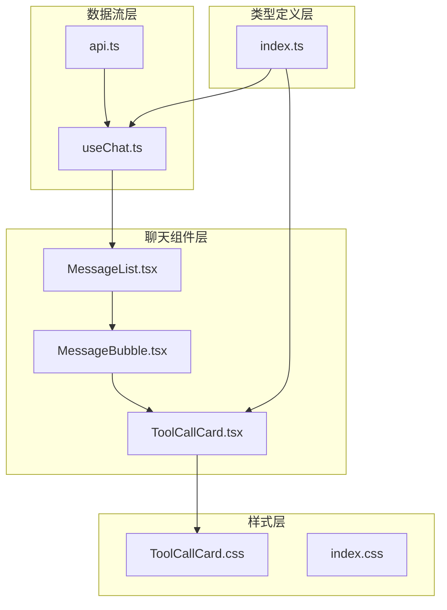
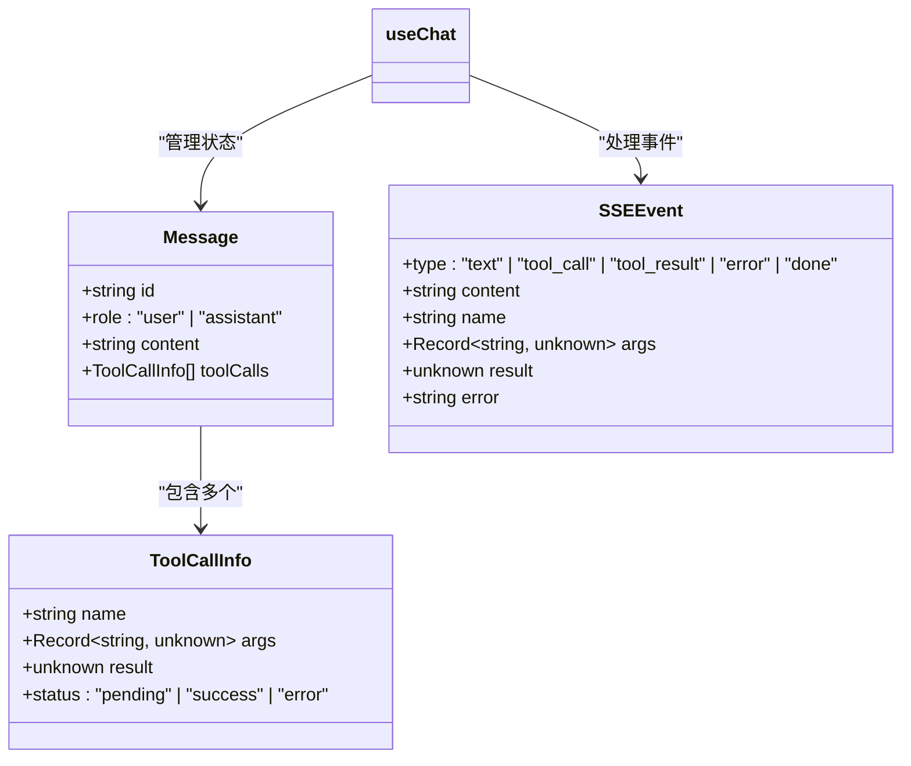
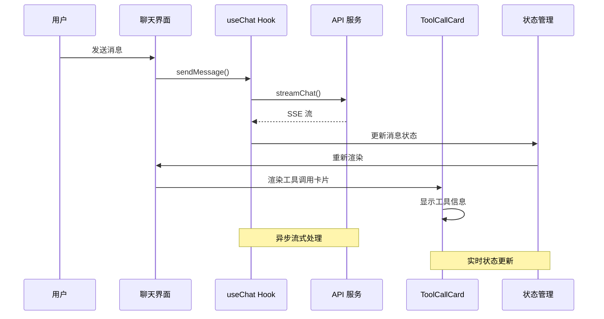
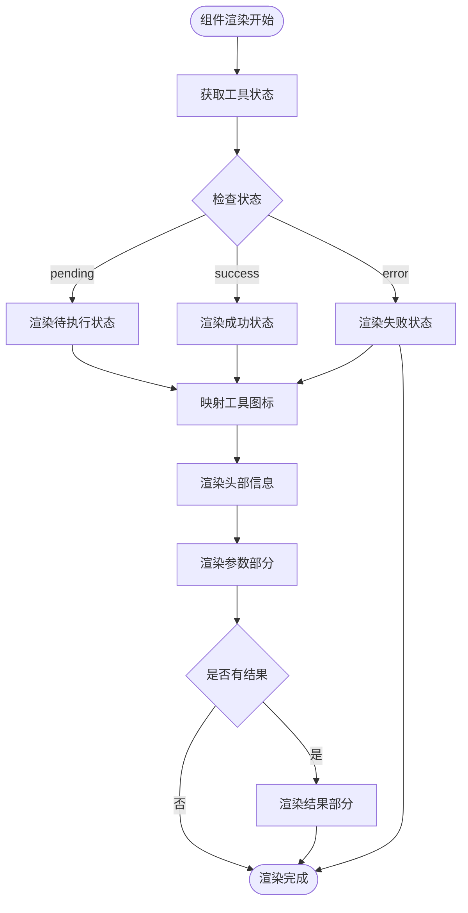
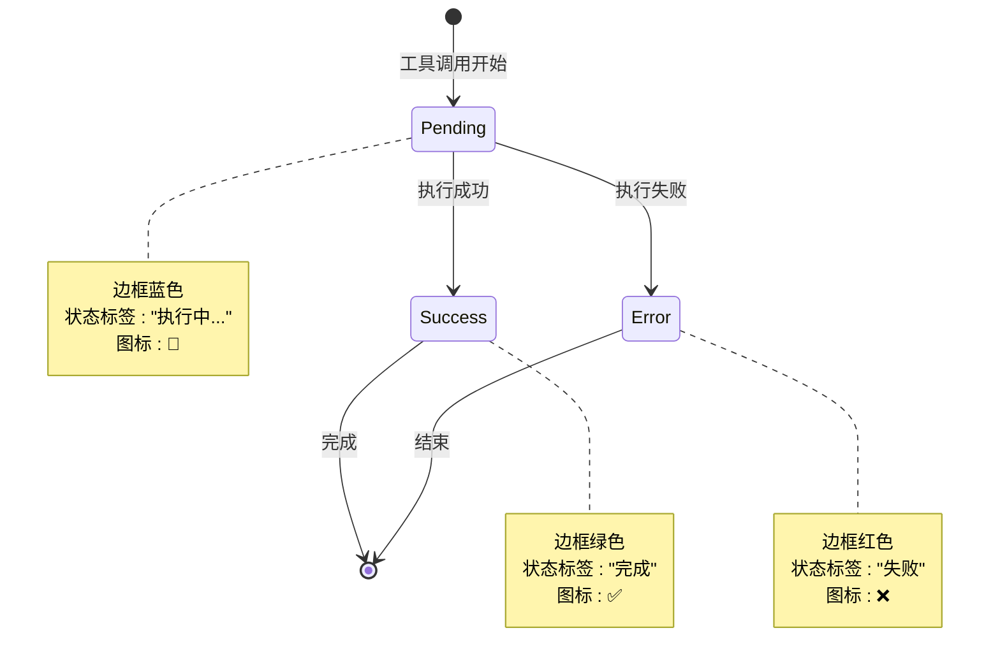
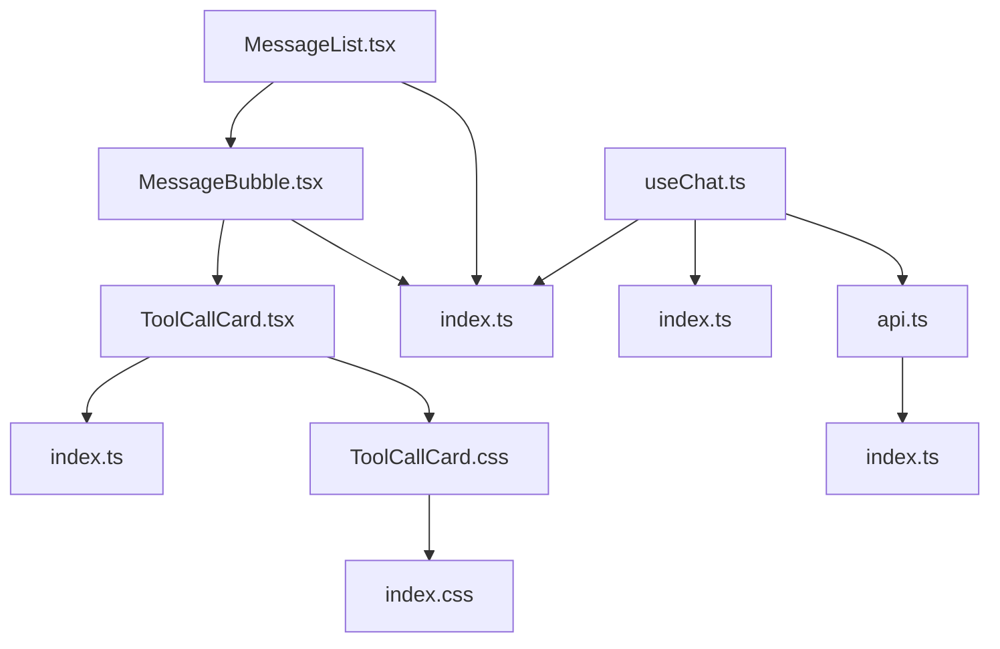

# ToolCallCard 工具调用卡片

<cite>
**本文档引用的文件**
- [ToolCallCard.tsx](file://src/components/Chat/ToolCallCard.tsx)
- [ToolCallCard.css](file://src/components/Chat/ToolCallCard.css)
- [index.ts](file://src/types/index.ts)
- [useChat.ts](file://src/hooks/useChat.ts)
- [api.ts](file://src/services/api.ts)
- [MessageBubble.tsx](file://src/components/Chat/MessageBubble.tsx)
- [MessageList.tsx](file://src/components/Chat/MessageList.tsx)
- [index.css](file://src/styles/index.css)
</cite>

## 目录
1. [简介](#简介)
2. [项目结构](#项目结构)
3. [核心组件](#核心组件)
4. [架构概览](#架构概览)
5. [详细组件分析](#详细组件分析)
6. [依赖关系分析](#依赖关系分析)
7. [性能考虑](#性能考虑)
8. [故障排除指南](#故障排除指南)
9. [结论](#结论)
10. [附录](#附录)

## 简介

ToolCallCard 是一个专门用于展示 AI Agent 工具调用信息的 React 组件。该组件负责显示工具名称、执行状态、参数详情和执行结果，并提供直观的状态指示和视觉反馈。组件支持三种执行状态：待执行（pending）、成功（success）和失败（error），并通过不同的颜色和图标来区分状态。

该组件是 AI Agent 聊天界面的重要组成部分，用于向用户透明地展示后台工具调用的完整生命周期，包括参数传递、执行过程和结果返回。

## 项目结构

ToolCallCard 组件位于聊天功能的核心模块中，与消息显示、状态管理和样式系统紧密集成：



**图表来源**
- [ToolCallCard.tsx](file://src/components/Chat/ToolCallCard.tsx#L1-L45)
- [MessageBubble.tsx](file://src/components/Chat/MessageBubble.tsx#L1-L38)
- [MessageList.tsx](file://src/components/Chat/MessageList.tsx#L1-L52)
- [useChat.ts](file://src/hooks/useChat.ts#L1-L159)
- [api.ts](file://src/services/api.ts#L1-L53)

**章节来源**
- [ToolCallCard.tsx](file://src/components/Chat/ToolCallCard.tsx#L1-L45)
- [MessageBubble.tsx](file://src/components/Chat/MessageBubble.tsx#L1-L38)
- [MessageList.tsx](file://src/components/Chat/MessageList.tsx#L1-L52)

## 核心组件

### ToolCallCard 组件

ToolCallCard 是一个纯函数组件，接收 ToolCallInfo 类型的 props 并渲染工具调用卡片。组件的核心特性包括：

- **状态驱动渲染**：根据工具执行状态动态调整样式和内容
- **工具图标映射**：内置常用工具的图标映射表
- **参数和结果展示**：格式化显示工具参数和执行结果
- **响应式设计**：适配不同屏幕尺寸和内容长度

### 数据模型

组件使用以下数据结构来表示工具调用信息：



**图表来源**
- [index.ts](file://src/types/index.ts#L8-L13)
- [index.ts](file://src/types/index.ts#L1-L6)
- [index.ts](file://src/types/index.ts#L15-L22)

**章节来源**
- [ToolCallCard.tsx](file://src/components/Chat/ToolCallCard.tsx#L1-L45)
- [index.ts](file://src/types/index.ts#L8-L13)

## 架构概览

ToolCallCard 的工作流程涉及多个组件和数据流的协调：



**图表来源**
- [useChat.ts](file://src/hooks/useChat.ts#L14-L146)
- [api.ts](file://src/services/api.ts#L8-L47)
- [ToolCallCard.tsx](file://src/components/Chat/ToolCallCard.tsx#L14-L44)

## 详细组件分析

### 渲染逻辑分析

ToolCallCard 的渲染逻辑基于工具调用的状态进行条件渲染：



**图表来源**
- [ToolCallCard.tsx](file://src/components/Chat/ToolCallCard.tsx#L14-L44)

### 工具名称映射机制

组件内置了工具名称到图标的映射表，支持以下工具：

| 工具名称 | 图标 | 描述 |
|---------|------|------|
| get_weather | 🌤️ | 天气查询工具 |
| calculate | 🔢 | 数学计算工具 |
| web_search | 🔍 | 网络搜索工具 |

对于未映射的工具，组件会使用默认工具图标 🔧。

### 参数展示和格式化

工具参数通过 JSON 格式化显示，使用等宽字体和边框美化：

- **格式化输出**：使用 JSON.stringify 进行缩进格式化
- **等宽字体**：确保参数对齐和可读性
- **滚动支持**：长参数内容支持水平滚动
- **背景高亮**：浅色背景突出显示参数内容

### 执行结果可视化

工具执行结果同样采用 JSON 格式化显示，具有以下特点：

- **条件渲染**：仅在存在结果时显示
- **独立区域**：与参数部分分离显示
- **格式保持**：保留原始数据结构
- **样式统一**：与参数部分使用相同的样式

### 状态切换机制

组件支持三种状态的实时切换和视觉反馈：



**图表来源**
- [ToolCallCard.tsx](file://src/components/Chat/ToolCallCard.tsx#L18-L26)
- [ToolCallCard.css](file://src/components/Chat/ToolCallCard.css#L10-L20)

**章节来源**
- [ToolCallCard.tsx](file://src/components/Chat/ToolCallCard.tsx#L8-L12)
- [ToolCallCard.tsx](file://src/components/Chat/ToolCallCard.tsx#L14-L44)
- [ToolCallCard.css](file://src/components/Chat/ToolCallCard.css#L1-L95)

## 依赖关系分析

### 组件间依赖关系



**图表来源**
- [ToolCallCard.tsx](file://src/components/Chat/ToolCallCard.tsx#L1-L2)
- [MessageBubble.tsx](file://src/components/Chat/MessageBubble.tsx#L1-L5)
- [MessageList.tsx](file://src/components/Chat/MessageList.tsx#L1-L4)
- [useChat.ts](file://src/hooks/useChat.ts#L1-L3)
- [api.ts](file://src/services/api.ts#L1-L6)

### 数据流依赖

组件的数据流遵循单向数据流原则：

1. **外部输入**：ToolCallInfo 对象作为 props 传入
2. **内部状态**：组件不维护内部状态，完全受控于外部 props
3. **样式依赖**：依赖 CSS 类名进行样式控制
4. **类型安全**：通过 TypeScript 接口确保类型正确性

**章节来源**
- [ToolCallCard.tsx](file://src/components/Chat/ToolCallCard.tsx#L1-L6)
- [MessageBubble.tsx](file://src/components/Chat/MessageBubble.tsx#L1-L37)
- [MessageList.tsx](file://src/components/Chat/MessageList.tsx#L1-L51)

## 性能考虑

### 渲染优化

- **纯函数组件**：避免不必要的重渲染，提升性能
- **最小化 DOM 操作**：仅在状态变化时更新相关元素
- **样式类名复用**：通过 CSS 类名而非内联样式提高渲染效率

### 内存管理

- **无状态设计**：组件不持有持久状态，减少内存占用
- **及时清理**：组件卸载时自动释放相关资源
- **对象冻结**：props 对象保持不可变性

### 渲染性能建议

1. **批量更新**：利用 React 的批处理机制减少重渲染
2. **虚拟滚动**：对于大量工具调用场景，考虑实现虚拟滚动
3. **懒加载**：对复杂工具调用结果进行懒加载

## 故障排除指南

### 常见问题及解决方案

#### 工具图标显示异常

**问题描述**：未知工具名称显示默认图标

**可能原因**：
- 工具名称不在映射表中
- 工具名称大小写不匹配

**解决方案**：
- 在映射表中添加新的工具图标
- 确保工具名称大小写一致

#### 参数显示格式错误

**问题描述**：参数显示格式不正确或内容溢出

**可能原因**：
- 参数包含循环引用
- 参数过大导致渲染性能问题

**解决方案**：
- 使用 JSON.stringify 的 replacer 参数处理循环引用
- 对超大参数进行分页或折叠显示

#### 状态更新延迟

**问题描述**：工具执行状态更新不及时

**可能原因**：
- 异步流处理阻塞
- 状态更新频率过高

**解决方案**：
- 优化流式数据处理逻辑
- 实现状态更新节流机制

**章节来源**
- [ToolCallCard.tsx](file://src/components/Chat/ToolCallCard.tsx#L8-L12)
- [useChat.ts](file://src/hooks/useChat.ts#L44-L129)

## 结论

ToolCallCard 是一个设计精良的工具调用展示组件，具有以下优势：

1. **清晰的视觉层次**：通过颜色、图标和布局明确区分不同状态
2. **完整的生命周期支持**：覆盖工具调用的整个执行过程
3. **良好的可扩展性**：支持自定义工具和样式主题
4. **类型安全保证**：完整的 TypeScript 类型定义
5. **简洁的 API 设计**：单一职责，易于使用和测试

该组件为 AI Agent 的工具调用提供了透明的用户体验，让用户能够清楚地了解后台工具的执行情况。

## 附录

### 自定义工具集成指南

要添加新的工具支持，需要：

1. **更新工具图标映射**：
   ```typescript
   const toolIcons: Record<string, string> = {
     // ... 现有映射
     new_tool: '🆕',
   };
   ```

2. **扩展类型定义**：
   ```typescript
   export interface ToolCallInfo {
     name: string;
     args: Record<string, unknown>;
     result?: unknown;
     status: 'pending' | 'success' | 'error';
   }
   ```

3. **添加样式支持**：
   ```css
   .tool-call-card.new_tool {
     border-color: #ff9800;
   }
   ```

### 样式主题定制

组件支持通过以下方式定制主题：

1. **颜色变量**：通过 CSS 变量控制主要颜色
2. **字体大小**：调整字体大小适应不同设备
3. **间距设置**：修改边距和内边距改善布局
4. **响应式设计**：适配移动端和桌面端显示效果

### 安全考虑

在工具调用的安全方面，需要注意：

1. **输入验证**：对工具参数进行严格验证
2. **结果过滤**：对敏感信息进行过滤和脱敏
3. **权限控制**：限制用户可访问的工具范围
4. **错误处理**：优雅处理工具调用失败的情况