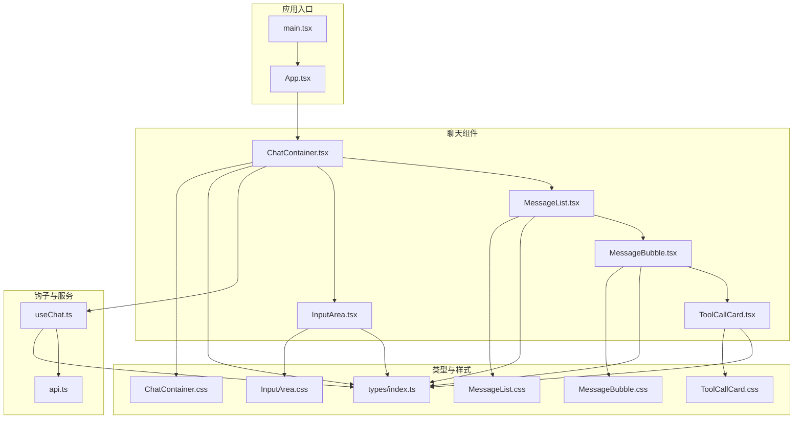
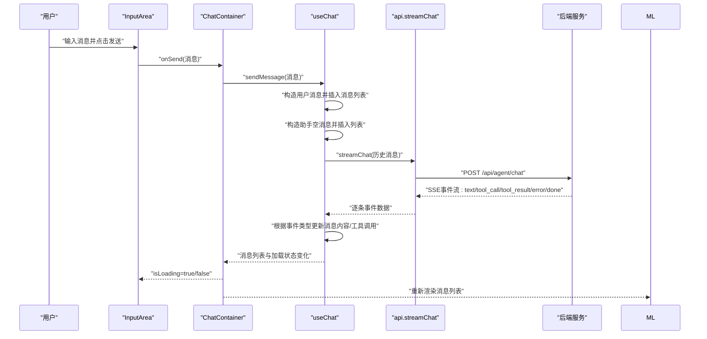
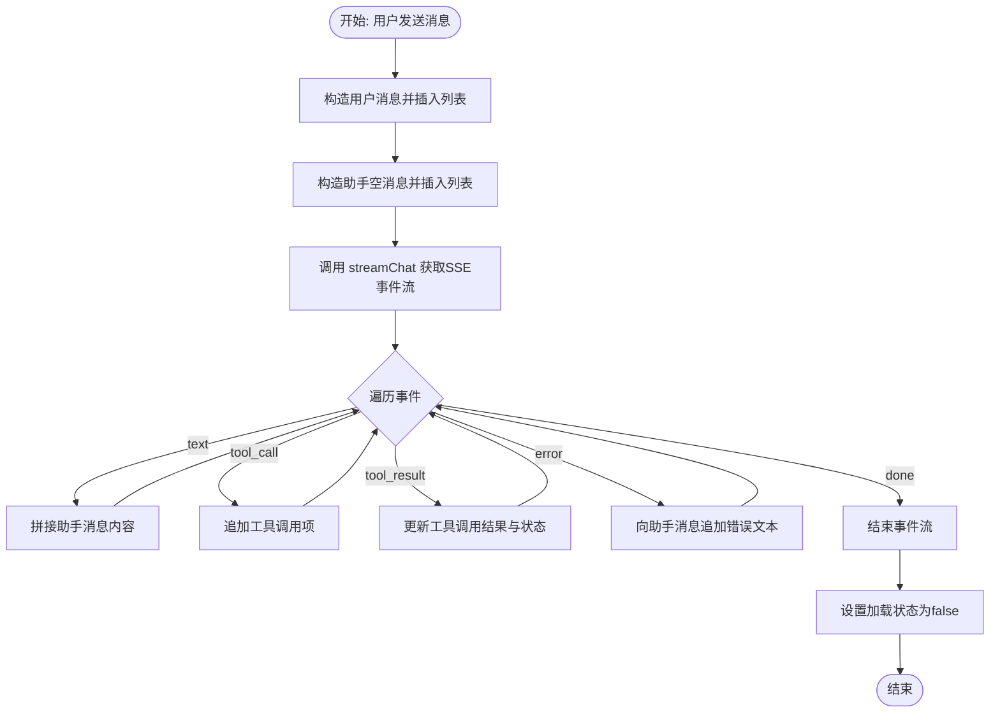
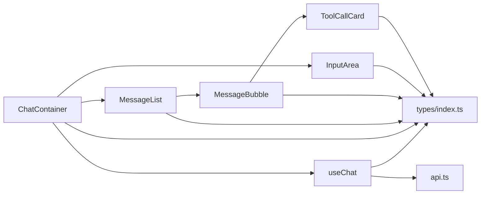

# 核心组件

<cite>
**本文引用的文件**
- [ChatContainer.tsx](file://src/components/Chat/ChatContainer.tsx)
- [MessageList.tsx](file://src/components/Chat/MessageList.tsx)
- [MessageBubble.tsx](file://src/components/Chat/MessageBubble.tsx)
- [InputArea.tsx](file://src/components/Chat/InputArea.tsx)
- [ToolCallCard.tsx](file://src/components/Chat/ToolCallCard.tsx)
- [useChat.ts](file://src/hooks/useChat.ts)
- [api.ts](file://src/services/api.ts)
- [index.ts](file://src/types/index.ts)
- [App.tsx](file://src/App.tsx)
- [main.tsx](file://src/main.tsx)
- [ChatContainer.css](file://src/components/Chat/ChatContainer.css)
- [MessageList.css](file://src/components/Chat/MessageList.css)
- [MessageBubble.css](file://src/components/Chat/MessageBubble.css)
- [InputArea.css](file://src/components/Chat/InputArea.css)
- [ToolCallCard.css](file://src/components/Chat/ToolCallCard.css)
</cite>

## 目录
1. [简介](#简介)
2. [项目结构](#项目结构)
3. [核心组件](#核心组件)
4. [架构总览](#架构总览)
5. [组件详解](#组件详解)
6. [依赖关系分析](#依赖关系分析)
7. [性能与可扩展性](#性能与可扩展性)
8. [故障排查指南](#故障排查指南)
9. [结论](#结论)
10. [附录：类型与接口](#附录类型与接口)

## 简介
本文件聚焦于AI代理Web项目的聊天界面核心组件，系统性梳理ChatContainer主容器、MessageList消息列表、MessageBubble消息气泡、InputArea输入区域以及ToolCallCard工具调用卡片的设计与实现，解释它们之间的调用关系、数据流、状态管理与错误处理策略，并给出面向初学者的易懂说明与面向资深开发者的深度细节。

## 项目结构
应用采用分层清晰的组织方式：
- 组件层：位于 src/components/Chat 下，包含聊天相关UI组件与样式
- 钩子层：位于 src/hooks，封装业务逻辑（如聊天状态与事件流）
- 服务层：位于 src/services，封装后端API交互（SSE流式响应）
- 类型层：位于 src/types，统一定义消息、工具调用与SSE事件的数据结构
- 应用入口：src/main.tsx 和 src/App.tsx 负责渲染根组件

图表来源
- [main.tsx](file://src/main.tsx#L1-L10)
- [App.tsx](file://src/App.tsx#L1-L9)
- [ChatContainer.tsx](file://src/components/Chat/ChatContainer.tsx#L1-L24)
- [MessageList.tsx](file://src/components/Chat/MessageList.tsx#L1-L52)
- [MessageBubble.tsx](file://src/components/Chat/MessageBubble.tsx#L1-L38)
- [InputArea.tsx](file://src/components/Chat/InputArea.tsx#L1-L52)
- [ToolCallCard.tsx](file://src/components/Chat/ToolCallCard.tsx#L1-L45)
- [useChat.ts](file://src/hooks/useChat.ts#L1-L159)
- [api.ts](file://src/services/api.ts#L1-L53)
- [index.ts](file://src/types/index.ts#L1-L28)

章节来源
- [main.tsx](file://src/main.tsx#L1-L10)
- [App.tsx](file://src/App.tsx#L1-L9)

## 核心组件
本节概述五个核心组件的职责与协作关系：
- ChatContainer：页面主容器，负责承载头部、消息列表与输入区域，并通过自定义Hook useChat管理消息与加载状态
- MessageList：渲染消息列表，支持空态占位、自动滚动到底部、打字指示器
- MessageBubble：单条消息气泡，区分用户/助手角色，渲染Markdown正文与工具调用卡片
- InputArea：输入框与发送按钮，支持回车发送、禁用态控制、占位提示
- ToolCallCard：工具调用卡片，展示名称、状态、参数与结果，按状态切换样式

章节来源
- [ChatContainer.tsx](file://src/components/Chat/ChatContainer.tsx#L1-L24)
- [MessageList.tsx](file://src/components/Chat/MessageList.tsx#L1-L52)
- [MessageBubble.tsx](file://src/components/Chat/MessageBubble.tsx#L1-L38)
- [InputArea.tsx](file://src/components/Chat/InputArea.tsx#L1-L52)
- [ToolCallCard.tsx](file://src/components/Chat/ToolCallCard.tsx#L1-L45)

## 架构总览
下图展示了从用户输入到后端SSE事件流的完整调用链路与组件交互：

图表来源
- [InputArea.tsx](file://src/components/Chat/InputArea.tsx#L9-L28)
- [ChatContainer.tsx](file://src/components/Chat/ChatContainer.tsx#L6-L23)
- [useChat.ts](file://src/hooks/useChat.ts#L14-L146)
- [api.ts](file://src/services/api.ts#L8-L47)

## 组件详解

### ChatContainer 主容器
- 职责
  - 渲染聊天头部与清空按钮（当存在消息时）
  - 传入消息与加载状态给消息列表
  - 接收发送回调并传入输入区域
- 关键点
  - 使用自定义Hook useChat获取 messages、isLoading、sendMessage、clearMessages
  - 清空按钮仅在有消息时显示
- 依赖
  - 子组件：MessageList、InputArea
  - Hook：useChat
  - 样式：ChatContainer.css

章节来源
- [ChatContainer.tsx](file://src/components/Chat/ChatContainer.tsx#L6-L23)
- [ChatContainer.css](file://src/components/Chat/ChatContainer.css#L1-L42)

### MessageList 消息列表
- 职责
  - 渲染消息数组为消息气泡
  - 在无消息时显示空态占位与示例提示
  - 自动滚动到底部以跟随最新消息
  - 当最后一条消息为空且无工具调用时显示打字指示器
- 关键点
  - 使用 useRef 与 useEffect 实现平滑滚动
  - 通过 isLoading 与最后一条消息的状态判断是否显示打字指示器
- 依赖
  - 子组件：MessageBubble
  - 类型：Message
  - 样式：MessageList.css

章节来源
- [MessageList.tsx](file://src/components/Chat/MessageList.tsx#L11-L51)
- [MessageList.css](file://src/components/Chat/MessageList.css#L1-L98)

### MessageBubble 消息气泡
- 职责
  - 区分用户/助手角色并应用不同样式
  - 渲染消息正文（Markdown）
  - 渲染工具调用卡片集合
- 关键点
  - 使用 ReactMarkdown + GFM 插件渲染富文本
  - 工具调用卡片按顺序渲染
- 依赖
  - 子组件：ToolCallCard
  - 类型：Message
  - 样式：MessageBubble.css

章节来源
- [MessageBubble.tsx](file://src/components/Chat/MessageBubble.tsx#L11-L37)
- [MessageBubble.css](file://src/components/Chat/MessageBubble.css#L1-L74)

### InputArea 输入区域
- 职责
  - 提供多行文本输入与发送按钮
  - 支持 Enter 发送、Shift+Enter 换行
  - 根据 isLoading 禁用输入与按钮
  - 清空输入框并在发送后重置
- 关键点
  - 受控组件：value 由状态驱动
  - 键盘事件处理：区分 Enter 与 Shift+Enter
  - 发送按钮禁用条件：无内容或正在加载
- 依赖
  - 类型：Message
  - 样式：InputArea.css

章节来源
- [InputArea.tsx](file://src/components/Chat/InputArea.tsx#L9-L51)
- [InputArea.css](file://src/components/Chat/InputArea.css#L1-L62)

### ToolCallCard 工具调用卡片
- 职责
  - 展示工具名称、图标、状态（待执行/成功/失败）
  - 展示参数与结果（若存在）
- 关键点
  - 工具图标映射表：根据工具名选择图标
  - 状态样式：根据状态类名切换边框与标签颜色
  - 参数与结果以等宽格式展示
- 依赖
  - 类型：ToolCallInfo
  - 样式：ToolCallCard.css

章节来源
- [ToolCallCard.tsx](file://src/components/Chat/ToolCallCard.tsx#L14-L44)
- [ToolCallCard.css](file://src/components/Chat/ToolCallCard.css#L1-L95)

### useChat 钩子与事件流
- 职责
  - 维护消息列表与加载状态
  - 处理用户发送消息的完整生命周期
  - 解析SSE事件流并更新消息内容与工具调用
- 关键流程
  - 构造用户消息并插入列表
  - 构造助手空消息并插入列表
  - 调用 streamChat 获取事件流
  - 根据事件类型更新消息内容、追加工具调用、更新工具调用结果与状态
  - 异常时向助手消息追加错误文本
  - 流结束后恢复加载状态
- 依赖
  - 服务：api.streamChat
  - 类型：Message、SSEEvent、ToolCallInfo
  - 工具：generateId（消息ID生成）

图表来源
- [useChat.ts](file://src/hooks/useChat.ts#L14-L146)

章节来源
- [useChat.ts](file://src/hooks/useChat.ts#L10-L158)

### API 服务与SSE流
- 职责
  - 将前端消息数组提交至后端
  - 读取并解析SSE事件流，逐条产出事件数据
  - 提供工具清单查询接口
- 关键点
  - 通过 fetch 建立SSE连接
  - 使用 TextDecoder 与缓冲区按行解析
  - 过滤以 "data: " 开头的事件行
- 依赖
  - 环境变量：VITE_API_URL
  - 类型：ChatMessage

章节来源
- [api.ts](file://src/services/api.ts#L8-L47)

## 依赖关系分析
- 组件耦合
  - ChatContainer 作为协调者，向下依赖 MessageList、InputArea、useChat
  - MessageList 依赖 MessageBubble；MessageBubble 依赖 ToolCallCard
  - InputArea 依赖 useChat 的回调
- 数据流
  - 输入 -> ChatContainer -> useChat -> API -> useChat -> ChatContainer -> MessageList -> MessageBubble -> ToolCallCard
- 类型契约
  - 所有组件共享 src/types 中的 Message、ToolCallInfo、SSEEvent 定义，确保跨层一致性

图表来源
- [ChatContainer.tsx](file://src/components/Chat/ChatContainer.tsx#L1-L3)
- [MessageList.tsx](file://src/components/Chat/MessageList.tsx#L1-L4)
- [MessageBubble.tsx](file://src/components/Chat/MessageBubble.tsx#L1-L5)
- [InputArea.tsx](file://src/components/Chat/InputArea.tsx#L1-L2)
- [ToolCallCard.tsx](file://src/components/Chat/ToolCallCard.tsx#L1-L2)
- [useChat.ts](file://src/hooks/useChat.ts#L1-L3)
- [api.ts](file://src/services/api.ts#L1-L6)
- [index.ts](file://src/types/index.ts#L1-L28)

章节来源
- [index.ts](file://src/types/index.ts#L1-L28)

## 性能与可扩展性
- 渲染优化
  - MessageList 通过只在消息数组变化时滚动，避免频繁滚动操作
  - MessageBubble 仅在必要时渲染工具调用卡片，减少DOM节点
- 网络与流式处理
  - SSE事件按行解码，避免一次性解析大块数据
  - 事件循环中忽略解析异常，保证稳定性
- 可扩展建议
  - 对消息列表增加虚拟化（长对话场景）
  - 对工具调用卡片增加展开/折叠交互
  - 对Markdown渲染增加语法高亮插件
  - 对输入区域增加粘贴图片/文件上传能力

[本节为通用指导，无需列出章节来源]

## 故障排查指南
- 发送按钮不可用
  - 检查 isLoading 状态与输入内容是否为空
  - 确认 InputArea 的禁用条件与按钮禁用逻辑
- 消息未显示或不更新
  - 确认 useChat 是否正确接收并解析SSE事件
  - 检查事件类型是否为 text/tool_call/tool_result/error
- 工具调用卡片不显示
  - 确认消息对象中 toolCalls 字段是否存在且非空
  - 检查 ToolCallCard 的状态类名与样式是否匹配
- 打字指示器不消失
  - 确认最后一条消息 content 非空或存在 toolCalls
  - 检查 useChat 的 done 事件是否触发
- 后端连接失败
  - 检查 VITE_API_URL 环境变量与网络连通性
  - 查看 api.ts 的响应状态与错误抛出位置

章节来源
- [InputArea.tsx](file://src/components/Chat/InputArea.tsx#L35-L47)
- [MessageList.tsx](file://src/components/Chat/MessageList.tsx#L41-L47)
- [useChat.ts](file://src/hooks/useChat.ts#L44-L146)
- [api.ts](file://src/services/api.ts#L17-L24)

## 结论
本项目以清晰的分层与组件化设计实现了流畅的聊天体验：ChatContainer 作为协调者，结合 useChat 的事件流处理与API服务，将用户输入转化为消息与工具调用的可视化呈现。各组件职责明确、耦合度低、可维护性强，具备良好的扩展空间。通过本文档的接口说明、数据流图与排障建议，读者可以快速上手并深入定制。

[本节为总结性内容，无需列出章节来源]

## 附录：类型与接口
- Message
  - 字段：id（字符串）、role（'user' | 'assistant'）、content（字符串）、toolCalls（可选数组）
- ToolCallInfo
  - 字段：name（字符串）、args（参数对象）、result（可选结果）、status（'pending' | 'success' | 'error'）
- SSEEvent
  - 字段：type（'text' | 'tool_call' | 'tool_result' | 'error' | 'done'），以及 content/name/args/result/error（按需）
- ChatRequestMessage
  - 字段：role（'user' | 'assistant'）、content（字符串）

章节来源
- [index.ts](file://src/types/index.ts#L1-L28)