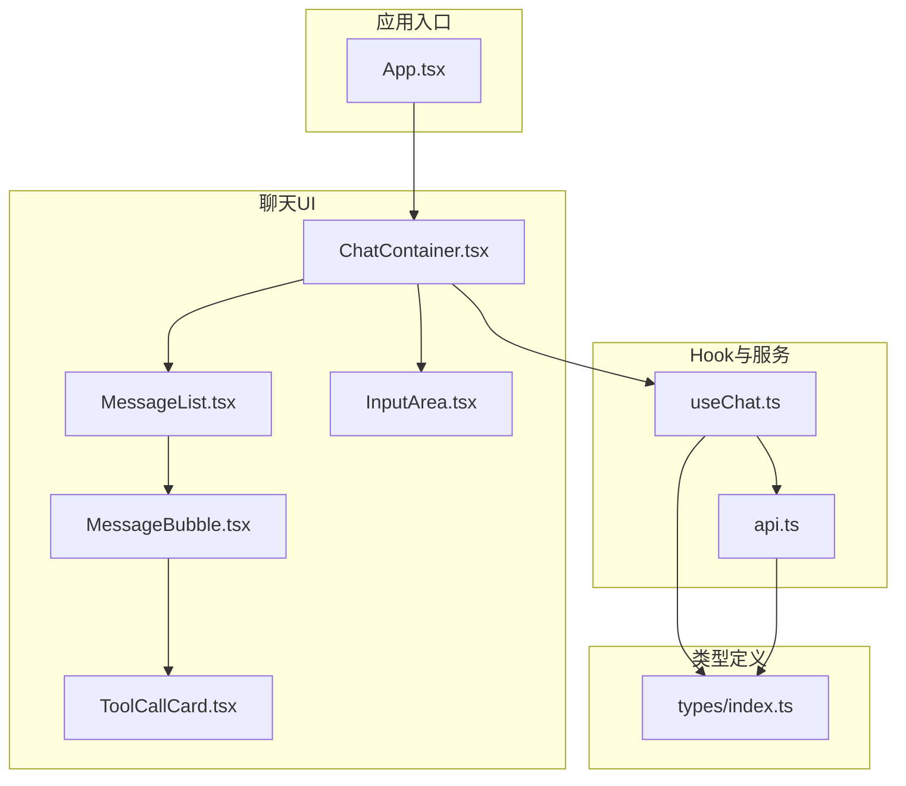
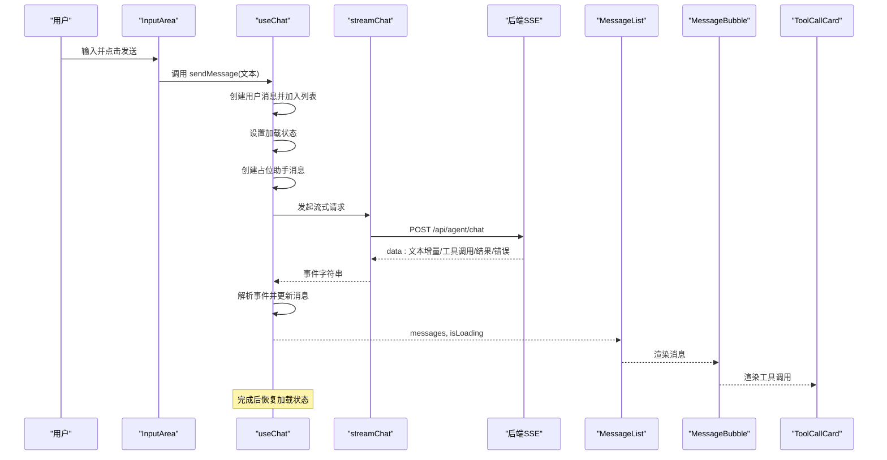
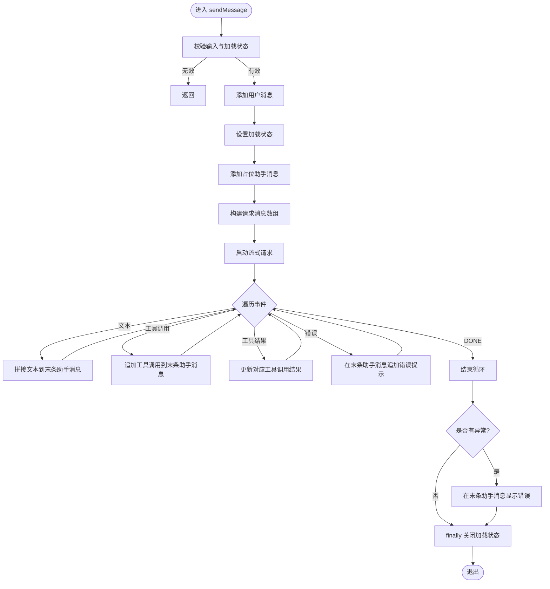
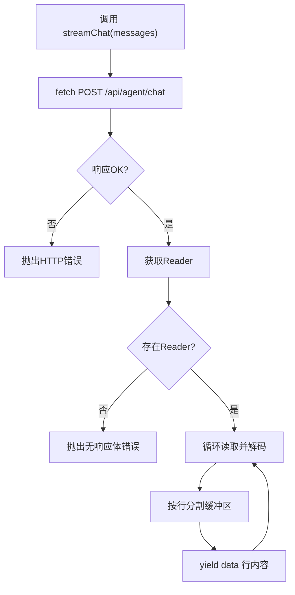
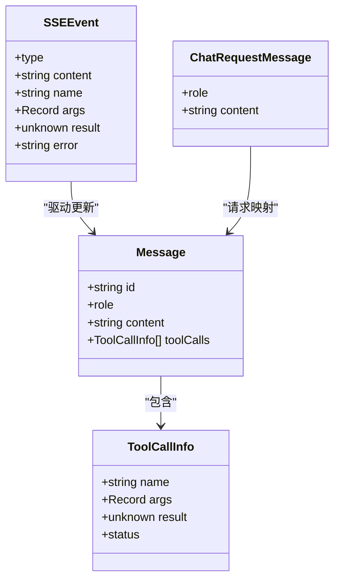
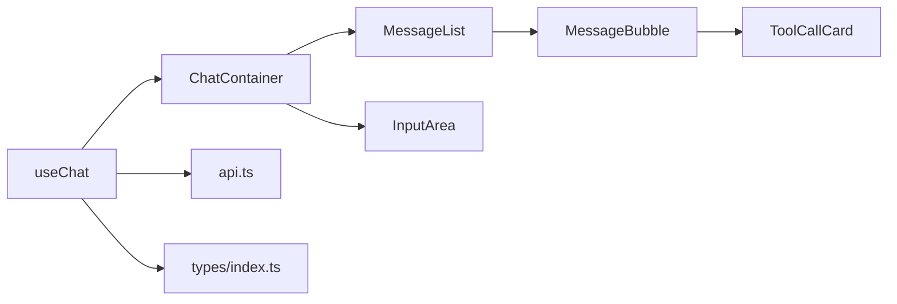
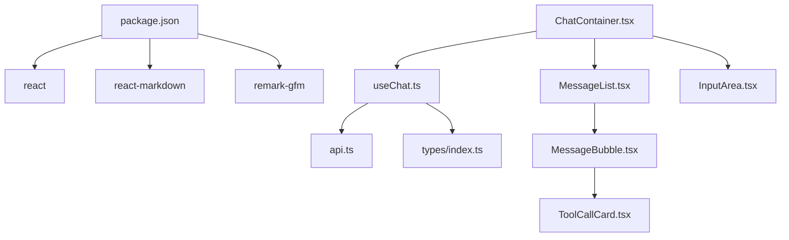

# 自定义Hook

<cite>
**本文引用的文件**
- [useChat.ts](file://src/hooks/useChat.ts)
- [api.ts](file://src/services/api.ts)
- [index.ts](file://src/types/index.ts)
- [ChatContainer.tsx](file://src/components/Chat/ChatContainer.tsx)
- [InputArea.tsx](file://src/components/Chat/InputArea.tsx)
- [MessageList.tsx](file://src/components/Chat/MessageList.tsx)
- [MessageBubble.tsx](file://src/components/Chat/MessageBubble.tsx)
- [ToolCallCard.tsx](file://src/components/Chat/ToolCallCard.tsx)
- [App.tsx](file://src/App.tsx)
- [package.json](file://package.json)
</cite>

## 目录
1. [简介](#简介)
2. [项目结构](#项目结构)
3. [核心组件](#核心组件)
4. [架构总览](#架构总览)
5. [详细组件分析](#详细组件分析)
6. [依赖关系分析](#依赖关系分析)
7. [性能考量](#性能考量)
8. [故障排查指南](#故障排查指南)
9. [结论](#结论)
10. [附录：使用模式与最佳实践](#附录使用模式与最佳实践)

## 简介
本文件围绕 AI 代理 Web 项目中的自定义 Hook useChat 进行系统化文档化，目标包括：
- 深入解释 useChat 的实现细节、状态管理逻辑、生命周期处理与性能优化策略
- 明确 Hook 的参数、返回值与副作用处理
- 解释与 UI 组件（聊天容器、输入区、消息列表等）的关系
- 提供常见问题的解决方案与最佳实践
- 面向初学者易懂、同时为有经验开发者提供技术深度

## 项目结构
该项目采用以功能域划分的组织方式，核心聊天交互通过自定义 Hook 将数据流与 UI 解耦，服务层负责与后端 SSE 流通信，类型定义统一约束数据结构。

图表来源
- [App.tsx](file://src/App.tsx#L1-L9)
- [ChatContainer.tsx](file://src/components/Chat/ChatContainer.tsx#L1-L24)
- [MessageList.tsx](file://src/components/Chat/MessageList.tsx#L1-L52)
- [MessageBubble.tsx](file://src/components/Chat/MessageBubble.tsx#L1-L38)
- [InputArea.tsx](file://src/components/Chat/InputArea.tsx#L1-L52)
- [ToolCallCard.tsx](file://src/components/Chat/ToolCallCard.tsx#L1-L45)
- [useChat.ts](file://src/hooks/useChat.ts#L1-L159)
- [api.ts](file://src/services/api.ts#L1-L53)
- [index.ts](file://src/types/index.ts#L1-L28)

章节来源
- [App.tsx](file://src/App.tsx#L1-L9)
- [ChatContainer.tsx](file://src/components/Chat/ChatContainer.tsx#L1-L24)
- [useChat.ts](file://src/hooks/useChat.ts#L1-L159)
- [api.ts](file://src/services/api.ts#L1-L53)
- [index.ts](file://src/types/index.ts#L1-L28)

## 核心组件
- useChat Hook：负责管理聊天消息列表、加载状态、发送消息、清空消息；内部通过服务层消费后端 SSE 流，实时更新 UI。
- 服务层 API：封装了与后端的流式请求，将响应体解析为事件数据流。
- 类型系统：统一定义消息、工具调用、SSE 事件的数据结构，确保前后端契约一致。
- UI 组件：聊天容器、消息列表、消息气泡、输入区、工具调用卡片，均通过 props 与 useChat 的状态/方法对接。

章节来源
- [useChat.ts](file://src/hooks/useChat.ts#L1-L159)
- [api.ts](file://src/services/api.ts#L1-L53)
- [index.ts](file://src/types/index.ts#L1-L28)
- [ChatContainer.tsx](file://src/components/Chat/ChatContainer.tsx#L1-L24)
- [MessageList.tsx](file://src/components/Chat/MessageList.tsx#L1-L52)
- [MessageBubble.tsx](file://src/components/Chat/MessageBubble.tsx#L1-L38)
- [InputArea.tsx](file://src/components/Chat/InputArea.tsx#L1-L52)
- [ToolCallCard.tsx](file://src/components/Chat/ToolCallCard.tsx#L1-L45)

## 架构总览
下图展示了从用户输入到后端 SSE 流再到 UI 更新的完整链路。

图表来源
- [InputArea.tsx](file://src/components/Chat/InputArea.tsx#L1-L52)
- [useChat.ts](file://src/hooks/useChat.ts#L14-L146)
- [api.ts](file://src/services/api.ts#L8-L47)
- [MessageList.tsx](file://src/components/Chat/MessageList.tsx#L1-L52)
- [MessageBubble.tsx](file://src/components/Chat/MessageBubble.tsx#L1-L38)
- [ToolCallCard.tsx](file://src/components/Chat/ToolCallCard.tsx#L1-L45)

## 详细组件分析

### useChat Hook 实现与状态管理
- 状态字段
  - messages：消息数组，包含用户与助手消息，以及可选的工具调用列表
  - isLoading：是否处于流式生成过程中的加载状态
- 关键方法
  - sendMessage(content: string)：发送用户消息，创建占位助手消息，消费 SSE 流并增量更新消息
  - clearMessages()：清空所有消息
- 状态更新策略
  - 使用不可变更新（复制数组/对象），避免直接修改引用
  - 增量更新文本与工具调用，保证 UI 逐段渲染
- 生命周期与副作用
  - 在 sendMessage 内部管理异步流的开始、中间事件与结束
  - finally 中统一关闭加载状态，防止卡住
- 错误处理
  - 事件解析失败时忽略（容错）
  - 请求或流异常时在最后一条助手消息追加错误提示
- 性能优化点
  - 使用 useCallback 包裹 sendMessage/clearMessages，减少子组件重渲染
  - 仅在必要时更新最后一条助手消息，避免全量重渲染
  - 使用独立的占位助手消息，避免等待后端首个事件才渲染

图表来源
- [useChat.ts](file://src/hooks/useChat.ts#L14-L146)

章节来源
- [useChat.ts](file://src/hooks/useChat.ts#L1-L159)

### 服务层：SSE 流式请求
- 功能概述
  - 将前端消息数组转换为 ChatMessage 并发起 POST 请求
  - 使用 ReadableStream Reader 逐行读取后端返回的 data 行
  - 作为 AsyncGenerator<string> 暴露给 Hook，便于 for-await-of 循环消费
- 错误处理
  - 非 OK 响应抛出错误
  - 无响应体时抛出错误
- 可扩展性
  - getTools 提供工具清单接口，可与 useChat 协同使用

图表来源
- [api.ts](file://src/services/api.ts#L8-L47)

章节来源
- [api.ts](file://src/services/api.ts#L1-L53)

### 类型系统：消息、工具调用与事件
- Message：包含 id、role、content、可选 toolCalls
- ToolCallInfo：包含 name、args、result、status
- SSEEvent：包含 type 与相应字段（content/name/args/result/error）
- ChatRequestMessage：用于向后端发送的消息格式

图表来源
- [index.ts](file://src/types/index.ts#L1-L28)

章节来源
- [index.ts](file://src/types/index.ts#L1-L28)

### UI 组件与 Hook 的协作
- ChatContainer：注入 useChat 的 messages、isLoading、sendMessage、clearMessages，并渲染头部、消息列表与输入区
- MessageList：根据 messages 自动滚动到底部；当最后一条助手消息为空且无工具调用时显示“正在输入”指示器
- MessageBubble：渲染 Markdown 内容与工具调用卡片
- InputArea：收集用户输入，支持 Enter 发送与禁用态控制
- ToolCallCard：展示工具名称、图标、参数与结果，并根据状态切换样式

图表来源
- [ChatContainer.tsx](file://src/components/Chat/ChatContainer.tsx#L1-L24)
- [MessageList.tsx](file://src/components/Chat/MessageList.tsx#L1-L52)
- [MessageBubble.tsx](file://src/components/Chat/MessageBubble.tsx#L1-L38)
- [InputArea.tsx](file://src/components/Chat/InputArea.tsx#L1-L52)
- [ToolCallCard.tsx](file://src/components/Chat/ToolCallCard.tsx#L1-L45)
- [useChat.ts](file://src/hooks/useChat.ts#L1-L159)
- [api.ts](file://src/services/api.ts#L1-L53)
- [index.ts](file://src/types/index.ts#L1-L28)

章节来源
- [ChatContainer.tsx](file://src/components/Chat/ChatContainer.tsx#L1-L24)
- [MessageList.tsx](file://src/components/Chat/MessageList.tsx#L1-L52)
- [MessageBubble.tsx](file://src/components/Chat/MessageBubble.tsx#L1-L38)
- [InputArea.tsx](file://src/components/Chat/InputArea.tsx#L1-L52)
- [ToolCallCard.tsx](file://src/components/Chat/ToolCallCard.tsx#L1-L45)

## 依赖关系分析
- 外部依赖
  - react：Hooks、组件模型
  - react-markdown 与 remark-gfm：消息内容渲染
- 内部依赖
  - useChat 依赖 api.ts 的流式接口与 types 的数据结构
  - UI 组件依赖 useChat 的状态与方法
- 潜在循环依赖
  - 当前模块间为单向依赖，未发现循环导入

图表来源
- [package.json](file://package.json#L1-L25)
- [useChat.ts](file://src/hooks/useChat.ts#L1-L159)
- [api.ts](file://src/services/api.ts#L1-L53)
- [index.ts](file://src/types/index.ts#L1-L28)
- [ChatContainer.tsx](file://src/components/Chat/ChatContainer.tsx#L1-L24)
- [MessageList.tsx](file://src/components/Chat/MessageList.tsx#L1-L52)
- [MessageBubble.tsx](file://src/components/Chat/MessageBubble.tsx#L1-L38)
- [InputArea.tsx](file://src/components/Chat/InputArea.tsx#L1-L52)
- [ToolCallCard.tsx](file://src/components/Chat/ToolCallCard.tsx#L1-L45)

章节来源
- [package.json](file://package.json#L1-L25)

## 性能考量
- 状态更新最小化
  - 仅对最后一条助手消息进行增量更新，避免全量重渲染
  - 工具调用通过追加方式更新，减少不必要的对象重建
- 渲染优化
  - 使用 useCallback 包裹 sendMessage/clearMessages，降低子组件重渲染频率
  - MessageList 在消息变化时滚动到底部，避免手动 DOM 操作
- 异步流控制
  - isLoading 严格控制输入区禁用与按钮状态，避免并发请求
  - finally 统一关闭加载状态，防止 UI 卡死
- 内存管理
  - 事件循环中仅保留必要的 currentToolCall 引用，完成后置空
  - 清空消息时重置状态，释放引用
- 可扩展建议
  - 对于长对话，可考虑分页或虚拟化列表
  - 工具调用结果过大时，可延迟渲染或分块展示

[本节为通用性能指导，不直接分析具体文件]

## 故障排查指南
- 无法发送消息
  - 检查 isLoading 是否为 true（发送过程中会禁用输入）
  - 确认 sendMessage 的回调是否正确传入 InputArea
- 消息不显示或不更新
  - 确认 SSE 事件类型与内容是否符合预期（text/tool_call/tool_result/error）
  - 检查事件解析是否抛错（当前实现会忽略 JSON 解析异常）
- 加载状态不消失
  - 确认 finally 分支是否执行（异常路径也会关闭加载状态）
- 工具调用未显示
  - 确认事件类型为 tool_call，且 name/args 正常
  - 检查 ToolCallCard 的状态类名与样式是否生效
- 后端无响应
  - 检查 VITE_API_URL 环境变量与后端服务可用性
  - 确认 /api/agent/chat 接口返回正确的 SSE 数据行

章节来源
- [useChat.ts](file://src/hooks/useChat.ts#L14-L146)
- [api.ts](file://src/services/api.ts#L8-L47)
- [InputArea.tsx](file://src/components/Chat/InputArea.tsx#L1-L52)
- [MessageList.tsx](file://src/components/Chat/MessageList.tsx#L1-L52)
- [ToolCallCard.tsx](file://src/components/Chat/ToolCallCard.tsx#L1-L45)

## 结论
useChat Hook 将聊天的核心状态与异步流处理抽象为可复用的 Hook，配合服务层与 UI 组件形成清晰的职责分离。其设计兼顾了易用性与可维护性：通过不可变更新、增量渲染与严格的生命周期管理，实现了流畅的用户体验；通过类型系统与事件协议，确保了前后端契约的一致性。对于更复杂的场景，可在现有基础上扩展缓存、分页与工具调用结果的可视化优化。

[本节为总结性内容，不直接分析具体文件]

## 附录：使用模式与最佳实践
- 基本使用
  - 在 ChatContainer 中解构 useChat 的 messages、isLoading、sendMessage、clearMessages
  - 将 sendMessage 传入 InputArea，将 messages 与 isLoading 传入 MessageList
- 参数与返回值
  - sendMessage(content: string): Promise<void>
  - 返回值：无（通过状态更新触发 UI）
  - clearMessages(): void
- 副作用处理
  - sendMessage 内部管理加载状态、占位消息与事件流
  - 错误处理在事件循环与最终 catch 中分别处理
- 最佳实践
  - 保持消息 id 的唯一性与可追踪性
  - 对工具调用结果进行必要的安全渲染（避免直接渲染不受信任的 JSON）
  - 在长对话场景中考虑清理历史消息或启用分页
  - 为工具调用卡片提供统一的图标与状态样式，提升可读性

章节来源
- [ChatContainer.tsx](file://src/components/Chat/ChatContainer.tsx#L1-L24)
- [InputArea.tsx](file://src/components/Chat/InputArea.tsx#L1-L52)
- [MessageList.tsx](file://src/components/Chat/MessageList.tsx#L1-L52)
- [MessageBubble.tsx](file://src/components/Chat/MessageBubble.tsx#L1-L38)
- [ToolCallCard.tsx](file://src/components/Chat/ToolCallCard.tsx#L1-L45)
- [useChat.ts](file://src/hooks/useChat.ts#L1-L159)