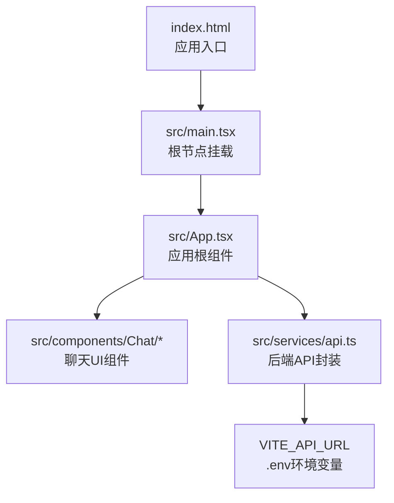
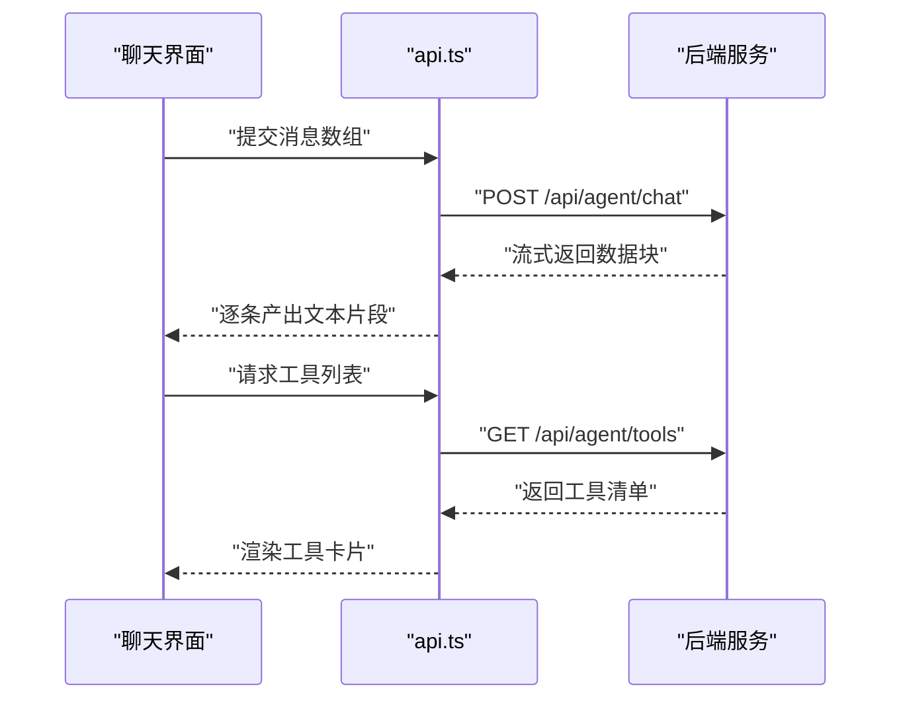
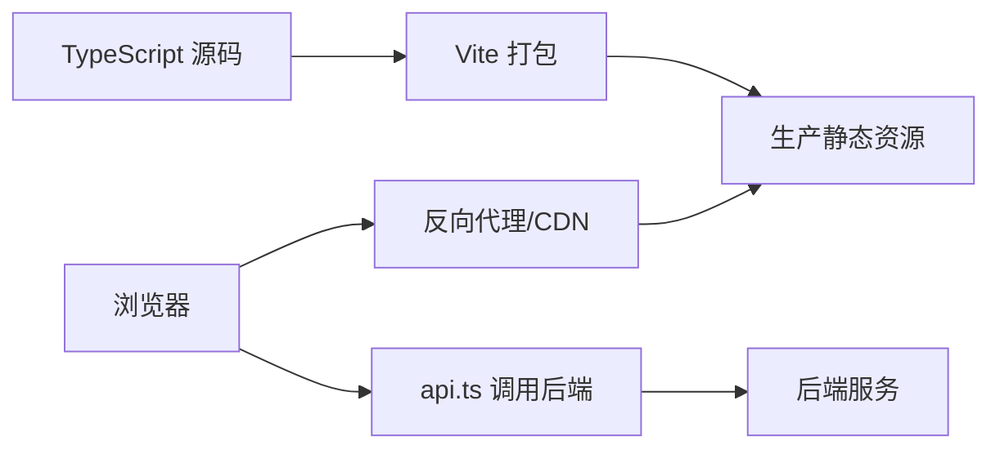

# 部署与运维

<cite>
**本文引用的文件**
- [package.json](file://package.json)
- [vite.config.ts](file://vite.config.ts)
- [index.html](file://index.html)
- [.env](file://.env)
- [tsconfig.json](file://tsconfig.json)
- [src/main.tsx](file://src/main.tsx)
- [src/App.tsx](file://src/App.tsx)
- [src/services/api.ts](file://src/services/api.ts)
</cite>

## 目录
1. [简介](#简介)
2. [项目结构](#项目结构)
3. [核心组件](#核心组件)
4. [架构总览](#架构总览)
5. [详细组件分析](#详细组件分析)
6. [依赖关系分析](#依赖关系分析)
7. [性能考虑](#性能考虑)
8. [故障排除指南](#故障排除指南)
9. [结论](#结论)
10. [附录](#附录)

## 简介
本文件面向运维与开发团队，提供AI代理Web项目的部署与运维指导。内容涵盖构建配置、部署流程、环境变量与安全、性能优化、缓存策略、不同部署平台配置示例（Nginx、Docker、云平台）、自动化部署与CI/CD建议，以及常见问题排查。

## 项目结构
该前端项目基于React与Vite构建，采用TypeScript进行类型约束。核心入口为HTML模板与React根节点挂载，应用通过服务层调用后端API，实现聊天流式输出与工具列表获取。



图表来源
- [index.html](file://index.html#L1-L14)
- [src/main.tsx](file://src/main.tsx#L1-L10)
- [src/App.tsx](file://src/App.tsx#L1-L9)
- [src/services/api.ts](file://src/services/api.ts#L1-L53)
- [.env](file://.env#L1-L2)

章节来源
- [index.html](file://index.html#L1-L14)
- [src/main.tsx](file://src/main.tsx#L1-L10)
- [src/App.tsx](file://src/App.tsx#L1-L9)
- [src/services/api.ts](file://src/services/api.ts#L1-L53)
- [.env](file://.env#L1-L2)

## 核心组件
- 构建与打包：使用Vite进行开发与生产构建，TypeScript编译由Vite链路触发。
- 运行时配置：通过Vite的环境变量机制注入运行时参数，后端地址由VITE_API_URL控制。
- 前端路由与入口：单页应用入口在HTML中定义，React根节点挂载于DOM。
- API交互：封装了流式聊天与工具列表两个后端接口，支持服务端事件风格的数据传输。

章节来源
- [package.json](file://package.json#L1-L25)
- [vite.config.ts](file://vite.config.ts#L1-L10)
- [.env](file://.env#L1-L2)
- [src/services/api.ts](file://src/services/api.ts#L1-L53)

## 架构总览
前端通过Vite构建生成静态资源，运行时从环境变量读取后端地址，向后端发起请求并以流式方式接收数据。生产部署可直接将构建产物交由反向代理或容器化平台分发。

```mermaid
graph TB
subgraph "前端"
V["Vite 构建产物"] --> N["Nginx/Apache/CDN"]
end
subgraph "后端"
S["AI Agent 后端服务"]
end
U["浏览器"] --> N
N --> U
U --> |HTTP(S)| S
```

图表来源
- [src/services/api.ts](file://src/services/api.ts#L1-L53)
- [vite.config.ts](file://vite.config.ts#L1-L10)

## 详细组件分析

### 构建与打包配置
- 构建命令：先执行TypeScript增量编译，再由Vite生成生产包。
- 开发服务器：默认监听本地端口，便于本地联调。
- TypeScript配置：严格模式与模块解析策略确保类型安全与打包兼容性。

章节来源
- [package.json](file://package.json#L6-L10)
- [vite.config.ts](file://vite.config.ts#L1-L10)
- [tsconfig.json](file://tsconfig.json#L1-L23)

### 运行时环境变量
- 后端地址：通过VITE_API_URL注入，可在不同环境切换。
- 其他Vite内置变量：如NODE_ENV等，可用于条件编译或调试开关。

章节来源
- [.env](file://.env#L1-L2)
- [src/services/api.ts](file://src/services/api.ts#L1-L2)

### API服务封装
- 流式聊天：基于Fetch与ReadableStream，逐行解析服务端推送的数据块。
- 工具列表：常规JSON响应获取。
- 错误处理：对非OK状态与无响应体场景抛出异常，便于上层捕获与提示。



图表来源
- [src/services/api.ts](file://src/services/api.ts#L8-L47)

章节来源
- [src/services/api.ts](file://src/services/api.ts#L1-L53)

### 入口与应用根组件
- HTML入口：定义根容器与脚本加载路径。
- React根挂载：在DOM中定位根容器并渲染应用。
- 应用根组件：负责引入样式与承载聊天容器。

章节来源
- [index.html](file://index.html#L1-L14)
- [src/main.tsx](file://src/main.tsx#L1-L10)
- [src/App.tsx](file://src/App.tsx#L1-L9)

## 依赖关系分析
- 构建链路：TypeScript编译器 → Vite打包 → 生产静态资源。
- 运行时链路：浏览器 → 反向代理/CDN → 前端静态资源 → 浏览器 → API调用 → 后端服务。
- 外部依赖：React生态、Vite插件、TypeScript类型声明。



图表来源
- [package.json](file://package.json#L6-L10)
- [vite.config.ts](file://vite.config.ts#L1-L10)
- [src/services/api.ts](file://src/services/api.ts#L1-L53)

章节来源
- [package.json](file://package.json#L1-L25)
- [vite.config.ts](file://vite.config.ts#L1-L10)
- [src/services/api.ts](file://src/services/api.ts#L1-L53)

## 性能考虑
- 构建优化
  - 使用Vite的原生ES模块与按需打包，减少首屏体积。
  - 合理拆分第三方依赖，避免将大库打入业务主包。
- 资源优化
  - 图片与媒体资源建议压缩与使用现代格式（如WebP）。
  - 启用Gzip/Brotli压缩，降低传输体积。
- 缓存策略
  - 静态资源采用长缓存策略（强缓存+文件名哈希），HTML短缓存或不缓存。
  - 浏览器端对工具列表与会话结果设置合理TTL。
- 网络与流式
  - 利用流式接口提升交互体验；对网络抖动做好重试与降级。
- 安全与合规
  - 强制HTTPS传输，启用HSTS与CSP。
  - 对跨域请求进行白名单管理，限制来源与方法。
- 监控与可观测性
  - 埋点页面加载时间、首屏时间、API耗时与错误率。
  - 结合日志与追踪系统定位性能瓶颈。

## 故障排除指南
- 构建失败
  - 检查TypeScript版本与配置是否与Vite匹配。
  - 清理构建缓存后重试。
- 运行时访问后端失败
  - 确认VITE_API_URL指向正确域名与端口。
  - 检查CORS配置与跨域策略。
- 流式接口无数据
  - 确认后端已开启流式输出与正确的Content-Type。
  - 检查网络代理对流式响应的支持。
- 预览或部署后空白页
  - 检查静态资源路径与基础路径配置。
  - 确认反向代理未拦截静态资源请求。

## 结论
本项目采用现代化前端技术栈，具备良好的可维护性与扩展性。结合合理的构建与缓存策略、严格的环境变量管理与安全加固，可在多平台稳定交付。建议配合CI/CD自动化流水线与监控体系，持续保障线上质量。

## 附录

### A. 环境变量与安全
- 关键变量
  - VITE_API_URL：后端服务地址（生产环境务必替换为线上域名）
- 安全建议
  - 不在客户端暴露敏感信息；对API调用进行鉴权与限流。
  - 使用HTTPS与安全响应头，防止中间人攻击与XSS。

章节来源
- [.env](file://.env#L1-L2)
- [src/services/api.ts](file://src/services/api.ts#L1-L2)

### B. 部署平台配置示例

- Nginx
  - 提供静态资源服务，开启Gzip/Brotli压缩与缓存头。
  - 将未命中静态资源的请求转发至后端（或SPA回退到index.html）。
  - 示例要点
    - 静态目录指向构建产物目录
    - 对/api/agent/*进行反向代理到后端服务
    - 设置合适的缓存与安全头

- Docker
  - 使用Nginx镜像作为静态资源服务器，挂载构建产物目录。
  - 或使用多阶段构建，将Nginx作为最终镜像，减少镜像体积。
  - 示例要点
    - 构建阶段：安装依赖并执行生产构建
    - 运行阶段：复制构建产物至Nginx站点目录
    - 暴露80端口并设置健康检查

- 云平台（如阿里云OSS/CDN + 负载均衡）
  - OSS/CDN托管静态资源，开启全球加速与缓存策略。
  - 负载均衡转发至后端服务，配置WAF与DDoS防护。
  - 示例要点
    - CDN缓存规则：JS/CSS长缓存，HTML短缓存
    - 回源策略：对/api/*回源至后端服务
    - HTTPS与证书管理

### C. 自动化部署与CI/CD建议
- 流水线步骤
  - 安装依赖与类型检查
  - 执行构建并生成产物
  - 进行静态扫描与安全检查
  - 推送镜像至制品库或上传至对象存储
  - 发布至预发布/生产环境并进行健康检查
- 版本与回滚
  - 以文件名哈希命名产物，实现灰度与快速回滚
  - 记录构建元数据（commit、时间、构建者）

### D. 性能优化技巧
- 代码分割：按路由或组件维度拆分，减少首屏加载。
- 资源压缩：启用Brotli/Gzip，图片WebP化。
- 缓存：静态资源强缓存，接口数据短期缓存。
- 网络：合理超时与重试，流式接口优化交互体验。
- 监控：埋点与告警，定期评估性能指标。