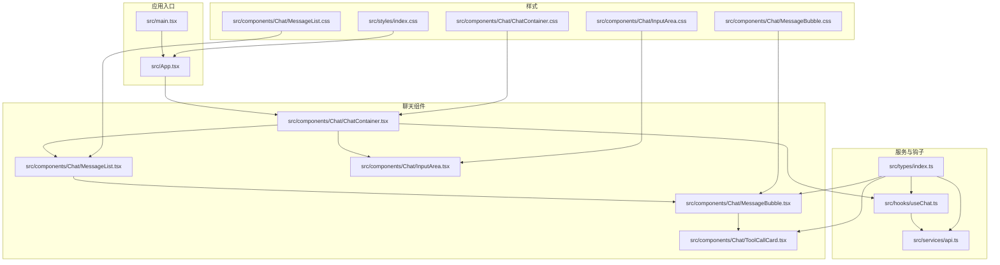
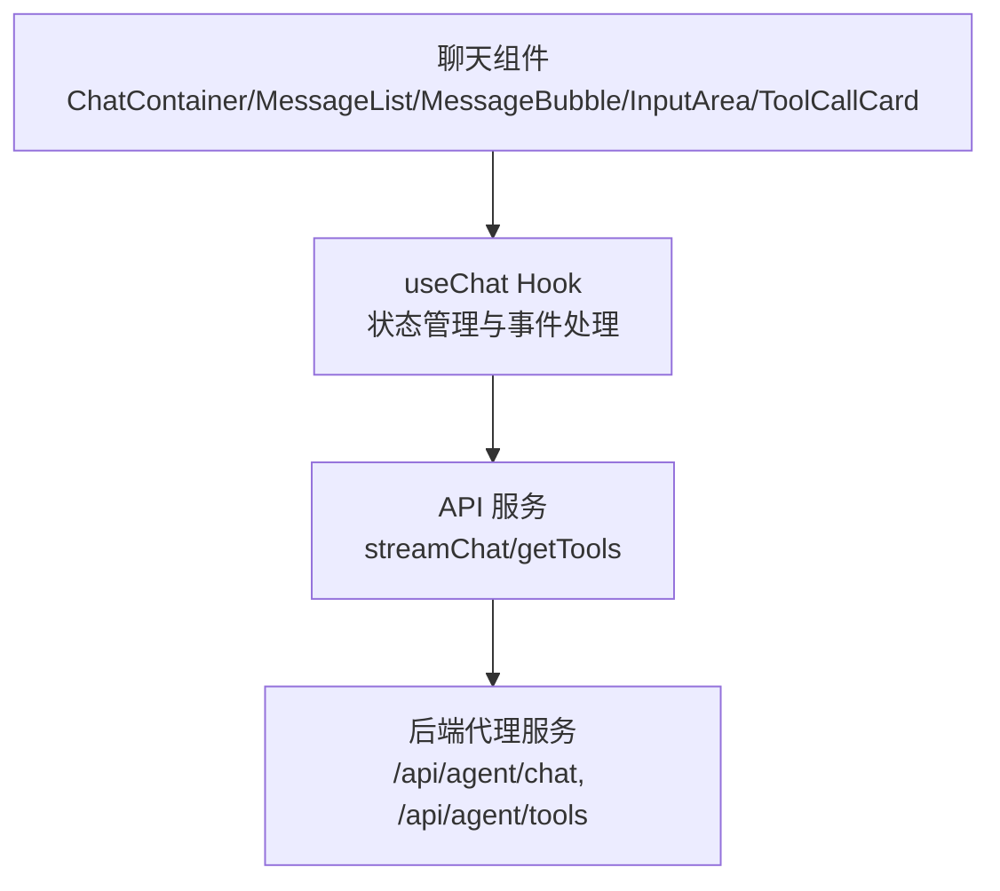
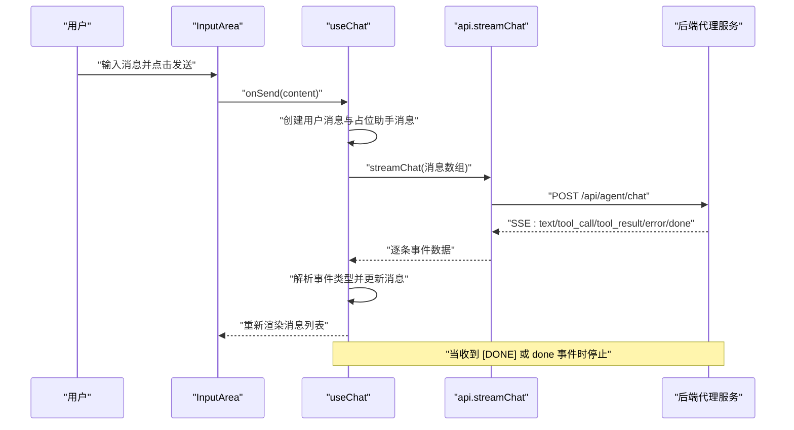
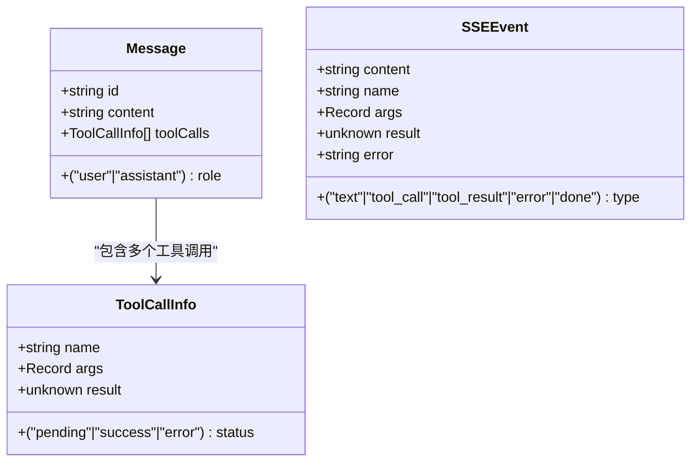
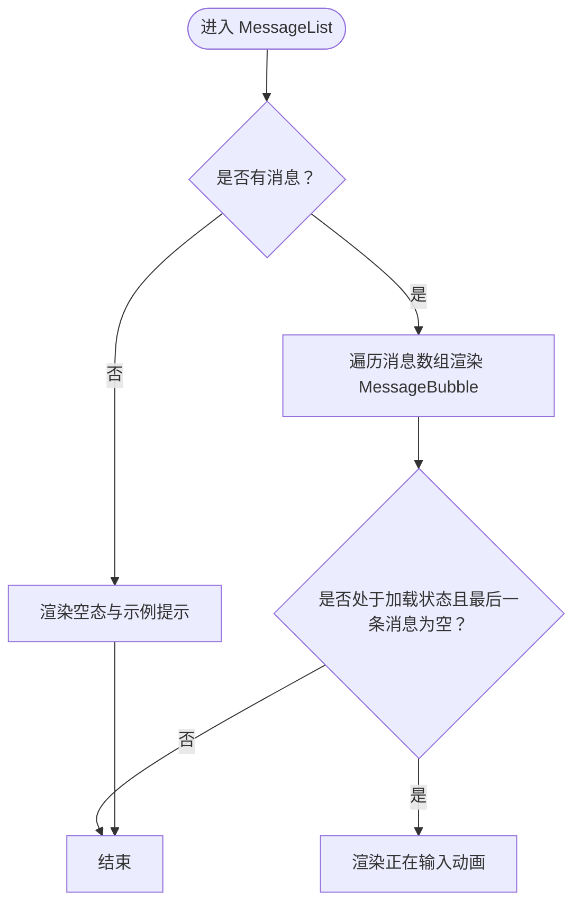
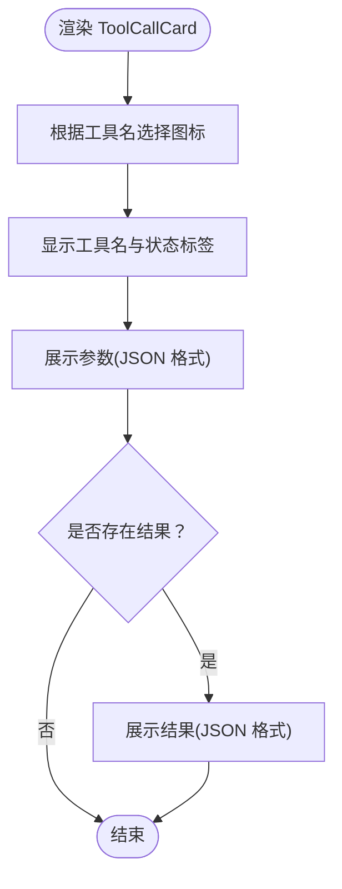
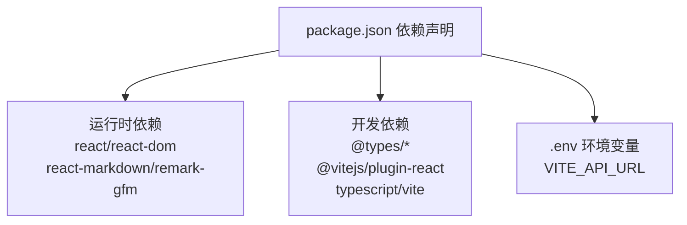

# 项目概述

<cite>
**本文档引用的文件**
- [package.json](file://package.json)
- [tsconfig.json](file://tsconfig.json)
- [vite.config.ts](file://vite.config.ts)
- [.env](file://.env)
- [src/main.tsx](file://src/main.tsx)
- [src/App.tsx](file://src/App.tsx)
- [src/services/api.ts](file://src/services/api.ts)
- [src/hooks/useChat.ts](file://src/hooks/useChat.ts)
- [src/types/index.ts](file://src/types/index.ts)
- [src/components/Chat/ChatContainer.tsx](file://src/components/Chat/ChatContainer.tsx)
- [src/components/Chat/InputArea.tsx](file://src/components/Chat/InputArea.tsx)
- [src/components/Chat/MessageList.tsx](file://src/components/Chat/MessageList.tsx)
- [src/components/Chat/MessageBubble.tsx](file://src/components/Chat/MessageBubble.tsx)
- [src/components/Chat/ToolCallCard.tsx](file://src/components/Chat/ToolCallCard.tsx)
- [src/styles/index.css](file://src/styles/index.css)
- [src/components/Chat/ChatContainer.css](file://src/components/Chat/ChatContainer.css)
- [src/components/Chat/InputArea.css](file://src/components/Chat/InputArea.css)
- [src/components/Chat/MessageList.css](file://src/components/Chat/MessageList.css)
- [src/components/Chat/MessageBubble.css](file://src/components/Chat/MessageBubble.css)
</cite>

## 目录
1. [引言](#引言)
2. [项目结构](#项目结构)
3. [核心组件](#核心组件)
4. [架构总览](#架构总览)
5. [详细组件分析](#详细组件分析)
6. [依赖关系分析](#依赖关系分析)
7. [性能考虑](#性能考虑)
8. [故障排除指南](#故障排除指南)
9. [结论](#结论)
10. [附录](#附录)

## 引言
本项目是一个基于 React 和 TypeScript 构建的智能对话代理前端应用，旨在提供流畅的实时聊天体验，支持工具调用与流式响应（Server-Sent Events）。该应用通过简洁的用户界面实现与后端 AI 代理服务的交互，使用户能够以自然语言发起对话、查看逐步生成的回复，并观察代理在需要时调用外部工具的过程。

- 主要用途：作为 AI 代理的 Web 前端入口，承载用户输入、展示消息与工具调用状态、处理流式输出。
- 解决的问题：简化复杂对话流程，提供可读性强的消息展示与工具调用可视化；通过流式渲染提升交互感知。
- 与其他组件的关系：前端通过 HTTP(SSE) 与后端代理服务通信，接收结构化的事件数据，驱动 UI 更新。

设计理念与技术选型：
- 使用 React Hooks 管理状态与副作用，确保组件职责清晰、逻辑可复用。
- 使用 TypeScript 提升类型安全，减少运行时错误，便于团队协作与长期维护。
- 使用 Vite 作为构建工具，提供快速开发体验与高效的热更新。
- 使用 react-markdown 与 remark-gfm 支持 Markdown 渲染，增强消息可读性。
- 使用自定义 Hook 封装聊天逻辑，分离关注点，便于测试与扩展。

## 项目结构
项目采用按功能模块组织的目录结构，核心模块包括：
- 入口与根组件：应用启动与根组件挂载
- 聊天组件：消息列表、消息气泡、输入区域、工具调用卡片
- 服务层：API 客户端，封装与后端的流式通信
- 钩子：聊天状态与业务逻辑封装
- 类型定义：统一的数据模型与事件类型
- 样式：全局样式与各组件样式

图表来源
- [src/main.tsx](file://src/main.tsx#L1-L10)
- [src/App.tsx](file://src/App.tsx#L1-L9)
- [src/components/Chat/ChatContainer.tsx](file://src/components/Chat/ChatContainer.tsx#L1-L24)
- [src/components/Chat/MessageList.tsx](file://src/components/Chat/MessageList.tsx#L1-L52)
- [src/components/Chat/MessageBubble.tsx](file://src/components/Chat/MessageBubble.tsx#L1-L38)
- [src/components/Chat/InputArea.tsx](file://src/components/Chat/InputArea.tsx#L1-L52)
- [src/components/Chat/ToolCallCard.tsx](file://src/components/Chat/ToolCallCard.tsx#L1-L45)
- [src/services/api.ts](file://src/services/api.ts#L1-L53)
- [src/hooks/useChat.ts](file://src/hooks/useChat.ts#L1-L159)
- [src/types/index.ts](file://src/types/index.ts#L1-L28)
- [src/styles/index.css](file://src/styles/index.css#L1-L35)
- [src/components/Chat/ChatContainer.css](file://src/components/Chat/ChatContainer.css#L1-L42)
- [src/components/Chat/MessageList.css](file://src/components/Chat/MessageList.css#L1-L98)
- [src/components/Chat/MessageBubble.css](file://src/components/Chat/MessageBubble.css#L1-L74)
- [src/components/Chat/InputArea.css](file://src/components/Chat/InputArea.css#L1-L62)

章节来源
- [package.json](file://package.json#L1-L25)
- [src/main.tsx](file://src/main.tsx#L1-L10)
- [src/App.tsx](file://src/App.tsx#L1-L9)

## 核心组件
- 应用入口与根组件
  - main.tsx：创建根节点并渲染 App
  - App.tsx：根组件直接渲染聊天容器
- 聊天容器 ChatContainer：协调消息列表、输入区域与清理按钮
- 消息列表 MessageList：渲染消息气泡、空态提示与“正在输入”指示器
- 消息气泡 MessageBubble：渲染文本内容与工具调用卡片
- 工具调用卡片 ToolCallCard：展示工具名称、参数、结果与状态
- 输入区域 InputArea：处理文本输入、快捷键与发送按钮
- 聊天钩子 useChat：封装消息状态、发送消息、流式事件解析与错误处理
- API 服务 api.ts：封装流式聊天与工具列表请求
- 类型定义 types/index.ts：统一消息、工具调用与 SSE 事件类型

章节来源
- [src/main.tsx](file://src/main.tsx#L1-L10)
- [src/App.tsx](file://src/App.tsx#L1-L9)
- [src/components/Chat/ChatContainer.tsx](file://src/components/Chat/ChatContainer.tsx#L1-L24)
- [src/components/Chat/MessageList.tsx](file://src/components/Chat/MessageList.tsx#L1-L52)
- [src/components/Chat/MessageBubble.tsx](file://src/components/Chat/MessageBubble.tsx#L1-L38)
- [src/components/Chat/ToolCallCard.tsx](file://src/components/Chat/ToolCallCard.tsx#L1-L45)
- [src/components/Chat/InputArea.tsx](file://src/components/Chat/InputArea.tsx#L1-L52)
- [src/hooks/useChat.ts](file://src/hooks/useChat.ts#L1-L159)
- [src/services/api.ts](file://src/services/api.ts#L1-L53)
- [src/types/index.ts](file://src/types/index.ts#L1-L28)

## 架构总览
应用采用“组件化 + 自定义 Hook + 服务层”的分层架构：
- 视图层：由多个纯函数组件构成，负责渲染与用户交互
- 逻辑层：useChat Hook 将视图与服务层解耦，集中处理消息状态与事件流
- 服务层：api.ts 封装与后端的 HTTP 与 SSE 通信
- 类型层：types/index.ts 统一数据契约，保证前后端一致性

图表来源
- [src/components/Chat/ChatContainer.tsx](file://src/components/Chat/ChatContainer.tsx#L1-L24)
- [src/hooks/useChat.ts](file://src/hooks/useChat.ts#L1-L159)
- [src/services/api.ts](file://src/services/api.ts#L1-L53)

## 详细组件分析

### 流式聊天工作流（SSE）
该流程展示了从前端发送消息到后端返回流式事件的完整过程，包括文本增量、工具调用与结果回传。

图表来源
- [src/components/Chat/InputArea.tsx](file://src/components/Chat/InputArea.tsx#L1-L52)
- [src/hooks/useChat.ts](file://src/hooks/useChat.ts#L14-L146)
- [src/services/api.ts](file://src/services/api.ts#L8-L47)

章节来源
- [src/hooks/useChat.ts](file://src/hooks/useChat.ts#L1-L159)
- [src/services/api.ts](file://src/services/api.ts#L1-L53)

### 数据模型与事件类型
应用通过统一的类型定义确保前后端契约一致，便于维护与扩展。

图表来源
- [src/types/index.ts](file://src/types/index.ts#L1-L28)

章节来源
- [src/types/index.ts](file://src/types/index.ts#L1-L28)

### 组件渲染与状态更新
消息列表根据消息数组与加载状态动态渲染，空态时提供示例提示，加载中显示“正在输入”动画。

图表来源
- [src/components/Chat/MessageList.tsx](file://src/components/Chat/MessageList.tsx#L1-L52)
- [src/components/Chat/MessageBubble.tsx](file://src/components/Chat/MessageBubble.tsx#L1-L38)

章节来源
- [src/components/Chat/MessageList.tsx](file://src/components/Chat/MessageList.tsx#L1-L52)
- [src/components/Chat/MessageBubble.tsx](file://src/components/Chat/MessageBubble.tsx#L1-L38)

### 工具调用卡片展示
工具调用卡片根据工具名称映射图标与状态，展示参数与结果，支持多种工具类型。

图表来源
- [src/components/Chat/ToolCallCard.tsx](file://src/components/Chat/ToolCallCard.tsx#L1-L45)

章节来源
- [src/components/Chat/ToolCallCard.tsx](file://src/components/Chat/ToolCallCard.tsx#L1-L45)

## 依赖关系分析
- 运行时依赖
  - react、react-dom：React 核心库
  - react-markdown、remark-gfm：Markdown 渲染与 GFM 支持
- 开发依赖
  - @types/react、@types/react-dom：React 类型定义
  - @vitejs/plugin-react：Vite 的 React 插件
  - typescript：TypeScript 编译器
  - vite：现代化构建工具
- 环境变量
  - VITE_API_URL：后端代理服务地址，默认 http://localhost:3001

图表来源
- [package.json](file://package.json#L11-L23)
- [.env](file://.env#L1-L2)

章节来源
- [package.json](file://package.json#L1-L25)
- [.env](file://.env#L1-L2)

## 性能考虑
- 流式渲染：通过 SSE 逐步更新消息内容，避免一次性渲染大段文本，提升首屏与滚动性能
- 最小重渲染：仅在事件到达时更新最后一条消息或工具调用项，降低不必要的组件重渲染
- 文本溢出与换行：消息文本使用断词策略与等宽字体预格式化，平衡可读性与渲染开销
- 输入优化：多行输入框自动增长与最大高度限制，减少布局抖动
- 动画与滚动：平滑滚动至底部与“正在输入”动画使用 CSS 动画，避免 JavaScript 动画带来的卡顿

## 故障排除指南
- 后端服务不可达
  - 现象：发送消息无响应或报错
  - 排查：确认 VITE_API_URL 是否正确指向后端服务，网络连通性是否正常
  - 参考：环境变量与 API 地址配置
- 流式事件解析异常
  - 现象：控制台出现 JSON 解析错误或事件未显示
  - 排查：检查后端事件格式是否符合 SSEEvent 类型定义，确保每条事件为合法 JSON 字符串
  - 参考：事件解析与容错处理逻辑
- 加载状态未恢复
  - 现象：发送消息后按钮持续禁用
  - 排查：确认 finally 分支是否执行，异常分支是否正确设置加载状态
  - 参考：发送消息流程中的 finally 与错误处理
- 工具调用结果未显示
  - 现象：工具调用已触发但无结果展示
  - 排查：确认 tool_result 事件携带的工具名与当前工具调用匹配，检查状态字段更新逻辑
  - 参考：工具调用状态与结果更新逻辑

章节来源
- [src/services/api.ts](file://src/services/api.ts#L1-L53)
- [src/hooks/useChat.ts](file://src/hooks/useChat.ts#L131-L146)
- [src/components/Chat/ToolCallCard.tsx](file://src/components/Chat/ToolCallCard.tsx#L1-L45)

## 结论
本项目以 React + TypeScript 为基础，结合自定义 Hook 与服务层封装，实现了简洁而强大的智能对话代理前端。其核心特性包括：
- 实时聊天与流式响应：通过 SSE 逐步渲染文本，提供即时反馈
- 工具调用可视化：以卡片形式展示工具名称、参数与结果，增强透明度
- 用户体验优化：空态引导、示例提示、正在输入动画与平滑滚动
- 类型安全与可维护性：统一的类型定义与清晰的组件边界

该架构适合快速迭代与功能扩展，可作为 AI 代理 Web 前端的参考实现。

## 附录
- 实际使用场景示例
  - 查询天气：用户输入“北京今天天气怎么样？”，代理识别意图并调用天气工具，前端展示工具调用卡片与结果
  - 数学计算：用户输入“计算 123 * 456”，代理调用计算工具，前端展示参数与结果
  - 信息检索：用户输入“搜索 TypeScript 教程”，代理调用网络搜索工具，前端展示工具调用与结果摘要
- 开发与部署建议
  - 在本地开发时，确保后端服务运行于 VITE_API_URL 指定的地址
  - 生产构建后，检查静态资源路径与跨域配置
  - 对于长对话，建议在后端实现会话上下文管理与消息截断策略